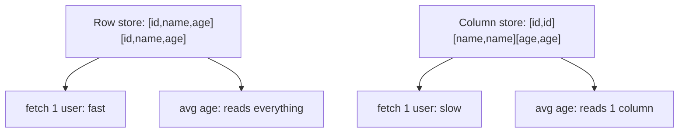

## Before you start

`indexing-and-transactions` and `query-optimization` — this topic explains what happens when indexes stop being enough, so you need to know what they do first.

## In one sentence

**OLTP** databases like PostgreSQL are built to read and write individual rows quickly, while **OLAP** and time-series databases are built to scan billions of rows and return one aggregate number fast — and they achieve it mainly by storing data in columns instead of rows.

## Why it matters

Most systems start with one database serving everything. It works until someone asks for a dashboard: "average response time per hour for the last 90 days." That query scans 200 million rows to return 2,160 numbers, takes 40 seconds, saturates the CPU, and — the real damage — slows every customer-facing query sharing that database.

Adding indexes doesn't help, because the query isn't selective: it genuinely needs every row. This is the moment where the answer stops being "optimise the query" and becomes "this is the wrong kind of database for this workload," and recognising that is exactly what the interview question tests.

## The intuition

Picture a filing cabinet of customer records, one sheet per customer with 50 fields.

**Row storage** keeps each customer's sheet whole. Fetch one customer and you pull one sheet — perfect. Now compute the average age of a million customers: you pull a million sheets and read one field from each, discarding 49. The disk moved 50× more data than the question needed.

**Column storage** files by field instead: all ages in one drawer, all names in another. Fetching one whole customer now means visiting 50 drawers — worse. But the average age means opening one drawer and reading straight through. You read 1/50th of the data.

That single inversion explains almost everything. Columnar storage also compresses far better, because a drawer of ages contains similar values, and similar values compress dramatically — often 10× or more. Less data on disk means less to read, compounding the win.

Neither is better. They're optimised for opposite questions: "tell me everything about one row" versus "tell me one thing about all rows."

## How it actually works



**OLTP** (online transaction processing) is your application database: many small concurrent reads and writes, row storage, B-tree indexes, ACID transactions. Optimised for point lookups and updates.

**OLAP** (online analytical processing) is the analytics database: few users, huge scans, aggregations. Columnar storage, heavy compression, and **vectorised execution** — processing values in batches rather than row by row, which uses CPU caches far better.

Columnar systems add **data skipping**. Each block of a column stores its own min/max, so a query filtering on last week can skip entire blocks without reading them. Combined with **partitioning** — splitting a table by time so each day is a separate chunk — a 90-day query on three years of data touches 3% of it.

**Time-series databases** are OLAP specialised for one shape: append-only data stamped with time, queried by time range. That shape permits assumptions general databases can't make. Data arrives roughly in time order and is rarely updated, so storage stays append-optimised. Timestamps in a sorted column compress extremely well by storing deltas rather than full values. And old data can be **downsampled** automatically — keeping per-second data for a week, per-minute for a month, per-hour for a year — because nobody needs second-level resolution from two years ago.

Postgres stops being enough at a recognisable point: when analytical queries scan a large fraction of a large table, when they compete with transactional traffic, or when time-series ingest volume overwhelms index maintenance on every insert. The usual progression is partitioning first, then a Postgres extension for time-series workloads, then a dedicated columnar store — not jumping straight to the last one.

The standard architecture keeps both. OLTP stays the source of truth; data is replicated into an OLAP store for analytics. The cost is that the analytics copy lags, which is nearly always acceptable — a dashboard minutes behind is fine, an account balance minutes behind is not.

## Worked example

The compression effect is measurable with built-ins alone:

```js
const zlib = require('node:zlib');

const N = 200000;
const rows = [], ages = [], names = [];
for (let i = 0; i < N; i++) {
  const age = 18 + (i % 60);           // low cardinality — compresses well together
  const name = 'user' + i;
  rows.push(JSON.stringify({ id: i, name, age }));
  ages.push(age);
  names.push(name);
}

const rowBytes = zlib.gzipSync(Buffer.from(rows.join('\n'))).length;
const ageColBytes = zlib.gzipSync(Buffer.from(ages.join(','))).length;

console.log('row-oriented, all fields :', rowBytes);
console.log('age column only          :', ageColBytes);
console.log('ratio                    :', (rowBytes / ageColBytes).toFixed(1) + 'x');
```

Output:

```
row-oriented, all fields : 1101980
age column only          : 2462
ratio                    : 447.6x
```

To average ages, a columnar engine reads the age column alone — here roughly 450× less data than reading whole rows. Two effects multiply: the age column is one of three fields, and because it holds only 60 distinct values repeating in a pattern, it compresses far harder than the mixed row data. That ratio *is* the speedup, because these queries are bound by how many bytes leave the disk, not by CPU.

## A second example — when it gets harder

The naive conclusion — "columnar is faster, move everything" — fails immediately.

Try running an application on a columnar store. `UPDATE users SET name = 'x' WHERE id = 42` means touching one value inside a compressed block, which requires decompressing the block, changing it, and recompressing. Many columnar systems don't support single-row updates efficiently at all, and some don't offer real transactions. Fetching one complete user reassembles 50 columns from 50 locations. Everything that made analytics fast makes transactions slow.

The subtler production trap is **cardinality** in time-series systems. Metrics are usually stored as a metric name plus a set of tags, and each unique tag combination becomes its own series. Tagging by `region` (10 values) and `service` (50) gives 500 series — fine. Add `user_id` with a million values and you have 500 million series. Memory for the index explodes and the database falls over. The cause isn't data volume, it's the *number of distinct series*, and it's a classic incident: someone adds a high-cardinality tag like a request ID or email and the metrics stack dies within hours. The rule is that tags must be low-cardinality dimensions you group by, never unique identifiers.

The third mistake is reaching for a new database too early. Partitioning a Postgres table by month, plus a rollup table maintained on write, solves a very large share of dashboard problems without a second system to operate, replicate into, and keep consistent.

## Quick reference

| | OLTP (Postgres, MySQL) | OLAP / time-series |
|---|---|---|
| Storage | Row-oriented | Column-oriented |
| Typical query | Point lookup, update | Aggregate over millions of rows |
| Writes | Frequent, individual, updated | Append-heavy, rarely updated |
| Transactions | Full ACID | Limited or absent |
| Compression | Modest | High — similar values together |
| Concurrency | Many users | Few analysts / dashboards |
| Fails at | Big scans and aggregates | Single-row updates, point reads |

| Situation | Reach for |
|---|---|
| Dashboard slowing the app database | Replicate to an analytics store |
| Large table, queries always by date | Partition by time first |
| Metrics/logs at high ingest rate | Time-series database |
| Need one row by primary key | Stay on OLTP |
| Report tolerates minutes of lag | Async replication is fine |

## Tools & frameworks

| Tool | What it's for | Reach for it when |
|---|---|---|
| [TimescaleDB / TigerData](https://www.tigerdata.com/docs) | Time-series extension for Postgres | You want hypertables and compression without leaving SQL and Postgres |
| [ClickHouse](https://clickhouse.com/docs) | Columnar OLAP database | You are scanning billions of rows analytically and can denormalise to do it |
| [Prometheus](https://prometheus.io/docs/introduction/overview/) | Metrics TSDB with pull scraping | You want operational metrics with short retention, not business analytics |
| [VictoriaMetrics](https://docs.victoriametrics.com/) | Prometheus-compatible TSDB with long retention | Prometheus cardinality or retention has itself become the problem |
| [DuckDB](https://duckdb.org/docs/) | In-process OLAP engine | You want analytics over a file, inside a script, with no server at all |

Prometheus is a *metrics* store, not a general time-series database — conflating the two is a common and costly mistake.

## Common mistakes

- Running heavy analytics on the production OLTP database, so dashboards degrade customer traffic.
- Assuming an index fixes an aggregate scanning most of a table — indexes help selective queries, and these aren't.
- Migrating to a columnar store for a workload dominated by single-row reads and updates.
- Adding a high-cardinality tag to time-series data, exploding the series count and exhausting memory.
- Adopting a second database before trying partitioning and rollup tables, taking on replication and consistency work unnecessarily.
- Expecting full ACID transactions from an analytical store.

## What interviewers ask

- **What's the difference between OLTP and OLAP?** — OLTP handles many small concurrent reads and writes of individual rows with full transactions; OLAP scans huge volumes to compute aggregates, using columnar storage and compression for few, heavy queries.
- **Why is columnar storage faster for analytics?** — A query reads only the columns it needs instead of whole rows, and storing similar values together compresses far better, so far fewer bytes leave the disk.
- **When does Postgres stop being enough?** — When analytical queries scan a large fraction of a large table, compete with transactional traffic, or when time-series ingest outpaces index maintenance — though partitioning and rollups often solve it first.
- **Why not use a columnar database for everything?** — Single-row reads reassemble many columns and updates require rewriting compressed blocks, so transactional workloads become slow, and transaction support is often limited.
- **What is cardinality in time-series, and why does it cause outages?** — Each unique tag combination is a separate series, so adding a high-cardinality tag like user ID creates millions of series and exhausts the index memory, regardless of data volume.

## Practice

1. Run the compression script, then change `age` to a unique random value per row and re-measure. Explain why the ratio collapses and what it implies about which columns compress well.
2. Take a table of 500 million events queried only by date range. Design a partitioning scheme and explain how data skipping avoids reading most partitions.
3. Design metrics storage for an API: latency, status code, endpoint, region, and user ID. Decide which become tags and which do not, and justify it in terms of cardinality.

## Where to go next

You've finished the databases chapter. Continue to `replication-and-partitioning` in distributed systems, which generalises the partitioning ideas here to data spread across many machines.
