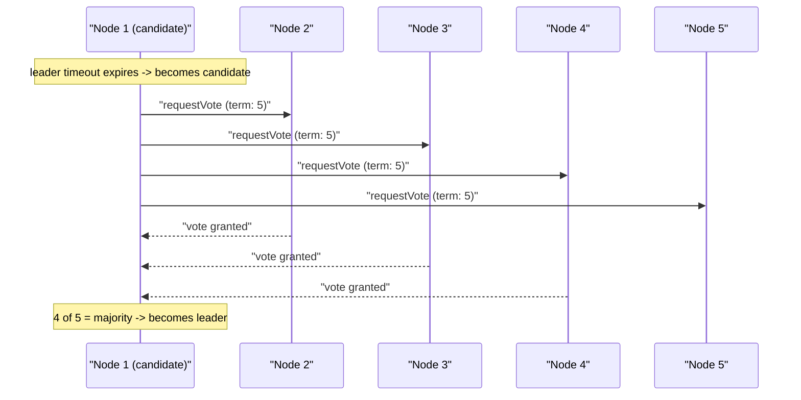

## Before you start

You need `replication-and-partitioning` — consensus algorithms are exactly the mechanism that decides who the leader is in a leader-follower setup, and what happens the moment that leader disappears.

## In one sentence

A **consensus algorithm** is a set of rules that lets a group of servers agree on a single value or decision — like who the leader is, or what the next entry in a shared log should be — even when some servers are slow, crash, or briefly lose connection to the rest.

## Why it matters

If every server in a cluster could just decide things on its own, you'd get outright contradictions — two servers both convinced they're the leader, or two different values both "confirmed" for the same record. Consensus algorithms are the mechanism that keeps a distributed system behaving like one coherent system instead of a pile of confused, disagreeing machines. They're the quiet foundation underneath leader election, distributed locks, and replicated logs in almost every serious distributed database and coordination service.

## The intuition

Imagine five people trying to elect a group leader by shouting their vote across a noisy room where some messages get lost. You can't require unanimous agreement — someone's vote might never arrive. But if everyone agrees the winner just needs *more than half* the votes cast, then even with some messages lost, at most one candidate can possibly have a majority — two different people can't both have gotten more than half of the same five votes. That single rule — **majority quorum** — is the core trick that makes consensus algorithms work at all.

## How it actually works



The core problem: multiple servers need to agree on one answer, but messages between them can be delayed or lost, and any server might crash at any moment. **Paxos** was the first widely known solution, but it's famously difficult to understand and correctly implement — it works through rounds of proposals and acknowledgments, where a value is only considered "chosen" once a majority of servers accept it.

**Raft** was designed later, specifically to be easier to understand while solving the exact same problem, and it's what most modern systems actually use — including etcd, which powers Kubernetes' own coordination. Raft splits the problem into three clear parts: **leader election** (servers vote for one leader; whoever gets a majority of votes for a given term wins, as shown above), **log replication** (the leader receives writes and copies them to followers in the same order), and **safety** (a write is only considered committed once a majority of servers have durably stored it, so it survives even if the leader crashes the instant after).

The shared idea behind both algorithms is the **majority quorum**: as long as more than half the servers are up and can talk to each other, the group can keep making progress and agreeing on new values, even if the rest are down or unreachable. This is exactly why clusters are usually set up with an odd number of nodes — 3 or 5 — it makes the majority math clean and tells you precisely how many failures the cluster can tolerate.

## Worked example

```js
// A simplified illustration of majority-quorum decision making
function isCommitted(totalNodes, acksReceived) {
  const majority = Math.floor(totalNodes / 2) + 1;
  return acksReceived >= majority;
}

console.log(isCommitted(5, 3)); // true — 3 out of 5 is a majority, write is safely committed
console.log(isCommitted(5, 2)); // false — not enough nodes have confirmed yet
```

A write, or a leader election vote, is only treated as final once more than half the cluster has acknowledged it. That's what protects the decision even if some nodes later fail: two different values could never both reach a majority of the same fixed group of nodes.

## A second example — when it gets harder

Here's the scenario that separates surface knowledge from real understanding: a 5-node cluster suffers a network partition that splits it into a group of 3 and a group of 2. The group of 3 still has a majority, so it can elect a new leader and keep accepting writes. The group of 2 does *not* have a majority — it correctly refuses to elect its own leader or accept writes, even though from its own point of view, it can't tell whether the other group is down or just unreachable.

This is the system deliberately choosing safety over availability, exactly matching the CP side of the CAP theorem: rather than risk two separate leaders both accepting conflicting writes (a dangerous state called **split-brain**), the minority side simply stops making progress until the partition heals. A common mistake is assuming *any* majority of nodes being reachable is enough — but the requirement is a majority of the *whole* cluster, not just a majority of whoever you can currently see, which is precisely why the minority side must recognize its own position and refuse to act.

## Quick reference

| Algorithm | Known for | Used in |
|---|---|---|
| Paxos | First formal solution, notoriously hard to implement correctly | Google Chubby, some internal systems |
| Raft | Designed to be understandable, same guarantees as Paxos | etcd (Kubernetes), Consul, CockroachDB |
| ZAB | Similar goals, built for one specific system | Apache ZooKeeper |

## Common mistakes

- Thinking consensus algorithms are only about picking a leader — leader election is one part, but ongoing log replication and safety guarantees under failure are equally important, and are what actually keep data correct.
- Assuming any majority of reachable nodes is enough regardless of network conditions — a network partition can split a cluster so that no side has a majority of the *total* cluster, in which case the system correctly refuses to make progress rather than risk a split-brain decision.
- Believing Raft and Paxos guarantee different things — they solve the identical problem with the same fundamental guarantees; Raft's advantage is being easier to reason about and implement correctly.

## What interviewers ask

- **What problem does a consensus algorithm actually solve?** — It lets a group of unreliable, network-connected servers agree on a single value or ordering of events, even when some servers crash or messages are delayed, so the whole cluster behaves as one consistent system instead of contradicting itself.
- **Why does Raft use a majority quorum, and why are clusters usually an odd number of nodes?** — A majority ensures any two decisions, like two leader elections in the same term, must overlap on at least one node, which prevents two conflicting values from both being "confirmed"; an odd number like 3 or 5 avoids wasted nodes, since 4 nodes tolerate the same single failure as 3 but require an extra machine.
- **Why did Raft get created when Paxos already existed?** — Paxos is provably correct but notoriously difficult to understand and implement safely in real systems; Raft was explicitly designed for understandability, breaking the identical guarantees into clearer, separated sub-problems: leader election, log replication, and safety.
- **What happens if a 5-node Raft cluster splits into groups of 3 and 2?** — The group of 3 retains a majority and can elect a leader and keep accepting writes; the group of 2 lacks a majority and correctly refuses to elect its own leader or accept writes, avoiding a dangerous split-brain scenario where two leaders might both confirm conflicting data.

## Practice

1. Trace through the leader election sequence diagram above, but change it so Node 1's `requestVote` messages to Node 4 and Node 5 are lost — does Node 1 still become leader with a 5-node cluster? What's the minimum number of nodes it needs to hear back from?
2. Explain, using the `isCommitted` function, why a 4-node cluster tolerates only 1 failure just like a 3-node cluster does, making the 4th node "wasted" for fault tolerance purposes.
3. Research one real split-brain incident (search "split-brain database incident") and identify which part of the consensus/quorum logic failed or was misconfigured.

## Where to go next

Continue to `message-queues` to see a different distributed-systems problem — not "how do machines agree," but "how do independent parts of a system exchange work without being tightly coupled to each other."
