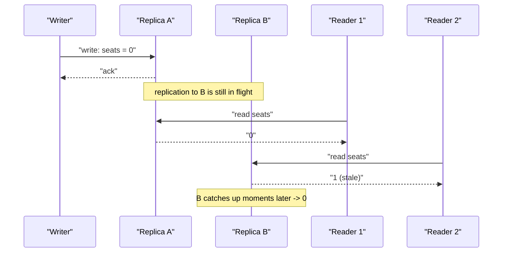

## Before you start

You need `cap-theorem` — consistency models are essentially a menu of specific answers to the "Consistency" side of that trade-off, ranging from strict to relaxed.

## In one sentence

A **consistency model** is a promise a distributed system makes about how up to date the data you read will be, ranging from "always the absolute latest write, guaranteed" to "eventually correct, but maybe not right this instant."

## Why it matters

When data is copied across multiple servers, updates take time to spread between them, and a read might land on a server that hasn't caught up yet. Choosing a consistency model decides whether your app can ever show a user outdated information, and how much performance and availability you're willing to trade to prevent that. Get it wrong in one direction and you build something too slow and rigid for its actual use case; get it wrong in the other and you build something that shows users confusing, contradictory data at the worst possible moment.

## The intuition

Two people try to book the last seat on a flight within the same second, from two different app servers. With **strong consistency**, both bookings are checked against a single, always-current source of truth — one succeeds, the other is immediately and correctly told "sold out," no matter which server they hit. With **eventual consistency**, each server might be working from a slightly stale local copy — both briefly see "1 seat left," both proceed, and both bookings succeed *locally* — the conflict only surfaces afterward, when the two servers compare notes and someone has to sort out the overbooking.

## How it actually works



**Strong consistency** guarantees every read sees the most recent write, no matter which server answers — as if there were only one copy of the data anywhere. This is the safest option but also the slowest, since servers must coordinate with each other before confirming any write went through, similar to everyone in a meeting having to explicitly agree before anyone is allowed to act on a decision.

**Eventual consistency** guarantees that *if no new writes happen*, every copy will eventually converge to the same value — but right after a write, different servers might briefly disagree. Think of a group chat where a message takes a moment to reach everyone's phone; for a short window some people have seen it and others haven't, but given enough time with no further writes, everyone converges to seeing the same messages.

**Causal consistency** sits in between the two extremes: operations that are causally related — a comment that replies to a specific post — are guaranteed to be seen by everyone in the same relative order (nobody sees the reply before the post it replies to). But operations that are unrelated to each other, like two different people's unrelated posts, can appear in a different order for different readers without breaking anything.

## Worked example

```js
// A simplified illustration of the gap eventual consistency allows
let replicaA = { seats: 1 };
let replicaB = { seats: 1 }; // starts as a copy of replicaA, not yet told about any changes

function bookSeat(replica) {
  if (replica.seats > 0) {
    replica.seats -= 1;
    return 'booked';
  }
  return 'sold out';
}

console.log(bookSeat(replicaA)); // 'booked' — replicaA now has 0 seats
console.log(bookSeat(replicaB)); // 'booked' too! replicaB hasn't heard about A's update yet
```

Output:

```
booked
booked
```

Both replicas independently believe a seat is still available, because the update from A hasn't propagated to B in time — exactly the kind of conflict eventual consistency allows to happen, and must reconcile after the fact (typically by refunding one booking).

## A second example — when it gets harder

The case that trips people up: a social media comment thread. You post a comment replying to a friend's photo, then immediately refresh the page — and briefly, your own comment isn't there yet, even though *you* just wrote it and know it succeeded. This looks like a bug, but it's actually a well-known consistency gap called **read-your-own-writes** — a guarantee stronger than plain eventual consistency (which promises nothing about *when* you specifically will see your own recent write) but weaker than full strong consistency (which would require coordinating every read globally, for every user, all the time).

Many real systems solve this by routing a user's own reads back to whichever replica handled their most recent write, at least for a short window — giving that one user a stronger guarantee without paying the cost of strong consistency for every reader of that comment thread globally. This is a good example of why "eventual consistency" isn't one fixed thing — there's a whole spectrum of intermediate guarantees systems mix and match based on what actually matters for each specific feature.

## Quick reference

| Model | Guarantee | Speed | Example use case |
|---|---|---|---|
| Strong | Every read sees the latest write | Slowest (needs coordination) | Bank balances, seat booking |
| Causal | Related events stay in order | Medium | Comments/replies, social feeds |
| Read-your-own-writes | You always see your own recent writes | Medium | Posting your own comment or profile edit |
| Eventual | All copies converge, eventually | Fastest | Shopping cart, DNS, "likes" count |

## Common mistakes

- Assuming eventual consistency means the data is unreliable forever — it converges, usually within milliseconds to a few seconds, it just doesn't guarantee an instant, global view at the moment of the write.
- Using strong consistency everywhere "to be safe" — this adds real coordination overhead and latency even to data nobody actually cares about seeing a few seconds late, hurting overall system performance for no real benefit.
- Treating "eventual consistency" as a single fixed guarantee — in practice, systems offer a spectrum (causal, read-your-own-writes, session consistency), and picking the right one per feature matters more than picking one model for the whole system.

## What interviewers ask

- **What's the difference between strong and eventual consistency?** — Strong consistency guarantees every read reflects the latest write immediately, requiring coordination between replicas; eventual consistency allows temporary disagreement between replicas right after a write, only guaranteeing they converge over time, which is much faster but can briefly show stale data.
- **Give an example where eventual consistency is perfectly fine.** — A "likes" counter on a social media post — if it briefly shows 104 on one server and 105 on another right after a like, nobody is harmed, and it self-corrects within moments.
- **What is causal consistency and why would you choose it over strong or eventual?** — It guarantees operations that depend on each other, like a reply and the post it replies to, are seen in the correct order everywhere, without paying the full coordination cost of strong consistency — a middle ground well suited to comment threads and social feeds.
- **Explain the 'two people booking the last seat' scenario under both models.** — Under strong consistency, both bookings check the same up-to-date source, so one is confirmed and the other rejected immediately; under eventual consistency, both might briefly see the seat as available and both succeed locally, with the conflict surfacing and needing resolution once the replicas synchronize.

## Practice

1. Modify the worked example so that after both bookings succeed, the two replicas "sync" (whichever replica wrote most recently wins) — write the reconciliation logic and decide what happens to the losing booking.
2. Explain why a chat app's "message delivered" checkmark is a form of the read-your-own-writes problem, and how you'd guarantee a sender always sees their own message appear instantly.
3. Pick three features from an app you use daily (e.g., follower count, direct messages, account balance) and classify which consistency model each most likely uses, with reasoning.

## Where to go next

Continue to `replication-and-partitioning` to see the actual mechanisms — leader-follower setups, quorums — that systems use to implement these consistency guarantees at scale.
