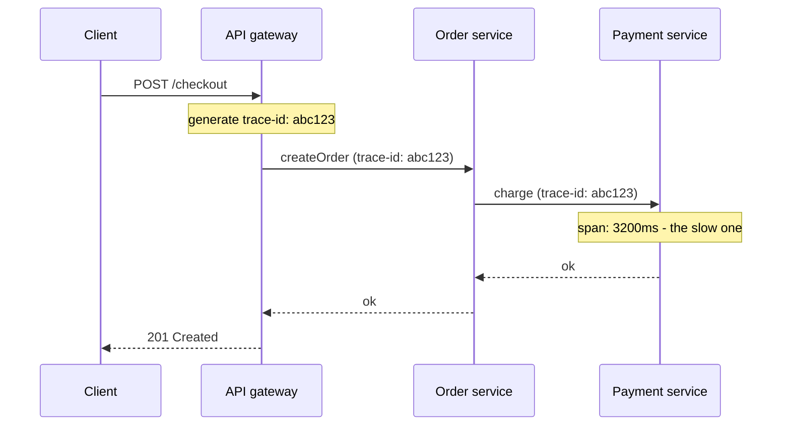

## Before you start

You need [monolith-vs-microservices](monolith-vs-microservices) — observability only becomes a hard problem once one user request touches several services. On a single server, a log file is enough.

## In one sentence

**Observability** is the ability to work out what your system is doing internally purely from the data it emits — logs, metrics, and traces — so you can answer questions about a failure you never anticipated, without adding new code and waiting for it to happen again.

## Why it matters

In a monolith, a stack trace tells you where a request broke. Split that same request across eight services and the stack trace tells you only that *your* call to something else failed. The user reports "checkout is slow"; you have eight sets of logs, none of which know about the others, and no way to line up which entries belong to that user's request.

Without observability, debugging a distributed system degrades into guesswork and grep. With it, you pull up one request and see exactly where its 4 seconds went.

## The intuition

Think about tracking a parcel. Each depot it passes through stamps it — arrived, sorted, dispatched — and every stamp carries the same tracking number. No single depot knows the whole journey. But because they all record the *same* number, you can lay the stamps end to end and see the complete route, including the depot where it sat for two days.

A **trace** is that journey. Each stamp is a **span**: one unit of work, in one service, with a start time and an end time. The tracking number is the **trace ID**, and passing it along at every hop is the entire trick.

The three kinds of telemetry answer different questions. **Metrics** are numbers over time — "error rate is 3%" — and tell you *that* something is wrong. **Logs** are timestamped events — "payment declined for order 91" — and tell you *what* happened at one point. **Traces** connect one request's work across services and tell you *where* the time or the failure lives.

## How it actually works

Each service, on receiving a request, looks for a trace ID in the incoming headers. If one is there, it continues that trace. If not, it starts a new one. It then creates a span for its own work, records the duration, and — critically — passes the trace ID onward in every outgoing call.



Spans nest. The gateway's span is the parent; the order service's span is its child; the payment span is a child of that. Because each span records a parent ID alongside its own, a collector can reassemble the tree from spans that arrived separately, out of order, from four different machines.

That parent-child structure is what turns a pile of durations into a diagnosis. The gateway span says the request took 3.4 seconds. Its children say the order service took 3.3 of them, and *its* child says payment took 3.2. The slow component identifies itself.

**Context propagation** is the part people get wrong. The trace ID must survive every boundary — HTTP headers, message queue metadata, background jobs. The moment one service forgets to forward it, the trace splits in two and the connection is lost. The W3C `traceparent` header is the standard format, so tools from different vendors can read each other's traces.

If a full tracing system is more than you need, a **correlation ID** gets you most of the debugging value for almost no effort: generate one ID per request, forward it, and include it in every log line. You lose the timing tree, but `grep abc123` across all services now returns one request's complete story.

## Worked example

A minimal correlation-ID propagator. This is the pattern real tracing libraries automate, written out so you can see there is no magic in it:

```js
const { randomUUID } = require('node:crypto');
const { AsyncLocalStorage } = require('node:async_hooks');

const store = new AsyncLocalStorage(); // carries context through async calls

function log(message) {
  const ctx = store.getStore();
  console.log(JSON.stringify({ traceId: ctx?.traceId ?? 'none', message }));
}

function handleRequest(headers, work) {
  const traceId = headers['x-trace-id'] ?? randomUUID(); // continue or start
  return store.run({ traceId }, work);
}

// Simulate a request arriving with no trace ID yet
handleRequest({}, async () => {
  log('order received');
  await new Promise((r) => setTimeout(r, 10)); // async boundary — context survives
  log('payment charged');
});
```

Output (your UUID will differ):

```
{"traceId":"6f1c...","message":"order received"}
{"traceId":"6f1c...","message":"payment charged"}
```

Both lines carry the same ID even though the second runs after an `await`. `AsyncLocalStorage` is what makes that work — without it you would have to thread the ID manually through every function signature in the codebase.

## A second example — when it gets harder

Tracing every request at full volume is unaffordable. A service handling 10,000 requests per second, each producing 20 spans, generates 200,000 spans per second — terabytes a day, mostly recording that things worked fine. So systems **sample**: keep some traces, discard the rest.

Naive **head sampling** decides at the start of the request, usually at random: keep 1%. It is cheap and predictable, and it has one fatal property — the interesting requests are rare, so you almost always throw away the errors and keep the boring successes.

**Tail sampling** buffers the spans until the request finishes, then decides: keep it if it errored, keep it if it was slower than a threshold, keep a small random slice of the healthy ones. You get every failure and a representative sample of normal traffic. The cost is that the collector must hold spans in memory until it knows the request is done, which is real infrastructure you now have to run and scale.

The trap: whichever you choose, the decision must be **consistent across services**. If the gateway samples a trace in but the payment service independently samples it out, you get a trace with a hole in it, which is worse than no trace — you will spend an hour concluding payment was never called. This is why the sampling decision travels in the trace context itself rather than being made independently at each hop.

## Quick reference

| Signal | Answers | Cost | Best for |
|---|---|---|---|
| Metrics | "Is something wrong?" | Cheap, fixed size | Dashboards, alerting, trends |
| Logs | "What exactly happened here?" | Grows with traffic | Detail on one event |
| Traces | "Where did the time go?" | Expensive, needs sampling | Latency and cross-service failures |

| Sampling | Decides when | Keeps errors? |
|---|---|---|
| Head (random) | Request start | Only by luck |
| Tail | Request end | Yes, by rule |

## Common mistakes

- Logging without a correlation ID, so you can never reassemble one request's story from several services' logs.
- Dropping the trace context at an async boundary — a message queue, a background job — which silently splits one trace into two unrelated ones.
- Alerting on causes instead of symptoms. Page on "checkout error rate above 2%", which users feel; leave "CPU at 80%", which they may not, for a dashboard.
- Putting high-cardinality values like user IDs into metric labels — a metric with a million label combinations will take down the metrics system itself. Those belong on spans and log lines.

## What interviewers ask

- **What's the difference between monitoring and observability?** — Monitoring tracks known failure modes you predicted and instrumented in advance; observability is emitting enough data to answer questions you did not anticipate, without shipping new code first.
- **How do you trace one request across ten services?** — Generate a trace ID at the edge, propagate it in a standard header on every outgoing call, and have each service emit a span carrying that trace ID plus its parent span ID; a collector reassembles the tree.
- **What are the four golden signals?** — Latency, traffic, errors, and saturation, from the Google SRE book; they are the minimum set that catches most user-visible problems in a request-driven service.
- **Why not trace 100% of requests?** — Volume and cost: spans scale with requests multiplied by service hops, quickly exceeding what you can afford to store, so you sample — ideally at the tail, so every error is kept.
- **What's the risk of using logs for metrics?** — Counting log lines to derive rates is expensive and slow at query time, and log loss silently corrupts the number; a counter incremented in-process is cheap and exact.

## Practice

1. Take the `handleRequest` example and extend it so an outgoing `fetch` automatically attaches `x-trace-id` from the current context, without the calling code passing it explicitly.
2. Add span timing: record a start and end time per operation, plus a parent span ID, and print the resulting tree indented by depth.
3. A trace shows a request taking 900ms, with child spans of 300ms, 250ms, and 200ms that do not overlap in time. Where are the missing 150ms, and what would you instrument to find out?

## Where to go next

Tracing tells you *which* service is slow or failing. [designing-for-failure](designing-for-failure) covers what the calling service should do about it — timeouts, circuit breakers, and degrading gracefully instead of hanging.
