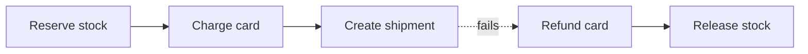

## Before you start

You need [indexing-and-transactions](indexing-and-transactions) for what ACID means in one database, and [message-queues](message-queues), since sagas are usually driven by events.

## In one sentence

A **distributed transaction** is a single logical operation that must update data in several independent services or databases, where you cannot simply wrap the whole thing in `BEGIN` and `COMMIT` because no one system owns all the data.

## Why it matters

Placing an order means reserving stock, charging a card, and creating a shipment. In a monolith with one database, that is one transaction: all three succeed or all three roll back, and the database guarantees it.

Split those into three services with three databases and the guarantee vanishes. Stock is reserved, the card is charged, and then shipping is down. You now have money taken for an order that will never ship, and no `ROLLBACK` that reaches across all three. Every microservice architecture has this problem, and how you answer it determines whether your data stays trustworthy.

## The intuition

Two ways to coordinate a group booking with a hotel, a flight, and a car hire.

The first: call all three, ask each to hold the booking without confirming, wait until all three say "I can do it," then tell all three to confirm. Nobody commits until everyone agrees. That is **two-phase commit** (2PC). It is correct, and it requires all three to sit holding a reservation — and their locks — while waiting for you.

The second: book them one at a time. If the car hire fails, you phone the hotel and the airline and cancel. There is a window where you have a flight but no car, and cancelling might cost a fee, but nobody was ever blocked waiting. That is a **saga**: a sequence of local transactions, each with a **compensating action** that undoes it.

The key difference is that a saga never rolls back — it moves forward through corrections. You cannot un-charge a card; you issue a refund, which is a new transaction that leaves a trace.

## How it actually works

2PC uses a coordinator. Phase one: it asks every participant to prepare, and each either votes yes — durably promising it *can* commit — or no. Phase two: if all voted yes, the coordinator tells everyone to commit; otherwise everyone aborts.

It genuinely provides atomicity. It is also avoided in practice, for one main reason: participants hold locks from the moment they vote yes until they hear the decision. If the coordinator crashes in between, they are stuck — they cannot commit (the decision might be abort) and cannot abort (it might be commit). They block, holding locks, until the coordinator returns. That is a single point of failure that freezes every participant, and it scales badly since throughput is bounded by the slowest participant on every operation.

Sagas trade atomicity for availability. Each step commits locally and immediately, publishing an event that triggers the next.



If step three fails, the compensations run backwards: refund the card, release the stock. The system is briefly inconsistent — stock reserved, money taken, no shipment — and then converges. That intermediate state is visible to users, which is the real price of a saga and must be designed for, not hidden.

Sagas come in two shapes. **Choreography**: each service listens for events and reacts, with no central controller. Simple for three steps, and impossible to follow at ten — the workflow exists nowhere except as emergent behaviour. **Orchestration**: one component holds the sequence explicitly, calling each service and invoking compensations on failure. More moving parts, but the workflow is in a single readable place, which matters enormously when debugging why order 4471 is stuck.

Both depend on one thing: the local database write and the event publish must not diverge. Write the order and then publish, and a crash between them loses the event forever — the order exists and nothing downstream ever hears. Publish then write, and you announce an order that does not exist.

The **outbox pattern** fixes this. Inside the same local transaction that writes the order, insert a row into an `outbox` table. Both commit atomically because they are in one database. A separate process then reads unsent outbox rows and publishes them, marking them sent. Crash anywhere and the row is still there to be retried. You get at-least-once delivery, which is why the consumers must be idempotent.

## Worked example

An orchestrated saga that compensates in reverse order:

```js
async function runSaga(steps) {
  const completed = [];
  try {
    for (const step of steps) {
      await step.action();
      completed.push(step); // remember what to undo
    }
    return 'saga completed';
  } catch (err) {
    for (const step of completed.reverse()) { // compensate newest first
      await step.compensate();
    }
    return `saga compensated: ${err.message}`;
  }
}

const steps = [
  { name: 'stock',    action: async () => console.log('reserved stock'),
                      compensate: async () => console.log('released stock') },
  { name: 'payment',  action: async () => console.log('charged card'),
                      compensate: async () => console.log('refunded card') },
  { name: 'shipping', action: async () => { throw new Error('carrier unavailable'); },
                      compensate: async () => console.log('cancelled shipment') },
];

runSaga(steps).then(console.log);
```

Output:

```
reserved stock
charged card
refunded card
released stock
saga compensated: carrier unavailable
```

Shipping never completed, so it is never compensated — only completed steps get undone. Compensation runs newest-first because later steps may depend on earlier ones; releasing stock before refunding could let another order grab inventory tied to a payment you are still unwinding.

## A second example — when it gets harder

The code above assumes compensation succeeds. In production it is the compensation that fails — the refund API times out — and now you have taken money with no order and no automatic way back.

Compensations must therefore be **retryable indefinitely and idempotent**. A refund that runs twice must not pay out twice. This is why compensation is usually a durable queued job with backoff rather than an inline call, and why after a bounded number of failures it must land in a dead-letter queue that alerts a human. Silent failure here means silently keeping a customer's money.

Worse are steps that cannot be compensated at all. You cannot un-send an email. The standard technique is **semantic locking**: order the saga so irreversible steps go last, and until then keep the entity in a pending state — an order marked `PENDING_PAYMENT` rather than `CONFIRMED`. Anything reading it sees the state and knows not to treat it as final.

Then there is the anomaly sagas cannot avoid. Because each step commits immediately, another transaction can read data mid-saga and act on values that are about to be compensated away. A customer sees their balance debited, screenshots it, and thirty seconds later the refund lands. Classic ACID isolation would have hidden the intermediate state entirely; sagas offer no isolation, only atomicity-by-eventual-correction. If a business rule genuinely cannot tolerate that window, a saga is the wrong pattern and the operation belongs inside one service and one database.

## Quick reference

| | 2PC | Saga |
|---|---|---|
| Consistency | Strong, immediate | Eventual |
| Isolation | Yes | None — intermediate states are visible |
| Locks | Held across the whole transaction | Local and short |
| Failure of coordinator | Participants block | Compensations continue |
| Scales across services | Poorly | Well |
| Undo mechanism | Real rollback | Compensating transactions |

## Tools & frameworks

| Tool | What it's for | Reach for it when |
|---|---|---|
| [Temporal (TypeScript SDK)](https://github.com/temporalio/sdk-typescript) | Durable workflow execution in Node | You need sagas with retries and compensation, written as ordinary code |
| [Temporal docs](https://docs.temporal.io/evaluate/use-cases-design-patterns) | Saga and long-running patterns | You are choosing between orchestration and choreography |
| [Kafka docs](https://kafka.apache.org/documentation/) | Exactly-once between consume and produce | The "transaction" is really read-process-write inside one system |
| [PostgreSQL docs](https://www.postgresql.org/docs/current/) | `PREPARE TRANSACTION` and 2PC reference | You want to show why 2PC blocks on coordinator failure — a cautionary tool |

The right answer in most interviews is to avoid distributed transactions and use a saga with idempotent steps; 2PC is here as the thing you explain *away*.

## Common mistakes

- Assuming a compensation cancels the original. It is a new forward transaction with its own record — a refund, not an erasure.
- Publishing the event outside the database transaction, so a crash loses events or announces work that never happened. Use an outbox.
- Compensating in the same order as the steps rather than in reverse.
- Making compensations non-idempotent, so a retried refund pays twice.
- Choosing choreography for a ten-step workflow, leaving no single place that describes what the process actually is.

## What interviewers ask

- **Why is 2PC avoided in microservices?** — Participants hold locks from voting yes until the decision arrives, so a coordinator crash blocks them indefinitely; it is a single point of failure that freezes everyone and caps throughput at the slowest participant.
- **What is a saga?** — A sequence of local transactions, each committing immediately and publishing an event, where a failure triggers compensating transactions that semantically undo the completed steps in reverse order.
- **Choreography or orchestration?** — Choreography for two or three steps where the coupling cost of a central component is not worth it; orchestration beyond that, because the workflow needs to live in one readable, debuggable place.
- **What problem does the outbox pattern solve?** — The dual-write problem: it makes the database change and the event atomic by writing the event into an outbox table in the same local transaction, with a separate process publishing from it.
- **What consistency do you actually get from a saga?** — Eventual, with no isolation: intermediate states are visible to other transactions, so users can observe a state that is about to be compensated away.

## Practice

1. Add retry with exponential backoff to `runSaga`'s compensation loop, and route a step to a dead-letter list after three failures instead of throwing.
2. Design the outbox table for the order service: name the columns, and describe exactly what the publisher process does on startup after a crash.
3. Take a hotel booking saga where the confirmation email is step two of four. Explain what goes wrong, then reorder the saga and add the state field that fixes it.

## Where to go next

Sagas rely on retries and duplicate-safe steps, which is [idempotency-and-retries](idempotency-and-retries). For choosing consistency deliberately rather than by accident, read [cap-and-tradeoffs-in-practice](cap-and-tradeoffs-in-practice).
