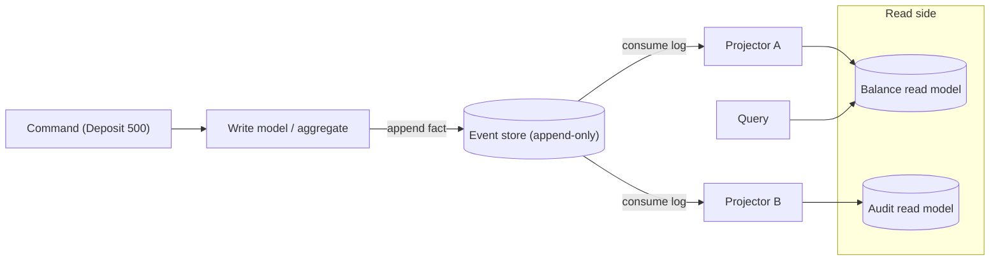
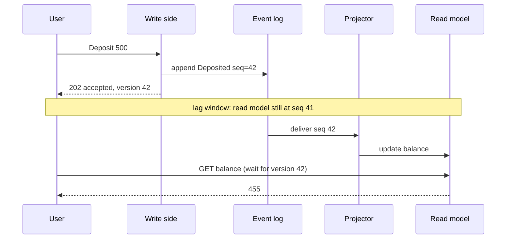

## Before you start

Read `message-queues` first — you already know a Kafka-style log keeps messages after they are read and lets a consumer replay them, and that log is the machinery underneath everything here. `consistency-models` matters too, because the words *eventual consistency* and *read-your-own-writes* are defined there and used throughout this topic. Having seen `time-series-and-analytics-databases` helps: its two-store architecture is the same shape argued on different grounds.

## In one sentence

**Event sourcing** stores the complete, ordered list of things that happened rather than the current situation, and rebuilds the current situation by replaying that list — while **CQRS** (Command Query Responsibility Segregation) is the separate decision to use one data model for writing and a different one for reading.

## Why it matters

A normal `UPDATE accounts SET balance = 455 WHERE id = 7` destroys evidence. The new balance is stored; the reason is gone. Six months later, someone asks why a customer's balance is wrong, and you have a number with no history. You go hunting through application logs that were never designed to be authoritative, rotated after 30 days, and disagree with the database.

Now a regulator asks what that balance was last Tuesday at 3pm. With overwritten state you cannot answer at all. With a stored sequence of deposits, withdrawals and holds, you answer by replaying up to that timestamp — a query nobody designed for and which works anyway.

That is the payoff: the *reason* is data, not a log line. The cost is real and shows up later in this topic, which is why event sourcing is both genuinely powerful and one of the most over-adopted patterns in the field.

## The intuition

Think about a bank statement versus the number on an ATM screen.

The ATM shows £455. That is state: one value, correct right now, telling you nothing. The statement is a list — opened, deposited £500, withdrew £120, hold placed £50, deposited £75. From the statement you can compute the £455 yourself, and you can also compute what the balance was on any past date, spot the transaction you did not recognise, and check the arithmetic.

Banks do not store your balance and hope. They store the transactions and derive the balance, because the transactions are the facts and the balance is merely a *summary* of them. Event sourcing applies that to application state generally: the event log is the source of truth, and every stored "current state" is a **projection** — a cached summary you can throw away and rebuild.

One consequence follows immediately and is worth fixing in your head now. Events are in the past tense and immutable: `MoneyDeposited`, not `Deposit`. You cannot delete or edit a statement line. To correct a mistake you add a correcting line — exactly the forward-only compensation logic you saw in `distributed-transactions`.



## How it actually works

A **command** is a request to change something — it can be rejected. The write model loads the relevant history, decides whether the command is allowed, and if so appends one or more events. Appending is the only write operation the event store supports: no update, no delete. That single constraint is what makes the log trustworthy.

To decide, the write model needs current state, which it gets by replaying that entity's events through a reducer function. This is the part beginners find surprising: the business rules live in the reducer, and there is no row anywhere holding the balance.

**Projections** build the read side. A projector consumes the log in order and maintains whatever shape answers a particular question — a balance table, a search index, a monthly report. Each projection is independently rebuildable: delete it, replay the log from event one, and you have it back. That is what makes a projection bug cheap. You fix the projector, replay, and the corrected read model appears; you never write a data-repair script against the truth, because the truth was never wrong.

**Snapshots** solve the obvious performance problem. An account with 200,000 events should not replay all of them on every command. A snapshot stores the folded state as of sequence N, so you load the snapshot and replay only what came after. The critical point for interviews: a snapshot is a *cache*, never a source of truth. If a snapshot is corrupt or its format changed, you delete it and rebuild from the log.

### CQRS is a different idea

This is the classic interview error, so be precise. **CQRS says commands and queries should use separate models.** That is all it says. It says nothing about how you store data.

You can do CQRS with no event sourcing at all: a normalised relational schema for writes, a denormalised table or a search index for reads, kept in sync by triggers, change-data-capture, or the outbox pattern from `distributed-transactions`. Plenty of systems do this and never store an event.

You can also do event sourcing with no CQRS: append events, replay them, serve reads from the same replayed state. Small event-sourced services often do exactly this, and it is simpler.

They pair well because event sourcing hands you the synchronisation mechanism CQRS needs for free. The hard part of CQRS is normally "how does the read model learn about the write?" — and an ordered, replayable log is a very good answer.



### The cost: eventual consistency between the sides

Look at that gap in the diagram. The write is durable at sequence 42, but the read model has not caught up. A user who submits a form and is redirected to a page reading from the projection sees their old data — the **read-your-own-writes** problem from `consistency-models`, now structural rather than accidental.

Two fixes work in practice. First, serve that one request from the write model, accepting a slower and less convenient query for the narrow case where the user must see their own change. Second, return the version the write reached (`version 42` above) and have the client pass it back, so the read side either waits briefly for the projection to reach 42 or tells the client to retry. Both are deliberate; the failure mode is treating the lag as a bug to be eliminated instead of a property to be designed around.

## Worked example

```js
// An append-only event store. Events are facts: they never change.
const log = [];
function append(type, data) {
  log.push({ seq: log.length + 1, type, data });
}

// A reducer turns one event into the next state. This IS the business logic.
function apply(state, e) {
  switch (e.type) {
    case 'Opened':     return { balance: 0, holds: 0, closed: false };
    case 'Deposited':  return { ...state, balance: state.balance + e.data.amount };
    case 'Withdrawn':  return { ...state, balance: state.balance - e.data.amount };
    case 'HoldPlaced': return { ...state, holds: state.holds + e.data.amount };
    case 'Closed':     return { ...state, closed: true };
    default:           return state;
  }
}

// Replay: fold the log from a starting point. No stored current state anywhere.
function replay(events, from = null) {
  return events.reduce(apply, from ? { ...from } : undefined);
}

append('Opened', {});
append('Deposited', { amount: 500 });
append('Withdrawn', { amount: 120 });
append('HoldPlaced', { amount: 50 });
append('Deposited', { amount: 75 });

console.log('state now      :', replay(log));
console.log('same replay    :', replay(log));             // deterministic
console.log('as of seq 3    :', replay(log.slice(0, 3))); // time travel, free

// A snapshot is a cached fold up to seq N. It is an optimisation, not truth.
const snapshot = { seq: 3, state: replay(log.slice(0, 3)) };
const tail = log.filter(e => e.seq > snapshot.seq);
console.log('from snapshot  :', replay(tail, snapshot.state), `(replayed ${tail.length} of ${log.length})`);

// A projection is a read model: shaped for a question, rebuildable from scratch.
function buildLedgerProjection(events) {
  const rows = [];
  let running = 0;
  for (const e of events) {
    if (e.type === 'Deposited') running += e.data.amount;
    if (e.type === 'Withdrawn') running -= e.data.amount;
    else if (e.type !== 'Deposited') continue;
    rows.push({ seq: e.seq, delta: e.type === 'Deposited' ? +e.data.amount : -e.data.amount, running });
  }
  return rows;
}
console.log('ledger rows    :', buildLedgerProjection(log));
```

Output:

```
state now      : { balance: 455, holds: 50, closed: false }
same replay    : { balance: 455, holds: 50, closed: false }
as of seq 3    : { balance: 380, holds: 0, closed: false }
from snapshot  : { balance: 455, holds: 50, closed: false } (replayed 2 of 5)
ledger rows    : [
  { seq: 2, delta: 500, running: 500 },
  { seq: 3, delta: -120, running: 380 },
  { seq: 5, delta: 75, running: 455 }
]
```

Four things are proven here. Replaying twice gives byte-identical state, because `apply` is a pure function of the events — if it ever consults the clock, a random number, or another service, replay stops being reproducible and the whole model collapses. Slicing to sequence 3 gives the historical balance of 380 with no extra machinery. Starting from the snapshot reaches the same 455 while touching two events instead of five. And the ledger projection is a completely different shape from the balance state, derived from the same log, rebuilt from scratch in one pass.

## A second example — when it gets harder

Now the part that actually bites in production: events live forever, so a schema change is not an `ALTER TABLE`.

You cannot migrate an event log the way `database-migrations` migrates a table. A v1 `Deposited` event written three years ago has no `currency` field, and you cannot rewrite it — rewriting history destroys the property you adopted event sourcing for, and any auditor or hash chain over the log would notice. So the code must stay able to read every version it ever wrote.

```js
// A three-year-old v1 event sits next to a v2 one. Both must still be readable.
const stored = [
  { seq: 1, type: 'Deposited', v: 1, data: { amount: 500 } },
  { seq: 2, type: 'Deposited', v: 2, data: { amount: 120, currency: 'EUR' } },
];

// Upcasters run at READ time. The stored bytes are never rewritten.
const upcasters = {
  'Deposited:1': e => ({ ...e, v: 2, data: { ...e.data, currency: 'USD' } }),
};
function upcast(e) {
  let cur = e;
  while (upcasters[`${cur.type}:${cur.v}`]) cur = upcasters[`${cur.type}:${cur.v}`](cur);
  return cur;
}

const totals = {};
for (const e of stored.map(upcast)) {
  totals[e.data.currency] = (totals[e.data.currency] || 0) + e.data.amount;
}
console.log('upcast v1      :', upcast(stored[0]).data);
console.log('per currency   :', totals);
console.log('store untouched:', stored[0].data); // still the original v1 bytes
```

Output:

```
upcast v1      : { amount: 500, currency: 'USD' }
per currency   : { USD: 500, EUR: 120 }
store untouched: { amount: 500 }
```

An **upcaster** transforms an old event into the current shape as it is read, chaining v1→v2→v3 so only one hop needs writing per version. The store is never touched.

Notice the uncomfortable part: the upcaster had to invent `currency: 'USD'`. That information does not exist in the v1 event, and no clever code can recover it. This is why the practical rule is **additive-only changes with safe defaults** — adding an optional field is easy, splitting one field into two is painful, and changing the meaning of an existing field is close to impossible. Getting the event vocabulary right early matters far more here than in a system where you can just run a migration.

## Quick reference

| Question | Event sourcing | CQRS |
|---|---|---|
| What does it change? | How state is stored (log of facts, not current values) | How models are shaped (separate write and read models) |
| Can you use it alone? | Yes — replay and serve reads from the same state | Yes — normalised writes, denormalised reads, synced any way |
| Main benefit | Audit trail, temporal queries, rebuildable state | Each side optimised and scaled for its own workload |
| Main cost | Immutable schema, replay time, event design is permanent | Two models to keep in sync, and lag between them |
| Schema change | Version the event and upcast on read | Rebuild the read model from the write model |

| Worth it when | Over-engineering when |
|---|---|
| Money, ledgers, anything where "how did we get here" is the question | CRUD forms where nobody will ever ask what changed |
| Regulated or audit-critical domains | The team has never run an event-sourced system before |
| Complex collaborative state with concurrent editors | Read and write load are both modest and similar in shape |
| Reads and writes need wildly different shapes or scale | A read replica or a materialised view already solves it |

## Tools & frameworks

| Tool | What it's for | Reach for it when |
|---|---|---|
| [Kurrent (formerly EventStoreDB)](https://docs.kurrent.io/) | Purpose-built event store with streams | Event sourcing is the core model, not an add-on to something else |
| [Kafka](https://kafka.apache.org/documentation/) | Durable partitioned log | You want the log as an integration backbone across services |
| [Postgres as event store](https://www.postgresql.org/docs/current/) | Append-only table plus projections | Most real systems — one database, transactional appends, no new operations |
| [Temporal](https://docs.temporal.io/) | Event-sourced workflow state | The events you care about are *process* steps, not domain facts |
| [Axon](https://www.axoniq.io/) | Full CQRS/ES framework on the JVM | You are a JVM shop wanting the whole pattern prescribed; nothing in Node matches its scope |

EventStoreDB was renamed Kurrent, so use that name. And note the default: event sourcing in Postgres is the pragmatic choice, and a dedicated event store is a decision that needs justifying.

## Common mistakes

- **Saying event sourcing and CQRS are the same thing.** They are independent choices that happen to compose well. Being able to separate them cleanly is the single strongest signal on this topic.
- **Naming events as commands.** `CreateOrder` is a request that can be refused; `OrderCreated` is a fact that already happened. Only facts belong in the log.
- **Non-deterministic reducers.** Calling `Date.now()`, a random generator, or another service inside `apply` means replaying the same events gives a different answer, which silently destroys every guarantee. Capture the timestamp *in the event* when it is produced.
- **Treating snapshots as truth.** A snapshot you cannot delete and rebuild is no longer an optimisation, it is a second source of truth that will eventually disagree with the log.
- **Mutating old events to "fix" data.** The fix is a new correcting event, or a projector change plus a replay.
- **Assuming the read model is current.** Every projection lags. Design the user experience for that, or read the affected request from the write model.
- **Adopting it because it sounds sophisticated.** Ask what question the log will answer that state cannot. If there is no answer, a table and an audit trigger will serve you better.

## What interviewers ask

- **Are event sourcing and CQRS the same thing?** — No. Event sourcing is about storing facts and deriving state; CQRS is about separating the write model from the read model. Either works without the other; they pair because a replayable log is an excellent way to feed read models.
- **How do you get current state without storing it?** — Replay the entity's events through a pure reducer, using a snapshot as a starting point so you only replay the tail. They are checking you understand state is derived, and that snapshots are a cache.
- **A user updates their profile and immediately sees stale data. Why, and what do you do?** — The projection has not consumed the event yet. Either serve that request from the write model, or return the write's version and have the read side wait for or report on reaching it.
- **How do you change an event's schema?** — You do not change stored events. You add a version, write an upcaster that converts old events to the new shape at read time, and keep changes additive with safe defaults.
- **When would you not use event sourcing?** — Standard CRUD where nobody asks what changed, where the team has no operational experience with replay, or where a materialised view already gives you the read shape you wanted. It is heavily over-adopted.
- **A projection has a bug that produced wrong data for two months. How do you fix it?** — Fix the projector and replay the log to rebuild the projection. No data-repair script against the source of truth, because the source of truth was never wrong.

## Practice

1. Extend the event store above with a `Closed` event and a command handler that rejects `Withdrawn` when the account is closed or when the amount exceeds `balance - holds`. Prove the rejection happens on the write side by replaying, without storing a balance anywhere.
2. Add a second projection that reports total deposits per calendar month, then delete it and rebuild it from the log. Time both a full replay and a snapshot-plus-tail replay as the log grows to 100,000 events, and decide where a snapshot starts paying for itself.
3. Introduce a v3 `Deposited` event that splits `amount` into `amountMinor` and `currency`, write the upcaster chain from v1, and explain precisely which piece of information cannot be recovered from a v1 event and what you would have done differently when first designing it.

## Where to go next

Continue to `idempotency-and-retries`. Projectors consume the log at least once, so the same event will be delivered twice and your projection must produce the same result either way — that topic is where the dedupe and exactly-once-processing techniques this pattern depends on are worked out properly.
