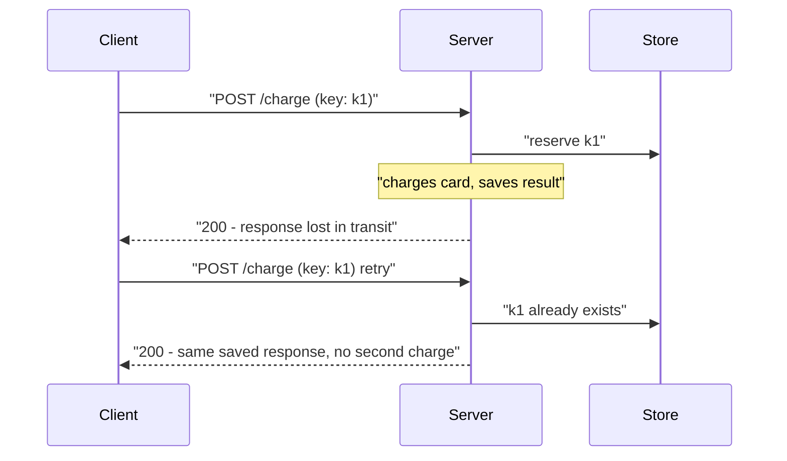

## Before you start

You need [api-design](api-design) — idempotency is designed into an API's contract, not bolted on later. Familiarity with HTTP methods helps, since some are already idempotent by definition.

## In one sentence

An operation is **idempotent** if performing it twice leaves the system in exactly the same state as performing it once, which is what makes it safe to retry a request when you have no idea whether the first attempt actually succeeded.

## Why it matters

Your service calls the payment API. The connection times out. Did the charge go through?

You genuinely cannot tell. The request may have never arrived, or it may have been processed perfectly with only the response lost on the way back. Both produce an identical timeout on your end.

Retry and you risk charging the customer twice. Don't retry and you risk a customer whose order never gets paid. Idempotency is what dissolves this dilemma: make the operation safe to repeat, and the answer becomes "always retry," with no downside.

## The intuition

A light switch labelled "OFF" is idempotent — flick it ten times and the light is off. A switch labelled "TOGGLE" is not: the outcome depends entirely on how many times you pressed it, and if you don't know whether your press registered, you can't safely press again.

Most useful operations are naturally toggles. "Add £50 to this balance" run twice adds £100. The fix is to make the operation carry an identity: not "add £50" but "apply transfer `txn_8a1f`, worth £50". The server records which transfer IDs it has already applied, so a repeat is recognised and ignored. That identifier is an **idempotency key**.

## How it actually works

The client generates a unique key — a UUID is standard — and sends it with the request. The key identifies *the intent*, so a retry of the same logical operation reuses the same key while a genuinely new operation gets a fresh one.



The server stores the outcome against the key. On any repeat, it returns the stored response instead of redoing the work. Stripe keeps these records for 24 hours, which comfortably covers any realistic retry window.

Two details matter. First, the key must be **reserved before** the work starts, atomically — otherwise two concurrent retries both check, both find nothing, and both charge. A unique constraint on the key column does this for free: the second insert fails, and that failure is the signal to wait for the first one's result. Second, the stored response must include **failures** — if the first attempt failed validation, the retry should return that same failure rather than trying again and possibly succeeding, which would make the outcome depend on timing.

Retrying also needs to be paced. Immediate retries from thousands of clients hitting a struggling service produce a **retry storm**: the service is slow, everyone retries, load multiplies, it gets slower, more retries. The service cannot recover because the retries themselves are now the load.

**Exponential backoff** spaces attempts out — 100ms, 200ms, 400ms, 800ms — giving the service room to recover. But backoff alone leaves clients synchronised: everyone who failed at the same moment retries at the same moment, in tightening clusters. **Jitter** adds randomness, spreading those clusters into a smooth trickle. AWS's analysis of this is the canonical reference, and its conclusion is blunt: full jitter, picking uniformly at random from zero to the current backoff ceiling, beats the alternatives.

## Worked example

Backoff with full jitter, plus a guard against retrying things that should never be retried:

```js
const sleep = (ms) => new Promise((r) => setTimeout(r, ms));

async function retry(fn, { attempts = 5, baseMs = 100, capMs = 5000 } = {}) {
  for (let attempt = 0; attempt < attempts; attempt++) {
    try {
      return await fn();
    } catch (err) {
      if (!err.retryable || attempt === attempts - 1) throw err; // 400s never retry
      const ceiling = Math.min(capMs, baseMs * 2 ** attempt);
      const delay = Math.random() * ceiling; // full jitter: uniform in [0, ceiling)
      console.log(`attempt ${attempt + 1} failed, waiting ${Math.round(delay)}ms`);
      await sleep(delay);
    }
  }
}

let calls = 0;
const flaky = async () => {
  if (++calls < 4) throw Object.assign(new Error('503'), { retryable: true });
  return `succeeded on call ${calls}`;
};

retry(flaky).then(console.log);
```

Output (delays are random, so yours will differ):

```
attempt 1 failed, waiting 61ms
attempt 2 failed, waiting 134ms
attempt 3 failed, waiting 291ms
succeeded on call 4
```

The ceiling doubles each time, but the actual wait is uniformly random below it. Two clients failing simultaneously will almost certainly retry at different moments. Note `err.retryable` — a 400 Bad Request will fail identically every time, so retrying it just wastes capacity and delays the error the caller needs to see.

## A second example — when it gets harder

"Exactly-once delivery" is what everyone wants and what no network can provide. The reason is fundamental: the sender cannot distinguish "the message was lost" from "the message arrived and the acknowledgement was lost." Whatever the sender does — retry or give up — it is wrong in one of those two cases. Send once and you risk zero deliveries; retry and you risk two. There is no third option, and no amount of protocol cleverness creates one.

So you pick your failure mode. **At-most-once**: never retry, accept occasional loss. **At-least-once**: always retry, accept occasional duplicates. Almost everything real chooses at-least-once, because a duplicate can be handled and a silent loss cannot.

Exactly-once *processing* is achievable, and is a different claim from exactly-once delivery. You accept that the message may arrive twice and make the processing idempotent — deduplicating on a message ID, or writing the result and the "processed" marker in one transaction so they cannot disagree. Kafka works this way: idempotent producers plus transactional writes absorb duplicates rather than preventing them.

The distinction is what interviewers are listening for. "Exactly-once delivery" is a red flag. "At-least-once delivery with idempotent consumers" is the same outcome, honestly described.

## Quick reference

| Method | Idempotent? | Why |
|---|---|---|
| GET | Yes | Reads change nothing |
| PUT | Yes | Sets a resource to a given state |
| DELETE | Yes | Already-deleted stays deleted |
| POST | No | Creates something new each call — needs a key |

| Backoff strategy | Behaviour under load |
|---|---|
| Immediate retry | Retry storm; amplifies the outage |
| Fixed interval | Clients stay synchronised in waves |
| Exponential, no jitter | Spaced out, but still clustered |
| Exponential + full jitter | Load spread smoothly — the recommended default |

## Common mistakes

- Retrying non-retryable errors. A 400 or 422 will fail identically forever; retrying wastes capacity and hides the real error from the caller.
- Generating a new idempotency key on each retry, which defeats the entire mechanism — the key must identify the intent, not the attempt.
- Checking for the key and then writing it in two separate steps, letting concurrent retries both slip through the gap. Reserve atomically.
- Retrying at every layer of the stack. Three layers each retrying three times is 27 requests from one call; retry at exactly one layer.
- Claiming exactly-once delivery. Say at-least-once with idempotent processing, which is what you actually built.

## What interviewers ask

- **What does idempotent mean, and which HTTP methods are?** — Repeating the operation leaves the same state as doing it once; GET, PUT, and DELETE are idempotent by definition, POST is not and needs an explicit idempotency key.
- **How do you make a payment API safe to retry?** — The client sends a unique idempotency key; the server atomically reserves it before doing the work, stores the response against it, and returns that stored response — success or failure — for any repeat within the retention window.
- **Why add jitter to exponential backoff?** — Backoff alone keeps failed clients synchronised, so they retry in tight clusters that re-overload the recovering service; jitter randomises the wait so the same load arrives spread out.
- **Is exactly-once delivery possible?** — No, because the sender can never distinguish a lost message from a lost acknowledgement; you choose at-least-once and make processing idempotent, which achieves exactly-once *effects*.
- **A request times out. Did it succeed?** — Unknowable from the client side, which is precisely why the operation must be idempotent — then the question stops mattering, because you simply retry.

## Practice

1. Extend `retry` so the total time spent across all attempts never exceeds a deadline passed by the caller, abandoning remaining attempts once the budget is gone.
2. Implement an in-memory idempotency store where a second concurrent request with the same key waits for the first one's result instead of starting its own work.
3. Three services in a chain each retry three times with backoff. Calculate the worst-case number of requests hitting the deepest service and the worst-case total latency, then argue where retries should be disabled.

## Where to go next

Retries help with brief failures; they make sustained ones worse. [designing-for-failure](designing-for-failure) covers circuit breakers, which stop retrying when a service is genuinely down. For multi-step operations that need undoing rather than repeating, see [distributed-transactions](distributed-transactions).
