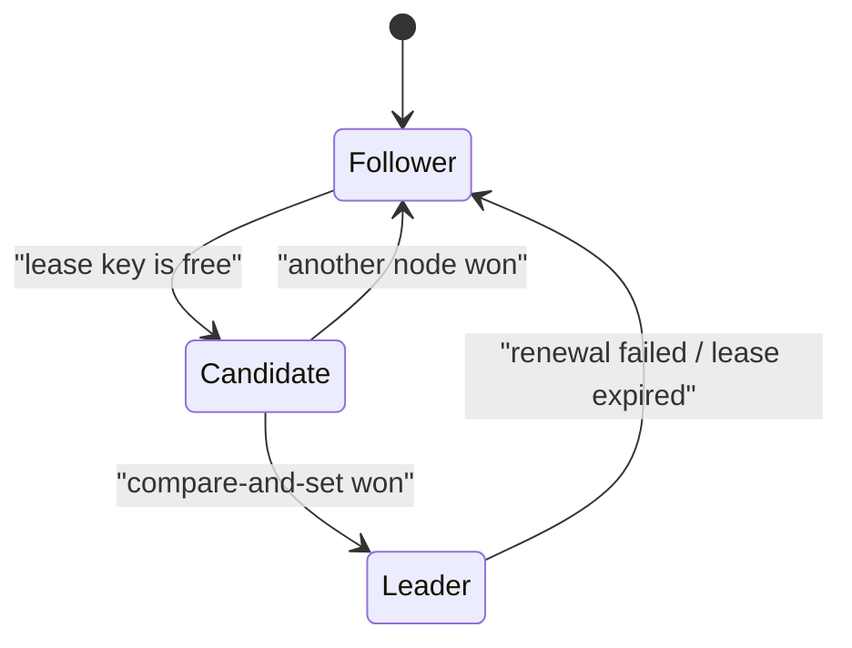

## Before you start

You need [consensus-algorithms](consensus-algorithms) — leader election is the problem consensus was built to solve, and majority quorums are assumed here.

## In one sentence

**Leader election** is how a group of identical servers agrees that exactly one of them is currently in charge of some job, and — more importantly — how the system stays correct when they briefly disagree about who that is.

## Why it matters

Plenty of work must happen exactly once even though you run several instances for redundancy. Sending the nightly billing run. Compacting a database. Consuming a partition of a queue. Run it on all five instances and you bill every customer five times. You could designate one instance in config, but then its death is an outage requiring a human. Leader election makes the group pick a leader itself, and pick a new one automatically when that leader dies.

## The intuition

A group of colleagues shares an on-call phone. Whoever holds it answers. If they leave without handing it over, someone must be able to take it — but not two people at once, or callers get contradictory answers.

The mechanism is a **lease**: you hold the phone for ten minutes, and to keep it you must actively renew before it expires. Stop renewing — because you crashed, or your network died — and the lease lapses on its own, freeing someone else to take over. No handover required from the departing holder, which matters because a crashed process cannot hand anything over.

Leases are safe where a plain lock is not, because they expire without anyone's cooperation — a lock held by a crashed process is held forever.

## How it actually works

The standard implementation uses a coordination service — **etcd** or **ZooKeeper** — that provides one primitive: a compare-and-set write that either succeeds or fails atomically, with no in-between.

Every candidate tries to write its own ID to the same key, conditional on that key not already existing. Exactly one write wins. The winner is leader and must renew the lease before its TTL expires; the losers watch the key and race again the moment it disappears.



Note that this is not a majority vote among the candidates themselves. They delegate the hard part to etcd, which internally runs Raft across its own nodes to make that single write linearizable. Your application gets a simple atomic operation and inherits consensus without implementing it.

Now the part that trips people up: leader election does **not** guarantee one leader at a time. It cannot. Consider a leader holding a 10-second lease whose process pauses for 15 seconds — a long garbage-collection pause, a hypervisor suspending the VM, a network partition. The lease expires and etcd correctly hands leadership to another node. Then the first process wakes up. It has no idea time passed, still believes it leads, and carries on writing.

Two leaders now exist simultaneously. That is **split brain**, and no timeout tuning eliminates it, because the pause can always be longer than whatever you chose.

The fix is not to prevent two leaders but to make the second one harmless. Each time etcd grants leadership it also issues a **fencing token**: a number that only ever increases. The leader includes that token with every write to the protected resource, and the resource remembers the highest token it has seen — rejecting anything lower. The paused leader wakes holding token 33, the current leader is on 34, and the storage layer refuses the stale write. Martin Kleppmann's article is the definitive treatment of this, and its key point is that the *resource* must enforce the check; a lock service alone can never make this safe.

## Worked example

A lease with expiry and fencing tokens, showing the stale-leader rejection:

```js
class LeaseManager {
  constructor(ttlMs = 10_000) { this.ttlMs = ttlMs; this.holder = null; this.token = 0; }

  acquire(nodeId, now = Date.now()) {
    if (this.holder && this.holder.expiresAt > now) return null; // still held
    this.token += 1; // monotonic — every grant gets a strictly higher token
    this.holder = { nodeId, expiresAt: now + this.ttlMs, token: this.token };
    return this.holder;
  }
}

class Resource { // the storage the leader writes to
  constructor() { this.highestToken = 0; this.value = null; }
  write(token, value) {
    if (token < this.highestToken) return `REJECTED token ${token}`; // stale leader
    this.highestToken = token;
    this.value = value;
    return `OK token ${token}`;
  }
}

const leases = new LeaseManager();
const store = new Resource();

const a = leases.acquire('node-A', 0);            // node A leads, token 1
console.log(store.write(a.token, 'from A'));
const b = leases.acquire('node-B', 20_000);       // A's lease lapsed, token 2
console.log(store.write(b.token, 'from B'));
console.log(store.write(a.token, 'from A again')); // A wakes up, still thinks it leads
```

Output:

```
OK token 1
OK token 2
REJECTED token 1
```

Node A never learns it was demoted — it does not need to. The resource rejects its write because token 1 is below the highest token it has seen, so correctness holds without A cooperating or even being reachable.

## A second example — when it gets harder

Leases assume clocks behave. They mostly don't.

The lease holder measures its own TTL, and the coordination service measures the same TTL independently. If the holder's clock runs 5% slow, it believes it has 10 seconds of lease left when the service has already expired it at 9.5 — and it keeps acting as leader during that gap. Virtual machines make this worse: a VM suspended and resumed can jump forward by seconds with nothing in the process noticing.

The mitigation is to never compare absolute timestamps across machines. Use a **monotonic clock** — `process.hrtime.bigint()` in Node, which counts elapsed time and is immune to NTP adjustments — and have the holder step down voluntarily, renewing at a third of the TTL and abandoning leadership if a renewal fails. This shrinks the danger window but cannot close it.

Which is why fencing tokens are load-bearing rather than a nice extra. Timeouts reduce how *often* two nodes think they lead; fencing tokens make it not *matter*. The lesson generalises past leader election: in an asynchronous system, timing gives you liveness but never safety. Safety must come from ordering — a monotonically increasing number that lets a receiver reject anything from the past.

## Quick reference

| Mechanism | Prevents split brain? | Notes |
|---|---|---|
| Config-designated leader | No | Failure needs human intervention |
| Distributed lock, no expiry | No | A crashed holder blocks everyone forever |
| Lease with TTL | No | Bounds the window; a pause still beats it |
| Lease + fencing tokens | Effectively yes | Stale writes rejected by the resource |

| Service | Consensus | Typical use |
|---|---|---|
| etcd | Raft | Kubernetes control plane, leader election |
| ZooKeeper | ZAB | Kafka (historically), Hadoop, HBase |
| Consul | Raft | Service discovery plus locks |

## Common mistakes

- Assuming leader election gives you exactly one leader. It gives you at most one *lease holder*; process pauses mean two nodes can both believe they lead.
- Using a lock with no expiry, so a crashed holder blocks all progress until someone intervenes manually.
- Implementing the fencing check in the leader instead of the resource. A leader that thinks it is valid will happily check itself and pass.
- Comparing wall-clock timestamps across machines. Use monotonic clocks and durations.
- Building leader election on a store with no atomic compare-and-set. Read-then-write lets two nodes both win.

## What interviewers ask

- **Why elect a leader at all?** — So work that must happen exactly once — a scheduled job, a queue partition, a compaction — runs on one instance, while still keeping several instances for redundancy and automatic failover.
- **What is split brain and can you prevent it?** — Two nodes simultaneously believing they lead, caused by pauses or partitions; you cannot prevent it with timeouts, so you make it harmless with fencing tokens that let the resource reject the stale leader's writes.
- **What is a fencing token?** — A strictly increasing number issued with each grant of leadership, included in every write, with the resource tracking the highest it has seen and rejecting anything lower.
- **Why use etcd instead of writing your own election?** — Correct election needs linearizable compare-and-set, which needs consensus; etcd already runs Raft, so you inherit a proven implementation instead of writing the hardest code in distributed systems yourself.
- **Why doesn't a shorter lease TTL solve the pause problem?** — A GC pause or VM suspension can exceed any TTL you pick, and shorter TTLs cause spurious failovers under normal load; the window shrinks but never closes.

## Practice

1. Add renewal to `LeaseManager`: the holder extends its own lease only if it still holds it and it has not expired, and the extension fails otherwise.
2. Simulate a 15-second process pause against a 10-second TTL and show, with output, exactly which writes get rejected and why.
3. Explain what breaks if fencing tokens are assigned by the leader rather than the lease manager, and construct a sequence of events that produces a lost update.

## Where to go next

Leader election coordinates who acts. [distributed-transactions](distributed-transactions) covers coordinating a multi-step operation across services so it either completes or is properly undone.
