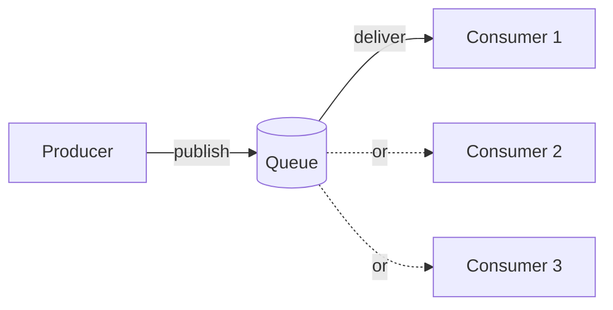

## Before you start

`consensus-algorithms` isn't required, but it helps to have finished `replication-and-partitioning` — message queues solve a related but distinct problem: not "how do machines agree," but "how do independent parts of a system hand off work without being tightly coupled."

## In one sentence

A **message queue** is a middleman that holds messages sent from one part of a system until another part is ready to process them, so the two sides don't have to talk to each other directly or at the same time.

## Why it matters

Without a queue, if a service that sends emails is slow or temporarily down, whatever is trying to send those emails either has to wait, retry the call itself, or lose the request entirely. A queue absorbs that mismatch: the sender drops a message and moves on immediately, and the receiver processes messages whenever it's ready, even if that's a few seconds later. This is what lets systems absorb sudden traffic spikes gracefully and keeps one slow component from freezing the entire application around it.

## The intuition

Think of a restaurant kitchen's order ticket rail. A waiter doesn't stand at the kitchen window watching a specific chef cook a specific dish — they clip the ticket to the rail and immediately go back to serving other tables. Whichever chef becomes free next grabs the next ticket. The waiter and the chef are **decoupled**: the waiter doesn't need to know which chef will cook it, how many chefs are working, or whether the kitchen is currently swamped — they just trust the rail to hold the order until someone's ready.

## How it actually works



At its simplest, a **producer** sends a message to a queue, and a **consumer** reads and processes it later. This decouples the two sides — the producer doesn't need to know who's consuming, how many consumers exist, or whether they're currently busy.

There are two common delivery patterns. In a **point-to-point queue** (like a classic RabbitMQ queue), each message is delivered to exactly *one* consumer out of a pool — as shown above, only one of the three consumers actually gets any given message — useful for distributing work across a pool of workers, like processing uploaded images, where you specifically don't want the same image processed twice. In **publish/subscribe** (pub/sub), a message is broadcast to *every* subscriber interested in that topic, useful when multiple independent parts of a system need to react to the same event, like "order placed" simultaneously triggering both a confirmation email and an inventory update.

**Kafka** is often used as a durable, ordered log of events that many independent consumers can read at their own pace, making it popular for event streaming and analytics — a consumer can even "replay" old messages, since Kafka doesn't delete a message just because one consumer read it. **RabbitMQ** is a more traditional message broker, strong at flexible routing rules and classic point-to-point work queues, where a message is typically removed once successfully processed. Both need a defined delivery guarantee: **at-most-once** (might lose a message, but never delivers a duplicate), **at-least-once** (never silently loses a message, but might deliver it more than once), or **exactly-once** (the ideal outcome, but by far the hardest and most expensive to guarantee in practice).

## Worked example

```js
// A minimal in-memory queue illustrating producer/consumer decoupling
const queue = [];

function produce(message) {
  queue.push(message); // producer doesn't wait for anyone to process it
  console.log('Queued:', message);
}

function consume() {
  const message = queue.shift();
  if (message) console.log('Processing:', message); // consumer works at its own pace
}

produce({ type: 'send_email', to: 'user@example.com' });
consume();
```

Output:

```
Queued: { type: 'send_email', to: 'user@example.com' }
Processing: { type: 'send_email', to: 'user@example.com' }
```

The producer's job ends the instant the message is queued — it never blocks waiting for the email to actually be sent, and in a real system, `consume()` might run seconds later, on a completely different machine.

## A second example — when it gets harder

The naive assumption is "the queue guarantees exactly-once delivery" — but most real systems default to **at-least-once**, and here's exactly why that matters. Suppose a consumer processes a "charge $50 to this card" message, successfully charges the card, but crashes *before* it can send the acknowledgment back to the queue. The queue, having never received confirmation, assumes the message wasn't processed and redelivers it to another consumer — which now charges the same card a second time.

The fix isn't to chase a perfect exactly-once guarantee (which is extremely expensive and still has edge cases) — it's to make the consumer **idempotent**: design the "charge card" operation so that processing the exact same message twice has the same effect as processing it once, typically by including a unique message ID and checking "have I already charged for this specific ID?" before acting. This is one of the most common real production bugs in queue-based systems, and it's also a favorite interview question precisely because the naive fix (a global lock, or "just don't crash") doesn't actually solve the underlying problem.

## Quick reference

| Guarantee | Meaning | Risk |
|---|---|---|
| At-most-once | Message sent once, no retry | Can silently lose messages |
| At-least-once | Retries until acknowledged | Consumer might see duplicates |
| Exactly-once | Delivered and processed exactly once | Hardest and most expensive to implement |

| Pattern | Delivery | Good for |
|---|---|---|
| Point-to-point queue | One consumer per message | Distributing work across workers |
| Publish/Subscribe | All subscribers get the message | Broadcasting an event to many services |

## Common mistakes

- Assuming a queue guarantees exactly-once delivery by default — most real systems default to at-least-once, and it's the consumer's responsibility to handle potential duplicates safely through idempotency.
- Using pub/sub when you actually need work distributed across a pool of workers — broadcasting a task to every subscriber means every one of them processes it, instead of exactly one worker picking it up.
- Treating "the message is in the queue" as "the work is done" — a crashed consumer can leave a message stuck unacknowledged, and the system needs a clear policy for what happens to it (retry, dead-letter queue, alert).

## What interviewers ask

- **Why would you introduce a message queue between two services instead of calling one directly?** — It decouples them in time and load: the caller doesn't have to wait for the receiver to be ready or fast, sudden traffic spikes get smoothed out by the queue instead of overwhelming the receiver directly, and if the receiver crashes, messages simply wait in the queue instead of being lost.
- **What's the difference between a point-to-point queue and pub/sub?** — Point-to-point delivers each message to exactly one consumer, ideal for splitting up work across a pool; pub/sub broadcasts each message to every subscriber, ideal for notifying multiple independent services about the same event.
- **When would you choose Kafka over a traditional queue like RabbitMQ?** — When you need a durable, replayable log of events that multiple independent consumers can read at their own pace, like an analytics pipeline, rather than a queue where each message is consumed once and then gone.
- **How do you prevent duplicate side effects with at-least-once delivery?** — Make the consumer idempotent — give each message a unique ID and have the consumer check whether it has already processed that specific ID before acting, so redelivering the same message safely produces the same end result instead of a duplicate effect.

## Practice

1. Extend the worked example's in-memory queue to support at-least-once delivery: if `consume()` "fails" (simulate randomly), the message should go back into the queue instead of being lost.
2. Add idempotency to the "charge card" scenario: write a function that tracks processed message IDs and skips reprocessing a duplicate, then demonstrate it against a message delivered twice.
3. Design the queue architecture for an e-commerce "order placed" event that must trigger an email, an inventory update, and an analytics log — decide whether this calls for point-to-point or pub/sub, and justify it.

## Where to go next

You've now covered the full distributed-systems arc: what guarantees are even possible (`cap-theorem`), how to reason about staleness (`consistency-models`), how data is copied and split (`replication-and-partitioning`), how machines agree (`consensus-algorithms`), and how independent parts hand off work (this topic). From here, these ideas recombine constantly in system design interviews — revisit `cap-theorem` if any of the later topics felt disconnected from it.
