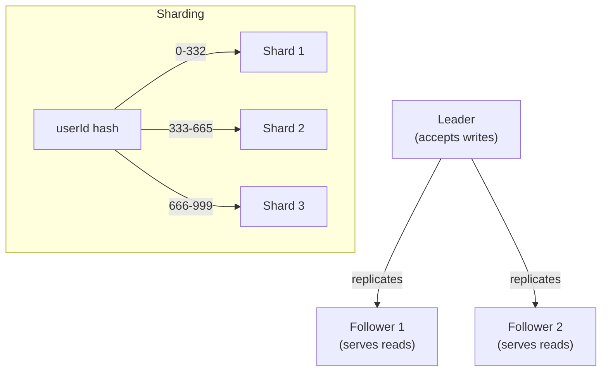

## Before you start

`consistency-models` matters here — replication is precisely where the strong-versus-eventual trade-off gets implemented, since every replica is a copy that must somehow stay in sync with the others.

## In one sentence

**Replication** means keeping multiple copies of the same data on different servers for safety and speed, while **partitioning** (also called **sharding**) means splitting one large dataset into smaller pieces spread across different servers, so no single machine has to hold all of it.

## Why it matters

One server can only hold so much data and handle so many requests before it becomes a bottleneck — or worse, a single point of failure that takes the whole system down if it dies. Replication protects you from losing data when a server fails; partitioning lets you scale far beyond what any one machine could store or serve. Nearly every large-scale system, from a bank's core ledger to a social feed serving billions of users, relies on both at once.

## The intuition

Replication is like a library keeping three identical copies of a popular book — if one copy gets damaged, or if too many people want to read it at once, the other copies keep the book available. Partitioning is a completely different move: instead of copying the same book, you split an entire encyclopedia across different shelves — volumes A-M on one shelf, N-Z on another — so no single shelf has to hold the whole thing, and you can add shelves as the encyclopedia grows.

## How it actually works



With **replication**, the same data lives on multiple servers. The most common setup is **leader-follower** (also called primary-replica): one server, the leader, accepts all writes, while one or more followers copy those changes and can serve read requests. This spreads out read traffic across more machines and gives you a safety net if the leader fails — a follower can be promoted to take over. The trade-off is **replication lag**: followers might fall slightly behind the leader, so a read from a follower could return data that's a moment out of date, which is exactly the mechanism behind the "eventual consistency" gap from the previous topic.

With **partitioning** (sharding), instead of copying the whole dataset, you split it — for example, users A-M go on server 1, and N-Z go on server 2. Each server only needs to hold and serve its own slice, so the system can grow far beyond what one machine could handle. The hard part is choosing a good **partition key** (what you split the data by) so that both data and traffic spread evenly, and handling queries that need to touch multiple partitions at once, which is inherently slower and more complex than a query that stays entirely on one shard.

In practice, real systems combine both: each partition (shard) is itself replicated across several servers, giving you scale (through partitioning) and safety (through replication) simultaneously.

## Worked example

```js
// A simple hash-based partitioning function: decide which shard a user belongs to
function getShard(userId, shardCount) {
  // A basic hash spreads users evenly across shards
  let hash = 0;
  for (const char of String(userId)) {
    hash = (hash * 31 + char.charCodeAt(0)) % 1000003;
  }
  return hash % shardCount; // e.g. shard 0, 1, or 2 out of 3
}

console.log(getShard('user_482', 3)); // always routes this user to the same shard
console.log(getShard('user_777', 3));
```

Output:

```
1
0
```

The same user ID always hashes to the same shard, so the application always knows exactly which server to query for that user's data — no lookup table needed, just a deterministic calculation.

## A second example — when it gets harder

The naive assumption is "just add more shards to scale forever" — but consider what happens when you need to change the number of shards, say from 3 to 4, because the current 3 are overloaded. With the simple `hash % shardCount` scheme above, changing `shardCount` from 3 to 4 changes the result for *almost every single user* — `getShard('user_482', 3)` returns `1`, but `getShard('user_482', 4)` might return `2`. That means nearly all your data needs to be physically moved to different servers all at once, a massive and risky migration.

This is exactly the problem **consistent hashing** solves: instead of a plain modulo, it maps both servers and keys onto a conceptual ring, so adding or removing one server only reshuffles the small slice of keys nearest to it on the ring — not the entire dataset. This is a genuinely common follow-up interview question after "how would you shard this," precisely because the naive answer works fine until the system needs to actually grow or shrink.

## Quick reference

| Concept | Solves | Trade-off |
|---|---|---|
| Leader-follower replication | Read scaling + failover safety | Followers can lag (replication delay) |
| Multi-leader replication | Writes accepted in multiple locations | Conflicting writes need resolution |
| Partitioning (sharding) | Dataset too big for one server | Cross-shard queries are slower and harder |
| Consistent hashing | Resharding without moving everything | More complex to implement than plain modulo |
| Replicated + partitioned | Scale and safety together | More operational complexity overall |

## Tools & frameworks

| Tool | What it's for | Reach for it when |
|---|---|---|
| [PostgreSQL docs (replication)](https://www.postgresql.org/docs/current/) | Streaming and logical replication | You want read scaling or failover on a single-primary relational database |
| [Vitess](https://vitess.io/docs/) | MySQL sharding middleware | MySQL has outgrown one node and you cannot rewrite the application |
| [Citus](https://docs.citusdata.com/en/stable/) | Postgres extension for sharding | You want distributed Postgres with the same SQL surface you already use |
| [Cassandra](https://cassandra.apache.org/doc/latest/) | Consistent hashing with tunable replicas | Replication and partitioning are the product, not a feature bolted on |
| [MongoDB sharding](https://www.mongodb.com/docs/manual/sharding/) | Shard keys and balancing | You are studying shard-key choice — these docs are unusually clear on it |

## Common mistakes

- Assuming replication alone solves scaling — it helps with reads and safety, but every write still has to go through the leader, which remains a bottleneck; only partitioning spreads write load across machines.
- Picking a partition key that creates a "hot" shard — for example, partitioning by signup date when most active traffic comes from recently joined users, overloading the newest shard while older ones sit idle.
- Using plain `hash % shardCount` in a system expected to grow, then being surprised that adding one server requires moving almost all existing data.

## What interviewers ask

- **What's the difference between replication and partitioning?** — Replication copies the *same* data onto multiple servers for redundancy and read scaling; partitioning *splits* data into different pieces across servers so each one only holds a slice, which is how you scale storage and write capacity.
- **What happens if a leader server fails in leader-follower replication?** — One of the followers is promoted to become the new leader, often automatically via a health check and election process, and other followers start replicating from it; any writes that hadn't yet reached a follower before the crash can be lost, which is a real trade-off of this design.
- **What's a downside of sharding you should mention?** — Queries that span multiple shards, like "find all orders above $100 across all users," become much harder and slower, since you either query every shard and merge results, or maintain a separate cross-shard index just for that kind of lookup.
- **Why is `hash % shardCount` a poor long-term sharding strategy?** — Because changing the number of shards changes almost every key's assigned shard, forcing a massive data migration; consistent hashing solves this by only reshuffling the keys near the added or removed server.

## Practice

1. Implement a basic consistent-hashing ring in JavaScript: place a handful of virtual server points on a numeric ring, and write a function that finds the nearest server clockwise from any given key's hash.
2. Design the replication setup for a read-heavy analytics dashboard versus a write-heavy order-processing system — explain why they'd want different numbers of followers.
3. A cross-shard query needs "total revenue across all users." Sketch two different approaches: querying every shard live versus maintaining a separately aggregated summary table, and describe the trade-off between them.

## Where to go next

Continue to `consensus-algorithms` to see exactly how a cluster of replicas agrees on who the leader is, and how it survives that leader crashing without corrupting data.
