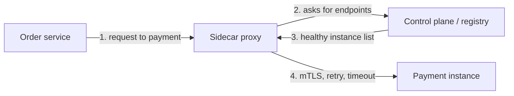

## Before you start

You need [monolith-vs-microservices](monolith-vs-microservices) — discovery is a problem you only have once services call each other over a network. A little [dns-load-balancing](dns-load-balancing) helps, since DNS is the oldest discovery mechanism there is.

## In one sentence

**Service discovery** is how one service finds a current, healthy network address for another service it needs to call, in an environment where those addresses change constantly; a **service mesh** is infrastructure that takes discovery — plus retries, encryption, and metrics — out of your application code entirely.

## Why it matters

Hardcode `http://10.0.1.47:8080` in your order service and it works until the payment service is redeployed onto a different host, autoscaled to six instances, or restarted with a new IP. In a container platform, that happens many times a day. Every instance address is temporary.

Something must answer "where is the payment service right now, and which of its instances are actually healthy?" — freshly, on every call. That is the whole problem.

## The intuition

Think of a company that keeps moving desks. You could write down a colleague's desk number, but it goes stale within a week. Instead there is a receptionist who always knows where everyone currently sits. When someone joins they tell reception; when they leave, reception removes them; and reception periodically checks that people are actually at their desks rather than off sick.

That receptionist is the **service registry**. Instances **register** on startup, **deregister** on shutdown, and send a periodic **heartbeat** so the registry can drop anything that stops responding.

There are two ways to use the receptionist. You ask reception yourself and then walk over — **client-side discovery**. Or you hand your message to reception and they deliver it — **server-side discovery**. Both work; they differ in who holds the complexity.

## How it actually works

In **client-side discovery**, the calling service queries the registry, gets back a list of healthy addresses, and picks one itself — so it also does its own load balancing. This is efficient, with no extra network hop, but every service in every language needs discovery logic embedded in it.

In **server-side discovery**, the caller sends the request to a fixed address — a load balancer or the platform's virtual IP — which consults the registry and forwards it. The caller stays simple and language-agnostic. Kubernetes works this way: a `Service` gives you a stable name and virtual IP, and the platform routes to whichever pods currently pass their health checks.



A **service mesh** is what you get when you move that sidecar into every pod as a standard. Each service instance gets a proxy — usually Envoy — deployed alongside it, intercepting all inbound and outbound traffic. The application makes a plain HTTP call to `payment`; the proxy transparently resolves it, load balances, retries, enforces a timeout, encrypts the connection with mTLS, and records metrics.

The mesh splits into two parts. The **data plane** is the fleet of sidecar proxies actually carrying traffic. The **control plane** — Istio's `istiod`, for example — watches the platform for what services exist and which instances are healthy, and pushes that configuration down to every proxy.

What a mesh buys you is uniformity. Retries, mTLS between every service, per-route timeouts, traffic splitting for canary releases, and consistent golden-signal metrics — applied identically to services written in five languages, changed by editing config rather than by shipping code in each of them.

What it costs is real. You are running a distributed proxy fleet: extra latency on every hop, memory and CPU per pod, and a control plane that is now on your critical path. Debugging gets harder because there is a component between every two services that can itself fail or misroute. For a handful of services, a shared HTTP client library gives you most of the benefit at a fraction of the operational cost.

## Worked example

A registry with heartbeat expiry and round-robin client-side selection — the core of what a real registry does:

```js
class ServiceRegistry {
  constructor(ttlMs = 5000) { this.instances = new Map(); this.ttlMs = ttlMs; }

  register(name, address) {
    if (!this.instances.has(name)) this.instances.set(name, new Map());
    this.instances.get(name).set(address, Date.now()); // heartbeat = re-register
  }

  healthy(name) {
    const now = Date.now();
    const found = this.instances.get(name) ?? new Map();
    return [...found.entries()]
      .filter(([, lastSeen]) => now - lastSeen < this.ttlMs) // expire silent instances
      .map(([address]) => address);
  }
}

const registry = new ServiceRegistry();
registry.register('payment', '10.0.1.4:8080');
registry.register('payment', '10.0.1.9:8080');

let cursor = 0;
function pick(name) {
  const list = registry.healthy(name);
  if (list.length === 0) throw new Error(`no healthy instance of ${name}`);
  return list[cursor++ % list.length]; // round robin across whatever is alive
}

console.log(pick('payment'), pick('payment'), pick('payment'));
```

Output:

```
10.0.1.4:8080 10.0.1.9:8080 10.0.1.4:8080
```

An instance that stops heartbeating for 5 seconds simply drops out of `healthy()` — no explicit deregistration needed, which matters because a crashed process never gets to announce its own death.

## A second example — when it gets harder

The registry above has a dangerous failure mode. Suppose a brief network glitch stops heartbeats from all six payment instances for six seconds. `healthy('payment')` returns an empty list, `pick` throws, and every caller fails — even though all six instances are running perfectly and would have answered.

The registry has confused "I cannot hear you" with "you are dead," and turned a minor network blip into a total outage of a healthy service.

Real registries defend against this with **self-preservation**: if the proportion of instances expiring at once exceeds a threshold, the registry assumes the problem is its own connectivity, stops evicting, and serves the last known list. Serving a few stale addresses is recoverable — the caller gets a connection error and retries elsewhere. Serving an empty list is not recoverable, because there is nothing to retry against.

The general principle beneath this: prefer **failing static** over failing closed. When the component that decides who is healthy loses confidence in its own information, freezing the last good answer is almost always safer than declaring everything dead. The same logic applies to config distribution, DNS caching, and feature flags — if the control plane goes down, the data plane should keep running on its last known configuration rather than stopping.

## Quick reference

| Approach | Who picks the instance | Pros | Cons |
|---|---|---|---|
| Client-side | The calling service | No extra hop, fine-grained control | Discovery logic in every service and language |
| Server-side | A load balancer or platform | Callers stay simple, language-agnostic | Extra hop; the balancer needs its own HA |
| Service mesh | A sidecar proxy per instance | Uniform retries, mTLS, metrics; config not code | Latency, resource cost, real operational burden |
| DNS only | Whatever resolves the name | Universally supported, no new infrastructure | Caching and TTLs make failover slow and uneven |

## Common mistakes

- Caching a resolved IP address for the lifetime of the process, so the caller keeps dialling an instance that was replaced hours ago.
- Treating "the process is running" as healthy. A readiness check should confirm the instance can actually serve — its database connection is up, its cache is warm — not merely that it booted.
- Letting a registry evict every instance during a network partition, converting a connectivity blip into a full outage.
- Adopting a mesh for five services. The operational cost is roughly fixed; the benefit scales with how many services and languages you have.

## What interviewers ask

- **How do services find each other when instances come and go constantly?** — A registry that instances join on startup and are expired from when their heartbeat stops; callers either query it directly (client-side) or send to a stable address that consults it (server-side).
- **Client-side or server-side discovery — which would you choose?** — Server-side for polyglot systems, because the routing logic lives in one place instead of being reimplemented per language; client-side when you need per-call routing control and want to avoid the extra hop.
- **What does a service mesh actually give you?** — Retries, timeouts, mutual TLS, traffic splitting, and consistent metrics on every call, applied uniformly across languages via sidecar proxies configured centrally rather than coded into each service.
- **What's the downside of a mesh?** — Latency on every hop, per-pod CPU and memory, a control plane on your critical path, and harder debugging; below roughly ten services a shared client library is usually the better trade.
- **What should the registry do if it stops hearing from everything at once?** — Assume its own connectivity is the problem and serve the last known list rather than evicting everything, since an empty list guarantees an outage while a stale one only risks a retryable error.

## Practice

1. Add self-preservation to `ServiceRegistry`: if more than 50% of a service's instances would expire within one interval, keep serving the previous list and log a warning.
2. Replace round-robin `pick` with a version that prefers instances in the caller's own availability zone and only crosses zones when none are healthy locally.
3. Work out how long a caller keeps sending traffic to a dead instance when discovery is DNS with a 60-second TTL, a client that caches for the TTL, and a 30-second health-check interval. Then explain why a mesh reduces that window.

## Where to go next

A mesh retries failed calls for you, which is safe only if those calls are safe to repeat — that is [idempotency-and-retries](idempotency-and-retries). For what the sidecar should do when a service stays down, read [designing-for-failure](designing-for-failure).
