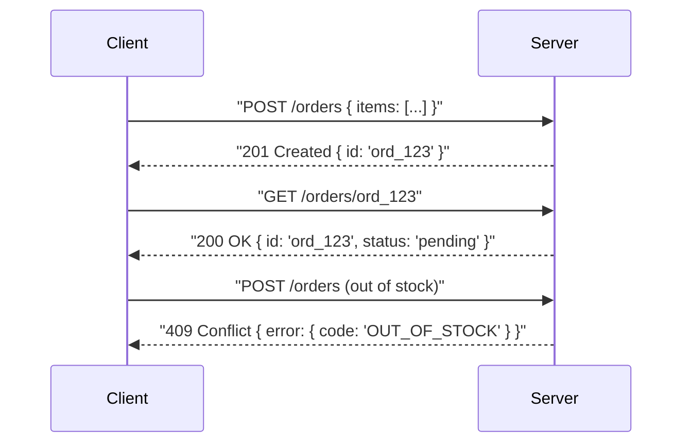

## Before you start

Some comfort with HTTP (what a request and response look like) helps but isn't required — this topic pairs naturally with [monolith-vs-microservices](monolith-vs-microservices), since API design is exactly the contract that lets split-apart services (or a client and a server) talk to each other.

## In one sentence

**API design** is deciding the shape of the contract other programs use to talk to your backend — what URLs exist, what data they accept, and what they return — so that anyone reading it can predict how it behaves.

## Why it matters

An API is a promise: change it carelessly and every app or team depending on it breaks. Good design makes an API predictable and easy to learn without reading source code; bad design means every consumer has to guess, retry, and work around inconsistencies. This is also one of the most common "design something" interview prompts, because it tests both technical judgment and empathy for whoever has to use what you build.

## The intuition

Think of an API like a restaurant menu. A good menu groups similar dishes, names them clearly, and tells you the price upfront. A bad menu makes you ask the waiter what's actually in "Chef's Special #7" every time — and sometimes the answer changes based on who's asking.

**REST** is the most common style: it models your system as **resources** (nouns, like `/orders` or `/users`) and uses HTTP methods as verbs (`GET` to read, `POST` to create, `PUT`/`PATCH` to update, `DELETE` to remove). **GraphQL** flips this: one endpoint, and the client asks for exactly the fields it needs. REST is simpler to cache; GraphQL avoids over-fetching and under-fetching when a screen needs data shaped from several resources at once.

Good API design also means consistent naming (plural nouns, not a mix of `/getUser` and `/orders`) and using HTTP status codes to mean what they actually mean — not returning `200 OK` with an error buried in the body.

## How it actually works

A well-designed request/response follows a predictable shape every time: the URL names a resource, the method names the action, and the status code tells the client what happened before it even looks at the body.



Notice the client can branch on the status code alone (`201` means it was created, `409` means it conflicted) without parsing the body first. That's the point of using status codes correctly: they carry meaning at the protocol level, so error handling doesn't require inspecting every response body to know if something went wrong.

The same discipline applies to naming and structure: URLs are nouns (`/orders`, not `/getOrders`), nesting reflects real ownership (`/users/42/orders` for one user's orders), and every error response uses the same shape everywhere in the API, so client code can handle errors generically instead of writing custom parsing per endpoint.

## Worked example

A well-designed REST response versus a poorly designed one for the same operation:

```js
// Bad: status is always 200, client must parse the body to know if it worked
// POST /api/createOrder -> 200 OK
{ "result": "error", "msg": "out of stock" }

// Good: status code carries meaning, body is consistent, resource is a noun
// POST /orders -> 201 Created
{ "id": "ord_123", "status": "pending", "total": 49.99 }

// Good: failure uses a matching status code + a consistent error shape
// POST /orders -> 409 Conflict
{ "error": { "code": "OUT_OF_STOCK", "message": "Item sku_44 has 0 units left" } }
```

A client can now branch on `response.status` alone without parsing the body first, and every error across the whole API looks the same shape — `error.code` for programmatic handling, `error.message` for logs or display.

## A second example — when it gets harder

The naive version of this endpoint breaks the moment the list of orders gets large, or a client needs slightly different data than another client. Two problems and their fixes:

```js
// Problem 1: returning the entire table — fine at 50 orders, a disaster at 5 million
// GET /orders -> 200 OK
[ /* every order in the system */ ]

// Fix: cursor-based pagination — client gets a page and a pointer to the next one
// GET /orders?limit=20&cursor=ord_100 -> 200 OK
{
  "data": [ /* 20 orders */ ],
  "next_cursor": "ord_120"
}

// Problem 2: a mobile app only needs { id, total }, a dashboard needs the full
// order plus user and shipping details — REST forces one shape for everyone,
// so either the mobile app over-fetches or you build two endpoints
// GET /orders/ord_123 -> 200 OK (REST: fixed shape)
{ "id": "ord_123", "total": 49.99, "user": {...}, "shipping": {...}, "items": [...] }

// GraphQL: each client asks for only what it needs, one endpoint
// POST /graphql
// query { order(id: "ord_123") { id total } }
{ "data": { "order": { "id": "ord_123", "total": 49.99 } } }
```

Pagination fixes the first problem for REST or GraphQL alike — never return an unbounded list. The second problem is the actual trade-off between the two styles: REST's fixed response shape is simple and cacheable by URL, but forces a choice between over-fetching (sending fields a client doesn't need) or maintaining multiple tailored endpoints. GraphQL solves over-fetching directly, at the cost of losing simple HTTP caching, since every query can ask for a different shape from the same URL.

## Quick reference

| Status code | When to use it |
|---|---|
| 200 OK | `GET`/`PUT` succeeded, returning data |
| 201 Created | `POST` that made a new resource |
| 204 No Content | `DELETE` succeeded, nothing to return |
| 400 Bad Request | Missing or malformed fields |
| 401 Unauthorized | Missing or bad auth token |
| 403 Forbidden | Valid identity, wrong permissions |
| 404 Not Found | Wrong ID or deleted resource |
| 409 Conflict | Duplicate or out of stock |
| 500 Internal Server Error | Unhandled server exception |

## Common mistakes

- Using verbs in URLs (`/getUser`, `/deleteOrder`) instead of letting the HTTP method be the verb and the URL be the noun.
- Returning `200 OK` for every response and putting the real success/failure inside the JSON body, forcing every client to parse the body to know what happened.
- Designing the API around your database tables instead of around what the client actually needs, which leaks internal structure and makes future refactors painful.
- Returning an unbounded list from a collection endpoint instead of paginating, which works fine in testing and falls over in production.

## What interviewers ask

- **When would you choose GraphQL over REST?** — When clients need very different, nested slices of data (like a mobile app vs. a dashboard) and over-fetching with REST would mean multiple round trips; the cost is losing simple HTTP caching and adding query complexity on the server.
- **What makes an API RESTful?** — Resources are nouns addressed by URL, HTTP methods express the action, responses use standard status codes, and ideally it's stateless — each request carries everything the server needs, with no server-side session between calls.
- **How do you version an API without breaking existing clients?** — Common approaches are a version in the URL (`/v2/orders`) or a header; the key point is old clients keep working on the old version while you migrate consumers, rather than mutating a live endpoint's contract.
- **How should pagination work for a large list endpoint?** — Return a page of results plus a cursor or `next` link rather than the whole dataset, so the client and server both avoid loading everything into memory at once.

## Practice

1. Design REST endpoints (method + URL + status codes) for a simple to-do list app: create, list, mark complete, delete. Write out what each response body looks like on success and on a plausible failure.
2. Take the same to-do app and sketch how it would look as a single GraphQL query that fetches a list's to-dos along with each to-do's assigned user's name — note what a REST version of the same screen would require instead (how many requests).
3. Design an error response shape you'd reuse across an entire API, then write two example errors using it: one for "not found" and one for "validation failed with two bad fields."

## Where to go next

An API's response time under load usually comes down to what's behind it — [caching-strategies](caching-strategies) covers how to avoid hitting the database on every request, which is often the first lever pulled once an API design is settled.
