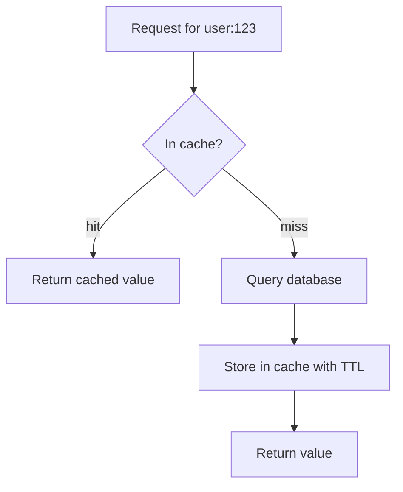

## Before you start

Nothing formal is required. It helps to have seen a request hit a database at least once — the pain caching solves is easiest to feel if you've watched a slow query, so [api-design](api-design) is a natural predecessor since caching usually sits behind an API.

## In one sentence

**Caching** means storing a copy of expensive-to-compute or slow-to-fetch data somewhere fast, like memory, so the next request for the same thing is answered instantly instead of redoing the work.

## Why it matters

Without caching, every request hits your database or does the same heavy computation from scratch, even if a thousand users just asked the exact same question. A cache turns a 200ms database query into a 1ms memory lookup, which is often the difference between a system that survives a traffic spike and one that falls over.

## The intuition

Imagine a librarian who keeps the five most-requested books on a cart next to the front desk instead of walking to the shelves every time. That cart is the cache: small, fast to check, and only useful if it holds what people actually ask for. If the cart is full and a new popular book arrives, the librarian must decide which book to remove — that's an **eviction policy**.

Caches sit at different layers: in-process memory (fastest, but not shared across servers), a shared store like **Redis** or **Memcached** (shared across app servers), or a CDN (caches content close to users geographically).

The hardest part of caching isn't storing data — it's knowing when the cached copy is wrong. This is **cache invalidation**: if the underlying data changes but the cache still has the old value, users see stale data.

## How it actually works

The most common pattern is **cache-aside**: the application checks the cache first, and only goes to the database on a miss, filling the cache afterward so the next request is fast. The hit path and miss path diverge right at the first check:



A **hit** is the fast path: no database involved at all. A **miss** costs one database query, but pays it forward — the next request for the same key becomes a hit. This is why cache-aside is self-correcting: even if the cache is completely empty (a cold start, or right after a restart), the system still works correctly, just slower until it warms up.

The other two common strategies handle writes differently. **Write-through** updates the cache and the database in the same operation, so they never disagree, at the cost of every write paying both costs. **TTL** (time-to-live) sidesteps needing to explicitly invalidate anything — the entry just expires and the next read naturally refreshes it, trading a bounded window of staleness for simplicity.

## Worked example

A cache-aside pattern with a TTL, and a key design that avoids collisions between different users' data:

```js
const cache = new Map(); // stand-in for Redis; same logic applies

async function getUserProfile(userId) {
  const key = `user:${userId}:profile`; // namespaced key avoids collisions
  const cached = cache.get(key);

  if (cached && cached.expiresAt > Date.now()) {
    return cached.value; // cache hit — skip the database entirely
  }

  const value = await db.query('SELECT * FROM users WHERE id = ?', [userId]);
  cache.set(key, { value, expiresAt: Date.now() + 60_000 }); // 60s TTL
  return value;
}
```

The key includes the entity type and ID (`user:123:profile`) so unrelated data never overwrites it, and the TTL guarantees stale data self-heals within 60 seconds even if nothing explicitly invalidates it.

## A second example — when it gets harder

The naive cache-aside pattern above breaks down under two realistic conditions: a very popular key expiring, and a write that needs the cache to reflect it immediately.

```js
// Problem: "thundering herd" — key expires while under heavy load, and
// every concurrent request sees a miss and hits the database at once
async function getPopularProduct(id) {
  const key = `product:${id}`;
  let cached = cache.get(key);
  if (cached && cached.expiresAt > Date.now()) return cached.value;

  // 1,000 concurrent requests can all reach here in the same millisecond
  const value = await db.query('SELECT * FROM products WHERE id = ?', [id]);
  cache.set(key, { value, expiresAt: Date.now() + 60_000 });
  return value;
}

// Fix: track an in-flight promise per key so concurrent misses share one
// database call instead of triggering one each
const inFlight = new Map();

async function getPopularProductSafe(id) {
  const key = `product:${id}`;
  const cached = cache.get(key);
  if (cached && cached.expiresAt > Date.now()) return cached.value;

  if (inFlight.has(key)) return inFlight.get(key); // join the request already running

  const promise = db.query('SELECT * FROM products WHERE id = ?', [id]).then((value) => {
    cache.set(key, { value, expiresAt: Date.now() + 60_000 });
    inFlight.delete(key);
    return value;
  });
  inFlight.set(key, promise);
  return promise;
}
```

Without the fix, a single expiring hot key can send a spike of simultaneous identical queries straight to the database — exactly the load the cache was supposed to absorb. The fix collapses concurrent misses for the same key into one shared database call, so the database only ever sees one query per expiry, no matter how many requests arrive in that window. The second, related problem — a write needing to update or invalidate the cache immediately instead of waiting for a TTL — is what write-through exists for, at the cost of every write now touching two systems instead of one.

## Quick reference

| Eviction policy | Removes | Good for |
|---|---|---|
| LRU (Least Recently Used) | The item not accessed for the longest time | General-purpose caching, most common default |
| LFU (Least Frequently Used) | The item accessed the fewest times | Data with a stable set of "hot" items |
| FIFO (First In, First Out) | The oldest item added, regardless of use | Simple queues, low overhead |
| TTL-based | Anything past its expiry time | Data that naturally goes stale (prices, sessions) |

## Tools & frameworks

| Tool | What it's for | Reach for it when |
|---|---|---|
| [MDN HTTP guides](https://developer.mozilla.org/en-US/docs/Web/HTTP/Guides/CSP) | Entry point to MDN's HTTP header guides | You are getting `Cache-Control`, `ETag` and `stale-while-revalidate` right — navigate from here |
| [Cloudflare Cache](https://developers.cloudflare.com/cache/) | Edge caching and cache rules | The content is public and cacheable before it ever reaches your origin |
| [Redis](https://redis.io/docs/latest/) | Shared cache with TTL and eviction | Multiple instances must see the same cached value |
| [Memcached](https://memcached.org/) | Simple distributed LRU cache | You want a cache with no persistence story to reason about |

The table is ordered deliberately: the highest-value cache is usually the free one you get from correct HTTP headers, long before any Redis appears.

## Common mistakes

- Caching data with no expiry, so a bug in invalidation logic serves wrong data forever instead of self-healing.
- Using a cache key that's too broad, so unrelated requests overwrite each other's cached values.
- Treating the cache as the source of truth — if it's evicted, that data must still exist safely in the real database.
- Not handling concurrent misses on the same key, letting a single hot key's expiry cause a spike of duplicate database queries.

## What interviewers ask

- **What is cache invalidation and why is it hard?** — It's the problem of updating or removing cached data when the source changes; it's hard because you must catch every code path that writes the underlying data, and a missed path leaves silently stale results with no error to alert you.
- **What's the difference between write-through and write-back caching?** — Write-through updates the cache and the database in the same operation, so they never disagree but every write pays both costs; write-back updates the cache immediately and writes to the database later (async), which is faster but risks losing data if the cache crashes before the write-back happens.
- **How would you cache a paginated list endpoint?** — Cache each page under its own key (including the page number and any filters in the key), with a shorter TTL than single-item data, since lists change more often as new items get added.
- **What happens if your cache goes down?** — With cache-aside, the app should fall back to hitting the database directly (a "cache miss" for everything), just slower — the cache should never be a single point of failure for correctness, only for speed.
- **What is a thundering herd and how do you prevent it?** — It's when a popular cache key expires and many concurrent requests all miss at once, sending a spike of identical queries to the database; the fix is to have concurrent misses for the same key share one in-flight database call instead of each triggering their own.

## Practice

1. Design a cache key scheme for an e-commerce product page that needs to vary by product ID, currency, and whether the viewer is logged in (prices might differ). Write out three example keys.
2. Pick a TTL for a "trending posts" list versus a single user's profile, and justify the difference in seconds.
3. Describe how you'd detect, from production metrics alone, that a cache invalidation bug is causing stale data — before a user reports it.

## Where to go next

Caching buys you speed for the traffic you already have. When the traffic itself outgrows one machine, that's [scalability-and-performance](scalability-and-performance) — and when a single database can't hold all the data even with caching in front of it, that's [database-sharding](database-sharding).
