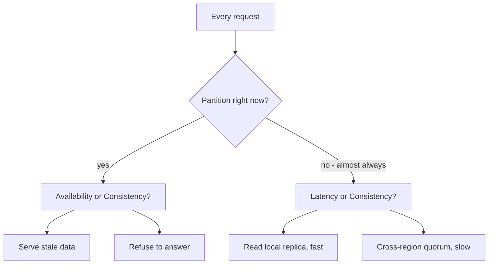

## Before you start

You need [consistency-models](consistency-models) for what strong and eventual consistency actually mean, and [cap-theorem](cap-theorem) for the textbook statement this topic argues with.

## In one sentence

Every distributed system constantly trades **consistency** (everyone sees the same data) against **latency and availability** (everyone gets a fast answer), and the useful skill is not reciting CAP but deciding, per feature, which side each specific operation should sit on.

## Why it matters

CAP as usually taught — "pick two of consistency, availability, partition tolerance" — is close to useless in a design interview, and worse in a real design. Partitions are not optional, so you never had three to pick from. And partitions are rare; CAP says nothing about the other 99.9% of the time, which is when your system actually runs. What you need is a way to reason about the trade-off you make on every single request, not the one you make during a rare network failure.

## The intuition

Two shops, same chain, shared stock list.

A customer buys the last blue jacket in shop A. Shop B can either check with head office before every sale — always correct, but every customer waits — or trust its local copy, updated every few seconds, and occasionally sell a jacket that no longer exists.

Neither is right in general. For jackets, the local copy is obviously correct: you refund the rare double-sale, and every other customer is served fast. For seats on the last flight of the day, checking centrally is obviously correct, because overselling means a stranded passenger and a compensation claim.

Same architecture, opposite answers, decided by the cost of being wrong. That is the actual skill.

## How it actually works

**PACELC** is the extension that makes CAP useful. It reads: if there is a **P**artition, choose between **A**vailability and **C**onsistency; **E**lse — normal operation — choose between **L**atency and **C**onsistency.

The second half is the part that matters daily. Even with a perfectly healthy network, a write that must be confirmed by replicas in three regions cannot beat the speed of light between them. Strong consistency costs latency on every request, forever, not just during failures.



Databases can be classified this way. DynamoDB and Cassandra default to PA/EL: available under partition, low latency otherwise, with consistency as an opt-in you pay for per request. Traditional single-region Postgres is PC/EC: it will refuse rather than serve unknown data. Spanner is PC/EC too, paying real latency for global consistency and using atomic clocks to make that cost bearable.

The decisive move in a real design is that this choice is **per operation**, not per system. One product uses both sides constantly:

- Follower count on a profile — stale by 30 seconds is fine. EL.
- Account balance shown before a transfer — must be current. EC.
- "Was this coupon already redeemed?" — must be linearizable, or you lose money.
- Which posts appear in a feed — eventual, obviously, and nobody can even tell.

A senior answer names the operation, states which side it sits on, and gives the cost of being wrong as the reason. A junior answer says "it's an AP system."

The other lever is that consistency has more than two settings. **Read-your-writes** guarantees a user sees their own updates while others may lag — usually achieved by routing that user's reads to the primary for a few seconds after they write. It solves the complaint that generates support tickets ("I saved it and it vanished") at a fraction of the cost of global strong consistency.

## Worked example

The real cost of a quorum write across regions is arithmetic, not opinion:

```js
const RTT_MS = { local: 1, sameRegion: 3, crossRegion: 140 }; // typical measured values

function writeLatency({ replicas, quorum, placement }) {
  const rtts = replicas.map((r) => RTT_MS[r]).sort((a, b) => a - b);
  return rtts[quorum - 2] ?? 0; // wait for the (quorum-1)th slowest ack; leader is free
}

const singleRegion = { replicas: ['sameRegion', 'sameRegion'], quorum: 2, placement: 'one region' };
const global = { replicas: ['crossRegion', 'crossRegion'], quorum: 2, placement: 'three regions' };

console.log('single-region quorum write:', writeLatency(singleRegion), 'ms');
console.log('global quorum write:', writeLatency(global), 'ms');

const perDay = 2_000_000;
const extra = (writeLatency(global) - writeLatency(singleRegion)) / 1000;
console.log(`extra user-waiting time per day: ${(perDay * extra / 3600).toFixed(1)} hours`);
```

Output:

```
single-region quorum write: 3 ms
global quorum write: 140 ms
extra user-waiting time per day: 76.1 hours
```

Global strong consistency costs roughly 137ms on every write. At two million writes a day that is 76 hours of cumulative human waiting, daily. Worth it for payments; absurd for "user updated their bio."

## A second example — when it gets harder

The hard cases are where the technical and business answers diverge.

Take an e-commerce inventory. The textbook answer is strong consistency — never sell what you do not have. Amazon famously does not do this. Checking a global quorum on every add-to-cart would make the site slow enough to lose far more revenue than overselling costs, and overselling has a cheap resolution: apologise, refund, offer a discount.

So the design accepts inconsistency and adds a business process to absorb it. The cost of being wrong is one apologetic email. The cost of being slow is measurable lost conversion.

Now flip a variable: the same system selling concert tickets. Overselling means a fan with a ticket and no seat, a refund, reputational damage, and possibly regulatory attention. Same data structure, same failure mode, completely different cost — so seat allocation gets a strongly consistent reservation, while the *browsing* pages showing "50 tickets left" stay eventually consistent because nobody is harmed by a slightly stale count.

Two more traps. First, "eventually consistent" is meaningless without a number attached. Eventually could be 50ms or four hours; the SLA is the design, and "we accept up to 2 seconds of staleness, monitored via replication lag with an alert at 5" is an engineering statement while "it's eventually consistent" is a shrug.

Second, consistency is not only about correctness — it is about what users can perceive. A user who posts a comment and does not see it will post again. A user who sees a friend's like count differing by one from what their friend sees will never notice. Read-your-writes for the first, full eventual consistency for the second, in the same product on the same day.

## Quick reference

| System | Under partition | Normally | Notes |
|---|---|---|---|
| DynamoDB | PA — stays available | EL — low latency | Strong reads available per request, at a cost |
| Cassandra | PA | EL | Consistency level tunable per query |
| MongoDB | PC — primary only | EC by default | Reads can be relaxed to secondaries |
| Postgres (single region) | PC | EC | No partition to tolerate within one node |
| Spanner | PC | EC | Pays real latency for global consistency |

| Operation | Choose | Because |
|---|---|---|
| Payment or coupon redemption | Strong | Money; wrongness is unrecoverable |
| Inventory at checkout | Strong | Oversell has real cost at commit time |
| Inventory while browsing | Eventual | Stale count harms nobody |
| Feed, likes, view counts | Eventual | Nobody can detect the difference |
| A user's own profile edit | Read-your-writes | They will notice; others won't |

## Tools & frameworks

| Tool | What it's for | Reach for it when |
|---|---|---|
| [Jepsen](https://jepsen.io/analyses) | Real consistency-violation reports | You are checking whether a vendor's claim survives testing |
| [CockroachDB](https://docs.cockroachlabs.com/docs/) | CP distributed SQL | You choose consistency and will pay the cross-region latency for it |
| [Cassandra](https://cassandra.apache.org/doc/latest/) | AP store with tunable quorums | You choose availability and will handle conflicting reads yourself |
| [DynamoDB](https://docs.aws.amazon.com/dynamodb/) | Eventual reads with a strong-read option | You want the trade-off visible as a per-request flag with a price difference |

## Common mistakes

- Reciting "pick two" as though partition tolerance were optional in a distributed system. It is not; you are always choosing between C and A when a partition happens.
- Treating consistency as one system-wide switch instead of a per-operation decision.
- Ignoring the EL half of PACELC — the latency cost of consistency applies on every request, not just during rare failures.
- Saying "eventually consistent" with no bound. State the window and monitor it.
- Choosing strong consistency for everything "to be safe," then discovering the product is too slow to use.

## What interviewers ask

- **What's wrong with CAP as a design tool?** — Partitions are not optional so you never had three choices, and CAP is silent about normal operation, which is when the system almost always is. PACELC adds the latency-versus-consistency trade you make on every request.
- **What does PACELC add?** — If Partitioned, choose Availability or Consistency; Else choose Latency or Consistency — making explicit that strong consistency costs latency permanently, not only during failures.
- **Would you use strong consistency for a shopping cart?** — Not for browsing or cart contents; yes at checkout for the final stock decrement, because the cost of being wrong is small before commit and real at commit.
- **How do you handle a user not seeing their own update?** — Read-your-writes consistency, typically by routing that user's reads to the primary for a short window after a write, which fixes the perceivable problem without paying for global strong consistency.
- **Give an example where the business answer beats the technical one.** — Retail inventory: strong consistency is technically correct, but the latency costs more revenue than overselling does, and overselling has a cheap apology-and-refund path.

## Practice

1. For a ride-hailing app, classify five operations — driver location, fare calculation, payment, ride history, surge multiplier — as EL or EC, and justify each by the cost of being wrong.
2. Take the latency script and model a 5-replica cluster with quorum 3 across two regions. Find the placement that minimises write latency while surviving one region failing.
3. Write the staleness SLA for a "seats remaining" counter on a booking site: the bound, how you would measure it, and what the alert threshold should be.

## Where to go next

You have decided what to guarantee when things work. [designing-for-failure](designing-for-failure) covers holding those guarantees when a dependency stops responding, and [capacity-planning](capacity-planning) puts numbers behind the latency budgets above.
