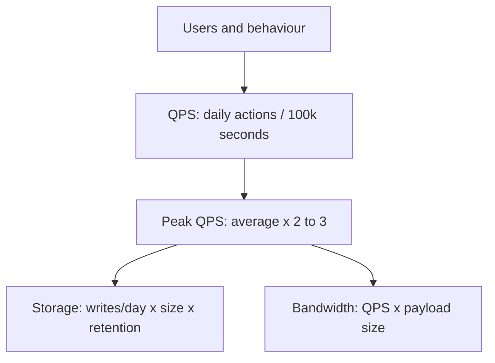

## Before you start

You need [scalability-and-performance](scalability-and-performance) for what you are scaling, and comfort with rough arithmetic. Nothing beyond multiplication is required.

## In one sentence

**Back-of-envelope estimation** is calculating, in under a minute with deliberately rounded numbers, roughly how much traffic, storage, and bandwidth a system needs — so your design is anchored to reality rather than guesswork.

## Why it matters

In a system design interview, "we'll shard the database" is a guess until you know whether the data is 50 GB or 50 TB. One fits on a laptop; the other needs a real sharding strategy. The estimate is what makes the rest of the design defensible. The same applies at work: ordering ten servers when three would do wastes money, and ordering three when you need thirty is an outage. Estimation also catches design errors early — if your maths says you need 4,000 servers, something is wrong, and finding that in five minutes beats finding it in a sprint.

## The intuition

You do not need precision. You need the right **order of magnitude**. There is a large difference between 100 requests per second and 100,000 — the first runs on one modest server, the second needs a fleet, a cache layer, and careful partitioning. Whether the real number is 80,000 or 120,000 changes almost nothing about the architecture.

So round aggressively. A year is 30 million seconds. A day is 100,000 seconds. The goal is a number you can reason about, fast.

Some latency numbers are worth knowing by heart, because everything else derives from them:

| Operation | Rough time | Operation | Rough time |
|---|---|---|---|
| L1 cache reference | 1 ns | Round trip in a datacentre | 500 µs |
| Main memory reference | 100 ns | Disk seek (spinning) | 10 ms |
| SSD random read | 100 µs | California to Netherlands | 150 ms |

The shape matters more than the digits: memory is roughly a million times faster than a cross-continent round trip. That single fact explains caching, CDNs, and regional replicas.

## How it actually works

Estimation follows the same four steps every time.



**Step one: QPS.** Daily active users times actions per user per day, divided by 100,000 seconds. Ten million users doing 10 actions daily is 100 million actions, which is 1,000 QPS average.

**Step two: peak.** Traffic is never flat — people sleep. Multiply the average by 2 to 3, more for anything with a scheduled event. That 1,000 QPS becomes roughly 3,000 at peak, and *that* is the number you size for.

**Step three: storage.** Writes per day times bytes per write times retention. Be honest about what a record contains: a tweet is not 140 bytes but closer to 300 with its ID, timestamp, user ID, and indexes. **Step four: bandwidth.** QPS times payload size. Images and video dominate — a 200 KB image at 1,000 QPS is 200 MB/s, which dwarfs any amount of JSON and is exactly why CDNs exist.

Then sanity-check against one machine. A modern server handles roughly 10,000 simple requests per second, and a single Postgres instance comfortably serves a few thousand QPS. If your peak is 3,000 QPS you need a handful of servers, not a fleet — and if your answer implies 500 machines, recheck the arithmetic before designing anything.

## Worked example

Sizing an image-sharing service, with every number derived rather than asserted:

```js
const SECONDS_PER_DAY = 100_000; // 86,400, rounded for mental arithmetic

function estimate({ dau, uploadsPerUserPerDay, viewsPerUserPerDay, imageKB, metadataBytes, retentionYears }) {
  const uploadsPerDay = dau * uploadsPerUserPerDay;
  const viewsPerDay = dau * viewsPerUserPerDay;
  const writeQps = uploadsPerDay / SECONDS_PER_DAY;
  const readQps = viewsPerDay / SECONDS_PER_DAY;
  const peakReadQps = readQps * 3; // peak is ~3x average
  const imageTBPerYear = (uploadsPerDay * imageKB * 1024 * 365) / 1e12;
  const metadataGBPerYear = (uploadsPerDay * metadataBytes * 365) / 1e9;
  const egressMBs = (peakReadQps * imageKB) / 1024; // read bandwidth at peak
  return {
    writeQps: Math.round(writeQps),
    peakReadQps: Math.round(peakReadQps),
    readWriteRatio: Math.round(readQps / writeQps),
    imageStorageTB: Math.round(imageTBPerYear * retentionYears),
    metadataGB: Math.round(metadataGBPerYear * retentionYears),
    peakEgressMBs: Math.round(egressMBs),
  };
}

console.log(estimate({
  dau: 10_000_000, uploadsPerUserPerDay: 0.2, viewsPerUserPerDay: 50,
  imageKB: 300, metadataBytes: 500, retentionYears: 5,
}));
```

Output:

```
{
  writeQps: 20,
  peakReadQps: 15000,
  readWriteRatio: 250,
  imageStorageTB: 1121,
  metadataGB: 1825,
  peakEgressMBs: 4395
}
```

Every architectural decision now follows. The 250:1 read-to-write ratio says optimise reads hard with caching and replicas, while a single primary easily absorbs 20 writes per second. 1.1 PB of images means object storage, never a database. 1.8 TB of metadata fits in one Postgres instance, so *do not shard it*. And 4.4 GB/s of peak egress is the finding that matters most — serve that from origin servers and you pay enormously and perform badly, so a CDN is not an optimisation here, it is the design.

## A second example — when it gets harder

Averages hide the failure modes. Take video streaming: 100,000 average concurrent viewers at 5 Mbps is 500 Gbps, a large but ordinary CDN problem. Now a live final — 10 million concurrent viewers all starting within the same two minutes. That is 50 Tbps, a hundred times the average, and it must be provisioned in advance because autoscaling cannot add capacity in two minutes. **You size for the peak you cannot scale into, not for the average.**

Three more things routinely break estimates. **Replication multiplies storage**: your 1.1 PB with three replicas is 3.3 PB, plus backups and indexes, so storage estimates are commonly 3–5x the raw figure. **Hot keys break averages**: if 1% of your images get 90% of the views, the average tells you nothing about the server holding them.

**Fan-out multiplies work.** One tweet from an account with 100 million followers is one write — and if you push it to followers' timelines, 100 million writes. That asymmetry is why large systems push for ordinary users and pull for celebrities. Always ask what one user action costs in machine work; sometimes it is 1, sometimes 10⁸.

The discipline that saves you is stating assumptions out loud: "I'm assuming 10 million DAU, 50 views each, 300 KB per image." An interviewer who disagrees then corrects the input, not your method, and your maths still stands.

## Quick reference

| Quantity | Round to | Size | Typical |
|---|---|---|---|
| Seconds per day | 100,000 | Text post / metadata row | 100 bytes – 1 KB |
| Seconds per year | 30 million | Compressed photo | 200 KB – 2 MB |
| 1 million requests/day | ~12 QPS | Minute of 1080p video | ~30 MB |
| 1 billion requests/day | ~12,000 QPS | char in UTF-8 | 1–4 bytes |
| Peak multiplier | 2–3x average | Modern server | ~10,000 simple req/s |

## Tools & frameworks

| Tool | What it's for | Reach for it when |
|---|---|---|
| [k6](https://grafana.com/docs/k6/latest/) | Load testing to find the saturation point | You need a measured number, not an estimate, before you size anything |
| [Prometheus](https://prometheus.io/docs/introduction/overview/) | Utilisation and saturation metrics | You want headroom derived from real traffic instead of guessed peaks |
| [Grafana](https://grafana.com/docs/grafana/latest/) | Dashboards for the four golden signals | You must present saturation to the people who decide budgets |
| [SRE Workbook](https://sre.google/workbook/table-of-contents/) | Google's capacity and load-shedding practice | You want the methodology rather than another tool |

## Common mistakes

- Sizing for average traffic and being taken down by the first predictable peak.
- Forgetting the replication factor, so real storage is three times your estimate.
- Ignoring fan-out, treating one user action as one unit of work when it may be millions.
- Assuming an even distribution across keys when a small fraction usually dominates.
- Chasing precision — 86,400 versus 100,000 seconds never changes an architecture, and the exactness wastes time you needed for design.
- Not stating assumptions, leaving the interviewer unable to correct an input rather than dismissing the answer.

## What interviewers ask

- **How many QPS for 10 million DAU doing 10 actions a day?** — 100 million actions over ~100,000 seconds is 1,000 QPS average, roughly 3,000 at peak, and peak is what you size for.
- **How much storage for a year of tweets?** — Daily tweets times realistic bytes per record including metadata and indexes, times 365, then times the replication factor.
- **Memory or SSD?** — Memory reads are around 100 ns against 100 µs for an SSD random read, roughly a thousand times faster, which is why hot data belongs in RAM.
- **What does the read-to-write ratio tell you?** — Where to spend effort: a 250:1 ratio means caching and read replicas dominate the design while a single primary handles writes easily. A 100x spike from a scheduled event must be provisioned ahead of time, since autoscaling cannot add capacity within the minutes a live event ramps up in.

## Practice

1. Estimate QPS, storage, and bandwidth for a URL shortener: 100 million new links a month, 10 billion redirects a month. Does the data fit on one machine?
2. Adjust the `estimate` function to take a replication factor and a compression ratio, then rerun the image service with 3 replicas and 30% compression.
3. A chat app has 50 million DAU sending 40 messages a day into groups averaging 8 people. Calculate write QPS both with and without fan-out to each recipient, and explain which number determines the design.

## Where to go next

Your estimate names the bottleneck. If it is reads, go to [caching-strategies](caching-strategies); if it is data volume, [database-sharding](database-sharding); if it is peak traffic, [load-balancing-strategies](load-balancing-strategies).
