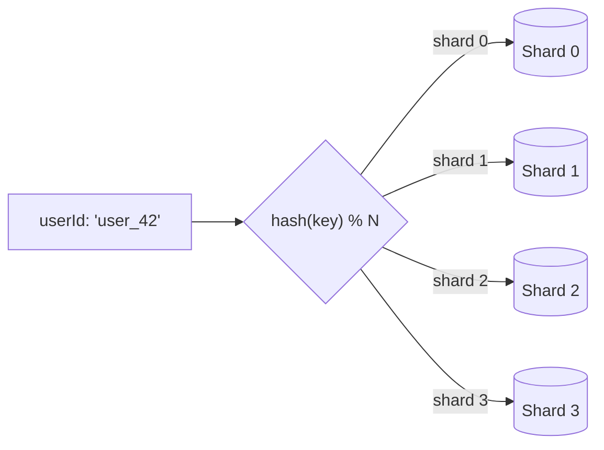

## Before you start

[Scalability-and-performance](scalability-and-performance) is the natural predecessor — sharding is horizontal scaling applied specifically to a database, once the database itself is the bottleneck adding app servers or caching can't fix.

## In one sentence

**Sharding** means splitting one large database into multiple smaller databases (called **shards**), each holding a slice of the data, so no single machine has to store or serve all of it.

## Why it matters

A single database server has limits on disk space, memory, and how many queries it can handle per second — eventually one machine simply can't hold or serve all your data fast enough, no matter how powerful it is. Sharding lets you keep growing by adding more machines, each responsible for a slice of the data, instead of hitting a hard ceiling.

## The intuition

Imagine a library so large it can't fit in one building, so you split it across five buildings by the author's last name: A–F in building one, G–L in building two, and so on. Each building (**shard**) holds a fraction of the books, and knowing the author's name tells you exactly which building to visit. That's sharding: pick a **shard key** (like user ID) and route each piece of data to exactly one shard.

The hard part is mapping keys to shards. **Range-based sharding** puts consecutive keys together, which is simple but can create a **hot shard** if one range gets far more traffic. **Hash-based sharding** runs the key through a hash function to pick a shard, spreading data evenly but making range queries hard since results scatter across every shard.

## How it actually works

Every read or write first has to answer one question: which shard holds this key? That routing decision happens before any query touches a database:



The router (sometimes a proxy layer, sometimes logic inside the application) computes the hash once per request and sends the query straight to the one shard responsible for that key — the other shards never see the request at all. This is what makes sharding scale: each shard only handles its own slice of both storage and query load.

**Consistent hashing** solves a specific pain with this scheme: with plain hash-based sharding, adding or removing a shard changes `N`, which remaps almost every key at once — a massive migration. Consistent hashing arranges shards on a conceptual ring instead of a flat modulo, so adding or removing one shard only remaps the keys that land near that shard's position on the ring, leaving the rest untouched.

## Worked example

A simplified routing function showing hash-based shard selection — the core decision every sharded system makes on every query:

```js
const crypto = require('crypto');

function getShardForUser(userId, shardCount) {
  // hash the key so similar IDs don't cluster on one shard
  const hash = crypto.createHash('md5').update(String(userId)).digest('hex');
  const hashInt = parseInt(hash.slice(0, 8), 16); // take first 8 hex chars as a number
  return hashInt % shardCount; // route to one of N shards
}

console.log(getShardForUser('user_42', 4));   // e.g. shard 2
console.log(getShardForUser('user_1001', 4)); // e.g. shard 0 — spread out, not sequential
```

This shows why hash-based sharding balances load well (`user_42` and `user_1001` land on different shards despite being unrelated), but also why adding a 5th shard changes almost every `hash % shardCount` result — the exact problem consistent hashing is built to avoid.

## A second example — when it gets harder

The routing function above assumes every query has a shard key to hash. That assumption breaks the moment you need a query that spans all users at once — like a global count, or an admin search by email instead of user ID:

```js
// Works fine: query has the shard key, routes to exactly one shard
async function getUser(userId, shardCount) {
  const shard = getShardForUser(userId, shardCount);
  return db[shard].query('SELECT * FROM users WHERE id = ?', [userId]);
}

// Breaks the model: no shard key available — email isn't the shard key,
// so the router has no way to know which single shard holds this row
async function getUserByEmail(email, shardCount, shards) {
  // must ask every shard and combine results — a "scatter-gather" query
  const results = await Promise.all(
    shards.map((db) => db.query('SELECT * FROM users WHERE email = ?', [email]))
  );
  return results.flat().find(Boolean); // only one shard will actually have a match
}
```

`getUserByEmail` has to query every single shard and merge the results, because sharding by `userId` tells you nothing about which shard holds a given email. This scatter-gather pattern works but scales badly — a query that used to hit one machine now hits all of them, and latency becomes "the slowest shard's response time," not the fastest. The usual fixes are maintaining a secondary index (a separate lookup table mapping email to shard) or accepting that some queries are simply expensive in a sharded system and should be rare, cached, or run against a replica built specifically for cross-shard search.

## Quick reference

| Strategy | Strength | Weakness |
|---|---|---|
| Range-based | Fast range queries | Hot shards if traffic is uneven |
| Hash-based | Even distribution | Resharding remaps almost everything |
| Consistent hashing | Resharding only remaps nearby keys | More complex to implement |
| Directory-based | Flexible, easy to rebalance | Lookup table can be a bottleneck |

## Common mistakes

- Choosing a shard key that doesn't match query patterns, forcing most queries to scan every shard instead of one.
- Using naive `hash % shardCount` in a growing system, then being surprised that adding a shard re-migrates almost all data.
- Assuming sharding is free — it also removes single-database transactions or joins across shards without extra application work.
- Forgetting that any query without the shard key (searching by a non-key field) turns into a slow scatter-gather across every shard.

## What interviewers ask

- **What is a shard key and how do you choose a good one?** — It's the field used to decide which shard a row lives on; a good one spreads load evenly and matches how you query the data most often (like `user_id`, if most queries are per-user), since a bad choice causes hot shards or forces queries to scan every shard.
- **What happens when you need to add a shard to a hash-based sharded system?** — With plain `hash % N`, adding a shard changes `N` and remaps nearly every key, requiring a huge data migration; consistent hashing avoids this by only remapping the keys that fall near the new shard's position on the ring.
- **What's a hot shard and how do you fix one?** — A shard receiving disproportionately more traffic or data than others, often because the shard key correlates with popularity (like sharding by region when one region is huge); fixes include picking a better shard key, splitting the hot shard further, or adding a cache in front of it.
- **How do you run a query that needs data from multiple shards, like a global count?** — You either query every shard and aggregate the results in the application (a "scatter-gather" query), or maintain a separate aggregated/denormalized store specifically for cross-shard queries, since no single shard has the full picture.

## Practice

1. Given a `user_id` shard key and 8 shards, trace through `getShardForUser` by hand (or in Node) for three different user IDs and confirm they land on different shards.
2. Design a shard key for a chat application storing messages, where the most common query is "get all messages in conversation X." Justify why you picked that field over, say, message ID.
3. Describe how you'd migrate from 4 shards to 8 using consistent hashing versus plain `hash % N`, and estimate roughly what fraction of keys move in each case.

## Where to go next

Sharding splits data across machines within one system, which is a stepping stone into distributed systems more broadly — [consistency-models](consistency-models) and [cap-theorem](cap-theorem) build directly on the trade-offs introduced here: once data lives on multiple machines, keeping it correct and available becomes the whole problem.
