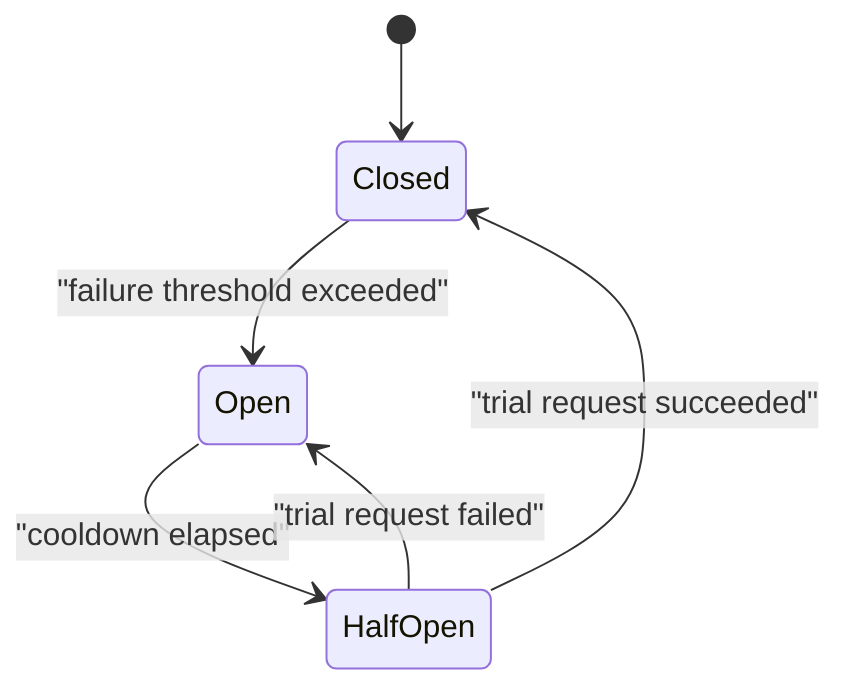

## Before you start

You need [monolith-vs-microservices](monolith-vs-microservices) — these patterns exist because a service now depends on other services that can fail independently. [idempotency-and-retries](idempotency-and-retries) pairs closely with this.

## In one sentence

**Designing for failure** means assuming every dependency you call will eventually be slow, broken, or unreachable, and deciding in advance what your service does then — because the default behaviour, waiting indefinitely, turns one failure into an outage of everything.

## Why it matters

A recommendation service goes down. It should degrade one section of a product page. Instead the whole site stops loading. The mechanism is boring and universal. Your service calls recommendations with no timeout. That request hangs, holding a thread or connection. More requests arrive, each hanging on the same call. Within seconds every connection in your pool is waiting on a service that will never answer, and your service — perfectly healthy — can no longer serve requests that have nothing to do with recommendations. That is a **cascading failure**, and it is how one non-critical component takes down a system.

## The intuition

A ship's hull is divided into **bulkheads**: sealed compartments, so a breach floods one and the ship stays afloat. Without them a single hole sinks everything. A **circuit breaker** is the electrical version — when a circuit faults, the breaker trips and cuts power immediately rather than letting the fault burn the house down, then cautiously tests later whether the fault has cleared.

Both encode the same instinct: contain the damage, and stop repeatedly doing the thing that is failing. A retry loop against a dead service is holding the wire against the short.

## How it actually works

Everything starts with **timeouts**. A call with no timeout is a promise to wait forever, and forever is a resource commitment you cannot afford. The number should come from measurement, not intuition: set it slightly above the dependency's p99 latency. Too low and you fail requests that would have succeeded; too high and you hold resources long past the point of usefulness.

Timeouts must also form a **budget**. If your API has a 3-second budget and calls three services in sequence, they cannot each have a 2-second timeout — the caller gives up at 3 seconds while your service is still waiting on the third call, doing work nobody will ever read. Pass the remaining budget down the chain, and have each layer refuse work it cannot finish in time.

A **circuit breaker** wraps a dependency and tracks its recent failures. It has three states:



**Closed** is normal: calls pass through, failures are counted. Once failures cross a threshold the breaker goes **Open**, and every call fails instantly without touching the network — protecting the caller from waiting and giving the struggling dependency room to recover. After a cooldown it moves to **Half-open** and permits one trial request: success closes it, failure re-opens it. Failing fast is the point, because when a dependency is truly down, spending 2 seconds discovering that on every request is pure waste that consumes your own capacity.

**Bulkheads** limit blast radius by partitioning resources. Give each dependency its own connection pool — 20 connections for recommendations, 20 for payments — and recommendations hanging can exhaust only its own 20 while payments keeps working. With one shared pool of 40, the failing dependency takes it all.

**Graceful degradation** is what you do once you have failed fast: return a useful reduced response instead of an error. No recommendations means show bestsellers. Decide these fallbacks at design time, when you can ask a product owner what "acceptable but reduced" means — not at 3am from a stack trace.

## Worked example

A circuit breaker with all three states:

```js
class CircuitBreaker {
  constructor({ threshold = 3, cooldownMs = 5000 } = {}) {
    Object.assign(this, { threshold, cooldownMs, failures: 0, state: 'CLOSED', openedAt: 0 });
  }

  async call(fn, fallback, now = Date.now()) {
    if (this.state === 'OPEN') {
      if (now - this.openedAt < this.cooldownMs) return fallback('circuit open'); // fail fast
      this.state = 'HALF_OPEN'; // cooldown done — allow one trial request
    }
    try {
      const result = await fn();
      this.failures = 0; this.state = 'CLOSED'; // success resets everything
      return result;
    } catch (err) {
      this.failures += 1;
      if (this.state === 'HALF_OPEN' || this.failures >= this.threshold) {
        this.state = 'OPEN'; this.openedAt = now;
      }
      return fallback(err.message);
    }
  }
}

const breaker = new CircuitBreaker({ threshold: 3, cooldownMs: 5000 });
const brokenService = async () => { throw new Error('ECONNREFUSED'); };
const fallback = (why) => `bestsellers (${why})`;

(async () => {
  const t = Date.now();
  for (let i = 1; i <= 5; i++) {
    console.log(`call ${i}: ${await breaker.call(brokenService, fallback, t)} [${breaker.state}]`);
  }
  console.log(`after cooldown: ${await breaker.call(brokenService, fallback, t + 6000)}`);
})();
```

Output:

```
call 1: bestsellers (ECONNREFUSED) [CLOSED]
call 2: bestsellers (ECONNREFUSED) [CLOSED]
call 3: bestsellers (ECONNREFUSED) [OPEN]
call 4: bestsellers (circuit open) [OPEN]
call 5: bestsellers (circuit open) [OPEN]
after cooldown: bestsellers (ECONNREFUSED)
```

Calls 1–3 attempt the network and pay the full failure cost, with call 3 tripping the breaker. Calls 4 and 5 return instantly without a network attempt — same user experience, none of the waiting. Every path returns bestsellers, so the user always sees a working page.

## A second example — when it gets harder

The nastiest failures are the ones where nothing reports an error. A dependency that returns 500s is easy: the breaker trips. A dependency that responds successfully in 8 seconds instead of 80ms is far worse — every health check passes, error rates look fine, and your connection pool fills with successful-but-slow requests until you cannot serve anyone. Circuit breakers must therefore trip on **latency**, not only on errors, treating "slower than the timeout" as a failure.

Then there is **retry amplification**. Three layers each retrying three times means one user request can become 27 requests at the deepest service. During an outage that is when load *increases* by an order of magnitude, guaranteeing the struggling service never recovers. Retry at exactly one layer, cap total attempts against a deadline budget, and let the circuit breaker suppress retries entirely once it is open.

**Chaos testing** exists because these interactions cannot be reasoned about reliably. You believe recommendations failing degrades gracefully; the only way to know is to break it in a controlled way and watch. Start small — add 500ms of latency to one dependency in staging and see whether the timeout budget holds. The interesting result is never "the fallback worked." It is discovering that a *different* service, one nobody connected to recommendations, also degraded because it shared a connection pool with it. Failure is a design input, not an exception path.

## Quick reference

| Pattern | Prevents | Cost |
|---|---|---|
| Timeout | Unbounded resource holding | Fails some slow-but-valid requests |
| Circuit breaker | Wasting capacity on a known-dead dependency | Rejects during cooldown even if it recovered |
| Bulkhead | One dependency exhausting shared resources | Lower peak utilisation of each pool |
| Retry with backoff | Transient blips reaching the user | Amplifies load if unbounded |
| Graceful degradation | Total failure from partial failure | Requires designed fallbacks per feature |
| Load shedding | Overload collapse | Some users rejected to save the rest |

## Common mistakes

- Network calls with no timeout, which is the single most common cause of cascading failure.
- Timeouts that ignore the caller's budget, so your service works on requests the caller has already abandoned.
- Circuit breakers that trip only on errors, missing the slow-but-successful dependency that fills your pool.
- Retrying at every layer, multiplying load exactly when the system can least absorb it.
- One shared connection pool for all dependencies, so any one of them can starve the rest.
- Deciding fallback behaviour during an incident instead of designing it beforehand.

## What interviewers ask

- **What is a cascading failure?** — One component's failure consuming a shared resource — connections, threads, memory — until unrelated components fail too, typically caused by calls with no timeout.
- **Explain the three circuit breaker states.** — Closed passes calls and counts failures; Open fails instantly without a network call after a threshold is crossed; Half-open allows one trial after a cooldown, closing on success and re-opening on failure.
- **Why is failing fast better than retrying?** — When a dependency is genuinely down, each attempt costs the full timeout and consumes your own capacity; failing instantly preserves your resources and lets the dependency recover without added load.
- **What is a bulkhead?** — Partitioned resources — a separate connection pool per dependency — so one failing dependency can exhaust only its own share rather than everything.
- **How do you pick a timeout?** — Measure the dependency's p99 latency and set it slightly above, then check it fits inside the caller's overall budget rather than choosing a round number.
- **What is chaos engineering for?** — Verifying that failure handling works, because these interactions are too complex to reason about; the valuable findings are the unexpected couplings you did not know existed.

## Practice

1. Add latency-based tripping to `CircuitBreaker`: treat any call slower than a configured threshold as a failure, and show it opening against a slow-but-successful service.
2. Implement a deadline budget: a caller passes a remaining-milliseconds value down through three nested calls, and each refuses to start work it cannot finish in time.
3. Map a product page's dependencies — auth, catalogue, pricing, reviews, recommendations — marking each critical or optional, and write the degraded response for every optional one.

## Where to go next

Failure handling depends on knowing what "normal" looks like, which is [capacity-planning](capacity-planning). To find *which* dependency is failing during an incident, see [distributed-tracing-and-observability](distributed-tracing-and-observability).
