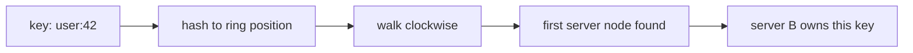

## Before you start

You need [scalability-and-performance](scalability-and-performance) — a load balancer is the component that makes horizontal scaling possible, so the reason for having one comes first.

## In one sentence

A **load balancer** sits in front of a group of identical servers and decides which one handles each incoming request, so no single server is overwhelmed while others idle, and so a server that dies stops receiving traffic without users noticing.

## Why it matters

Horizontal scaling is only real if something distributes the work. Ten servers behind no balancer is ten separate addresses, and clients that must somehow know which to use and what to do when one dies. The balancer also makes failure invisible: when a server crashes it stops passing health checks, traffic stops going to it, and users see nothing. Without that, one dead server in ten means one request in ten fails.

## The intuition

A supermarket with ten tills. **Round robin** sends each new customer to the next till in order — trivially simple, and it works well when every customer takes about the same time. But it ignores what is actually happening: send someone with a full trolley to till 3 and round robin will keep feeding till 3 customers on schedule regardless.

**Least connections** instead looks at each till and picks whichever has the fewest people currently waiting. It adapts automatically to requests of wildly different cost, which is why it usually beats round robin in practice.

**Consistent hashing** is different in kind. It sends the same customer to the same till every time, deliberately — because that till already knows them. You give up even distribution to gain cache locality.

## How it actually works

Balancers operate at one of two layers. **Layer 4** routes on IP and port, forwarding TCP packets without inspecting the contents — fast, cheap, protocol-agnostic. **Layer 7** parses the HTTP request, so it can route by path or header, terminate TLS, and retry a failed request against another server. Layer 7 costs more CPU and buys far more control.

The algorithm choice matters less than most people expect, with one exception: caching.

If your servers hold per-key caches, round robin is actively harmful. Requests for the same key land on a different server each time, so every server ends up caching everything, and your effective cache size is one server's worth rather than ten. Hashing the key to a server means each key is cached in exactly one place.

The naive way to do that — `hash(key) % serverCount` — has a fatal flaw. Change the server count from 10 to 11 and the modulus changes for nearly every key, so almost the entire cache is invalidated at once, and the database absorbs the full uncached load.

**Consistent hashing** fixes this. Picture the hash space as a ring. Each server is placed at several points around it, and each key hashes to a point on the same ring and belongs to the first server found moving clockwise.



Now removing a server only affects the keys that were sitting in its arc — those move to the next server clockwise, and everything else stays put. Adding or removing one of ten servers reshuffles roughly a tenth of the keys instead of all of them.

The multiple points per server are **virtual nodes**, and they are not optional. With one point each, servers land at random positions and one may own a huge arc while another owns a sliver. With 150 points each, the arcs average out and the distribution is close to even.

None of this works without **health checks**. The balancer probes each server on an interval — commonly `GET /health` — and removes any that fail a threshold of consecutive checks. A good check verifies the server can actually serve: its database connection is alive, it has finished starting up. A check that returns 200 whenever the process is running will happily route traffic to a server that fails every real request.

## Worked example

A consistent-hashing ring with virtual nodes, showing how little moves when a server is removed:

```js
const { createHash } = require('node:crypto');
const hash = (s) => parseInt(createHash('md5').update(s).digest('hex').slice(0, 8), 16);

class Ring {
  constructor(vnodes = 150) { this.vnodes = vnodes; this.points = []; }

  add(server) {
    for (let i = 0; i < this.vnodes; i++) this.points.push({ pos: hash(`${server}#${i}`), server });
    this.points.sort((a, b) => a.pos - b.pos); // keep the ring ordered
  }

  remove(server) { this.points = this.points.filter((p) => p.server !== server); }

  get(key) {
    const h = hash(key);
    const found = this.points.find((p) => p.pos >= h); // first point clockwise
    return (found ?? this.points[0]).server;           // wrap around the ring
  }
}

const ring = new Ring();
['A', 'B', 'C'].forEach((s) => ring.add(s));

const keys = Array.from({ length: 10_000 }, (_, i) => `user:${i}`);
const before = keys.map((k) => ring.get(k));
ring.remove('C');
const after = keys.map((k) => ring.get(k));

const moved = before.filter((s, i) => s !== after[i]).length;
console.log(`${moved} of ${keys.length} keys moved (${(moved / keys.length * 100).toFixed(1)}%)`);
```

Output:

```
3177 of 10000 keys moved (31.8%)
```

Removing one of three servers moved about a third of the keys — exactly the keys that server owned, and no others. With `hash(key) % 3` changing to `% 2`, roughly two thirds would have moved, most of them for no reason at all.

## A second example — when it gets harder

**Sticky sessions** are where load balancing meets application design badly.

If your servers store session state in memory, a user's requests must keep reaching the same server or they get logged out. The balancer can pin them with a cookie — that is stickiness. It works, and it creates three problems.

Distribution degrades: a server that happens to collect long-lived heavy sessions stays hot while others idle, and the balancer cannot rebalance without breaking those sessions. Deploys become disruptive: restarting a server drops every session pinned to it. And autoscaling loses its point, since new servers only receive brand-new sessions and take a long time to shoulder their share.

The fix is not a better stickiness algorithm — it is to stop needing it. Move session state to Redis or a signed cookie, and every server can serve every request. Then any balancing algorithm works, deploys are boring, and a dying server costs nobody their login.

Consistent hashing is the legitimate cousin of stickiness: it also routes a given key to a given server, but for cache locality rather than correctness. If the "wrong" server gets the request, it is a cache miss — slower, still correct. That distinction is what makes one pattern healthy and the other a trap.

## Quick reference

| Algorithm | How it picks | Best for | Weakness |
|---|---|---|---|
| Round robin | Next server in order | Uniform, cheap requests | Ignores actual load |
| Weighted round robin | In order, biased by capacity | Mixed hardware | Still ignores current load |
| Least connections | Fewest in-flight requests | Variable request cost | Needs live connection counts |
| Least response time | Fastest recent latency | Latency-sensitive traffic | Can stampede onto one fast server |
| Consistent hashing | Hash of a key on a ring | Per-server caches, sharding | Uneven if keys are skewed |
| Random | Uniformly at random | Very large fleets | No load awareness |

## Tools & frameworks

| Tool | What it's for | Reach for it when |
|---|---|---|
| [HAProxy](https://docs.haproxy.org/) | L4/L7 balancing with many algorithms | You want to compare round-robin, least-connections and EWMA for real |
| [NGINX](https://nginx.org/en/docs/) | Reverse proxy and upstream balancing | The common default, and its `upstream` docs are the clearest primer |
| [Envoy](https://www.envoyproxy.io/docs/envoy/latest/) | Outlier detection and zone-aware routing | You need per-endpoint health ejection and locality awareness |
| [Netflix concurrency-limits](https://github.com/Netflix/concurrency-limits) | Adaptive concurrency limiting | Your fixed connection limits are wrong and should be derived from latency instead |

## Common mistakes

- Using `hash(key) % n` for cache routing, so every scaling event invalidates nearly the whole cache at once.
- Consistent hashing with one point per server, producing badly uneven arcs.
- Health checks that only prove the process is alive, so traffic keeps flowing to a server whose database connection is dead.
- Needing sticky sessions because state lives in server memory; externalise the state instead.
- One load balancer with no redundancy — you have moved the single point of failure, not removed it.

## What interviewers ask

- **Round robin or least connections?** — Least connections in most real systems, because request costs vary; round robin is fine only when every request takes roughly the same time and is cheaper to compute.
- **Why consistent hashing over modulo?** — Modulo remaps almost every key when the server count changes, dumping the full uncached load on the database; consistent hashing moves only the keys owned by the changed server, roughly 1/n of them.
- **What are virtual nodes for?** — With one ring position per server the arcs are wildly uneven; giving each server ~150 positions averages the arcs out so load is close to even.
- **Layer 4 versus layer 7?** — L4 forwards TCP by IP and port, fast and protocol-agnostic; L7 parses HTTP so it can route by path or header, terminate TLS, and retry elsewhere, at higher CPU cost.
- **What's wrong with sticky sessions?** — They pin load unevenly, make deploys drop sessions, and blunt autoscaling; the real fix is moving session state out of server memory.
- **How does the balancer know a server is unhealthy?** — Periodic health checks removing servers after N consecutive failures, where the check must verify real serving ability, not just that the process is up.

## Practice

1. Change `vnodes` from 150 to 1 in the `Ring` example and print how many keys each server owns. Explain the distribution you see.
2. Add a `getReplicas(key, n)` method returning the next `n` *distinct* servers clockwise, which is how replication is layered onto consistent hashing.
3. A fleet of 20 servers uses least connections. One server's disk is failing, so it returns 500s in 5ms while healthy servers take 200ms. Explain where all the traffic goes and how to prevent it.

## Where to go next

A balancer spreads load; it does not reduce it. [rate-limiting-and-throttling](rate-limiting-and-throttling) covers rejecting excess traffic deliberately, and [designing-for-failure](designing-for-failure) covers what a server should do when its dependencies fail.
