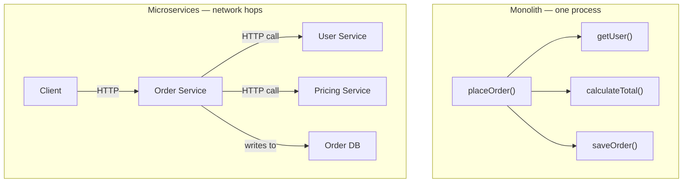

## Before you start

Nothing formal is required — this is a good first topic in system design. It helps to have written at least one backend app (even a small one), so "one codebase" versus "many services" has something concrete to attach to.

## In one sentence

A **monolith** is one application where all the code — user login, orders, payments — runs and deploys together as a single unit, while **microservices** split that same application into small independent services that each run and deploy on their own.

## Why it matters

As a team grows, one giant deployable becomes slow to build, test, and release — a typo in payments code can block the whole product's release. Microservices let teams ship independently, trading that freedom for network calls, consistency problems, and more moving parts to operate. Nearly every "why did we choose this architecture" interview question comes back to this trade-off.

## The intuition

Think of a monolith like a single restaurant kitchen: one team, one set of ovens, everyone works from the same station. It's simple to coordinate, but if the grill breaks, the whole kitchen stops.

Microservices are like a food court: each stall (service) has its own equipment and menu, and one stall closing doesn't stop the others. But now you need shared plumbing — a way for stalls to talk to each other, and a plan for when one depends on another that's out of stock.

Most companies start as a monolith because it's faster to build with a small team. They move to microservices only when specific pain shows up: one part needs to scale independently, or teams keep blocking each other on the same codebase. Splitting too early adds network calls, retries, and partial failures before you actually need them.

## How it actually works

The difference that matters isn't syntax — it's the **deployment boundary** and what crosses the network versus what stays a function call. In a monolith, calling another module is a function call: it's fast, it can't partially fail, and it's part of the same transaction. In microservices, the same call becomes an HTTP or gRPC request to another process, possibly on another machine — it can time out, fail halfway, or return late.

This diagram shows the same "place an order" feature drawn both ways, with the network hops made visible:



In the monolith, every arrow is an in-memory function call inside one process — nothing on that path can time out independently. In the microservices version, every arrow crossing a service boundary is a real network call, each with its own latency, failure mode, and retry logic to think about.

This is also why microservices need extra infrastructure a monolith doesn't: service discovery (how does Order Service find User Service's address), distributed tracing (following one request across five services), and a strategy for partial failure (what happens if Pricing Service times out but User Service already responded).

## Worked example

Here's the same feature expressed both ways in code, since the real difference is deployment boundaries, not logic:

```js
// monolith: one process, direct function calls, one transaction
function placeOrder(userId, items) {
  const user = getUser(userId);
  const total = calculateTotal(items);
  return saveOrder(user, total); // all-or-nothing, in one DB transaction
}

// microservices: each step is now a network call that can fail on its own
async function placeOrder(userId, items) {
  const user = await fetch(`http://user-service/users/${userId}`).then(r => r.json());
  const total = await fetch('http://pricing-service/calc', {
    method: 'POST', body: JSON.stringify({ items }),
  }).then(r => r.json());
  return fetch('http://order-service/orders', {
    method: 'POST', body: JSON.stringify({ user, total }),
  });
}
```

The monolith version can't partially fail — it's one transaction: either the order saves or the whole call throws. The microservices version can fail halfway (user fetched fine, pricing service times out), which is the core trade-off: independence in deployment costs you certainty in execution.

## A second example — when it gets harder

The naive view is "just split the monolith along its existing module boundaries." That breaks down the moment two services need the same data. Say `User Service` and `Order Service` both need to show a user's display name. In a monolith, that's one shared table, one join. Split apart, you have two bad options:

```js
// Option A: Order Service calls User Service on every request — adds latency,
// and Order Service now goes down if User Service is slow or unavailable
async function getOrderWithUserName(orderId) {
  const order = await db.getOrder(orderId);
  const user = await fetch(`http://user-service/users/${order.userId}`).then(r => r.json());
  return { ...order, userName: user.name };
}

// Option B: Order Service keeps its own copy of the user's name — fast and
// resilient to User Service being down, but now it can go stale if the
// name changes and the update event is missed
async function getOrderWithUserNameDenormalized(orderId) {
  const order = await db.getOrder(orderId); // order.userName cached locally
  return order;
}
```

Neither option is free. Option A trades speed and availability for always-correct data. Option B trades a small chance of staleness for speed and resilience — and now requires an event (`user.name.changed`) to keep the copy in sync. This is the real cost of microservices: every piece of shared data needs an explicit decision about where it lives and how copies stay consistent, a problem a monolith's single database never had.

## Quick reference

| Aspect | Monolith | Microservices |
|---|---|---|
| Deployment | One unit, all-or-nothing | Independent per service |
| Scaling | Scale the whole app | Scale only the busy service |
| Team ownership | Shared codebase | One team per service |
| Failure mode | Whole app crashes together | One service fails, others may survive |
| Data consistency | Easy — one database, one transaction | Hard — needs eventual consistency across services |
| Operational cost | Low — one thing to deploy/monitor | High — many things to deploy/monitor |
| Best for | Small teams, early-stage products | Large teams, independently-scaling parts |

## Common mistakes

- Splitting into microservices before there's a real scaling or team problem — it adds network failures for no benefit yet.
- Forgetting a service boundary is now a network call that can time out or fail partially, unlike a function call.
- Giving every microservice its own database with no plan for keeping related data consistent across them.
- Assuming microservices are always "more scalable" — a well-built monolith with a good database and caching can serve enormous traffic; the ceiling most teams hit first is organizational, not technical.

## What interviewers ask

- **When would you choose microservices over a monolith?** — When team size or scaling needs create real bottlenecks in a shared codebase, not by default; operational complexity is the cost, so the pain of staying monolithic has to outweigh it.
- **How do microservices talk to each other?** — Usually HTTP/REST or gRPC for direct calls, and message queues (like Kafka or RabbitMQ) for async, decoupled communication.
- **What's the hardest part of microservices in practice?** — Data consistency across services without a shared database, plus debugging a request that touches five services instead of one stack trace.
- **Can you migrate a monolith to microservices gradually?** — Yes, via the "strangler fig" pattern: route specific features to new services one at a time while the monolith still handles the rest, until nothing is left to strangle.

## Practice

1. Take a feature you've built (or know well) that has at least three logical pieces (e.g. auth, a data model, and a background job). Draw it as a monolith, then redraw it as three services, marking exactly which arrows become network calls.
2. For the redrawn version, pick one piece of data that both services need (like a username or a price) and write out, in a sentence, which service owns it and how the other one gets a copy.
3. Describe how you'd migrate an existing monolith's "notifications" feature into its own service using the strangler fig pattern, without a big-bang cutover.

## Where to go next

Once a system is split into multiple services (or even just multiple instances of a monolith), the next question is how clients reach the right one and how the system stays contract-friendly as it changes — that's [api-design](api-design). After that, [scalability-and-performance](scalability-and-performance) covers how to actually add capacity to either architecture.
