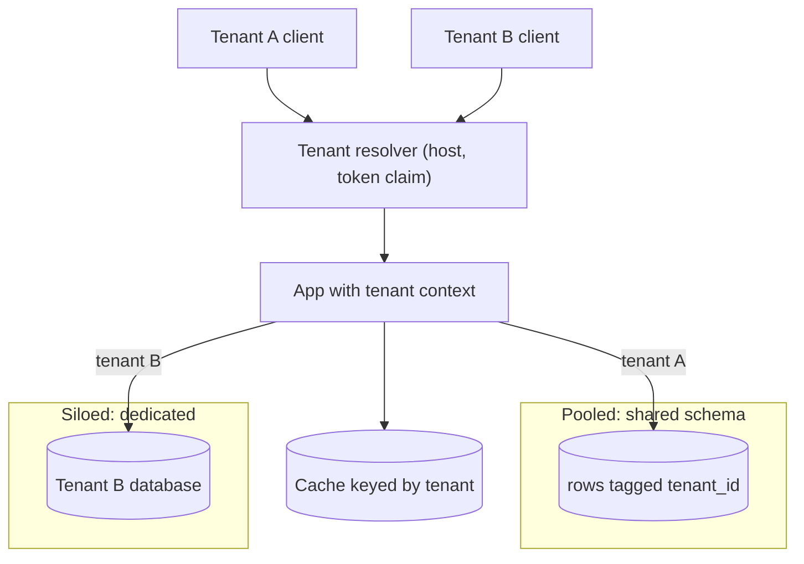
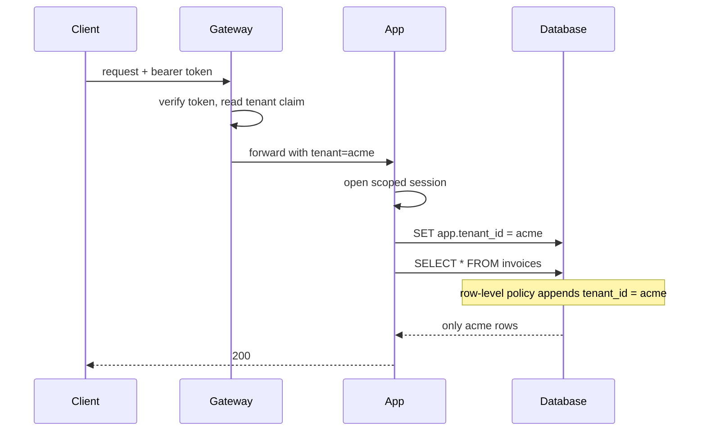

## Before you start

Read `database-sharding` first — tenant routing is a shard-key decision, and hot shards, directory-based routing and scatter-gather all reappear here wearing tenant costumes. `authentication-authorization` matters because tenant identity arrives inside a verified token, and everything in this topic depends on that identity being trustworthy before you use it.

## In one sentence

**Multi-tenancy** is one running system serving many separate customers — **tenants** — from shared infrastructure, where each tenant must be unable to see another's data and unable to consume the capacity another tenant paid for.

## Why it matters

Two failures define this topic, and they fail in opposite directions.

The first is a data leak. A shared-schema application runs a report query, someone forgot one clause, and a customer sees another customer's invoices. There is no gradual degradation, no error rate to watch climb. It works perfectly until it exposes exactly the thing your contracts promised it would not, and there is no undo — you cannot un-show data.

The second is quieter. One tenant imports a 40-million-row spreadsheet, saturates the shared database, and every other customer's dashboard times out. Nobody's data leaked, and your entire customer base is having an outage caused by one account behaving legitimately.

Running a separate copy of everything per customer avoids both and is what a naive design reaches for. It also multiplies your infrastructure bill by your customer count and makes deploying a fix a thousand-deployment operation. The whole topic is the space between those two extremes.

## The intuition

Think about how buildings house multiple households.

An **open-plan office** is the cheapest: one big room, everyone's desks in it, files labelled with names. Cheap per person and easy to reconfigure, but privacy depends entirely on nobody reading the wrong label, and one loud person ruins the room for everyone.

**Apartments in one block** give each household a locked door while sharing the foundation, plumbing and lift. Much better isolation, still efficient, but a burst pipe affects several flats and the lift capacity is shared.

**Detached houses** give total isolation. Nothing one household does can affect another. They also cost enormously more per household, and re-roofing all of them means a thousand separate jobs.

The mapping is direct: labelled desks are a `tenant_id` column, locked doors are a schema or database per tenant, detached houses are a deployment per tenant. And the important insight from the analogy is that most companies run *several of these at once* — the open-plan floor for small customers, a detached house for the bank that demanded it.



## How it actually works

Every request must answer "which tenant is this?" before it touches data, and the answer must come from something the client cannot forge: a claim inside a verified token, or a subdomain mapped server-side to a tenant record. A `tenantId` in the request body or a header the client controls is not tenant identity, it is a request to impersonate.

Once resolved, the tenant travels with the request as **tenant context** and every data access derives its scope from that context rather than from a parameter a developer remembered to pass.

### The isolation spectrum

| Model | Cost per tenant | Blast radius | Noisy neighbour | Per-tenant restore | Migrations | Fits compliance demands |
|---|---|---|---|---|---|---|
| Shared schema, `tenant_id` column | Lowest | All tenants | High — shared everything | Hard: filtered export, not a restore | One migration, all tenants at once | Weakest story |
| Shared DB, schema per tenant | Low | All tenants on that instance | High — shared CPU, pool, disk | Easier: dump one schema | N migrations, must be automated | Moderate |
| Database per tenant | Medium | One tenant | Low for storage, some at host level | Simple: restore that database | N migrations, orchestrated, slow | Strong |
| Deployment per tenant | Highest | One tenant | None | Simple and independent | N deployments — the real cost | Strongest, and often required |

Read that table as a ladder you climb only when forced. Start pooled, keep the tenant boundary explicit in the code, and move individual tenants up the ladder when a contract, a data-residency law, or their sheer size demands it. The design that survives is the one where a tenant can be *moved* between models without rewriting the application, which is why tenant context must be an abstraction rather than a connection string sprinkled through the code.

### The row-level catastrophe

With a shared schema, correctness and security are the same clause. `SELECT * FROM invoices WHERE status = 'open'` is a perfectly valid query, passes code review if the reviewer is thinking about status, and returns every tenant's invoices.

The lesson people take from this is "be careful in queries", and that lesson is wrong. Every hand-written query is another chance to forget, across every developer, every hotfix at 2am, every ad-hoc script. Correctness that depends on remembering will eventually not be remembered.

So the scoping must live somewhere it *cannot* be forgotten. Two mechanisms do this properly:

**Row-level security in the database.** Postgres policies attach a predicate to the table itself. The application sets a session variable holding the tenant, and the database appends `tenant_id = current_setting('app.tenant_id')` to every query against that table. Forgetting the clause now returns zero rows instead of someone else's — the failure mode flips from silent leak to visible bug. This is the strongest option because it holds even for a psql session, an ORM you did not write, and a reporting tool connecting directly.

**A mandatory query layer.** All data access goes through a repository or ORM scope that takes tenant context and injects the predicate, with no public method that accepts a raw filter. This is weaker than database enforcement — it protects only code that goes through it — but it is often the practical path in an existing application, and it can be defended with a lint rule and a test that runs every repository method with two tenants seeded and asserts nothing crosses over.

Whichever you choose, back it with a test that is impossible to pass by accident: seed two tenants, exercise every read path as tenant A, and fail if a single row belonging to B appears. And note the corollary for indexes — with a shared schema, `tenant_id` should be the leading column of your composite indexes, for the leftmost-prefix reason worked out in `query-optimization`.



### Noisy neighbours

Isolation is not only about data. Per-tenant rate limits and quotas are the first line — see `rate-limiting-and-throttling` for the algorithms — but request rate is the easy dimension. The dangerous ones are slower: a single tenant's expensive report holding connections from a shared pool until every other tenant's request queues behind it, or a bulk import monopolising disk throughput.

Bound work per tenant, not just requests per tenant: cap query cost and row counts, give background jobs per-tenant concurrency limits and separate queues so a large tenant's backlog cannot starve small ones, and reserve pool capacity so no tenant can take the last connection.

A shared cache deserves its own warning because it fails in both directions at once. A key like `invoices:open` describes the query but not who asked, so tenant B's request finds tenant A's cached rows: a wrong answer *and* a data leak, delivered fast and with no database query to audit. Tenant identity belongs in the key, derived from tenant context by the cache helper rather than concatenated by each caller — the namespacing habit from `caching-strategies` becomes a security control here.

### Keys, regions and the big customer

Per-tenant encryption keys turn deletion into a tractable problem: destroy the key and that tenant's data is unreadable wherever copies of it ended up, including backups you cannot selectively edit. They also mean one tenant's key compromise is not everyone's.

Data residency is usually a routing problem: the tenant record names a region, and the resolver sends the request to the deployment there. This works only if it was designed in — retrofitting region pinning onto a global shared table is a migration of the entire dataset.

And eventually a very large customer asks for their own everything, and the commercially correct answer is yes. Plan for it: if tenant context is a clean abstraction, a siloed tenant is a configuration change, not a fork.

## Worked example

```js
// A tiny in-memory "table" shared by every tenant — the shared-schema model.
const invoices = [
  { id: 1, tenant_id: 'acme',  amount: 100 },
  { id: 2, tenant_id: 'globex', amount: 900 },
  { id: 3, tenant_id: 'acme',  amount: 250 },
];

// UNSAFE: scoping is the caller's job, so it can be forgotten.
function findUnsafe(pred) { return invoices.filter(pred); }

// SAFE: the tenant comes from the request context, not from the caller's filter.
// Every read goes through here, so there is no code path without the predicate.
function scopedRepo(ctx) {
  if (!ctx.tenantId) throw new Error('no tenant in context');
  const scope = r => r.tenant_id === ctx.tenantId;
  return {
    find: (pred = () => true) => invoices.filter(r => scope(r) && pred(r)),
    total: () => invoices.filter(scope).reduce((s, r) => s + r.amount, 0),
  };
}

const ctx = { tenantId: 'acme' };
console.log('forgot WHERE   :', findUnsafe(r => r.amount > 50).map(r => r.tenant_id));
console.log('scoped repo    :', scopedRepo(ctx).find(r => r.amount > 50).map(r => r.tenant_id));
console.log('scoped total   :', scopedRepo(ctx).total());
try { scopedRepo({}).find(); } catch (e) { console.log('no-tenant call :', e.message); }
```

Output:

```
forgot WHERE   : [ 'acme', 'globex', 'acme' ]
scoped repo    : [ 'acme', 'acme' ]
scoped total   : 350
no-tenant call : no tenant in context
```

The first line is the leak, and notice how ordinary the query that produced it looks. The scoped repository cannot produce that output because the tenant predicate is applied before the caller's filter is even consulted, and a missing tenant throws rather than defaulting to "all" — a scope that silently means *everything* when unset is the same bug with extra steps.

## A second example — when it gets harder

Two things break the naive picture: shared caches, and the day you migrate a single-tenant system into a multi-tenant one.

```js
const rows = { acme: ['acme-invoice'], globex: ['globex-invoice'] };
const cache = new Map();

// The bug: the key describes the QUERY but not WHO asked.
function badGet(tenant, q) {
  const key = `q:${q}`;                       // no tenant in the key
  if (!cache.has(key)) cache.set(key, rows[tenant]);
  return { key, value: cache.get(key) };
}
// The fix: tenant is part of the key, so entries can never collide.
function goodGet(tenant, q) {
  const key = `t:${tenant}:q:${q}`;
  if (!cache.has(key)) cache.set(key, rows[tenant]);
  return { key, value: cache.get(key) };
}

console.log('bad  acme  :', badGet('acme', 'invoices'));
console.log('bad  globex:', badGet('globex', 'invoices')); // served acme's rows
cache.clear();
console.log('good acme  :', goodGet('acme', 'invoices'));
console.log('good globex:', goodGet('globex', 'invoices'));
```

Output:

```
bad  acme  : { key: 'q:invoices', value: [ 'acme-invoice' ] }
bad  globex: { key: 'q:invoices', value: [ 'acme-invoice' ] }
good acme  : { key: 't:acme:q:invoices', value: [ 'acme-invoice' ] }
good globex: { key: 't:globex:q:invoices', value: [ 'globex-invoice' ] }
```

Globex asked for its own invoices and received Acme's, because the database was never consulted. Row-level security in the database would not have saved you — the leak happened in front of it.

Now the migration trap, and it generalises far beyond tenancy. Suppose a table had `UNIQUE (email)` from its single-tenant days, and you add `tenant_id` and replace that with `UNIQUE (tenant_id, email)`. The migration adds the new index, drops the old one, and records success. Except the drop was wrapped in a `try` that swallowed its error — because that made the migration rerunnable in development — so the old global unique index is still there. Nothing looks wrong for weeks. Then two tenants both have a user called `admin@company.com`, the second signup fails with a confusing duplicate-key error, and your migration history says the change completed.

The lesson is about error handling, not indexes: **a migration that swallows its own failure is worse than one that fails loudly.** A loud failure gets fixed in ten minutes. A silent one leaves the database in a state your schema definition says is impossible, and every subsequent diagnosis starts from a false premise. Make the drop explicit, assert afterwards that the old index is gone, and let the migration fail if it is not.

## Quick reference

| Concern | Enforce it here | Failure symptom if you do not |
|---|---|---|
| Tenant identity | Verified token claim or server-side host mapping | Client-supplied ID lets any tenant impersonate another |
| Row scoping | Database row-level security, or a mandatory query layer | One missing clause leaks another tenant's rows |
| Index design | `tenant_id` as the leading composite index column | Per-tenant queries scan the whole table |
| Request rate | Per-tenant limits and quotas at the edge | One tenant's traffic degrades everyone |
| Expensive work | Per-tenant pool caps, concurrency limits, separate queues | A single report starves the connection pool |
| Cache | Tenant in the key, built by the cache helper | Wrong answers and a leak in front of the database |
| Deletion and residency | Per-tenant keys, region on the tenant record | Cannot prove deletion, cannot satisfy residency |

## Tools & frameworks

| Tool | What it's for | Reach for it when |
|---|---|---|
| [PostgreSQL docs (RLS)](https://www.postgresql.org/docs/current/) | Row-Level Security for per-tenant filtering | Shared-table tenancy, and you want isolation the ORM cannot bypass |
| [Kubernetes RBAC](https://kubernetes.io/docs/reference/access-authn-authz/rbac/) | Namespace-scoped permission boundaries | Tenants are namespaces and you need a hard control-plane boundary |
| [Open Policy Agent](https://www.openpolicyagent.org/docs) | Externalised authorization policy | Tenancy rules are complex enough to deserve a language of their own |
| [Kyverno](https://kyverno.io/docs/introduction/) | Kubernetes policy as resources | You are enforcing per-namespace quotas and network policy without writing Go |
| [Prisma / Drizzle](https://orm.drizzle.team/docs/overview) | Where tenant scoping actually gets forgotten | You are reviewing query layers — a missing `tenant_id` is the classic leak |

The recurring real bug is a query path or migration that forgets tenant scoping. RLS survives a developer mistake; application-level filtering does not.

## Common mistakes

- **Trusting a tenant ID from the client.** It must come from a verified token or a server-side mapping. Anything the caller can edit is not identity.
- **Relying on discipline for row scoping.** "Always add the WHERE clause" is not a control. Enforce it in the database or in a layer with no unscoped escape hatch.
- **Leaving the tenant out of cache keys.** Both a correctness bug and a leak, and it bypasses every database-level protection you built.
- **Defaulting an unset tenant scope to "all".** Missing context must throw. A permissive default converts a bug into a breach.
- **Ignoring resource isolation.** Data isolation gets the attention, but noisy neighbours cause far more incidents.
- **Deciding one isolation model for all tenants forever.** Real systems mix models; the goal is being able to move a tenant between them.
- **Writing migrations that swallow errors so they rerun cleanly.** A migration recorded as successful while its work did not happen is the worst possible state.
- **Forgetting offboarding.** Deleting a tenant means data, caches, search indexes, backups, keys and per-tenant infrastructure — enumerate them while onboarding is fresh in your mind.

## What interviewers ask

- **A shared-schema tenant leaks another tenant's rows. How do you prevent that structurally?** — Not by being careful. Put the predicate somewhere it cannot be omitted: row-level security so the database appends it, or a mandatory query layer that injects it from request context, plus a two-tenant test that fails if any foreign row appears. They want to hear "enforcement", not "code review".
- **Walk through the isolation models and pick one.** — Shared schema, schema per tenant, database per tenant, deployment per tenant, trading cost against blast radius, noisy-neighbour exposure and per-tenant restore. A good answer starts pooled, names the trigger for moving a tenant up, and says real systems run a mix.
- **Where does tenant identity come from?** — A verified token claim or a server-side host-to-tenant mapping, established once at the edge and carried as request context. Never a client-supplied parameter.
- **How do you stop one customer degrading everyone else?** — Per-tenant rate limits and quotas, bounded query cost, per-tenant concurrency and queues for background work, and reserved connection-pool capacity so no tenant takes the last connection.
- **How do you migrate a schema across 5,000 tenant schemas?** — Backward-compatible expand-migrate-contract as in `database-migrations`, applied by an orchestrated per-tenant runner that is resumable, tracks per-tenant state, and fails loudly. Never a hand-run loop.
- **A customer demands their own database in their own region. What breaks?** — Nothing, if tenant context is an abstraction and the tenant record carries its region and connection target. Everything, if connection details are hardcoded or a global shared table has to be split.

## Practice

1. Extend the scoped repository above with `create` and `update` that stamp and verify `tenant_id`, then write a test that seeds two tenants and asserts that no method can be induced to touch the other tenant's rows — including by passing a crafted predicate.
2. Design tenant onboarding and offboarding for the shared-schema model as an explicit checklist: what is created, what is deleted, and what remains after deletion that you cannot easily remove. Then explain what per-tenant encryption keys change about the last item.
3. Take a table with a legacy `UNIQUE (email)` constraint and write the migration to `UNIQUE (tenant_id, email)`. Add an assertion that fails the migration if the old index still exists, and explain why that assertion is more valuable than the index change itself.

## Where to go next

Continue to `rate-limiting-and-throttling` if resource isolation is the part you found least concrete — per-tenant quotas are where noisy-neighbour protection is actually implemented. If the data-shape questions interested you more, `database-sharding` is the natural pair, since choosing `tenant_id` as a shard key makes tenancy and partitioning the same decision.
