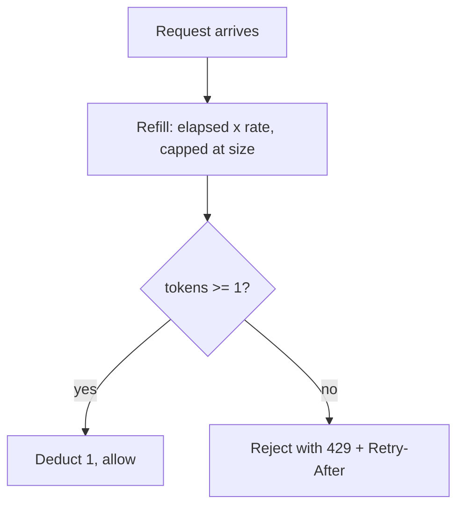

## Before you start

You need [api-design](api-design), since rate limits are part of an API's contract, and [caching-strategies](caching-strategies), because distributed limiters are almost always built on Redis.

## In one sentence

**Rate limiting** caps how many requests a given client may make in a given period, rejecting the excess with a `429 Too Many Requests` rather than letting one caller consume capacity that everyone else needs.

## Why it matters

Without limits, a single client can take down a service for everyone else — usually not maliciously. A retry loop with no backoff, a script accidentally left running, a customer's integration that polls every 10ms. Your service treats all of it as legitimate demand and tries to serve it until it falls over. Rate limiting converts an unbounded failure into a bounded one: the abusive caller gets errors, everyone else keeps working. It is also what makes tiered pricing possible — free tier 100 requests an hour, paid tier 10,000.

## The intuition

A nightclub with a capacity of 200. The bouncer's job is not to be fair to any one person — it is to keep the club from becoming dangerously full. Two styles exist. The **leaky bucket** lets people in at a strictly constant rate, one every three seconds, no matter how big the queue outside gets: output is perfectly smooth, and someone arriving alone at a quiet moment still waits three seconds.

The **token bucket** starts with 200 tokens and adds one every three seconds up to that ceiling. Arrive after a quiet spell and you walk straight in, because tokens accumulated. Arrive with a crowd and the bucket empties, throttling everyone to the refill rate.

The difference is **bursts**. Leaky bucket forbids them; token bucket allows a burst up to the bucket size, then enforces the average. Almost all APIs want the token bucket, because real usage is bursty and punishing a client for ten requests at once after an hour of silence is user-hostile.

## How it actually works

The token bucket needs two numbers per client: the current token count and when it was last refilled. Refill lazily — on each request, compute how many tokens should have accrued since the last check and add them, capped at the bucket size. No background timer needed.



The counting alternatives trade accuracy for simplicity. A **fixed window** counts requests per clock minute and resets — one counter, trivially cheap, with a bad edge: a client can send its full quota at 10:00:59 and again at 10:01:00, achieving double the limit across a two-second span. A **sliding window log** stores a timestamp per request and counts those within the last 60 seconds, which is exactly accurate but costs memory proportional to the limit for every client.

The **sliding window counter** is the usual compromise: keep this window's count and last window's, and estimate by weighting the previous window by how much of it is still in view. If 25% of the current minute has elapsed, count this minute's requests plus 75% of last minute's. One extra counter, and the fixed-window boundary problem largely disappears.

Where you enforce matters as much as how. A limiter in one process only sees that process's traffic — run ten instances and your "100 per minute" limit is really 1,000. Distributed limiting needs shared state, and Redis is the standard answer: `INCR` the key and set an expiry on first creation, or run a small Lua script to do the token-bucket arithmetic atomically. Atomicity is essential; a read-then-write from ten instances at once will let far more requests through than the limit permits.

Finally, tell the client what happened. Return `429` with a `Retry-After` header and `X-RateLimit-Remaining`, so a well-behaved client can slow down deliberately instead of hammering blindly.

## Worked example

A token bucket with lazy refill — the algorithm most production limiters use:

```js
class TokenBucket {
  constructor(size, refillPerSec) {
    this.size = size; this.refillPerSec = refillPerSec;
    this.tokens = size; this.last = Date.now();
  }

  tryConsume(now = Date.now()) {
    const elapsedSec = (now - this.last) / 1000;
    this.tokens = Math.min(this.size, this.tokens + elapsedSec * this.refillPerSec); // lazy refill
    this.last = now;
    if (this.tokens >= 1) { this.tokens -= 1; return { allowed: true }; }
    const waitMs = Math.ceil(((1 - this.tokens) / this.refillPerSec) * 1000);
    return { allowed: false, retryAfterMs: waitMs }; // tell the client when to come back
  }
}

const bucket = new TokenBucket(5, 2); // 5 burst, 2 per second sustained
const t0 = Date.now();

for (let i = 1; i <= 7; i++) {
  const r = bucket.tryConsume(t0); // all seven arrive in the same instant
  console.log(`req ${i}: ${r.allowed ? 'allowed' : `429, retry in ${r.retryAfterMs}ms`}`);
}
console.log('after 2s:', bucket.tryConsume(t0 + 2000)); // 4 tokens have refilled
```

Output:

```
req 1: allowed
req 2: allowed
req 3: allowed
req 4: allowed
req 5: allowed
req 6: 429, retry in 500ms
req 7: 429, retry in 500ms
after 2s: { allowed: true }
```

The first five ride the burst allowance. The sixth is rejected with a precise `retryAfterMs` — at 2 tokens per second, one token takes 500ms. Two seconds later the bucket has refilled and requests flow again.

## A second example — when it gets harder

Per-user limits do not protect you from your worst outage.

Suppose 50,000 users each stay comfortably inside their 100-requests-per-minute limit. That is 5 million requests a minute arriving at a service sized for 1 million, and every single request is within its limit. Your limiter approves the traffic that kills you. So you need limits at several layers. A **global** limit caps total concurrent work regardless of who is asking — a system-wide ceiling that sheds load when saturated. **Per-endpoint** limits stop an expensive route from starving cheap ones, since a search query costing 200ms of CPU should not share a quota with a 2ms key lookup. **Per-IP** limits catch unauthenticated abuse before login. **Per-user** limits enforce fairness and pricing tiers.

Beneath all of them sits **load shedding**, which is different from rate limiting in kind. Rate limiting says "you have had your share." Load shedding says "I am overloaded right now, and serving you would make me fail everyone." It is triggered by the server's own health — queue depth, latency, CPU — not by the client's identity. It should reject the cheapest requests to reject first, prioritise requests already in flight over new arrivals, and always be admission control, never a queue: queueing requests you cannot serve just adds latency before the failure.

The trap is the interaction. A limiter that returns 429 without `Retry-After` invites immediate retries, and those retries are new requests that consume limiter capacity themselves. Under load your rate limiter can become the thing generating the load. Always return `Retry-After`, and count rejected requests against the limit too.

## Quick reference

| Algorithm | Bursts | Memory per client | Accuracy |
|---|---|---|---|
| Fixed window | Allowed at boundaries | 1 counter | Poor — 2x at edges |
| Sliding window log | Controlled precisely | 1 timestamp per request | Exact |
| Sliding window counter | Smoothed | 2 counters | Very good |
| Token bucket | Allowed up to bucket size | 2 numbers | Good, and burst-friendly |
| Leaky bucket | Never | 1 queue | Exact, but no bursts |

| Scope | Protects against |
|---|---|
| Per-user | One customer starving others; enforces pricing tiers |
| Per-IP | Unauthenticated abuse and scraping |
| Per-endpoint | An expensive route consuming all capacity |
| Global | Aggregate overload from many well-behaved clients |

## Common mistakes

- Keeping limiter state in process memory across many instances, so the effective limit is your limit times the instance count.
- Read-then-write against Redis without atomicity, letting concurrent requests all pass the check. Use `INCR` or a Lua script.
- Returning 429 with no `Retry-After`, so clients retry instantly and the rejections become their own load.
- Only rate limiting per user, leaving the service defenceless against many users each behaving perfectly.
- Rate limiting by IP alone, which lumps an entire corporate NAT or mobile carrier into one bucket.
- Queueing throttled requests instead of rejecting them, adding latency before an inevitable failure.

## What interviewers ask

- **Explain the token bucket.** — Tokens accrue at a fixed rate up to a maximum; each request consumes one, and requests are rejected when the bucket is empty. Bucket size sets the burst allowance, refill rate sets the sustained rate.
- **Token bucket or leaky bucket?** — Token bucket for APIs, because it tolerates the bursts real clients produce while still enforcing the average; leaky bucket when downstream needs a perfectly smooth rate, such as feeding a fixed-capacity system.
- **What's wrong with fixed windows?** — At a boundary a client can spend its full quota at the end of one window and again at the start of the next, achieving double the intended rate in a short span.
- **How do you rate limit across many servers?** — Shared state in Redis with atomic operations — `INCR` with an expiry, or a Lua script for token-bucket maths — so all instances decrement one counter rather than each keeping its own.
- **Difference between rate limiting and load shedding?** — Rate limiting is per-client fairness based on identity; load shedding is a server-health response that rejects requests regardless of who sent them because serving them would fail everyone.
- **What should a 429 response include?** — `Retry-After` so clients back off deliberately, plus remaining-quota and reset headers so they can pace themselves before being rejected at all.

## Practice

1. Extend `TokenBucket` to a `cost` parameter so an expensive endpoint consumes 10 tokens and a cheap one consumes 1. What breaks if a request costs more than the bucket size?
2. Implement a sliding window counter and compare its verdicts against a fixed window for a client sending 100 requests at 10:00:59 and 100 more at 10:01:01, with a limit of 100 per minute.
3. Sketch the Redis operations for a distributed token bucket. Identify every place two concurrent requests could interleave badly, and explain why a Lua script fixes it.

## Where to go next

Rate limiting rejects excess traffic at your edge. [designing-for-failure](designing-for-failure) covers what your service does when the traffic it *did* accept depends on something that is failing.
