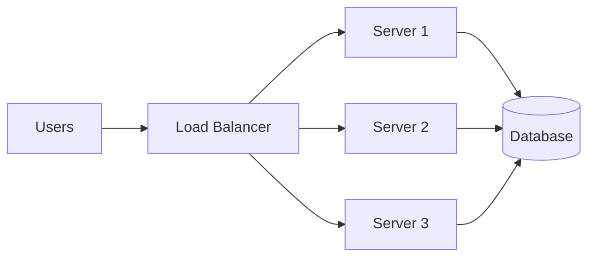

## Before you start

[Caching-strategies](caching-strategies) is a useful predecessor — caching is often the first thing that buys you headroom before you need to scale infrastructure at all. No other prerequisite is required.

## In one sentence

**Scalability** is a system's ability to handle more load — more users, more data, more requests — by adding resources, while **performance** is how fast it responds to a single request right now.

## Why it matters

A system can be fast for one user and completely fall over at ten thousand users if it can't scale; conversely, a system can scale to millions of users while still feeling slow to each one. You need both: performance keeps individual users happy, scalability keeps the system standing as more of them show up at once.

## The intuition

There are two ways to scale. **Vertical scaling** means making one machine bigger — more CPU, more RAM. It's simple (no code changes) but has a hard ceiling and a single point of failure. **Horizontal scaling** means adding more machines and spreading load across them with a load balancer. It scales further but requires your app to not depend on local, single-machine state (like an in-memory session only one server knows about).

A **bottleneck** is whatever component limits the whole system's throughput — it doesn't matter how fast your API server is if every request waits on one overloaded database. Finding the real bottleneck via monitoring, not guessing, is most of the actual work of scaling; adding servers in front of the wrong bottleneck does nothing.

## How it actually works

Horizontal scaling only works because of a piece in front of the servers: a **load balancer**, which spreads incoming requests across every instance so no single one is overwhelmed.



Compare that to vertical scaling, which has no fan-out at all — it's one bigger box handling everything, with nothing to redirect traffic if it goes down.

Notice all three servers still point at one database. Adding servers only helps throughput if the bottleneck is actually the application layer (CPU-bound request handling); if the database is the real bottleneck, tripling the number of app servers just means three times as many servers waiting on the same slow database. This is why finding the bottleneck first — through monitoring, not guessing — decides whether horizontal scaling even helps.

A useful way to reason about scale before writing any code is doing the math on expected load, so you can decide whether your architecture can plausibly handle it before you hit production.

## Worked example

Here's a capacity calculation — the kind of concrete number worth doing before you design anything:

```js
// Estimate load for a notifications feature
const dailyActiveUsers = 100_000;
const requestsPerUserPerDay = 3; // e.g. open app, refresh, check again

const totalRequestsPerDay = dailyActiveUsers * requestsPerUserPerDay; // 300,000
const secondsPerDay = 24 * 60 * 60; // 86,400

// Traffic isn't flat — assume peak hour carries ~20% of the day's traffic
const peakFraction = 0.20;
const avgRequestsPerSecond = totalRequestsPerDay / secondsPerDay;
const peakRequestsPerSecond =
  (totalRequestsPerDay * peakFraction) / (60 * 60);

console.log({ avgRequestsPerSecond: avgRequestsPerSecond.toFixed(2), peakRequestsPerSecond: peakRequestsPerSecond.toFixed(2) });
// avg ~3.5 req/s, but peak ~16.7 req/s — design for the peak, not the average
```

Designing for the average (3.5 req/s) would mean the system falls over exactly when it matters most — during the peak hour. This is why real capacity planning always uses peak load, not average load.

## A second example — when it gets harder

The calculation above assumes one request costs the same regardless of which server handles it. That assumption breaks the moment a request needs data tied to a specific machine — the classic case is an in-memory session:

```js
// Naive horizontal scaling: session lives in the memory of whichever
// server first handled the login — breaks the moment a load balancer
// sends the next request to a different server
const sessions = new Map(); // in-process memory — NOT shared across servers

function login(req, res) {
  const sessionId = crypto.randomUUID();
  sessions.set(sessionId, { userId: req.body.userId }); // only this server knows this
  res.cookie('sid', sessionId);
}

function getProfile(req, res) {
  const session = sessions.get(req.cookies.sid); // undefined if a different server handled login
  if (!session) return res.status(401).send('Not logged in'); // user IS logged in, wrong server just doesn't know
}

// Fix: externalize session state to a shared store every server can read
async function loginFixed(req, res) {
  const sessionId = crypto.randomUUID();
  await redis.set(`session:${sessionId}`, JSON.stringify({ userId: req.body.userId }), 'EX', 3600);
  res.cookie('sid', sessionId);
}
```

With sessions in local memory, a user can get randomly logged out depending on which server the load balancer happens to route them to next — a bug that's invisible with one server and appears the moment you add a second. The fix, moving session state to Redis (a shared store all servers can reach), is the general pattern for horizontal scaling: any state that must survive across requests needs to live somewhere every instance can see, not on whichever machine happened to handle the first request.

## Quick reference

| Aspect | Vertical scaling | Horizontal scaling |
|---|---|---|
| How | Bigger machine (more CPU/RAM) | More machines |
| Code changes needed | Usually none | Often yes (stateless design, load balancing) |
| Ceiling | Hard limit (biggest machine) | Very high, add more machines |
| Failure impact | Single point of failure | One machine dying doesn't take down the system |
| Cost curve | Gets expensive fast at the high end | More linear, but adds operational complexity |

## Tools & frameworks

| Tool | What it's for | Reach for it when |
|---|---|---|
| [k6](https://grafana.com/docs/k6/latest/) | Scripted load tests with thresholds | You need percentile latency under a realistic request mix |
| [autocannon](https://github.com/mcollina/autocannon) | Quick HTTP throughput numbers | You want a fast before-and-after on one endpoint |
| [Node.js `perf_hooks`](https://nodejs.org/api/perf_hooks.html) | In-process timing and marks | You need to find which internal phase is costing the milliseconds |
| [Grafana Pyroscope](https://grafana.com/docs/pyroscope/latest/) | Continuous profiling | The slowness only shows up in production under real load |
| [Redis](https://redis.io/docs/latest/) | Cache and shared state | The cheapest scale win is usually not doing the same work twice |

## Common mistakes

- Designing capacity around average load instead of peak load, so the system fails exactly when traffic matters most.
- Scaling horizontally before removing server-local state, which causes users to get logged out depending on which server they hit.
- Optimizing code that isn't actually the bottleneck instead of measuring where time is really spent.
- Adding more application servers when the real bottleneck is the database — throughput doesn't improve because every server is still waiting on the same slow resource.

## What interviewers ask

- **How do you find a bottleneck in a slow system?** — Measure, don't guess: use monitoring/profiling to see where time actually goes (database query time, network latency, CPU), then fix the biggest measured cost first rather than optimizing whatever seems slow.
- **Why is horizontal scaling harder than vertical scaling?** — It requires the application to be stateless or to externalize state (sessions, uploaded files) to a shared store, because any request might land on any server; a system built assuming one machine's local memory breaks the moment you add a second machine.
- **What's the difference between throughput and latency?** — Latency is how long one request takes; throughput is how many requests the system handles per unit time. You can increase throughput (via horizontal scaling, more workers) without improving latency, and the two sometimes trade off against each other under load.
- **How would you design for a 10x traffic spike (like a sale event)?** — Identify the bottleneck ahead of time (usually the database), add caching in front of hot reads, make the app horizontally scalable so you can add servers on demand, and load-test at the expected peak before the event, not during it.

## Practice

1. Given 500,000 daily active users each making 10 requests a day, calculate average requests per second and peak requests per second, assuming peak hour carries 25% of daily traffic.
2. Take a system you know (even a side project) and list, in order, where you'd expect the first bottleneck to appear as traffic grows 10x — justify the order.
3. Describe what would break in a simple Express app that stores rate-limit counters in a local `Map()` the moment it's deployed behind a load balancer with three instances, and how you'd fix it.

## Where to go next

Horizontal scaling for data specifically — splitting a database itself across many machines rather than just the application layer — is [database-sharding](database-sharding), the natural next step once one database becomes the bottleneck you can't scale away with caching or more app servers.
