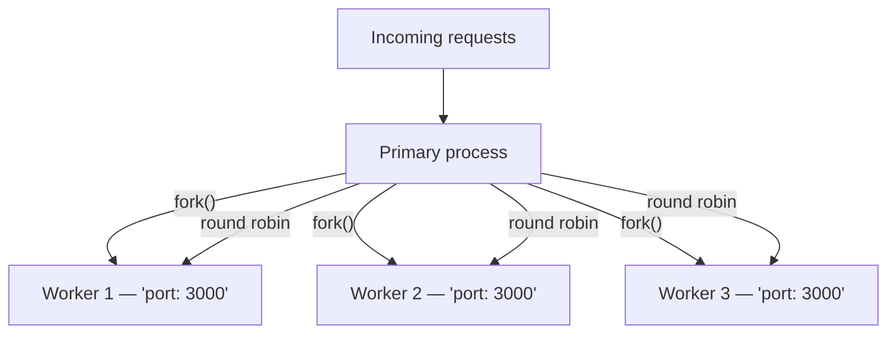

## Before you start

You need [event-loop-and-async-io](event-loop-and-async-io) first — clustering and worker threads only make sense once you understand what "blocking the single JS thread" actually means. [Scalability-and-performance](scalability-and-performance) is useful context too, since cluster is essentially horizontal scaling applied within one machine.

## In one sentence

The **cluster module** lets you run multiple copies of your whole Node.js server (one per CPU core) to handle more requests at once, while **worker threads** let you run a piece of JavaScript on a separate thread within one process, mainly to avoid blocking everything else with heavy computation.

## Why it matters

A single Node process uses only one CPU core no matter how many cores your machine has, so an 8-core server running plain Node is wasting seven of them. Clustering and worker threads are Node's two answers to "how do I use more than one core," and they solve different problems: cluster is for scaling request handling, worker threads are for not blocking the event loop with CPU-heavy work.

## The intuition

The **cluster module** forks your entire server process multiple times — typically once per CPU core. Each forked process (a **worker**) is a full, independent copy of your app, and Node's built-in load balancer distributes incoming connections across them round-robin. This is ideal for scaling a web server: more workers means more requests handled per second, and if one crashes, the others keep serving.

**Worker threads** are different: they let you run JavaScript on a separate thread inside the same process, sharing memory more directly (via `SharedArrayBuffer`) if needed. This offloads CPU-heavy work — image processing, large computations — that would otherwise block the main thread's event loop and freeze every request that process is serving.

Rule of thumb: "too many requests for one process" means cluster; "one piece of work is CPU-heavy and blocks everything else" means worker threads. They're often combined: cluster for request capacity, worker threads inside each cluster worker for heavy computation.

## How it actually works

A cluster's **primary** process doesn't handle requests itself — it forks worker processes, each a complete copy of the app, and the OS-level load balancer built into Node spreads incoming connections across them. All workers share the same listening port.



Each worker is a fully separate OS process with its own memory space and its own event loop — nothing is shared between them automatically. That isolation is a feature: if one worker crashes handling a bad request, the other workers are completely unaffected and keep serving traffic, and the primary can simply fork a replacement.

## Worked example

A cluster setup that forks one worker per CPU core:

```js
const cluster = require('cluster');
const http = require('http');
const os = require('os');

if (cluster.isPrimary) {
  const cpuCount = os.cpus().length;
  for (let i = 0; i < cpuCount; i++) cluster.fork(); // one process per core

  cluster.on('exit', (worker) => {
    console.log(`Worker ${worker.process.pid} died — restarting`);
    cluster.fork(); // keep capacity up even if a worker crashes
  });
} else {
  // each worker runs its own full copy of the server
  http.createServer((req, res) => res.end(`Handled by process ${process.pid}`)).listen(3000);
}
```

Running this and hitting the server repeatedly shows different process IDs responding — Node's load balancer is spreading requests across all CPU cores, something a single process could never do alone.

## A second example — when it gets harder

The naive assumption after seeing cluster work is "now my in-memory state is fine, I just have more capacity." That's false, and it's the single most common cluster bug — an in-memory counter or cache built assuming one process silently breaks the moment you add a second worker:

```js
// Naive: works perfectly with 1 worker, silently wrong with more than 1
const cluster = require('cluster');
const http = require('http');

if (cluster.isPrimary) {
  cluster.fork();
  cluster.fork(); // 2 workers now
} else {
  let requestCount = 0; // lives ONLY in this worker's memory

  http.createServer((req, res) => {
    requestCount++; // each worker counts its OWN requests independently
    res.end(`This worker has seen ${requestCount} requests (pid ${process.pid})`);
  }).listen(3000);
}
// Hitting the server 10 times might show counts like 1, 1, 2, 2, 3, 1, 3, 2, 4, 2 —
// never a clean 1 through 10, because requests are split across two independent counters
```

The fix requires moving shared state out of process memory entirely, into something every worker can read and write:

```js
// Fixed: shared counter lives in Redis, not in any one worker's memory
const redis = require('redis').createClient();
await redis.connect();

http.createServer(async (req, res) => {
  const count = await redis.incr('request_count'); // atomic, shared across all workers
  res.end(`Total requests across all workers: ${count} (served by pid ${process.pid})`);
}).listen(3000);
```

This is the exact same trap as horizontal scaling with a load balancer — cluster workers are separate processes, not separate threads sharing memory, so anything that needs to be consistent across requests (counters, caches, sessions, rate limits) has to live in a shared external store, never in a worker's local variables.

## Quick reference

| Aspect | Cluster module | Worker threads |
|---|---|---|
| What's duplicated | The whole process (separate memory) | Just a thread (can share memory) |
| Solves | Too many requests for one process | CPU-heavy work blocking the event loop |
| Communication | IPC (inter-process messages) | `postMessage`, or shared memory via `SharedArrayBuffer` |
| Crash impact | One worker crashing doesn't affect others | An uncaught error can be isolated per-thread |
| Typical use | Scaling an HTTP server across cores | Image resizing, hashing, parsing large files |

## Tools & frameworks

| Tool | What it's for | Reach for it when |
|---|---|---|
| [Node.js `cluster`](https://nodejs.org/api/cluster.html) | Forking processes that share one listening socket | You are scaling an I/O-bound HTTP server across cores |
| [Node.js `worker_threads`](https://nodejs.org/api/worker_threads.html) | Threads sharing memory inside one process | You have CPU-bound work that would otherwise block the event loop |
| [Piscina](https://piscinajs.dev/) | Worker-thread pool with queueing | You need a pool rather than a single worker — do not hand-roll the lifecycle |
| [PM2](https://pm2.keymetrics.io/docs/usage/quick-start/) | Process manager with a built-in cluster mode | You need production process supervision outside a container orchestrator |

The whole decision is `cluster` for I/O concurrency and `worker_threads` for CPU work; getting that backwards is the most common Node interview error.

## Common mistakes

- Assuming cluster workers share memory — they're separate processes, so an in-memory cache or counter built in one worker is invisible to the others.
- Reaching for worker threads to fix a scaling problem — that's what cluster is for; worker threads help a single heavy computation, not overall throughput.
- Forgetting to handle a cluster worker's `'exit'` event and restart it, so a crashed worker permanently reduces capacity instead of self-healing.
- Forking more cluster workers than CPU cores — beyond that point, workers compete for the same cores and throughput stops improving, or even degrades from context-switching overhead.

## What interviewers ask

- **Why would you use the cluster module for a Node.js web server?** — A single Node process only uses one CPU core; clustering forks one worker process per core so the app can handle far more concurrent requests, and Node's built-in load balancer spreads incoming connections across them automatically.
- **When would you choose worker threads over cluster?** — When the problem is a specific CPU-heavy task (like resizing an uploaded image) blocking the event loop, not a lack of request-handling capacity; worker threads offload that one task to another thread while the rest of the app keeps responding, without duplicating the entire server process.
- **Do cluster workers share memory?** — No — each cluster worker is a separate OS process with its own memory space, so they can't share in-memory state like a cache or counter directly; you'd need an external shared store (like Redis) for state that must be consistent across workers.
- **What happens if you don't offload a CPU-heavy task at all?** — It runs on the main thread and blocks the event loop, so the entire process — meaning every concurrent request that process is handling — waits until that task finishes, since there's only one thread running JavaScript in a non-worker Node process.

## Practice

1. Run the cluster worked example on your machine, hit the server several times with `curl`, and confirm you see different process IDs in the responses.
2. Reproduce the naive request-counter bug: run 2 cluster workers with a local counter, hit the server 10 times, and show that no single worker reports "10."
3. Write a worker-threads example that offloads a CPU-heavy task (like computing a large Fibonacci number) so the main thread's HTTP server stays responsive to other requests while it runs.

## Where to go next

Running multiple processes or threads changes your security surface too — more entry points, more places input can go wrong — which leads into [security-best-practices](security-best-practices), the last stop for hardening a Node.js application you've now learned to scale.
