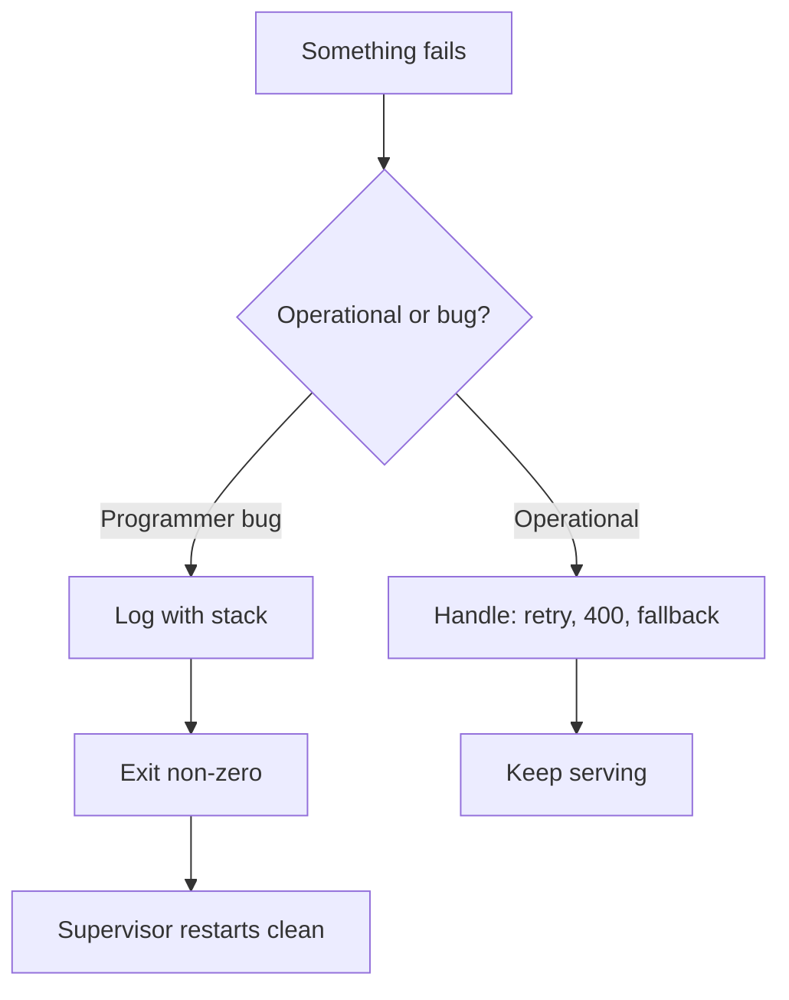

## Before you start

You need `async/await` and Promises. [event-loop-and-async-io](event-loop-and-async-io) helps, because *when* an error surfaces depends on which queue the failing code was running in.

## In one sentence

Error handling in Node is mostly one decision made over and over: is this failure something my program should expect and recover from, or is it a bug — in which case the safest thing is to crash on purpose and let a supervisor restart me clean.

## Why it matters

Node gives you exactly one process holding thousands of connections. A swallowed error there doesn't fail one request — it leaves the process running in a state you no longer understand, serving wrong data to everyone. The classic production incident is not a crash; it's a server that stayed up with a half-initialised database pool and returned `null` for six hours.

## The intuition

Split every failure into two buckets.

An **operational error** is a thing that will happen no matter how perfect your code is: the network dropped, the file wasn't there, the user sent malformed JSON, the database timed out. These are not bugs. They are the weather. You plan for them, handle them, and keep serving.

A **programmer error** is a bug: you called `undefined.name`, passed a string where a number was required, forgot to `await`. You cannot "handle" a bug — by definition you did not anticipate it, so any recovery code you write is guessing about a state you don't understand.

The rule that falls out: **handle operational errors, crash on programmer errors.** A restarted process is in a known-good state. A patched-over process is not.

## How it actually works

Node surfaces failures through three channels, and the channel decides what catches it.

Synchronous `throw` propagates up the call stack to the nearest `try/catch`. A rejected Promise propagates to the nearest `await` inside a `try/catch`, or to `.catch()`. And an **error-first callback** — the old `(err, result) => {}` convention — doesn't propagate at all; it just hands you `err` as an argument, which is precisely why it's so easy to ignore.



Two process-level events are your last line of defence. `uncaughtException` fires when a synchronous throw reaches the top of the stack, and `unhandledRejection` fires when a Promise rejects with no handler attached. Since Node 15 an unhandled rejection **terminates the process by default** — a deliberate change, because the old behaviour (print a warning, keep running) hid real bugs.

Treat both handlers as a place to log and exit, never as a place to resume. By the time they fire, the stack that failed is already unwound.

## Worked example

```js
class AppError extends Error {
  constructor(message, { status = 500, cause } = {}) {
    super(message, { cause });      // `cause` chains the original error
    this.isOperational = true;      // the flag the top level reads
    this.status = status;
  }
}

async function loadUser(id) {
  if (typeof id !== 'string') throw new TypeError('id must be a string'); // a BUG
  const user = { u1: { name: 'Ada' } }[id];
  if (!user) throw new AppError(`no user ${id}`, { status: 404 });        // EXPECTED
  return user;
}

async function handle(id) {
  try { console.log('ok:', await loadUser(id)); }
  catch (err) {
    if (err.isOperational) console.log(`handled -> ${err.status}: ${err.message}`);
    else console.log('BUG, would exit(1):', err.message);
  }
}

await handle('u1'); await handle('u2'); await handle(42);
```

Output:

```
ok: { name: 'Ada' }
handled -> 404: no user u2
BUG, would exit(1): id must be a string
```

One `catch` block, three outcomes. The missing user gives a clean 404 and the server keeps going; the bad type is a bug, so it takes a different path. The `isOperational` flag is what lets one catch site tell them apart — without it you'd be string-matching on messages.

## A second example — when it gets harder

The naive model is "wrap it in try/catch and you're safe." Here is where that fails:

```js
import { setTimeout as delay } from 'node:timers/promises';

async function broken() {
  try {
    fetchThing();           // no await — the returned Promise escapes
  } catch (err) {
    console.log('never runs:', err.message);
  }
}
async function fetchThing() { await delay(10); throw new Error('boom'); }

process.on('unhandledRejection', (e) => console.log('caught at process level:', e.message));

await broken();
console.log('broken() returned "successfully"');
await delay(50);
```

Output:

```
broken() returned "successfully"
caught at process level: boom
```

The `try/catch` never fires. `broken()` reports success. `try/catch` only catches what happens *while its block is on the stack* — a missing `await` means the function returns before the Promise settles, so by the time it rejects the `catch` is long gone.

The same trap eats `array.forEach(async ...)`, un-awaited `.map()` calls, and every un-awaited "fire and forget" call. **A floating Promise is an uncatchable error.** Either `await` it, attach `.catch()`, or hand it to `Promise.allSettled` — and turn on your linter's `no-floating-promises` rule, which catches this class mechanically.

## Quick reference

| Situation | Do this |
|---|---|
| Bad user input, 404, timeout | Operational — handle, return a 4xx/5xx, keep serving |
| `undefined is not a function` | Programmer error — log and exit non-zero |
| Rejected Promise, no handler | Node exits by default since v15; log in `unhandledRejection`, then exit |
| Error thrown inside `setTimeout` | No `try/catch` can reach it — only `uncaughtException` |
| Wrapping a lower-level failure | `new Error(msg, { cause: err })` keeps the original stack |
| Async work started without `await` | Attach `.catch()` or you cannot ever catch it |

## Common mistakes

- Writing `catch (err) {}` to make a stack trace go away — you've hidden a bug, not fixed it.
- Trying to keep running after `uncaughtException`. The state is unknown; log and exit.
- Forgetting `await`, then wondering why `try/catch` didn't fire.
- `throw`ing strings or plain objects instead of `Error` instances, which loses the stack trace entirely.
- Returning `null` on failure instead of throwing, pushing the problem to a caller who won't check.

## What interviewers ask

- **Operational vs programmer error?** — Operational is expected and recoverable (network, bad input); programmer is a bug you cannot meaningfully recover from. They're testing whether you know that "never crash" is the wrong goal — crashing cleanly beats running corrupted.
- **Why can't `try/catch` catch an async callback's error?** — The callback runs on a later tick of the event loop, long after the `try` block left the stack. Only `await` (or `.catch()`) reconnects a Promise to a `catch`.
- **What happens on an unhandled rejection?** — Since Node 15 the process terminates by default. Earlier versions only warned, which let real bugs hide in production.
- **Should you catch `uncaughtException` and keep going?** — No. Use it to log and flush, then exit; a supervisor restarts you in a known state.
- **How do you preserve the original error when re-throwing?** — Pass `{ cause: err }` to the `Error` constructor so the chain survives instead of being flattened to a message.

## Practice

1. Write `parseConfig(json)` that throws an operational error for malformed JSON but lets a genuine `TypeError` propagate untouched. Prove the difference with two calls.
2. Take `[1,2,3].forEach(async (n) => { throw new Error(n) })` — explain why no error surfaces and rewrite it so all three are collected.
3. Add `unhandledRejection` and `uncaughtException` handlers that log and exit(1), then trigger each one deliberately and confirm the exit code with `echo $?`.

## Where to go next

[testing-node-applications](testing-node-applications) — once you can classify failures, the next step is proving your code produces the right one. Then [security-best-practices](security-best-practices), since leaked error detail is a real vulnerability.
