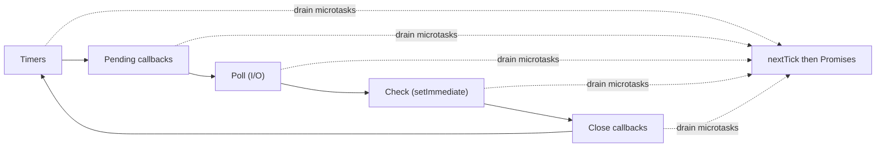

## Before you start

You should be comfortable with JavaScript functions, callbacks, and Promises — if `.then()` and `async/await` are unfamiliar, get comfortable with those first. No topic in this repo is a strict prerequisite, but this is the foundation the rest of Chapter 8 builds on.

## In one sentence

The **event loop** is the mechanism that lets Node.js — which runs your JavaScript on a single thread — still handle thousands of things at once, by handing slow work (reading a file, a network request) off to the system and running your code again only when that work finishes.

## Why it matters

If Node ran everything strictly line by line and waited for each slow operation, one slow database query would freeze your entire server for every other user. The event loop is why a single Node process can serve thousands of concurrent requests without spawning a thread per request.

## The intuition

Here's the part beginners "know" but don't really understand: Node.js is single-threaded for your JavaScript, but not single-threaded overall. A C++ library called **libuv** manages a thread pool and talks to the OS for things like file I/O and DNS lookups. Your code runs on one thread; the waiting happens elsewhere.

Think of a single chef (your one JS thread) running a kitchen. The chef doesn't stand at the oven watching a roast for two hours — they start it, walk away, and come back only when a timer goes off. Meanwhile they take other orders. The oven itself (libuv, the OS) does the actual waiting; the chef just gets notified when there's real work to do.

## How it actually works

The event loop is a cycle with distinct **phases** that Node visits in order, forever: **timers** (due `setTimeout`/`setInterval` callbacks), **pending callbacks**, **poll** (new I/O events — most work happens here), **check** (`setImmediate`), and **close callbacks**. Between every phase — and between every callback within a phase — Node drains the **microtask queue**: `process.nextTick()` callbacks first, then Promise callbacks, completely, before moving on.



This ordering — full microtask drain between every phase — is the source of nearly every "why did this print in that order" surprise in Node.

## Worked example

Run this and predict the output before reading the answer below:

```js
console.log('1: start');

setTimeout(() => console.log('2: setTimeout'), 0);

Promise.resolve().then(() => console.log('3: promise'));

process.nextTick(() => console.log('4: nextTick'));

console.log('5: end');
```

Actual output, running this in Node:

```
1: start
5: end
4: nextTick
3: promise
2: setTimeout
```

Most beginners guess `1, 2, 3, 4, 5` or `1, 5, 3, 4, 2` — both wrong. Here's why the real order happens: 1 and 5 run first because synchronous code always finishes completely before anything async runs, even a `setTimeout(fn, 0)`. Then `nextTick` (4) runs before the Promise (3), because Node fully drains `process.nextTick` callbacks before it touches the Promise/microtask queue — they're two separate queues, and `nextTick` always goes first. Only after both queues are completely empty does Node enter the timers phase and finally run the `setTimeout` (2) — proving that `setTimeout(fn, 0)` never means "immediately," it means "after this synchronous code and every microtask are done."

## A second example — when it gets harder

The naive mental model from the first example is "microtasks run once, then the timer fires." That breaks the moment a microtask schedules another microtask — which is exactly what `async/await` does under the hood:

```js
console.log('1: start');

setTimeout(() => console.log('2: timeout'), 0);

async function recurse(n) {
  if (n === 0) return;
  console.log(`3: nextTick-like microtask, n=${n}`);
  await null; // schedules a continuation as a microtask, same queue as Promise.then
  recurse(n - 1);
}
recurse(3);

console.log('4: end');
```

Running this in Node prints:

```
1: start
3: nextTick-like microtask, n=3
4: end
3: nextTick-like microtask, n=2
3: nextTick-like microtask, n=1
2: timeout
```

Every `await` schedules its continuation as a new microtask, and Node keeps draining the microtask queue — running newly-added microtasks too — until it's completely empty, no matter how many rounds that takes. Only once the queue has nothing left, at any depth, does the loop move to the timers phase and run the `setTimeout`. This is the trap: a chain of `await`s or recursive `.then()` calls can keep the event loop "stuck" in the microtask-draining step for many rounds before a single timer or I/O callback gets a turn — which is also why an infinite microtask recursion can starve I/O entirely, something an infinite `setTimeout` loop would not do.

## Quick reference

| Phase | What runs here |
|---|---|
| Timers | Due `setTimeout` / `setInterval` callbacks |
| Pending callbacks | Some system-level callbacks deferred from the previous loop |
| Poll | Fetch new I/O events; runs I/O callbacks (file reads, network) |
| Check | `setImmediate()` callbacks |
| Close callbacks | Cleanup, e.g. `socket.on('close', ...)` |
| (between every phase and callback) | Microtasks: `process.nextTick()` queue fully drained first, then the Promise queue |

## Common mistakes

- Assuming `setTimeout(fn, 0)` runs before Promises — microtasks always drain completely before the next event loop phase, including timers.
- Writing a synchronous CPU-heavy function in a request handler, which blocks every other concurrent request since there's only one JS thread.
- Confusing "asynchronous" with "parallel" — callbacks still run one at a time, never simultaneously.
- Not realizing a long chain of `await`s or recursive Promise callbacks can starve timers and I/O by keeping the loop in the microtask-draining step.

## What interviewers ask

- **Is Node.js single-threaded?** — Your JavaScript executes on one thread, but Node uses libuv's thread pool and the OS for I/O under the hood, which is why one slow database call doesn't block other requests from being handled — the answer is "single-threaded execution, multi-threaded I/O."
- **What's the difference between `process.nextTick()` and `setImmediate()`?** — `process.nextTick()` runs before any I/O event, right after the current operation, as part of the microtask draining step; `setImmediate()` runs in the check phase, after the poll phase's I/O callbacks — so despite the name, `setImmediate` typically runs later than `nextTick`.
- **Why does `setTimeout(fn, 0)` not run immediately?** — It only schedules the callback for the timers phase; it still waits for all currently-executing synchronous code and the entire microtask queue (nextTick, Promises) to finish first, so "0ms" means "as soon as possible after everything already queued," not "right now."
- **What happens if you block the event loop with a heavy synchronous loop?** — Nothing else can run — no other requests, no timers, no I/O callbacks — until that loop finishes, because there's only one thread running JavaScript; this is why CPU-heavy work belongs in a worker thread, not the main thread.
- **Can microtasks starve the event loop?** — Yes — since Node drains the microtask queue completely before moving to the next phase, code that keeps scheduling new microtasks (like unbounded recursive `.then()` calls) can delay timers and I/O indefinitely, unlike a busy `setImmediate`/`setTimeout` loop which always yields a turn to I/O.

## Practice

1. Predict the output order of a script mixing two `setTimeout(fn, 0)` calls, one `setImmediate`, and one `process.nextTick`, then run it in Node and check your answer.
2. Write a function that recursively schedules 100,000 `process.nextTick()` calls and observe what happens to a `setTimeout(() => console.log('done'), 0)` scheduled before it — explain why.
3. Take a request handler that does a heavy synchronous JSON.parse on a huge payload, and describe (without writing the fix yet) why it would slow down unrelated concurrent requests, and what the actual fix would look like.

## Where to go next

Once you understand what runs on the single JS thread versus what Node hands off, the natural next question is how Node handles *data* efficiently on that one thread — see [streams-and-buffers](streams-and-buffers). For genuinely CPU-heavy work that would block the loop no matter what, see [cluster-module-and-worker-threads](cluster-module-and-worker-threads).
