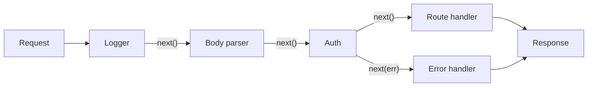

## Before you start

You need [event-loop-and-async-io](event-loop-and-async-io) and a rough idea of HTTP requests and responses. [error-handling-patterns](error-handling-patterns) makes the error-middleware section land properly.

## In one sentence

**Middleware** is a chain of small functions that each get a look at the request before it reaches your route handler — each one either does its bit and calls `next()` to pass it along, or ends the request right there.

## Why it matters

Every real server needs the same handful of things on nearly every request: log it, parse the body, check the session, set CORS headers, catch errors. Without middleware you copy that into all forty route handlers and one of them ends up missing the auth check.

Middleware turns those concerns into a pipeline you assemble once. And it produces a bug class worth understanding, because it's the one that reaches production most often: **the chain runs in the order you registered it**, so a mistake in ordering silently disables your security.

## The intuition

Picture airport security. You queue, show your boarding pass, put your bag through the scanner, walk through the metal detector, then reach the gate. Each station either waves you on or stops you.

Two properties matter. **Order is fixed** — the scanner is before the gate, always. And **any station can end your journey**: fail the metal detector and you never reach the gate, because the officer stopped you rather than passing you along.

That's exactly middleware. `next()` means "wave them through". Sending a response instead means "stopped here". Registering the metal detector after the gate means everyone boards unscanned — which is the ordering bug, precisely.



## How it actually works

Each middleware has the signature `(req, res, next)`. It can read and modify `req` and `res`, then do exactly one of three things: call `next()` to continue, send a response to stop the chain, or call `next(err)` to jump to error handling.

A middleware that neither responds nor calls `next()` **hangs the request forever** — the client sits there until it times out. That's the most common beginner bug, and it comes from an early `return` that forgets to call `next()`.

**Error middleware is different.** It takes four arguments — `(err, req, res, next)` — and that argument count is not cosmetic: it's how the framework identifies it. Express checks `fn.length === 4`. During normal flow, four-argument functions are skipped; once an error is in flight, only four-argument functions run. This is why error handlers must be registered **last**, after all routes.

In Express 5, an `async` handler that rejects forwards the error automatically. In Express 4 it does not — an unhandled rejection there hangs the request, which is why `.catch(next)` was ubiquitous in older code.

## Worked example

You don't need Express to understand this. Here's the engine itself, in plain `node:http`:

```js
import http from 'node:http';

function createApp() {
  const stack = [];
  const app = (req, res) => {
    let i = 0;
    const next = (err) => {
      const layer = stack[i++];
      if (!layer) {                             // ran off the end of the chain
        res.statusCode = err ? 500 : 404;
        return res.end(err ? 'Internal Error' : 'Not Found');
      }
      const isErrorHandler = layer.length === 4;  // THE arity check
      try {
        if (err) return isErrorHandler ? layer(err, req, res, next) : next(err);
        return isErrorHandler ? next() : layer(req, res, next);
      } catch (e) { next(e); }
    };
    next();
  };
  app.use = (fn) => { stack.push(fn); return app; };
  return app;
}

const app = createApp();
app.use((req, res, next) => { console.log('1 logger ->', req.url); next(); });
app.use((req, res, next) => {
  if (req.url === '/private') return next(new Error('not logged in')); // skip ahead
  console.log('2 auth ok'); next();
});
app.use((req, res, next) => { console.log('3 route'); res.end('hello\n'); });
app.use((err, req, res, next) => {              // 4 args = error handler
  console.log('4 ERROR handler:', err.message);
  res.statusCode = 401; res.end('Unauthorized\n');
});

const server = http.createServer(app).listen(0, async () => {
  for (const path of ['/', '/private']) {
    const r = await fetch(`http://localhost:${server.address().port}${path}`);
    console.log(`   -> ${path} responded ${r.status} ${(await r.text()).trim()}`);
  }
  server.close();
});
```

Output:

```
1 logger -> /
2 auth ok
3 route
   -> / responded 200 hello
1 logger -> /private
4 ERROR handler: not logged in
   -> /private responded 401 Unauthorized
```

Follow `/private`: the logger runs, auth calls `next(err)`, and then the route handler at position 3 is **skipped entirely** — because with an error in flight, `next(err)` walks the stack looking only for a four-argument function. That skipping is the whole mechanism behind Express error handling, and it's about fifteen lines of logic.

## A second example — when it gets harder

Now the bug that ships. Both versions look reasonable:

```js
// BROKEN — routes registered before auth
app.use(logger);
app.use('/admin', adminRoutes);   // registered FIRST, so it runs FIRST
app.use(requireAuth);             // never reached: adminRoutes already responded

// CORRECT — the gate comes before what it guards
app.use(logger);
app.use(requireAuth);
app.use('/admin', adminRoutes);
```

In the broken version `/admin` works perfectly — for everyone, logged in or not. There's no crash, no error, no failing test unless you specifically wrote one for the unauthenticated case. The endpoint just quietly has no authentication. `requireAuth` never runs because `adminRoutes` already sent the response and ended the chain.

The same trap hits error handlers: `app.use(errorHandler)` written *before* `app.use('/api', apiRoutes)` catches nothing, because `next(err)` walks *forward* through the stack. Put it first and requests hang or fall through to the framework's default handler, which leaks stack traces.

The habit that prevents both: read your `app.use` calls top to bottom as the actual order of events, because that is literally what they are. Order is: logging → body parsing → CORS → auth → routes → 404 → error handler.

## Quick reference

| Call | Effect |
|---|---|
| `next()` | Pass to the next middleware |
| `next(err)` | Skip ahead to the next 4-argument error handler |
| `res.send()` / `res.end()` | Stop the chain; request is answered |
| neither | Request hangs until the client times out |

## Tools & frameworks

| Tool | What it's for | Reach for it when |
|---|---|---|
| [Express](https://expressjs.com/) | Minimal middleware-based HTTP framework | It is the lingua franca — most interview questions assume it |
| [Fastify](https://fastify.dev/docs/latest/) | Schema-first, faster alternative | Throughput matters and you want JSON-schema validation built in |
| [Helmet](https://helmet.js.org/) | Security response headers as middleware | Any Express app — this is the two-line security baseline |
| [Hono](https://hono.dev/docs) | Small router for edge runtimes and Node | You deploy to Workers or Deno as well as Node from one codebase |

## Common mistakes

- Registering auth after the routes it's meant to protect — the endpoint silently has no auth.
- Registering the error handler first, so it catches nothing.
- Forgetting `next()`, leaving the request hanging with no error to debug.
- Calling `next()` *and* sending a response, causing "headers already sent".
- Writing an error handler with three parameters — the framework treats it as ordinary middleware and never routes errors to it.

## What interviewers ask

- **What is middleware?** — A function with access to `req`, `res`, and `next` that runs before the route handler; it can modify the request, end it, or pass it along. They want to hear "chain" and "order".
- **How does the framework know a function is an error handler?** — By its arity: four parameters instead of three. They're checking you know it's mechanical, which explains why a three-argument error handler silently never fires.
- **Why must error middleware be registered last?** — `next(err)` searches forward through the stack, so an error handler only catches errors raised by middleware registered before it.
- **What happens if middleware never calls `next()` or responds?** — The request hangs until the client times out. No error is thrown, which makes it hard to trace.
- **How would you handle an error thrown in an async handler?** — Express 5 forwards rejections automatically; in Express 4 you must `.catch(next)` or the request hangs.

## Practice

1. Extend the `createApp` example with a `requestId` middleware that attaches a `crypto.randomUUID()` to `req` and echoes it in a response header. Verify every response has one.
2. Deliberately register auth after your routes, confirm the protected route responds without credentials, then fix the order and confirm it returns 401.
3. Add a middleware that measures duration by recording `Date.now()` on the way in and logging the elapsed time — think about where in the chain it must sit to time the whole request.

## Where to go next

[typescript-in-node](typescript-in-node) — typing `req` and `res` correctly is where a lot of middleware bugs get caught at compile time. Then `authentication-authorization` in Chapter 9, which is auth middleware done properly.
