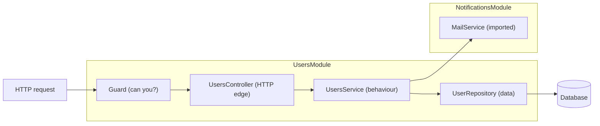
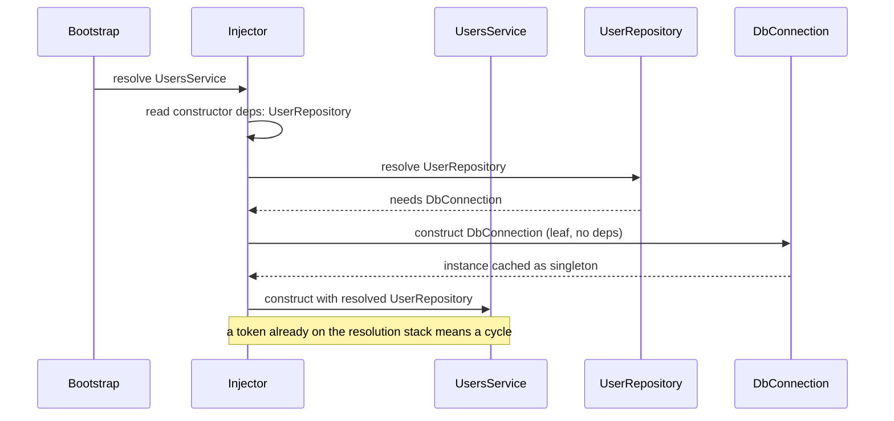

## Before you start

You need [express-and-middleware](express-and-middleware) — every NestJS concept here maps onto a middleware idea you already have. [typescript-in-node](typescript-in-node) matters too, because NestJS reads type annotations to decide what to inject. [testing-node-applications](testing-node-applications) makes the payoff section land.

## In one sentence

**Dependency injection** means a class asks for what it needs in its constructor instead of building it itself, and something else — a container — decides what to hand over; **NestJS** is a Node framework built around that idea, with an opinionated project structure on top.

## Why it matters

Take an Express app that grew. Route files `require` a database module directly. A service reaches up two directories for a config file. One handler builds its own email client because that was quickest. Nothing is wrong yet, but two things have quietly become impossible.

You cannot test anything in isolation. To test one function you have to load a real database connection, because the code that opens it is baked into the module the function imports. So people either skip the test or spin up infrastructure for it.

And nobody can see the shape of the system. To find out what the billing code touches, you read every file it imports, then every file *those* import. There is no single place that states dependencies.

DI fixes both by inverting one thing: who does the constructing. That inversion is the whole idea, and it transfers to Spring, .NET, Angular and Go frameworks. NestJS is one implementation of it, so learn the concept and the framework becomes syntax.

Worth being clear about what NestJS is *not* solving. It does not make your app faster, and it does not add capability Express lacks — it runs on Express by default. What it supplies is a shape everyone on the team recognises, so a new joiner opening an unfamiliar feature folder already knows which file holds the HTTP handling and which holds the logic. That is worth a lot on a large codebase and close to nothing on a small one, which is the honest basis for choosing it.

## The intuition

Compare hiring a contractor. The bad version: the contractor arrives, and to install a sink they go out and buy a sink, choosing the brand themselves. You wanted a different sink, but the choice was made inside the work you cannot see.

The good version: you hand them a sink. They install whatever sink you give them. Now you decide, and — the part that matters for testing — you can hand them a cardboard sink to check the plumbing fits without buying anything.

A class that calls `new PostgresClient()` inside itself is the first contractor. A class whose constructor says "give me something with a `query` method" is the second. **Inversion of control** is just that swap: the class stops controlling which concrete thing it gets, and control moves outward to a container that assembles everything.



A request enters at a controller, which does HTTP work only, and delegates to a service, which holds the behaviour, which uses a repository for data. The module is the box drawn around them: it declares which providers exist inside and which are visible outside.

## How it actually works

The container reads each class's constructor, builds whatever it asks for first, then builds the class with those instances as arguments. Since a dependency has its own dependencies, this is a depth-first walk of a graph, ending at leaves that need nothing.



Each class is identified by a **token** — usually the class itself, sometimes a string or symbol when the thing you inject is not a class (a config object, a third-party client).

The building blocks divide cleanly by job. A **provider** is anything the container can supply, and a **service** is the usual kind: plain behaviour, no HTTP knowledge. A **controller** is the HTTP edge, translating a request into a service call and a result into a response. A **module** is the composition boundary that says which providers exist and which are exported for other modules to import.

Then the cross-cutting layer, which is where your Express knowledge pays off. A **guard** answers yes or no before the handler runs, so it is auth middleware that returns 403. A **pipe** transforms or validates the incoming value, so it is a validation middleware that runs on one parameter rather than the whole request. An **interceptor** wraps the handler and sees both sides, so it is the middleware pattern where you do work before *and* after `next()` — timing, logging, response shaping. The order around a handler is guards, then pipes, then the interceptor's before-half, the handler, then the interceptor's after-half.

**Scope** is the lifetime question, and the default surprises people. Providers are **singletons**: constructed once and shared by every request for the life of the process. That is what makes them cheap — a database pool or an HTTP client is built once at boot, not per request, which is exactly what you want. It also means any mutable field on a service is shared global state. Set `this.currentUser` in one request and a concurrent request reads it, because there is only one object.

**Request-scoped** providers are built fresh per request and fix that. The cost is real in two ways. Construction moves from boot to the hot path, so anything expensive in the constructor now runs on every request. And scope is contagious upward: if a service is request-scoped, every controller and provider that injects it must be request-scoped too, since a singleton cannot hold a reference to something that changes per request. One scoped provider deep in a graph can therefore make most of that graph per-request without you asking for it.

Where does decorator magic actually come in? The container needs to know a constructor's parameter *types* at runtime, and JavaScript erases those. The framework relies on metadata that the TypeScript compiler emits for decorated classes — which is why a NestJS class needs `@Injectable()` even when it has no options, and why injecting an interface does not work: an interface does not exist at runtime, so there is no token to look up. That single fact explains most confusing DI errors.

## Worked example

The container is about forty lines. Building one shows there is no magic in the decorators.

```js
class Container {
  constructor() { this.registry = new Map(); this.instances = new Map(); }

  // deps is a list of tokens this thing needs. That list IS the wiring.
  register(token, deps, factory, { singleton = true } = {}) {
    this.registry.set(token, { deps, factory, singleton });
  }

  resolve(token, chain = []) {
    // The cycle check: is this token already being built further up the stack?
    if (chain.includes(token)) {
      throw new Error(`Circular dependency: ${[...chain, token].join(' -> ')}`);
    }
    const entry = this.registry.get(token);
    if (!entry) throw new Error(`Nothing registered for token: ${token}`);
    if (entry.singleton && this.instances.has(token)) return this.instances.get(token);
    const args = entry.deps.map((d) => this.resolve(d, [...chain, token])); // depth-first
    const instance = entry.factory(...args);
    if (entry.singleton) this.instances.set(token, instance);
    return instance;
  }
}

class Db { constructor() { this.rows = [{ id: 1, name: 'ada' }]; }
  find(id) { return this.rows.find((r) => r.id === id); } }
class UserRepo { constructor(db) { this.db = db; }   // asks for a db, never creates one
  byId(id) { return this.db.find(id); } }
class UserService { constructor(repo) { this.repo = repo; }
  greet(id) { const u = this.repo.byId(id); return u ? `hello ${u.name}` : 'not found'; } }

const c = new Container();
c.register('Db', [], () => new Db());
c.register('UserRepo', ['Db'], (db) => new UserRepo(db));
c.register('UserService', ['UserRepo'], (repo) => new UserService(repo));
c.register('RequestId', [], () => ({ id: Math.random().toString(36).slice(2, 8) }), { singleton: false });

console.log('greet    :', c.resolve('UserService').greet(1));
console.log('singleton:', c.resolve('UserService') === c.resolve('UserService'));
console.log('transient:', c.resolve('RequestId').id, c.resolve('RequestId').id);

// The payoff of DI: swap the real Db for a fake. UserRepo and UserService untouched.
const test = new Container();
test.register('Db', [], () => ({ find: () => ({ id: 1, name: 'FAKE' }) }));
test.register('UserRepo', ['Db'], (db) => new UserRepo(db));
test.register('UserService', ['UserRepo'], (repo) => new UserService(repo));
console.log('overridden:', test.resolve('UserService').greet(1));

// The classic failure: A needs B, B needs A.
const bad = new Container();
bad.register('Orders', ['Billing'], (b) => ({ b }));
bad.register('Billing', ['Orders'], (o) => ({ o }));
try { bad.resolve('Orders'); } catch (err) { console.log('boot error:', err.message); }
```

Real output:

```
greet    : hello ada
singleton: true
transient: cbm2oa nmap6w
overridden: hello FAKE
boot error: Circular dependency: Orders -> Billing -> Orders
```

Read the `overridden` line carefully — that is the entire argument for DI. `UserService` and `UserRepo` are the same classes in both containers. Only the registration changed, and now the code under test runs against a fake with no database anywhere.

The same shape in NestJS, with the container implied:

```ts
@Injectable()
export class UserService {
  constructor(private readonly repo: UserRepository) {} // the type IS the token
}

@Module({ providers: [UserService, UserRepository], controllers: [UserController] })
export class UsersModule {}

// The test override — the framework equivalent of the second container above
const moduleRef = await Test.createTestingModule({ imports: [UsersModule] })
  .overrideProvider(UserRepository)
  .useValue({ byId: () => ({ id: 1, name: 'FAKE' }) })
  .compile();
```

## A second example — when it gets harder

Two things break the naive picture. The first is **the circular dependency**. Your container caught it above, and a real one reports something similar at boot: Nest cannot resolve dependencies of a provider, often with a bare `undefined` where a class name should be, because a class was still being defined when the other referenced it.

`forwardRef()` on both sides makes it resolve, and it should be your second thought, not your first. A cycle means two modules each know about the other, which usually means a concept is in the wrong place: often a third thing both need, or one side reaching for behaviour it should have been handed. Extract the shared piece and the cycle disappears along with a design problem. When a cycle really is unavoidable, the deeper escape hatch is to stop depending at construction time and resolve lazily at call time — ask the module reference for the provider inside the method that needs it. Construction then has no cycle, because nothing needs the other side to exist yet.

The second is **the singleton with state**. Here is the trap running for real, using scopes from the container above:

```js
class CurrentUser {                          // looks harmless: one field
  setUser(name) { this.name = name; }
  get() { return this.name; }
}
c2.register('CurrentUser', [], () => new CurrentUser());                      // singleton default
c2.register('ScopedUser',  [], () => new CurrentUser(), { singleton: false }); // per resolve

function handle(token, user) {
  const ctx = c2.resolve(token);
  ctx.setUser(user);
  return ctx;   // pretend an await happens here and another request interleaves
}
const a = handle('CurrentUser', 'alice'), b = handle('CurrentUser', 'bob');
console.log('singleton  alice sees:', a.get(), '| bob sees:', b.get(), '| same object:', a === b);
const x = handle('ScopedUser', 'alice'), y = handle('ScopedUser', 'bob');
console.log('per-request alice sees:', x.get(), '| bob sees:', y.get(), '| same object:', x === y);
```

```
singleton  alice sees: bob | bob sees: bob | same object: true
per-request alice sees: alice | bob sees: bob | same object: false
```

Alice sees Bob's identity. Not a race condition you could blame on threads — a single shared object, exactly as designed, used wrongly. This is the bug behind cross-user data leaks in DI frameworks. Keep per-request data in the request object or an explicit context, or mark the provider request-scoped.

### The honest trade-offs

Do not adopt this by default. The metadata mechanism means real behaviour depends on decorators and compiler settings rather than on code you can read top to bottom, so when resolution fails the error tends to describe the container's confusion rather than your mistake. The learning curve is genuine: modules, providers, scopes and four kinds of cross-cutting hook are a lot to hold before you write a single route. Boot is heavier, because the container walks and instantiates the whole graph before the first request — usually irrelevant on a long-running server, and directly costly for a short-lived function whose startup time is on the critical path.

Plain Express or Fastify remains the better choice for a small service with a handful of routes, for anything where startup latency matters, and for a team that would rather own thirty lines of explicit wiring than learn a framework's conventions. You can also get most of the testing benefit without any framework: pass dependencies as constructor arguments and wire them in one file. That is DI. The container only starts earning its keep when hand-wiring becomes the tedious part.

## Quick reference

| NestJS piece | What it is for | Express equivalent |
|---|---|---|
| Module | Composition boundary, declares and exports providers | A folder plus a router, by convention |
| Controller | HTTP edge: parse request, call service, return result | Route handler |
| Service (provider) | Behaviour, no HTTP knowledge | A plain module you `require` |
| Guard | Allow or deny before the handler | Auth middleware returning 403 |
| Pipe | Validate or transform one input value | Validation middleware |
| Interceptor | Wraps handler, sees before and after | Middleware doing work around `next()` |
| Singleton scope (default) | One instance for the whole process | A module-level object |
| Request scope | One instance per request | Something set on `req` |

## Common mistakes

- Storing per-request data on a service field. It is a singleton, so that field is shared by every concurrent request.
- Reaching for `forwardRef()` the moment a cycle appears, instead of asking why two modules need each other.
- Instantiating a dependency inside a class that already receives one by injection, which quietly removes the test seam you were paying for.
- Treating NestJS as "Express with decorators" and putting business logic in controllers, which loses the testability that motivated the framework.
- Making one provider request-scoped without noticing that everything injecting it is now request-scoped too, and boot-time work moves onto the hot path.

## What interviewers ask

- **What is dependency injection, and what does it buy you?** — A class declares its needs in its constructor and a container supplies them. It buys substitution (swap a real dependency for a fake in a test) and visibility (the constructor is the dependency list). They want the *why*, not a definition.
- **What is inversion of control?** — Control over which concrete implementation gets used moves out of the class and into the container that assembles the graph. DI is one way to achieve it.
- **Default provider scope in NestJS, and why does it matter?** — Singleton. It matters because mutable state on a service is shared across all concurrent requests, which is a data-leak bug rather than a performance one.
- **How do guards, pipes and interceptors differ?** — A guard decides yes or no, a pipe transforms or validates a value, an interceptor wraps the handler and sees both request and response. All three are Express middleware split by responsibility.
- **When would you not use NestJS?** — Small services, a single-purpose function, or a team that wants a minimal dependency surface. The structure pays off with size; below that it is boot time and a learning curve for nothing.

## Practice

1. Extend the container so `resolve` reports the full chain for a missing token, not just the token itself. Then register a three-level graph with one typo and confirm the message points at the right place.
2. Add a `requestScope()` method that returns a child container caching instances per request while still sharing true singletons with the parent. Prove two requests get different scoped instances but the same singleton.
3. Build a deliberate two-module cycle in a real NestJS app, read the actual boot error, fix it once with `forwardRef()` and once by extracting a third module. Write down which you would defend in review.

## Where to go next

[testing-node-applications](testing-node-applications) — provider overrides are only useful if you know what to mock and what to leave real. Then [error-handling-patterns](error-handling-patterns), because a DI framework moves failures to boot time, and a container that cannot resolve a graph is a programmer error that should crash loudly rather than start half-wired.
