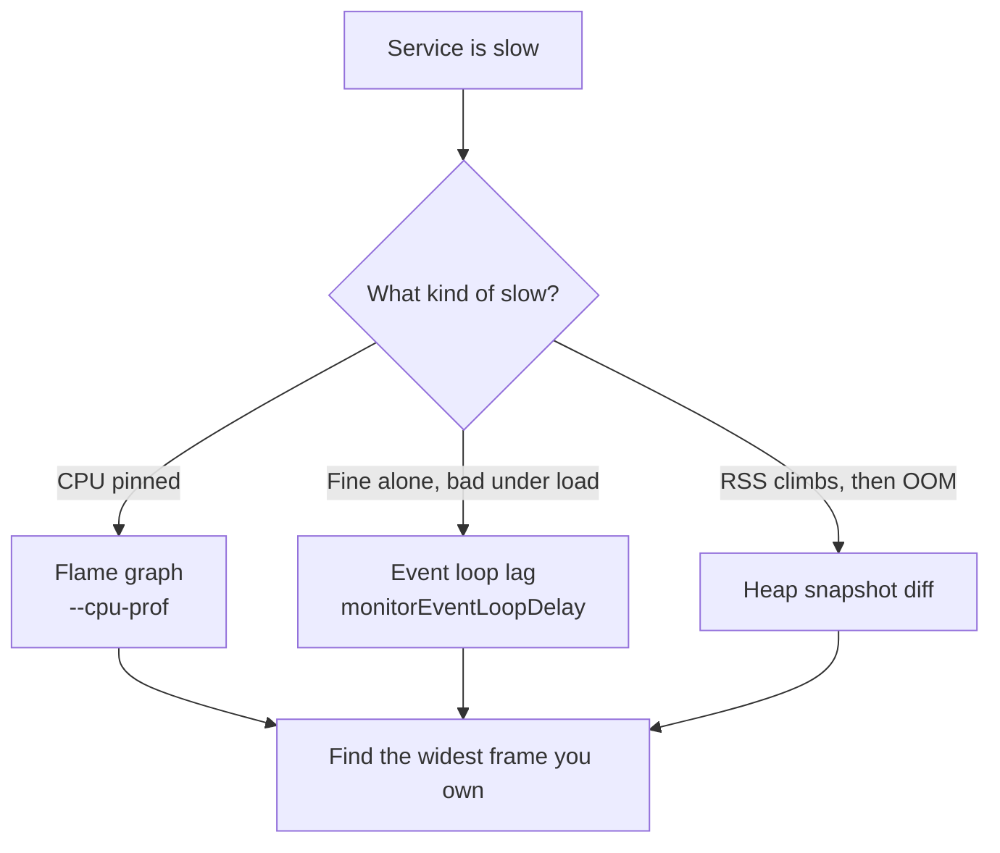

## Before you start

Read [event-loop-and-async-io](event-loop-and-async-io) first — nearly every Node performance problem is "something blocked the one thread". [v8-engine-and-garbage-collection](v8-engine-and-garbage-collection) explains the memory side.

## In one sentence

Profiling is measuring where your program actually spends its time and memory, so you fix the thing that's genuinely slow instead of the thing you assumed was slow.

## Why it matters

Developers are consistently, embarrassingly bad at guessing bottlenecks. You'll spend a day optimising a loop that accounts for 0.4% of request time while a forgotten synchronous `JSON.parse` eats 80%. Profiling replaces the guess with a measurement, and the measurement is usually surprising.

There's a second reason specific to Node: a single blocked thread degrades *every* concurrent request at once. A slow endpoint in a threaded server hurts the users who called it. A blocked event loop in Node hurts everyone.

## The intuition

You have three questions, and each has its own tool.

**"Where is CPU time going?"** → a **flame graph**. Node samples the call stack hundreds of times a second and records what was running. Stack the samples up and you get a picture: width means time. A wide bar is where your program lives.

**"Is the loop blocked?"** → **event loop lag**. Ask for a callback in 20ms and measure when it actually arrives. If it shows up at 300ms, something ran for 280ms without yielding — and every pending request waited too.

**"Is memory growing?"** → **heap snapshots**. Take one, run the workload, take another, and diff them. Whatever grew and never shrank is your leak.

The key skill is picking the right question first. Symptoms map to tools: high CPU means flame graph, slow-under-load means lag, restarts-every-few-hours means heap.



## How it actually works

**Flame graphs.** `node --cpu-prof app.js` writes a `.cpuprofile` on exit; open it in Chrome DevTools (`chrome://inspect` → Performance). Width is total time in a frame — look for the widest block *you wrote*, since wide frames in Node internals usually just mean "waiting".

**Live inspection.** `node --inspect app.js` starts the V8 inspector on `127.0.0.1:9229`. Attach Chrome DevTools or VS Code for breakpoints, CPU profiles, and heap snapshots against a running process. Never bind it publicly — it grants full code execution.

**Event loop lag.** `monitorEventLoopDelay()` from `node:perf_hooks` samples continuously into a histogram, in nanoseconds. The single most valuable Node metric to dashboard.

**Heap snapshots.** `v8.writeHeapSnapshot()` dumps the heap to a file. Load two into DevTools' Memory tab and use "Comparison" to see what was allocated and never freed.

## Worked example

Measuring event loop lag directly, with a deliberate block to see it register:

```js
import { monitorEventLoopDelay } from 'node:perf_hooks';

const h = monitorEventLoopDelay({ resolution: 10 }); // sample every 10ms
h.enable();

function blockFor(ms) {              // a synchronous CPU hog
  const end = Date.now() + ms;
  while (Date.now() < end);          // nothing else can run during this
}

setTimeout(() => blockFor(200), 50); // block the loop for 200ms

setTimeout(() => {
  h.disable();
  console.log('mean ms:', (h.mean / 1e6).toFixed(1));  // histogram is in ns
  console.log('max  ms:', (h.max / 1e6).toFixed(1));
  console.log('p99  ms:', (h.percentile(99) / 1e6).toFixed(1));
}, 400);
```

Output:

```
mean ms: 21.8
max  ms: 206.6
p99  ms: 206.6
```

The `max` of ~206ms is the 200ms block showing up almost exactly. That's the whole technique: a healthy service sits near single-digit milliseconds, and a p99 in the hundreds means requests are queueing behind something synchronous.

Watch **p99, not mean**. The mean here is 21.8ms — unremarkable, and it hides a 200ms stall completely. Averages are where outages go to hide.

## A second example — when it gets harder

A leak is harder than a stall, because nothing looks wrong for hours. Here's the shape almost every real Node leak takes:

```js
const sessions = new Map();

function onRequest(id) {
  // Written to be a cache. Nothing ever deletes. This is the bug.
  sessions.set(id, { id, data: new Array(1000).fill('x') });
}

const mb = () => (process.memoryUsage().heapUsed / 1024 / 1024).toFixed(1);

console.log('start:', mb(), 'MB');
for (let i = 1; i <= 30000; i++) {
  onRequest(`req_${i}`);
  if (i % 10000 === 0) console.log(`after ${i} requests:`, mb(), 'MB | entries:', sessions.size);
}
global.gc();                          // run with: node --expose-gc leak.mjs
console.log('after GC: ', mb(), 'MB | entries:', sessions.size, '<- GC cannot help');
```

Output:

```
start: 3.5 MB
after 10000 requests: 82.4 MB | entries: 10000
after 20000 requests: 161.1 MB | entries: 20000
after 30000 requests: 238.9 MB | entries: 30000
after GC:  236.6 MB | entries: 30000 <- GC cannot help
```

Two things matter here. Growth is **linear with traffic** and never plateaus — that's the signature of a leak, as opposed to a busy-but-healthy service whose memory rises then falls back. And the forced GC reclaims almost nothing.

That last part is the insight beginners miss: **this is not a garbage collector failure.** The GC is working perfectly. `sessions` is a live, reachable object holding every entry, so by the rules of reachability none of it is garbage. A leak in Node is almost never the collector misbehaving — it's your code keeping a reference it forgot about.

The usual culprits share this shape: a `Map` cache with no eviction, a listener added per request and never removed, a growing module-level array, or a closure capturing a large object. The fix is a bounded cache with a TTL or LRU policy. In a snapshot diff this shows as a huge retained size on `sessions`, with the retaining path leading straight to it.

## Quick reference

| Symptom | Tool | Command |
|---|---|---|
| CPU pinned at 100% | Flame graph | `node --cpu-prof app.js` |
| Slow only under load | Event loop lag | `monitorEventLoopDelay()` |
| Memory climbs until OOM | Heap snapshot diff | `v8.writeHeapSnapshot()` |
| Need to step through live code | Inspector | `node --inspect app.js` |
| Which of my functions is slow | Timing marks | `performance.now()` |

## Tools & frameworks

| Tool | What it's for | Reach for it when |
|---|---|---|
| [Node.js profiling guide](https://nodejs.org/learn/getting-started/profiling) | Built-in `--prof` and inspector workflow | Always start here — no dependency, and it usually suffices |
| [Clinic.js](https://clinicjs.org/) | Flame, bubbleprof and doctor views | You need a picture, and help choosing *which* profiler to reach for |
| [speedscope](https://github.com/jlfwong/speedscope) | Interactive flamegraph viewer | You have a `.cpuprofile` and need to actually read it |
| [Pyroscope](https://grafana.com/docs/pyroscope/latest/) | Continuous production profiling | The regression only reproduces under production traffic |
| [autocannon](https://github.com/mcollina/autocannon) | Generating the load you profile under | Profiling an idle process teaches you nothing |

## Common mistakes

- Optimising by intuition instead of measuring. The bottleneck is rarely where you think.
- Profiling in development with 10 rows of data when production has 10 million — the profile is of a different program.
- Watching averages. A good mean routinely hides a terrible p99, and users feel the p99.
- Calling a rising memory graph a leak. Node's heap grows lazily by design; only growth that survives GC and never plateaus is a leak.
- Blaming the garbage collector. If memory is retained, something in your code still references it.

## What interviewers ask

- **How would you find why a Node service is slow?** — Classify the symptom first: CPU-bound means a flame graph, slow-under-load means event loop lag, growing memory means heap snapshots. They're testing method, not tool trivia.
- **What is event loop lag and why measure it?** — The delay between when a callback was due and when it ran. It's the direct measure of "is my single thread blocked", and it degrades every concurrent request at once, so it's the number to alert on.
- **How do you find a memory leak?** — Take a heap snapshot, run the workload, take another, diff them, and look at retained size and the retaining path. The follow-up is what commonly causes leaks: unbounded caches, un-removed event listeners, and closures over large objects.
- **Why doesn't the GC free a leak?** — Because it isn't garbage. Anything reachable from a root is kept by definition; a `Map` you never delete from is a live reference, so the collector is doing its job correctly.
- **How do you read a flame graph?** — Width is time spent, stacking is call depth. Find the widest frame in your own code; wide frames in Node internals usually just mean waiting on I/O.

## Practice

1. Write an endpoint that does a synchronous `crypto.pbkdf2Sync` with a high iteration count. Measure event loop lag under 10 concurrent requests, then switch to the async `pbkdf2` and measure again.
2. Run any script with `--cpu-prof`, open the `.cpuprofile` in Chrome DevTools, and identify the widest frame you wrote.
3. Build a leak with an event listener added per request and never removed. Prove it with two heap snapshots and find the retaining path, then fix it and prove the growth stops.

## Where to go next

[cluster-module-and-worker-threads](cluster-module-and-worker-threads) — when profiling shows genuine CPU-bound work, moving it off the main thread is the fix. [streams-and-buffers](streams-and-buffers) covers the memory side of processing large payloads.
