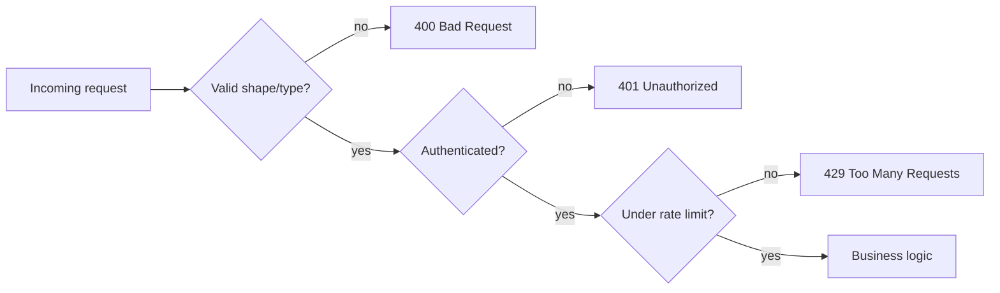

## Before you start

[Api-design](api-design) is a natural predecessor — most of these defenses sit directly on the request/response path an API already defines. No other prerequisite is required.

## In one sentence

**Security best practices** in a Node.js app are the routine defenses — validating input, hashing passwords, setting safe HTTP headers, limiting request rates — that stop the most common, well-known attacks before they become a breach.

## Why it matters

Most real-world breaches don't come from exotic zero-day exploits; they come from skipping basic, well-documented protections — an unvalidated input, a plaintext password, a missing rate limit. The **OWASP Top 10** catalogs the most common web app vulnerabilities precisely because the same handful of mistakes keep causing damage across the industry.

## The intuition

Think of these practices like locking your doors and windows rather than installing a vault — most attackers aren't targeting you specifically, they're scanning for the easiest unlocked door. A few defenses cover most of that surface.

**Input validation** means never trusting data from the client until you've checked its shape and type, because that's the entry point for injection attacks (like SQL injection, sneaking database commands into a text field). **Never store passwords in plaintext**; hash them with a slow, purpose-built algorithm like **bcrypt**, so a leaked database doesn't expose real passwords. **Rate limiting** caps how many requests a client can make in a time window, defending against brute-force login attempts and basic denial-of-service abuse. **Helmet** is an Express middleware that sets several security HTTP headers that are easy to forget individually but come as sane defaults together.

The common thread: assume every input is hostile until proven otherwise, and never store a secret in a form that's useful if stolen.

## How it actually works

A request passes through several checkpoints before it reaches your actual business logic, and each one exists to reject a different class of attack as early as possible:



Order matters here: rejecting malformed input before checking auth avoids doing expensive auth lookups on garbage requests, and rate limiting typically wraps the whole chain (or at least sensitive endpoints like login) so a flood of requests gets throttled before it can hammer any of the checks behind it. Each checkpoint fails closed — a rejection anywhere in the chain stops the request immediately rather than letting it continue with partial checks passed.

## Worked example

A minimal Express setup showing three of these defenses together:

```js
const express = require('express');
const helmet = require('helmet');
const rateLimit = require('express-rate-limit');
const bcrypt = require('bcrypt');

const app = express();
app.use(express.json());
app.use(helmet()); // sets safe security headers automatically

const loginLimiter = rateLimit({ windowMs: 15 * 60 * 1000, max: 5 }); // 5 tries per 15 min

app.post('/login', loginLimiter, async (req, res) => {
  const { username, password } = req.body;
  if (typeof username !== 'string' || typeof password !== 'string') {
    return res.status(400).json({ error: 'Invalid input' }); // reject malformed input early
  }

  const user = await findUser(username);
  // compare against the HASH, never a stored plaintext password
  const valid = user && (await bcrypt.compare(password, user.passwordHash));
  if (!valid) return res.status(401).json({ error: 'Invalid credentials' });

  res.json({ token: 'issued-here' });
});
```

Each line does one job from the list above: `helmet()` handles headers, `loginLimiter` throttles brute force, the type check rejects bad input, and `bcrypt.compare` means the real password is never stored anywhere.

## A second example — when it gets harder

The naive read of "validate input" is "check that fields exist." That's not enough — the more dangerous case is a field that exists, has the right type, but carries a value your query wasn't designed for:

```js
// Naive: checks that username is a string, but builds the query with
// string concatenation — an attacker can still inject SQL through a
// perfectly well-typed string
app.post('/login-unsafe', async (req, res) => {
  const { username, password } = req.body;
  if (typeof username !== 'string') return res.status(400).end();

  // DANGEROUS: username = "admin' --" turns this into
  // SELECT * FROM users WHERE username = 'admin' --' AND password = '...'
  // the -- comments out the password check entirely
  const query = `SELECT * FROM users WHERE username = '${username}'`;
  const user = await db.query(query);
  // ...
});

// Fixed: parameterized query — the driver treats username strictly as
// DATA, never as part of the SQL structure, no matter what characters it contains
app.post('/login-safe', async (req, res) => {
  const { username, password } = req.body;
  if (typeof username !== 'string') return res.status(400).end();

  const user = await db.query('SELECT * FROM users WHERE username = ?', [username]);
  const valid = user && (await bcrypt.compare(password, user.passwordHash));
  if (!valid) return res.status(401).json({ error: 'Invalid credentials' });
  res.json({ token: 'issued-here' });
});
```

The naive version passes every type check you'd write — `username` really is a string — but string concatenation lets that string reshape the query's actual structure. A parameterized query fixes this at the driver level: the placeholder (`?`) is always treated as a literal value, so `admin' --` gets searched for as a literal username (and fails to match), instead of being interpreted as SQL syntax. This is why "validate the type" is necessary but not sufficient — the deeper fix for injection is never building a query (or a shell command, or an HTML string) by concatenating untrusted input into it.

## Quick reference

| Threat | Defense |
|---|---|
| SQL/NoSQL injection | Validate and sanitize input; use parameterized queries, never string-concatenated ones |
| Stolen password database | Hash passwords with bcrypt/argon2, never store plaintext |
| Brute-force login attempts | Rate limiting on auth endpoints |
| Cross-site scripting (XSS) | Escape output, set a Content-Security-Policy header (Helmet does this) |
| Man-in-the-middle | Enforce HTTPS everywhere, use HSTS headers |
| Dependency vulnerabilities | Run `npm audit` and keep dependencies updated |

## Common mistakes

- Trusting `req.body` or `req.query` without validating type and shape, opening the door to injection or crashes from malformed input.
- Storing passwords with fast, general-purpose hashes like plain SHA-256 instead of bcrypt, making brute-forcing a stolen hash database far easier.
- Leaving error messages verbose in production (like a full stack trace), which hands attackers information about your internals.
- Believing type validation alone prevents injection — a well-typed string can still carry a malicious payload if it's concatenated into a query instead of passed as a parameter.

## What interviewers ask

- **Why hash passwords instead of encrypting them?** — Encryption is reversible with the right key, meaning anyone who steals both the encrypted data and the key gets the plaintext back; hashing with bcrypt is one-way and deliberately slow, so even a stolen database of hashes is expensive to crack, and you never need to "decrypt" a password anyway since you only ever compare.
- **What is SQL injection and how do you prevent it?** — It's when untrusted input is inserted directly into a query string, letting an attacker inject their own SQL logic (like `' OR '1'='1`) to bypass checks or exfiltrate data; the fix is parameterized queries or an ORM that separates query structure from data, never building queries with string concatenation.
- **What does rate limiting actually protect against?** — Brute-force attacks (guessing passwords repeatedly) and basic abuse/denial-of-service from a single source, by capping how many requests an IP or account can make in a time window before being temporarily blocked.
- **Why use Helmet instead of setting headers yourself?** — It bundles multiple well-researched security headers (like `X-Content-Type-Options`, `Content-Security-Policy` basics, disabling `X-Powered-By`) with safe defaults, so you don't have to remember and correctly configure each one individually — and it gets updated as new best practices emerge.
- **Is validating a field's type enough to prevent injection?** — No — a value can be exactly the right type and still carry a malicious payload; the real fix for injection is using parameterized queries (or equivalent APIs) so untrusted input is always treated as data, never as part of the command structure, regardless of what it contains.

## Practice

1. Take the unsafe login example and write out the exact SQL string that results from `username = "admin' --"` to see precisely how the injection bypasses the password check.
2. Add rate limiting to a hypothetical `/reset-password` endpoint, and justify your chosen window and max-attempts values.
3. List three HTTP headers Helmet sets by default and explain, in one sentence each, what attack each one mitigates.

## Where to go next

This closes the practical Node.js loop — from understanding the event loop, to using streams and buffers, to managing memory, to scaling across cores, to hardening what you've built. From here, revisit [api-design](api-design) with security in mind, since most of these defenses live directly on the API surface you design.
