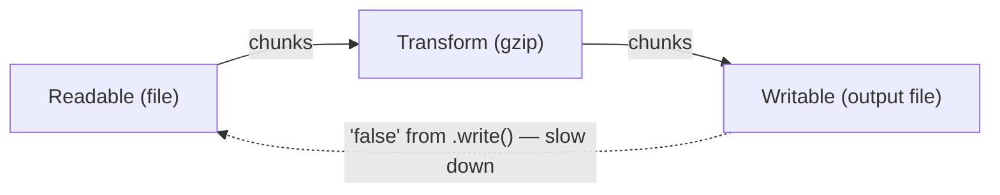

## Before you start

[Event-loop-and-async-io](event-loop-and-async-io) is the natural predecessor — streams are built entirely on the same async, event-driven model, emitting `data`, `end`, and `error` events over time instead of returning one value at once.

## In one sentence

A **buffer** is a chunk of raw binary data held in memory, and a **stream** is a way of processing data piece by piece as it arrives, instead of waiting for the whole thing to load into memory first.

## Why it matters

If you read a 2GB video file with `fs.readFileSync`, Node tries to hold all 2GB in memory at once before you can do anything with it — that can crash your process or make it painfully slow. Streams let you process data in small chunks as they flow in, so memory use stays flat regardless of whether the file is 2KB or 2GB.

## The intuition

Think of the difference like drinking from a garden hose versus receiving a swimming pool's worth of water all at once in a bucket. A buffer is the bucket — a fixed amount of data sitting fully in memory. A stream is the hose — data flows continuously, and you handle each bit as it comes.

Node has four kinds of streams: **Readable** (a source, like a file or an incoming HTTP request), **Writable** (a destination, like a file or an HTTP response), **Duplex** (both, like a TCP socket), and **Transform** (a duplex stream that modifies data in transit, like a gzip compressor).

## How it actually works

The real power move is **piping**: `readableStream.pipe(writableStream)` connects a source directly to a destination, and Node automatically handles **backpressure** — pausing the source if the destination can't keep up, so a fast reader doesn't overwhelm a slow writer.



The dotted arrow is backpressure: when the writable side's internal buffer fills up, `.write()` returns `false`, and `.pipe()` uses that signal to pause the readable source until the writable side drains and is ready for more. Without this signal, a fast producer could pile up unbounded chunks in memory waiting for a slow consumer — exactly the memory problem streams exist to avoid.

## Worked example

Copying a large file without ever loading it fully into memory:

```js
const fs = require('fs');
const zlib = require('zlib');

const readStream = fs.createReadStream('input.txt');   // Readable: emits chunks
const gzip = zlib.createGzip();                        // Transform: compresses chunks
const writeStream = fs.createWriteStream('input.txt.gz'); // Writable: consumes chunks

// pipe handles backpressure automatically — if writeStream is slow,
// readStream pauses instead of piling up chunks in memory
readStream.pipe(gzip).pipe(writeStream);

writeStream.on('finish', () => console.log('Done — compressed without loading the whole file into RAM'));
```

No matter how large `input.txt` is, memory usage stays roughly constant, because only a small chunk exists in memory at any moment as it flows through the pipeline.

## A second example — when it gets harder

The naive assumption is that `.pipe()` handles everything, including errors. It doesn't — errors do not propagate through a pipe chain, so an error on any stream in the middle needs its own handler, or the process can crash on an uncaught exception:

```js
const fs = require('fs');
const zlib = require('zlib');

// Naive: looks complete, but an error on ANY of these three streams
// is NOT forwarded to the others — only 'error' events on that specific
// stream fire, and an unhandled one crashes the process
fs.createReadStream('maybe-missing.txt')
  .pipe(zlib.createGzip())
  .pipe(fs.createWriteStream('out.gz'));

// Fixed: handle 'error' on every stream in the chain individually
function safePipeline(readPath, writePath) {
  const read = fs.createReadStream(readPath);
  const gzip = zlib.createGzip();
  const write = fs.createWriteStream(writePath);

  read.on('error', (err) => console.error('read failed:', err.message));
  gzip.on('error', (err) => console.error('gzip failed:', err.message));
  write.on('error', (err) => console.error('write failed:', err.message));

  read.pipe(gzip).pipe(write);
}

// Better: stream.pipeline() does this correctly in one call, and also
// cleans up (destroys) every stream in the chain if any one of them fails
const { pipeline } = require('stream');
pipeline(
  fs.createReadStream('maybe-missing.txt'),
  zlib.createGzip(),
  fs.createWriteStream('out.gz'),
  (err) => {
    if (err) console.error('pipeline failed:', err.message);
    else console.log('pipeline succeeded');
  }
);
```

Manually attaching `.on('error', ...)` to every stream works but is easy to forget on one link in a long chain — and a forgotten one means a missing file or a full disk crashes the whole process instead of failing gracefully. `stream.pipeline()` (or its Promise version, `stream/promises`) is the safer default: it wires up error handling and cleanup across the whole chain in one call, which is why modern Node code favors it over raw `.pipe()` chains for anything beyond a quick script.

## Quick reference

| Stream type | Direction | Example |
|---|---|---|
| Readable | Source you read from | `fs.createReadStream()`, incoming HTTP request |
| Writable | Destination you write to | `fs.createWriteStream()`, HTTP response |
| Duplex | Both read and write | TCP socket |
| Transform | Duplex that modifies data in transit | `zlib.createGzip()`, a CSV parser |

## Tools & frameworks

| Tool | What it's for | Reach for it when |
|---|---|---|
| [Node.js `stream` docs](https://nodejs.org/api/stream.html) | Readable/Writable/Transform and `pipeline` | You need the reference — and `pipeline` over `.pipe()` for error propagation |
| [undici](https://undici.nodejs.org/) | Streaming HTTP bodies without buffering | You are proxying or transforming a large response |
| [Node.js `zlib` docs](https://nodejs.org/api/stream.html) | A concrete Transform stream to study | You want a real Transform to reason about backpressure with |

The tooling story here is deliberately thin: streams are a core API, not an ecosystem.

## Common mistakes

- Using `fs.readFileSync()` or loading an entire request body into a string for large files, defeating the purpose of streaming.
- Manually piping data with `.on('data', ...)` without handling the `false` return from `.write()`, silently ignoring backpressure — `.pipe()` avoids this trap.
- Forgetting to handle the `'error'` event on every stream in a chain — `.pipe()` does not forward errors between chained streams, and an unhandled error crashes the process.
- Reaching for raw `.pipe()` chains in production code instead of `stream.pipeline()`, which handles errors and cleanup across the whole chain automatically.

## What interviewers ask

- **Why use a stream instead of reading a whole file into memory?** — Memory efficiency: a stream processes data in small chunks with roughly constant memory use, while reading the whole file loads it entirely into RAM first, which fails or slows badly on large files.
- **What is backpressure and why does it matter?** — It's the mechanism where a writable destination signals a readable source to pause when it can't keep up, preventing unbounded memory growth from unconsumed chunks piling up; `.pipe()` implements this automatically, which is why it's preferred over manually forwarding `data` events.
- **What is a Buffer in Node.js?** — A fixed-size chunk of raw binary data, used because JavaScript strings weren't originally designed to handle binary data efficiently; you see buffers when reading files, handling network protocols, or working with anything that isn't plain text.
- **When would you use a Transform stream?** — Any time you need to modify data as it passes through a pipeline without buffering the whole thing first, like compressing a file, encrypting data, or parsing a large CSV row by row.
- **Why doesn't `.pipe()` propagate errors between streams?** — By design, each stream only emits `'error'` on itself, so an unhandled error in the middle of a chain doesn't automatically stop or clean up the others; `stream.pipeline()` exists specifically to fix this by wiring error handling and cleanup across the whole chain.

## Practice

1. Write a script that reads a large text file line by line using a stream (without loading the whole file into memory) and counts the number of lines.
2. Build a small Transform stream that uppercases text passing through it, and pipe a file through it into another file.
3. Take the naive `.pipe()` chain from the second example, intentionally point it at a file that doesn't exist, and observe what happens with and without `stream.pipeline()`.

## Where to go next

Streams process data efficiently on the main thread, but they don't help if the processing itself is CPU-heavy (like parsing or compressing a huge payload) — that's when [cluster-module-and-worker-threads](cluster-module-and-worker-threads) becomes relevant. To understand what's actually happening to memory as buffers and objects get created and discarded, see [v8-engine-and-garbage-collection](v8-engine-and-garbage-collection).
