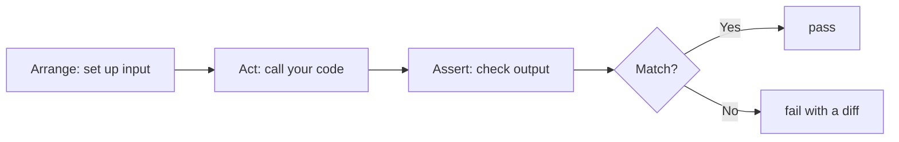

## Before you start

You need `async/await` and modules. [error-handling-patterns](error-handling-patterns) pairs well — a large share of the tests worth writing are about what happens when things fail.

## In one sentence

A test is a small program that runs your real code with known inputs and fails loudly when the output isn't what you promised — so that the thing which catches your mistake is a script, not a customer.

## Why it matters

Tests are not about proving code works today. They're about **changing it safely tomorrow**. Untested code isn't fragile because it's wrong; it's fragile because nobody dares touch it. The value shows up the day you refactor a function that eleven other files call and a green suite tells you in four seconds that you didn't break anything.

Node ships a test runner in the standard library. `node --test` — no install, no config, no framework decision to argue about.

## The intuition

Think about the difference between checking one bolt and test-driving the car.

A **unit test** checks one function in isolation: given this input, does it return that output? Fast, precise, and when it fails you know exactly which line to open.

An **integration test** drives several real pieces together — your route handler, a real router, a real database. Slower, but it catches the failures units never see: the two functions that each work perfectly and disagree about whether `userId` is a string or a number.

You need both, in that proportion. Many unit tests because they're cheap and pin down logic. Fewer integration tests because they're slow, but they're the only ones that prove the pieces actually fit.

## How it actually works

`node:test` gives you `test`, `describe`, `it`, hooks (`before`, `beforeEach`, `after`, `afterEach`), and a `mock` object. `node:assert/strict` gives you the checks. Run with `node --test`; files matching `*.test.js` are found automatically.

Every test follows the same three beats — **arrange, act, assert**. Set up the input, run the thing, check the result.



The hard question is never *how* to write a test. It's **what to mock**. The rule: mock at the boundaries you don't own — the network, the clock, the payment provider, the filesystem — and never mock your own internals. A test that mocks the function next door stops testing behaviour and starts testing your current implementation, so it breaks on every refactor while catching no real bugs.

## Worked example

```js
// cart.test.js  —  run with: node --test
import { test, describe } from 'node:test';
import assert from 'node:assert/strict';

function cartTotal(items, taxRate = 0) {
  if (!Array.isArray(items)) throw new TypeError('items must be an array');
  const sub = items.reduce((sum, i) => sum + i.price * i.qty, 0);
  return Math.round(sub * (1 + taxRate) * 100) / 100;  // avoid float drift
}

describe('cartTotal', () => {
  it('sums price times quantity', () =>
    assert.equal(cartTotal([{ price: 10, qty: 2 }, { price: 5, qty: 1 }]), 25));

  it('applies tax and rounds to cents', () =>
    assert.equal(cartTotal([{ price: 9.99, qty: 1 }], 0.2), 11.99));

  it('treats an empty cart as zero', () => assert.equal(cartTotal([]), 0));  // edge case

  it('rejects a non-array', () => assert.throws(() => cartTotal('nope'), TypeError));
});
```

Output:

```
✔ cartTotal > sums price times quantity
✔ cartTotal > applies tax and rounds to cents
✔ cartTotal > treats an empty cart as zero
✔ cartTotal > rejects a non-array
# pass 4
# fail 0
```

Four tests, four distinct claims. Note the third and fourth — the empty cart and the wrong type are where bugs actually live. A suite that only checks the happy path tells you almost nothing.

## A second example — when it gets harder

Now the two things beginners get stuck on: async code, and code that talks to the outside world.

```js
// order.test.js  —  run with: node --test
import { test } from 'node:test';
import assert from 'node:assert/strict';

// Dependencies arrive as arguments — that is what makes this testable.
async function placeOrder(order, { charge, now }) {
  if (order.total <= 0) throw new Error('invalid total');
  const receipt = await charge(order.total);
  return { id: receipt.id, at: now().toISOString() };
}

test('places an order without touching the real payment API', async (t) => {
  // Mock the BOUNDARY (payments), not our own logic.
  const charge = t.mock.fn(async () => ({ id: 'rcpt_1' }));
  const now = () => new Date('2026-01-01T00:00:00Z'); // freeze time

  const result = await placeOrder({ total: 42 }, { charge, now });

  assert.deepEqual(result, { id: 'rcpt_1', at: '2026-01-01T00:00:00.000Z' });
  assert.equal(charge.mock.callCount(), 1);          // called exactly once
  assert.deepEqual(charge.mock.calls[0].arguments, [42]); // with the right amount
});

test('rejects a zero total', async () => {
  const charge = () => { throw new Error('should never be called'); };
  await assert.rejects(
    placeOrder({ total: 0 }, { charge, now: () => new Date() }),
    /invalid total/
  );
});
```

Output:

```
✔ places an order without touching the real payment API
✔ rejects a zero total
# pass 2
# fail 0
```

Three things do real work. `await assert.rejects(...)` is how you assert on a *rejected* Promise — `assert.throws` cannot see one, and forgetting the `await` makes the test pass whatever happens. Freezing `now` makes the assertion deterministic; a test reading the real clock fails at midnight. And the mock lets you assert on the *call* — payment charged once, for 42 — often more valuable than the return value.

The real lesson is the signature: `placeOrder` takes `charge` and `now` as arguments instead of importing them. That single choice makes it testable at all — **hard-to-test code is usually badly-coupled code**, and the test is telling you so.

## Quick reference

| Assertion | Use it for |
|---|---|
| `assert.equal(a, b)` | Primitives (strict `===` in `assert/strict`) |
| `assert.deepEqual(a, b)` | Objects and arrays, compared by structure |
| `assert.throws(fn, Err)` | Synchronous code that must throw |
| `await assert.rejects(p, Err)` | A Promise that must reject — note the `await` |
| `t.mock.fn()` | A stand-in function that records its calls |
| `t.mock.method(obj, 'name')` | Spy on a real method; auto-restored after the test |

## Common mistakes

- Forgetting `await` on `assert.rejects` — the assertion never runs and the test passes green while proving nothing.
- Mocking internal modules, producing tests that break on every refactor and catch no real bugs.
- Testing implementation details ("calls `_helper` twice") instead of behaviour ("returns 25").
- Tests that depend on each other's leftover state, so they pass in order and fail in isolation.
- Using the real clock, real randomness, or the real network — all three make tests flaky.

## What interviewers ask

- **Unit vs integration test?** — A unit tests one piece in isolation (fast, precise failures); integration tests several real pieces together (slow, but catches interface mismatches). They want to hear you use both, weighted toward units.
- **What should you mock?** — Boundaries you don't own: network, clock, third-party services. Never your own internals, or the test just mirrors the implementation.
- **How do you test that an async function rejects?** — `await assert.rejects(fn(), /message/)`. The follow-up is always "what if you forget the `await`" — the test passes regardless, which is why it's a favourite trick question.
- **Is 100% coverage a good goal?** — No. Coverage measures execution, not verification. High coverage with weak assertions is worse than honest 70% because it manufactures false confidence.
- **What makes a test flaky, and why does it matter?** — Real time, real network, shared state, or ordering assumptions. Flaky tests are worse than no tests: people learn to re-run until green and stop believing failures.

## Practice

1. Write `slugify(title)` (lowercase, spaces to hyphens, strip punctuation) and test it — include an empty string, a string of only punctuation, and one with accented characters.
2. Write `retry(fn, attempts)` that retries a failing async function. Test it with a `t.mock.fn()` that fails twice then succeeds, and assert the call count is exactly 3.
3. Take a function that calls `fetch` directly and refactor it to receive its HTTP client as a parameter. Write the test that was impossible before, and note what changed in the signature.

## Where to go next

[performance-profiling](performance-profiling) — tests prove code is *correct*; profiling tells you whether it's *fast enough*. [express-and-middleware](express-and-middleware) then gives you a real request pipeline worth integration-testing.
