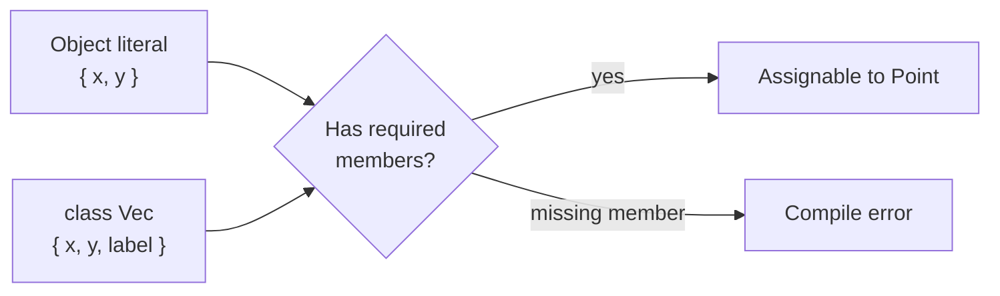

## Before you start

You need solid JavaScript. [testing-node-applications](testing-node-applications) is a useful companion — types and tests catch different bugs, and knowing which does what saves effort.

## In one sentence

**TypeScript** is JavaScript with type annotations that a compiler checks before your code ever runs, catching a whole class of mistakes — wrong argument, misspelled property, forgotten `null` case — at the moment you type them rather than at 3am in production.

## Why it matters

Types are documentation that cannot go stale. A function signature tells the next developer exactly what to pass and what comes back, and unlike a comment, the compiler enforces it.

The bigger payoff is refactoring. Rename a field on a widely-used object in plain JavaScript and you're grepping and praying. Do it in TypeScript and the compiler hands you the complete list of every place that breaks, in seconds. That's the difference between a codebase you can change and one you're afraid of.

Modern Node runs `.ts` files directly by stripping types — `node app.ts` works, no build step for simple cases. Types are erased at runtime; they check your code, they don't ship with it.

## The intuition

The one idea that explains most TypeScript surprises: it checks **shape, not name**.

Most typed languages you may have heard of are *nominal* — a `Duck` is a `Duck` because someone wrote `class Duck`. TypeScript is **structural**: if a value has the right properties with the right types, it fits, regardless of what it's called or where it came from. If it walks like a duck, it *is* a duck, as far as the compiler is concerned.

This fits JavaScript, where you constantly pass around anonymous object literals that no one declared a class for. It also explains why an object literal you invented on the spot satisfies an `interface` it has never heard of.



## How it actually works

An **interface** or **type** describes a shape. Anything with at least those members is assignable to it — extra properties are fine when the value arrives through a variable.

**Generics** let a function work over many types while keeping the relationship between input and output. `function first<T>(items: T[]): T | undefined` says "whatever type goes in, that same type comes out". Without the generic you'd write `any[]` and lose the type entirely, or write the function once per type.

Generics earn their keep only when there's a genuine **link** between types — input to output, or between two parameters. A generic with one parameter used once is usually just a complicated way of writing `unknown`.

Then the pair that matters most for real safety. **`any`** turns off type checking completely; the compiler stops looking. **`unknown`** is the honest version: you can hold anything, but you must narrow it — with `typeof`, a check, or a validator — before you touch it. `unknown` means "I don't know yet"; `any` means "stop asking".

## Worked example

Run this with `node structural.ts` — Node strips the types and executes it:

```ts
interface Point { x: number; y: number }

function dist(p: Point): number {
  return Math.sqrt(p.x ** 2 + p.y ** 2);
}

// A class that has never heard of Point, and does not implement it.
class Vec {
  x: number; y: number; label: string;
  constructor(x: number, y: number) { this.x = x; this.y = y; this.label = 'v'; }
}

console.log('object literal:', dist({ x: 3, y: 4 }));  // fits by shape
console.log('unrelated class:', dist(new Vec(6, 8)));  // also fits, extra prop ok

function first<T>(items: T[]): T | undefined { return items[0]; }

console.log(first(['a', 'b']), first<number>([]));
```

Output:

```
object literal: 5
unrelated class: 10
a undefined
```

`Vec` never declares `implements Point`, yet it's accepted — it has an `x` and a `y` of the right types, so structurally it *is* a `Point`. The extra `label` doesn't matter.

`first` shows the generic paying off. `first(['a','b'])` is inferred as `string | undefined`, and `first<number>([])` as `number | undefined`. The `| undefined` is the compiler forcing you to handle the empty-array case — the exact bug that becomes "cannot read property of undefined" at runtime.

## A second example — when it gets harder

Here's the misunderstanding that causes real production incidents: **types do not exist at runtime.**

```ts
async function loadUserUnsafe(res: Response): Promise<{ id: number }> {
  return await res.json() as { id: number };   // a lie the compiler believes
}
```

`res.json()` returns `any`, and that `as` is an assertion — you telling the compiler "trust me" — which performs zero checking. If the API returns `{"id": "42"}` as a string, TypeScript is perfectly happy and your code does arithmetic on a string.

**Every value crossing a boundary — HTTP body, database row, env var, message queue — is `unknown` until you validate it.** Types check your code; they cannot check the network.

```js
// The honest version. Runs as-is with: node validate.mjs
function parseUser(input) {
  if (typeof input !== 'object' || input === null) throw new TypeError('not an object');
  const o = input;
  if (typeof o.id !== 'number')    throw new TypeError(`id: expected number, got ${typeof o.id}`);
  if (typeof o.email !== 'string') throw new TypeError(`email: expected string, got ${typeof o.email}`);
  return { id: o.id, email: o.email };   // now genuinely trustworthy
}

for (const raw of ['{"id":1,"email":"a@b.com"}', '{"id":"1","email":"a@b.com"}']) {
  try   { console.log('ok  ->', parseUser(JSON.parse(raw))); }
  catch (e) { console.log('rejected ->', e.message); }
}
```

Output:

```
ok  -> { id: 1, email: 'a@b.com' }
rejected -> id: expected number, got string
```

The second payload is rejected at the boundary with a precise message. In TypeScript you'd type the parameter as `unknown` and give the function a return type of `User`, making it a **type guard**: `unknown` goes in, a verified `User` comes out, and everything downstream is safe for real rather than by assertion. Libraries like Zod automate this, but the principle is what matters — validate at the edge, trust inside.

## Quick reference

| Feature | Use it for |
|---|---|
| `interface` / `type` | Describing a shape; anything matching it is assignable |
| `unknown` | Untrusted input you must narrow before using |
| `any` | Escape hatch — avoid; it silently disables checking |
| `T[]` generic | Preserving the input type through to the output |
| `as X` | An unchecked assertion — a promise you make, not a check |
| `strict: true` | The setting that makes `null` handling real |

## Common mistakes

- Using `as` to silence an error. The error was information; the assertion just hides it.
- Sprinkling `any` to make the compiler quiet, which forfeits the entire benefit.
- Trusting `res.json()` or a database row as typed. Both are `any` at runtime — validate them.
- Not enabling `strict`. Without `strictNullChecks`, TypeScript misses the single most common JavaScript crash.
- Writing generics with no relationship between the type parameters — complexity with no payoff.

## What interviewers ask

- **What is structural typing?** — Compatibility is decided by shape, not by declared name or inheritance. They want to know why an object literal satisfies an interface it never declared.
- **`unknown` vs `any`?** — Both hold any value, but `unknown` forbids using it until you narrow it, while `any` disables checking entirely. `unknown` is the safe choice for external input; this is the most common TypeScript interview question.
- **Do types exist at runtime?** — No. They're erased during compilation, which is exactly why data crossing a network boundary needs runtime validation.
- **When is a generic worth it?** — When it preserves a relationship between types, like input array to output element. If the parameter appears only once, you probably wanted `unknown`.
- **Why is `as` dangerous?** — It's an unchecked assertion, not a conversion. You override the compiler with a claim it can't verify, so a wrong claim fails silently at runtime.

## Practice

1. Write `pick<T, K extends keyof T>(obj: T, keys: K[])` returning only those keys, and confirm the compiler rejects a key that doesn't exist on the object.
2. Take a function accepting `any` from an HTTP body, change the parameter to `unknown`, and fix every resulting compile error with real narrowing. Note how many latent bugs surface.
3. Write a type guard `isUser(value: unknown): value is User` and use it to safely handle a `JSON.parse` result, including the case where the JSON is a bare array.

## Where to go next

`api-versioning` in Chapter 9 — once your types describe an API contract, the next problem is changing that contract without breaking callers. [error-handling-patterns](error-handling-patterns) pairs naturally, since validation failures at a boundary are textbook operational errors.
