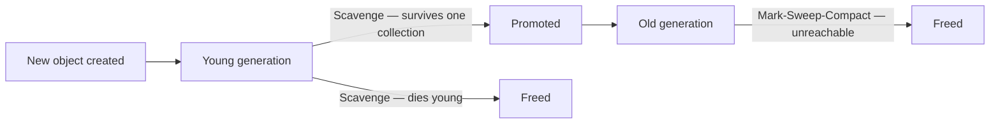

## Before you start

[Streams-and-buffers](streams-and-buffers) is a useful predecessor, since streams exist partly to avoid creating large objects that the garbage collector then has to deal with all at once. No other prerequisite is required.

## In one sentence

**V8** is the engine (originally built for Chrome) that actually runs your JavaScript in Node.js, and **garbage collection** is V8 automatically finding and freeing memory used by objects your code no longer needs, so you don't have to manually manage memory.

## Why it matters

Without garbage collection, you'd have to manually track every object you create and free it yourself, like in C — get it wrong and you get memory leaks or crashes from using freed memory. V8's garbage collector does this automatically, but understanding roughly how it works explains real production problems: why your Node process's memory keeps climbing, or why it occasionally pauses.

## The intuition

V8 splits memory into two areas. The **stack** holds simple values and function call frames — fast, small, cleaned up automatically when a function returns. The **heap** holds objects, arrays, closures — anything that needs to outlive the function that created it. Garbage collection is entirely a heap concern.

Think of the heap like an office that hires a lot of short-term interns (objects) and a few permanent staff (long-lived objects). Most interns finish their project and leave quickly, so it's cheap to check the intern desks often. The people who stick around get moved to a permanent desk, which you check on less often because turnover there is rare. Checking the intern desks constantly and the permanent desks rarely is far more efficient than treating everyone the same.

## How it actually works

V8's garbage collector is generational, based on the observation that most objects die young. The heap has a small **young generation** for freshly created objects, collected frequently with a fast algorithm called **Scavenge**. Objects that survive get promoted to the **old generation**, collected less often using the slower but thorough **Mark-Sweep-Compact** — it walks from known root references, marks everything still reachable, and frees the rest.



A **memory leak** in Node.js almost always means you're accidentally keeping a reference alive that should be dead — a growing array you never clear, an event listener never removed, or a cache map with no expiry. The garbage collector isn't broken here; it's correctly refusing to free memory you're technically still referencing. This is the single most important thing to internalize: GC frees unreachable memory, not "memory you're done with" — if your code can still reach it, V8 will not touch it, no matter how obviously unused it looks to you.

## Worked example

A classic Node.js leak — an array that grows forever because nothing ever removes old entries — and how to see it:

```js
const cache = []; // never cleared — this is the leak

function handleRequest(data) {
  cache.push(data); // grows forever; V8 can never collect these objects
  return cache.length;
}

// Simulate traffic
for (let i = 0; i < 5; i++) handleRequest({ id: i, payload: 'x'.repeat(1000) });

console.log(process.memoryUsage().heapUsed, 'bytes used by the heap');
// heapUsed climbs every call and never comes back down —
// V8 correctly keeps every object alive because `cache` still references them
```

`process.memoryUsage().heapUsed` is the first thing to check when you suspect a leak — if it only ever goes up under steady load, something is holding references it shouldn't.

## A second example — when it gets harder

The array-that-never-clears leak above is easy to spot by reading the code. A harder, more realistic leak hides inside a closure, where the retained reference isn't obvious from looking at the function that uses it:

```js
function createHandlers() {
  const bigData = new Array(100_000).fill('x'); // sizable, meant to be temporary

  return {
    // this function uses bigData, so its closure keeps bigData alive —
    // as long as ANY reference to this function exists, bigData can't be collected
    getFirst: () => bigData[0],
    // this function looks unrelated, but it shares the SAME closure scope,
    // so it also keeps bigData reachable even though it never touches it
    getName: () => 'handler',
  };
}

const handlers = [];
for (let i = 0; i < 50; i++) {
  handlers.push(createHandlers()); // each one drags its own bigData along, forever, via getName
}

console.log(process.memoryUsage().heapUsed, 'bytes — all 50 bigData arrays are still reachable');
```

The surprise: `getName` never references `bigData`, but because it's defined in the same closure scope as `getFirst` (which does reference `bigData`), V8 keeps the entire scope — including `bigData` — alive for as long as either function might be called. Holding onto `handlers` (and therefore every `getName`) transitively keeps every one of those arrays alive, with nothing in the code visibly "using" them anymore. This is why memory leaks in real apps are often found with heap snapshots rather than code review — the retaining reference is frequently several closures or objects removed from the data that's actually piling up.

## Quick reference

| Concept | What it means |
|---|---|
| Stack | Fast memory for function calls and simple values; auto-freed on return |
| Heap | Memory for objects/arrays/closures; managed by the garbage collector |
| Young generation (new space) | Where new objects are created; collected often (Scavenge) |
| Old generation | Where long-lived objects end up; collected less often (Mark-Sweep-Compact) |
| Memory leak | Objects kept reachable (by a reference you forgot about) so GC can't free them |

## Tools & frameworks

| Tool | What it's for | Reach for it when |
|---|---|---|
| [Node.js profiling guide](https://nodejs.org/learn/getting-started/profiling) | Heap snapshots and `--inspect` | You are diagnosing a leak — compare two snapshots, never one |
| [Node.js `perf_hooks`](https://nodejs.org/api/perf_hooks.html) | GC performance entries | You need pause duration and frequency, measured |
| [Clinic.js](https://clinicjs.org/) | Memory and GC visualisation | You want the heap growth curve rather than raw numbers |
| [Node.js diagnostics WG](https://github.com/nodejs/diagnostics) | Diagnostic tooling and best practices | You are choosing between the many overlapping diagnostic options |

Every tool here is diagnostic: this is a "read the runtime" topic with no framework to recommend, which is itself worth knowing.

## Common mistakes

- Adding event listeners repeatedly without ever calling `.off()`/`.removeListener()`, silently accumulating references that keep old objects alive.
- Using a plain object or Map as an unbounded cache with no TTL or size limit — the garbage collector won't "clean it up" because the cache itself is a live reference.
- Assuming a rising `heapUsed` always means a leak — GC is lazy by design, so short-term growth followed by a drop is normal.
- Assuming a closure only keeps alive the variables it directly uses — sibling functions sharing the same scope keep everything in that scope reachable, not just what each one touches.

## What interviewers ask

- **Why does V8 use a generational garbage collector instead of scanning the whole heap every time?** — Most objects are short-lived, so scanning only the small young generation frequently is much cheaper than scanning the entire heap; only survivors get promoted to the less-frequently-scanned old generation, matching effort to actual object lifetime.
- **What causes a memory leak in a Node.js app if there's a garbage collector?** — A leak means your code still holds a reachable reference to something it no longer needs — an ever-growing array, an uncleaned interval, or unremoved event listeners — so the GC is correctly refusing to free memory that's technically still in use.
- **How would you debug high memory usage in a running Node process?** — Take heap snapshots at two points in time under load and diff them to see which object types are growing, combined with watching `process.memoryUsage()` over time to confirm heap usage trends upward instead of stabilizing.
- **What's the difference between a memory leak and normal garbage collection pauses?** — GC pauses are brief and recover memory, then usage drops; a leak climbs steadily and never drops, because the leaked objects are still reachable and therefore ineligible for collection.
- **Can a closure cause a memory leak even if you don't reference the "big" variable directly?** — Yes — functions that share a lexical scope share the same closure, so a small function can keep a large object alive simply by being defined alongside a function that uses it, even if the small function itself never touches that object.

## Practice

1. Run the first worked example, then add a fix that caps `cache` at 100 entries (evicting the oldest), and confirm `heapUsed` stabilizes instead of climbing.
2. Using `node --expose-gc`, call `global.gc()` between iterations of a loop that creates and discards large temporary arrays, and observe how `heapUsed` behaves with and without the manual GC call.
3. Take the closure example and restructure `createHandlers` so `getName` no longer shares scope with `bigData` — verify (by reasoning, or a heap snapshot) that this removes the incidental retention.

## Where to go next

Understanding memory pressure on a single thread naturally leads to [cluster-module-and-worker-threads](cluster-module-and-worker-threads) — running multiple processes or threads changes how memory (and garbage collection) is distributed across a Node application, since each process gets its own separate heap.
