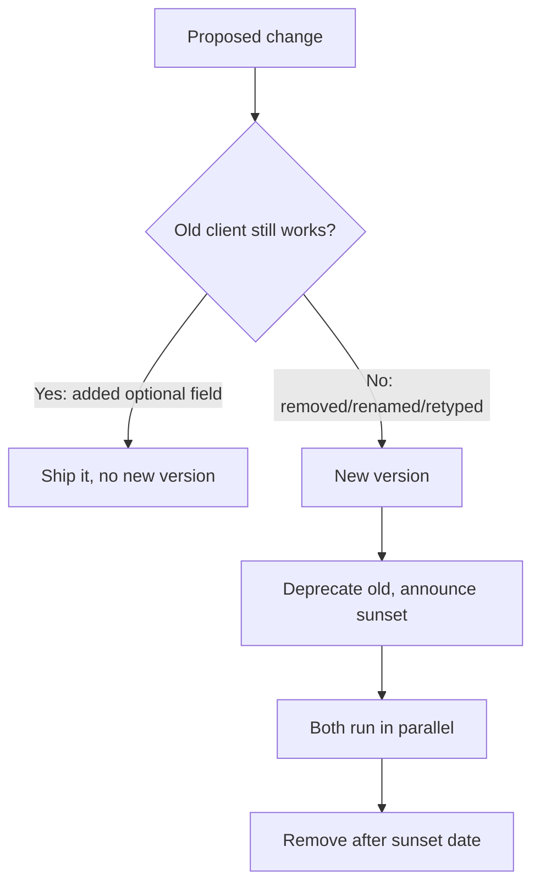

## Before you start

You need HTTP basics — methods, status codes, headers. `authentication-authorization` is useful context, since auth changes are among the most painful things to version.

## In one sentence

API versioning is how you change an API that other people's code depends on, without that code breaking the moment you deploy.

## Why it matters

The instant someone else calls your API, you no longer control when their code changes. A mobile app in the App Store may run your v1 contract for years — users don't upgrade, and you can't make them.

So you get one rule: **you cannot break existing clients**. Remove a field and someone's checkout flow crashes. Rename one and a partner's nightly sync fails silently at 2am. Versioning is the discipline that lets your API keep evolving anyway.

## The intuition

The useful mental split is **additive vs subtractive**.

Adding a new optional field is safe. Old clients ignore what they don't recognise, new clients use it. Nobody breaks.

Removing a field, renaming one, changing its type, tightening validation, or adding a required parameter is **subtractive**, and every one of those breaks somebody. `{"name": "Ada Lovelace"}` becoming `{"firstName": "Ada", "lastName": "Lovelace"}` looks like an improvement and is a breaking change — every client reading `.name` now gets `undefined`.

Ask one question before every change: *if a client written a year ago sends its old request and reads the response the old way, does it still work?* Yes means ship it. No means it needs a version.



## How it actually works

Two mainstream strategies.

**URL versioning** puts the version in the path: `/v1/users`, `/v2/users`. It's visible, trivially testable in a browser or curl, and obvious in logs. Purists object that the URL should identify the resource — and the resource didn't change, only its representation — but it's the most common approach because it's the most operationally obvious.

**Header versioning** keeps one URL and selects the version with a request header, either a custom `API-Version: 2` or content negotiation via `Accept: application/vnd.myapi.v2+json`. Cleaner in theory, and it lets you version individual resources independently. In practice it's easier to get wrong: it's invisible in logs, awkward to test by hand, and clients forget to send it — so you must define a sensible default.

Whichever you pick, **retiring** a version follows the same path. Announce it, serve `Deprecation` and `Sunset` response headers so clients learn from the API itself (both are standardised — RFC 9745 and RFC 8594), monitor who's still calling, contact them, and only then remove it. The rule most teams learn painfully: **never remove a version you can still see traffic on.**

## Worked example

A server implementing both strategies at once, with proper deprecation signalling:

```js
import http from 'node:http';

const user = { id: 7, firstName: 'Ada', lastName: 'Lovelace', email: 'ada@example.com' };

// v1 exposed a single `name`. v2 split it — a BREAKING change.
const shapes = {
  1: (u) => ({ id: u.id, name: `${u.firstName} ${u.lastName}`, email: u.email }),
  2: (u) => ({ id: u.id, firstName: u.firstName, lastName: u.lastName, email: u.email }),
};
const LATEST = 2, SUPPORTED = [1, 2];

function pickVersion(req) {
  const m = req.url.match(/^\/v(\d+)\//);          // 1. URL wins if present
  if (m) return Number(m[1]);
  const h = req.headers['api-version'];            // 2. else the header
  return h ? Number(h) : LATEST;                   // 3. else a defined default
}

const server = http.createServer((req, res) => {
  const v = pickVersion(req);
  if (!SUPPORTED.includes(v)) {
    res.writeHead(400, { 'content-type': 'application/json' });
    return res.end(JSON.stringify({ error: `unsupported version ${v}`, supported: SUPPORTED }));
  }
  const headers = { 'content-type': 'application/json', 'api-version': String(v) };
  if (v < LATEST) {
    headers['deprecation'] = '@1767225600';                    // RFC 9745: a timestamp
    headers['sunset'] = 'Wed, 01 Jul 2026 00:00:00 GMT';       // RFC 8594: when it dies
  }
  res.writeHead(200, headers);
  res.end(JSON.stringify(shapes[v](user)));
});
```

Output when called five ways:

```
v1 URL path -> 200 dep=@1767225600 {"id":7,"name":"Ada Lovelace","email":"ada@example.com"}
v2 URL path -> 200 dep=- {"id":7,"firstName":"Ada","lastName":"Lovelace","email":"ada@example.com"}
header v1   -> 200 dep=@1767225600 {"id":7,"name":"Ada Lovelace","email":"ada@example.com"}
no version  -> 200 dep=- {"id":7,"firstName":"Ada","lastName":"Lovelace","email":"ada@example.com"}
v9 bad      -> 400 dep=- {"error":"unsupported version 9","supported":[1,2]}
```

Four things worth noticing. The v1 client keeps working unchanged — the whole point. Deprecated responses carry machine-readable headers, so clients warn without a human reading a changelog. An unknown version fails fast listing what's supported, rather than a confusing 404. And unversioned requests get a **defined** default.

## A second example — when it gets harder

Maintaining two full code paths is the naive approach, and it doesn't survive v3, v4, v5 — you end up with five copies of your business logic and bugs fixed in only three.

The pattern that scales: **one internal model, thin translation at the edges.**

```js
// ONE canonical shape. All business logic uses only this.
const canonical = { id: 7, firstName: 'Ada', lastName: 'Lovelace', email: 'ada@example.com' };

// Versions are pure presentation functions applied on the way out.
const present = {
  1: (u) => ({ id: u.id, name: `${u.firstName} ${u.lastName}`, email: u.email }),
  2: (u) => ({ id: u.id, firstName: u.firstName, lastName: u.lastName, email: u.email }),
};

console.log(present[1](canonical));
console.log(present[2](canonical));
```

Output:

```
{ id: 7, name: 'Ada Lovelace', email: 'ada@example.com' }
{ id: 7, firstName: 'Ada', lastName: 'Lovelace', email: 'ada@example.com' }
```

Now a bug fix or new feature is written once against the canonical model, and every version inherits it. Adding v3 means adding one small function, not forking a service.

This only works while old versions can be **derived** from the current model. When v2 collects data v1 never had, or v1 promised a guarantee you've since dropped, the translation breaks down — and that's your signal it's genuinely time to retire v1 rather than emulate it forever.

The harder truth: versioning isn't free. Every live version is code you test, secure, and patch. Two is normal; five means you postponed too many hard conversations. Some large APIs avoid versions entirely by being **strictly additive** — only ever adding optional fields — the cheapest strategy when you can commit to it.

## Quick reference

| Change | Breaking? | Needs a version? |
|---|---|---|
| Add an optional response field | No | No |
| Add an optional request parameter | No | No |
| Add a new endpoint | No | No |
| Remove or rename a field | Yes | Yes |
| Change a field's type (`"7"` → `7`) | Yes | Yes |
| Make an optional parameter required | Yes | Yes |

## Common mistakes

- Treating "add a field" and "rename a field" as equally safe. One is invisible to old clients, the other breaks all of them.
- Removing a version because it's old, rather than because traffic reached zero. Check the logs first.
- Versioning nothing until the first emergency, then discovering there's no mechanism to add one.
- Copying the whole service per version, so every bug must be fixed N times.
- Deprecating in a changelog nobody reads instead of in the response headers clients actually receive.

## What interviewers ask

- **URL vs header versioning — which and why?** — URL is explicit and easy to debug; header keeps URLs clean and allows per-resource versioning. They want a reasoned trade-off, not a memorised winner.
- **What counts as a breaking change?** — Anything an existing client can detect: removing or renaming fields, changing types, adding required parameters, tightening validation. Adding optional things is safe.
- **How do you retire an old version?** — Announce it, emit `Deprecation` and `Sunset` headers, monitor remaining traffic, contact the callers, then remove — never before traffic drops.
- **How do you avoid duplicating logic across versions?** — Keep one canonical internal model and translate to each version's shape at the boundary, so business logic exists once.
- **Can you avoid versioning altogether?** — Sometimes, by being strictly additive: never remove or rename, only add optional fields. It constrains design but is much cheaper to run.

## Practice

1. Take an endpoint returning `{ "fullName": "Ada Lovelace" }` and design v2 splitting it into `firstName`/`lastName`. Write the v1 presenter that derives the old shape from the new model.
2. Given a log of one week's traffic by version, write the criteria you'd use to decide it's safe to delete v1 — be specific about thresholds and who you'd contact.
3. Classify each as breaking or not: adding `middleName`; changing `id` from string to number; making `email` required on POST; adding status value `"archived"`. Justify each.

## Where to go next

[logging-and-monitoring](logging-and-monitoring) — you can't retire a version safely without knowing who still calls it, and that's a logging question. [web-security-fundamentals](web-security-fundamentals) covers what else your API boundary must defend against.
