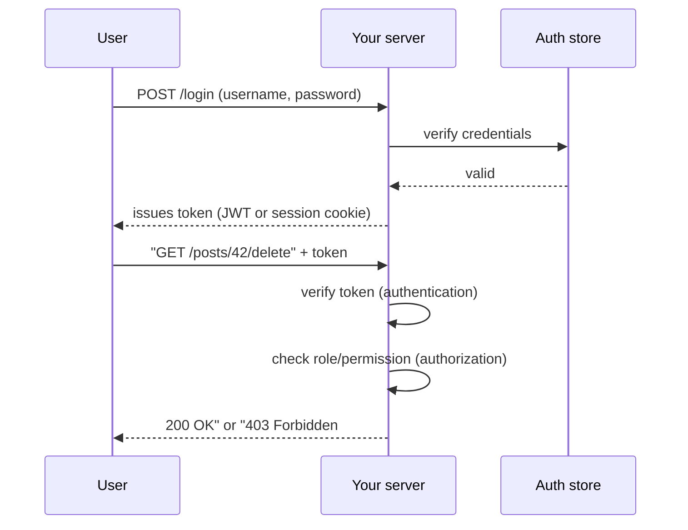

## Before you start

Helpful, not required: `api-design`, since auth is something you bolt onto an API's endpoints rather than a standalone system.

## In one sentence

**Authentication** is proving who you are, and **authorization** is deciding what you're allowed to do now that you're known — like showing an ID at the door, then a keycard deciding which rooms you can enter.

## Why it matters

Without authentication, anyone can claim to be anyone. Without authorization, every logged-in user can see or change everything — a regular user could delete another user's account just by knowing the right URL. Almost every real backend needs both, and conflating them is one of the most common security bugs in production code: checking only that *someone* is logged in, not that *this* logged-in person is allowed to do *this* specific thing.

## The intuition

Picture an office building. Authentication is the security desk checking your badge photo matches your face — it establishes identity once, at the door. Authorization is every door inside the building that only opens for certain badges: the server room, the executive floor, the supply closet. You can be fully authenticated (the desk let you in) and still be denied by a specific door (you're not on that door's access list). Systems that only check "did they get past the front desk" and forget to check individual doors are exactly where authorization bugs live.

## How it actually works

Authentication ("authN") happens first. The user proves identity — usually a password, a code from their phone, or a token from a trusted provider like Google. The server verifies this and issues something so the user isn't forced to log in on every request: a **session** or a **token**.

A **session** stores a small random ID in a cookie; the server looks up who that ID belongs to in a database or cache on every request. This makes revoking access instant — delete the session record and the user is logged out everywhere. A **JWT** (JSON Web Token) instead packs the identity directly into a signed token the server can verify with math, no database lookup required. That makes JWTs fast and easy to scale across many servers, but hard to revoke early — the server has already handed out a signed claim valid until it expires.

Authorization ("authZ") happens after identity is known. The server checks what this specific, now-identified user is permitted to do — usually based on a **role** (admin, editor, viewer) or a finer-grained list of **permissions** attached to the account.

**OAuth 2.0** is a standard that lets a user log into your app via another service ("Sign in with Google") without ever handing your app their Google password. The user is redirected to Google, approves the request there, and Google hands your app a token proving that approval — your app never sees the credentials.



The first two exchanges are pure authentication — proving identity once. The last two steps happen on *every subsequent request* and split cleanly: verifying the token answers "is this really user 42", while the role check answers the separate question "can user 42 delete this specific post".

## Worked example

```js
// A tiny JWT-style payload and a separate authorization check.
// In production you'd use a library like jsonwebtoken to sign/verify.

const tokenPayload = {
  sub: "user_42",        // "subject" — who this token identifies
  role: "editor",         // used later for authorization decisions
  exp: Math.floor(Date.now() / 1000) + 3600, // expires in 1 hour
};

function canDeletePost(user) {
  // Authorization: authentication already happened before this point.
  // This function has no idea HOW the user was verified — it only
  // cares about the role that verification produced.
  return user.role === "admin" || user.role === "editor";
}

console.log(canDeletePost({ role: "editor" })); // true
console.log(canDeletePost({ role: "viewer" })); // false
```

Output: `true` then `false`. The token proves *who* is asking; `canDeletePost` is a completely separate function that decides *what* they can do. Notice it never re-checks the signature or expiry — that verification step already ran earlier in the request pipeline (typically middleware), and by the time `canDeletePost` runs, `user` is trusted data.

## A second example — when it gets harder

The naive mental model — "check the role, done" — breaks down with **resource-level authorization**, where the role alone isn't enough:

```js
function canEditPost(user, post) {
  // Role check alone is not sufficient here.
  if (user.role === "admin") return true;

  // An editor can only edit THEIR OWN posts, not everyone's.
  if (user.role === "editor" && post.authorId === user.id) return true;

  return false;
}

const post = { id: 7, authorId: "user_42" };

console.log(canEditPost({ id: "user_42", role: "editor" }, post)); // true
console.log(canEditPost({ id: "user_99", role: "editor" }, post)); // false
```

Both users are equally authenticated and hold the same role, yet one is authorized and the other isn't. This is the bug class that role-only systems miss: checking `role === "editor"` and stopping there would let *any* editor delete *anyone's* post. Real authorization almost always needs to compare the authenticated identity against the specific resource being acted on, not just look at a role in isolation.

## Quick reference

| Concept | Answers | Example |
|---|---|---|
| Authentication | "Who are you?" | Password login, "Sign in with Google" |
| Authorization | "What can you do?" | Role checks, resource ownership checks |
| Session | Server remembers you via a stored ID | Cookie + server-side session store |
| JWT | You carry proof of identity with you | Signed token in an `Authorization` header |
| OAuth 2.0 | Delegated login via a trusted provider | "Continue with Google/GitHub" |

## Tools & frameworks

| Tool | What it's for | Reach for it when |
|---|---|---|
| [OAuth 2.0](https://oauth.net/2/) | Delegated authorization framework | You are granting third-party access — and learning what OAuth is *not* for |
| [OpenID Connect](https://openid.net/developers/how-connect-works/) | Authentication layer on top of OAuth | You need identity, not just an access token |
| [jose](https://github.com/panva/jose) | JWT/JWS/JWKS in Node, done correctly | You are verifying tokens — never decode-without-verify |
| [Keycloak](https://www.keycloak.org/documentation) | Self-hosted identity provider | You need OIDC or SAML inside your own infrastructure |
| [Auth.js](https://authjs.dev/) | Auth for JavaScript applications | A Node or Next app needs sessions and providers wired quickly |
| [node-casbin](https://github.com/apache/casbin-node-casbin) | RBAC/ABAC policy enforcement | Authorization has outgrown `if (user.role === 'admin')` |

node-casbin moved to the Apache org, so link the `apache/` path — the old `casbin/node-casbin` URL only redirects.

## Common mistakes

- Treating "the user is logged in" as sufficient — always check authorization separately, and for the *specific* resource, not just the general role.
- Storing tokens in `localStorage`, which any injected JavaScript can read; an `httpOnly` cookie is safer against XSS.
- Putting sensitive data (passwords, secrets) inside a JWT payload — it's signed, not encrypted, so anyone can decode and read it with a text editor.

## What interviewers ask

- **What's the difference between authentication and authorization?** — Authentication verifies identity; authorization decides permissions for that identity. They ask this to see whether you conflate the two in real code, which is where ownership-check bugs come from.
- **How would you invalidate a JWT before it expires?** — You generally can't without extra state (a blocklist, or short expiry paired with a revocable refresh token) — that's the core trade-off against sessions, which revoke instantly.
- **Where should you store a JWT on the client, and why?** — Prefer an `httpOnly` cookie over `localStorage` to reduce exposure if an XSS vulnerability lets attacker JavaScript run on the page.

## Practice

1. Write a function `canViewOrder(user, order)` where a `customer` role can only view their own orders, but a `support` role can view any order — then write two test calls that would fail if you only checked the role.
2. Sketch (on paper or in a comment) what a refresh-token flow needs: what's short-lived, what's long-lived, and what happens when the short-lived token expires.
3. Explain out loud why a JWT can be *verified* without a database call but a session generally cannot.

## Where to go next

Next is `docker-containerization` — once your API has real users and auth, packaging it so it runs identically everywhere is the next backend concern.
