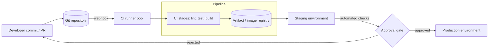
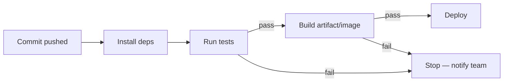
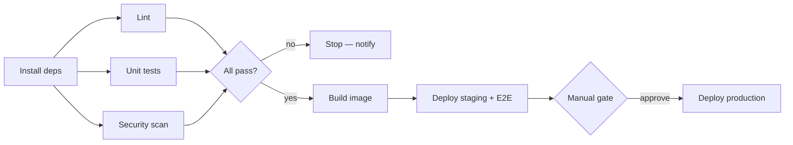

## Before you start

Helpful, not required: `docker-containerization` and `kubernetes-basics` — a pipeline often ends by building an image and deploying it, though the CI/CD concepts here stand on their own.

## In one sentence

**CI/CD** is an automated pipeline that tests your code every time you change it (Continuous Integration) and then ships it to users automatically or with one click (Continuous Delivery/Deployment).

## Why it matters

Without it, someone manually runs tests and copies files to a server — slow, and easy to get wrong under deadline pressure. A pipeline catches broken code before it reaches users and turns releasing software into a routine, low-stress, repeatable event instead of a nerve-wracking one where a tired human is the last line of defense.

## The intuition

Think of a pipeline as an assembly line with quality inspectors stationed at fixed points. A faulty part gets pulled off the line the moment an inspector spots it — it never reaches the next station, let alone the finished car. **Continuous Integration** is the first inspector: every time someone pushes code, a server automatically builds the project and runs the test suite, catching problems in minutes instead of days later when they're tangled up with other people's changes.

Zoom out and the assembly line runs from a developer's commit all the way to production:



The artifact registry is the hinge. The pipeline builds an artifact **once** and then promotes that same artifact through each environment — it never rebuilds per environment, because a rebuild could produce something subtly different from what you just tested. And the rejected arrow loops back to the developer, not forward.

## How it actually works

**Continuous Delivery** takes CI further: once tests pass, the code is automatically packaged and made ready to release, but a human still clicks a button to actually deploy it. **Continuous Deployment** removes even that click — every change that passes every stage goes straight to production with no manual gate at all. The three terms describe how far automation extends past the initial test run, not three different tools.

A pipeline is built from **stages** that run in a fixed order: install dependencies, lint, run tests, build, then deploy. If any stage fails, the pipeline stops immediately — later stages never run, so broken code never reaches the next station. This "fail fast, stop the line" behavior is the entire point; a pipeline that keeps going after a test failure isn't protecting anything.



Note the failure path: a failure at *any* stage routes straight to "stop and notify," never forward to deploy. Popular tools — GitHub Actions, Jenkins, GitLab CI — all implement this same stage-based shape; only the configuration syntax differs between them.

Real pipelines are not a straight line, though. Stages that don't depend on each other run **in parallel**, and gates collect their results:



Lint, unit tests and the security scan all read the same installed dependencies and none needs another's output, so running them together makes the pipeline as slow as its *slowest* check rather than the sum of all three. The gate after them is what keeps "fail fast" intact: every branch must pass before anything is built. Whether `G2` requires a human is exactly the line between Continuous Delivery and Continuous Deployment.

## Worked example

```yaml
# .github/workflows/ci.yml — a minimal GitHub Actions pipeline
name: CI
on: [push]
jobs:
  test:
    runs-on: ubuntu-latest
    steps:
      - uses: actions/checkout@v4
      - uses: actions/setup-node@v4
        with: { node-version: '20' }
      - run: npm ci              # install exact dependency versions
      - run: npm test            # pipeline stops here if tests fail
```

Pushing a commit that breaks a test produces output like:
```text
✓ Set up job
✓ Checkout
✓ Setup Node
✓ npm ci
✗ npm test — 1 failing
Error: Process completed with exit code 1.
```

Each `step` runs in order; `npm ci` fails fast if the lockfile is inconsistent, and `npm test` failing here means the workflow reports red and nothing downstream (build, deploy) ever executes — GitHub blocks the pull request from merging if you've configured that check as required.

## A second example — when it gets harder

The naive setup above treats "tests passed" as the finish line, but a real pipeline usually needs to *build and deploy an artifact*, and that's where the failure-path discipline actually gets tested — a partial deploy is worse than no deploy:

```yaml
# Extending the pipeline to build and push a Docker image, but only
# after tests pass on the main branch — not on every branch.
jobs:
  test:
    runs-on: ubuntu-latest
    steps:
      - uses: actions/checkout@v4
      - run: npm ci
      - run: npm test

  deploy:
    needs: test                       # only runs if `test` succeeded
    if: github.ref == 'refs/heads/main'
    runs-on: ubuntu-latest
    steps:
      - uses: actions/checkout@v4
      - run: docker build -t my-app:${{ github.sha }} .
      - run: docker push my-app:${{ github.sha }}
```

`needs: test` is the mechanism enforcing "stop the line": the `deploy` job literally cannot start until `test` reports success, and the `if` condition adds a second gate so feature branches build and test but never deploy. This is the pattern behind every real pipeline: gates that are structural (the job graph), not just a comment saying "remember to only deploy from main."

## Why pipelines get slow, and how teams keep them fast

A pipeline that takes 20 minutes to tell you a one-line change broke a test gets skipped under deadline pressure — which defeats the entire point of having it. Two techniques keep pipelines fast as a codebase grows. **Caching** avoids repeating expensive, rarely-changing work: `npm ci` reinstalling the same dependency tree on every single run is wasted time if the lockfile hasn't changed, so most CI tools let you cache the dependency folder keyed on a hash of the lockfile. **Parallelizing** runs independent stages at the same time instead of one after another — if linting and unit tests don't depend on each other's output, running them as two parallel jobs instead of two sequential steps can cut wall-clock time roughly in half, even though the total CPU work is unchanged.

Neither technique changes *what* the pipeline checks, only how quickly it reports back — which matters because a slow pipeline erodes the fast-feedback habit that makes CI valuable in the first place.

## Quick reference

| Term | Meaning |
|---|---|
| Continuous Integration | Auto-build and test on every push |
| Continuous Delivery | Auto-package a release; a human approves the deploy |
| Continuous Deployment | Every passing change auto-deploys to production, no gate |
| Pipeline stage | One step (build, test, deploy) that can pass or fail |
| Runner/agent | The machine that actually executes the pipeline's steps |
| Caching | Skips redoing unchanged, expensive work (like dependency installs) |

## Tools & frameworks

| Tool | What it's for | Reach for it when |
|---|---|---|
| [GitHub Actions](https://docs.github.com/en/actions) | CI/CD living in the repository host | Your code is on GitHub — the default with the least setup |
| [GitLab CI](https://docs.gitlab.com/ci/) | Pipelines with built-in registry and environments | You self-host GitLab, or want CI and registry in one product |
| [Argo CD](https://argo-cd.readthedocs.io/en/stable/) | Pull-based GitOps delivery to Kubernetes | You want CI to build and something else to deploy — separate the two halves |
| [Dagger](https://docs.dagger.io/getting-started/introduction/) | Pipelines as code, runnable locally | "Works in CI, fails locally" has become a real cost |

## Common mistakes

- Treating a green pipeline as proof the app fully works — it only proves what the tests actually cover, so weak coverage gives false confidence.
- Making the pipeline so slow that developers start skipping or ignoring it — fast feedback is the entire value proposition of CI.
- Deploying straight to production with no rollback plan, so a bad deploy has no quick way back once it's live.

## What interviewers ask

- **What's the difference between continuous delivery and continuous deployment?** — Delivery stops at "ready to release" and waits for a human; deployment ships automatically with no manual gate. They're checking you know this is a spectrum of automation, not two unrelated tools.
- **What happens if a stage in the pipeline fails?** — The pipeline halts at that stage, later stages never run, and the team is notified — this is the mechanism that keeps broken code from reaching production.
- **Why run tests in CI instead of trusting developers to run them locally?** — Local runs get skipped under deadline pressure and environments differ machine to machine; CI guarantees the same checks run the same way, every time, for every change.

## Practice

1. Write a two-job GitHub Actions workflow where a `deploy` job only runs if a `test` job succeeds — use `needs:` to enforce it structurally, not just a comment.
2. Deliberately break a test locally, push it, and read the failed workflow's log to identify exactly which step failed and why nothing after it ran.
3. Explain out loud the difference between Continuous Delivery and Continuous Deployment using a concrete example from a team you've worked with or read about.

## Where to go next

Chapter 9 is complete — from here, `mock-interviews-technical` in Chapter 10 shifts from building systems to practicing how you talk through them under interview conditions.
