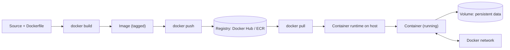
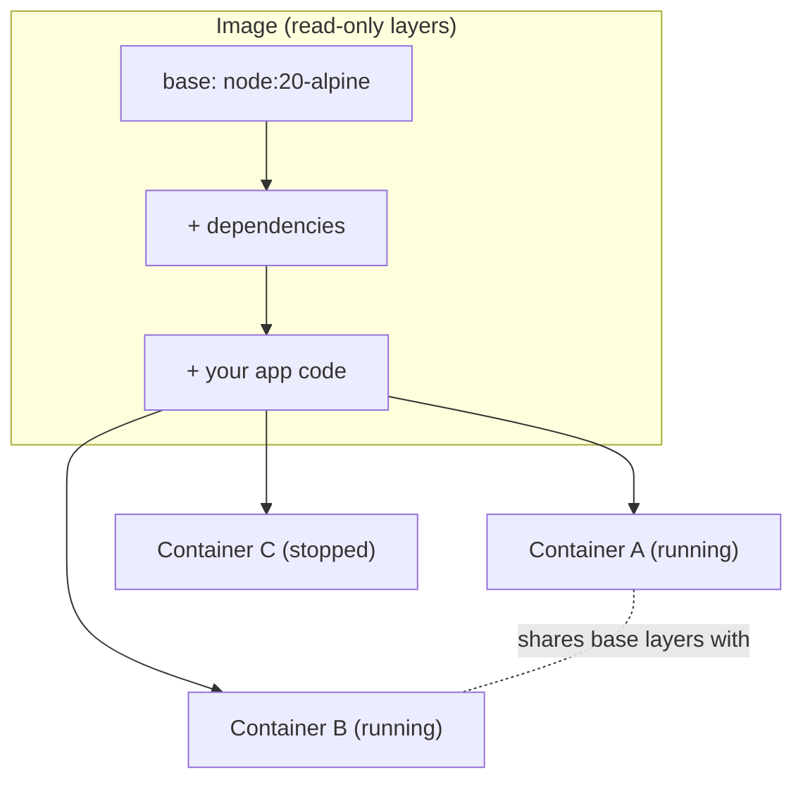
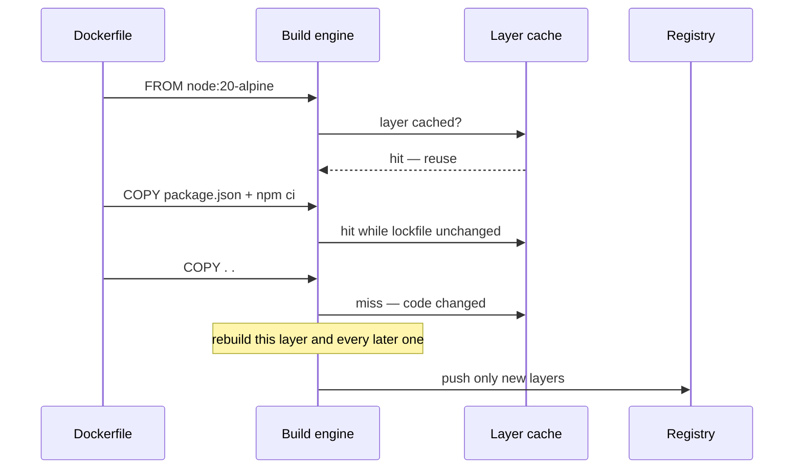

## Before you start

No prior topic in this course is required. Helpful context: `authentication-authorization`, since the app you'll containerize likely has auth logic already in it.

## In one sentence

**Docker** packages your app together with everything it needs to run — code, dependencies, and settings — into a single portable **container**, so it behaves the same on your laptop as it does on a server.

## Why it matters

"It works on my machine" is a real, frequent failure: a different OS, a missing system library, or a slightly different Node version can all break an app that ran fine for you. Containers remove that excuse entirely, because they ship the whole environment along with the code — what you tested locally is byte-for-byte what runs in production.

## The intuition

A container is like a shipping container for cargo: no matter what's inside — furniture, electronics, food — it has a standard shape that any ship, crane, or truck can handle without caring about the contents. Docker does the same for software: it defines a standard, isolated unit that bundles your app with its runtime, libraries, and configuration, so any machine running Docker can run it identically.

Extending the analogy: the container has to be packed somewhere, shipped through a port, and unloaded somewhere else. That end-to-end journey is the picture worth holding:



The registry in the middle is what makes "it works on my machine" stop being a problem: the machine that builds the image is not the machine that runs it, and the identical bytes cross between them. Note also that the volume sits *outside* the container — the one piece of the picture that survives when the container is thrown away.

## How it actually works

An **image** is the blueprint — a read-only snapshot of everything your app needs, built in layers (base OS, then dependencies, then your code). A **container** is a running instance of that image, similar to how a class relates to an object in programming: one image can spin up any number of identical, independent containers.

You build an image with a **Dockerfile** — a text file listing the steps to assemble it: start from a base image, copy in your code, install dependencies, specify the command that starts the app. Each instruction in a Dockerfile creates a new layer, and Docker caches layers that haven't changed, which is why the order of instructions matters for build speed.

Two mechanisms matter once you're running more than a toy example. A **volume** lets a container persist data outside its own filesystem, so that data survives even if the container itself is deleted and recreated — essential for anything stateful, like a database's files. A Docker **network** lets containers reach each other by name rather than by IP address, so a container called `api` can just connect to a hostname called `db` and Docker resolves it.



All three containers start from the exact same image layers; only their writable top layer and running state differ. That sharing is why spinning up a fourth identical container is nearly instant — Docker isn't copying the whole image again, just adding a thin new layer on top.

The same layering is what makes instruction order matter during a build. Watch the cache decide, instruction by instruction:



A cache miss invalidates every layer *after* it, never before. That is the whole reason you copy your dependency manifest and install dependencies before copying your source: your code changes constantly, your dependencies rarely, so putting the slow install step above the frequently-changing copy keeps it cached.

## Worked example

```dockerfile
# Dockerfile — packages a small Node.js app
FROM node:20-alpine
WORKDIR /app
COPY package*.json ./
RUN npm ci --omit=dev
COPY . .
EXPOSE 3000
CMD ["node", "server.js"]
```

```bash
docker build -t my-app .          # build the image from the Dockerfile
docker run -p 3000:3000 my-app    # run a container, mapping host port 3000
```

Output of `docker run` (abridged):
```text
Server listening on port 3000
```

The `Dockerfile` defines what goes into the image once; `docker run` can then start as many identical containers from it as you need, each in its own isolated filesystem and process space, all sharing the same underlying image layers.

## A second example — when it gets harder

The naive Dockerfile above rebuilds the *entire* `npm ci` layer every time you change a single line of app code, because `COPY . .` comes before it invalidates the cache for everything after. Reordering fixes this:

```dockerfile
FROM node:20-alpine
WORKDIR /app

# Copy ONLY the manifest first — this layer only invalidates
# when package.json/package-lock.json actually change.
COPY package*.json ./
RUN npm ci --omit=dev

# Now copy the rest of the code — changing app.js won't
# force npm ci to re-run, since that layer is already cached.
COPY . .

EXPOSE 3000
CMD ["node", "server.js"]
```

This is the difference between a 40-second rebuild and a 2-second rebuild on every code change, and it's exactly why Dockerfile instruction *order* is a real skill, not a stylistic detail: Docker caches each layer and only re-runs a layer (and everything after it) if its inputs changed.

## Why image size matters in practice

A bloated image doesn't just waste disk — it slows down every deploy, since the image has to be pushed to a registry and then pulled down to every machine that runs it. Three habits keep images small. Start from a minimal base like `node:20-alpine` instead of a full Linux distribution image, since Alpine is a fraction of the size and still has everything a typical Node app needs. Use a `.dockerignore` file (the Docker equivalent of `.gitignore`) so build artifacts like `node_modules` or `.git` from your host machine never get copied into the image by accident. For compiled languages, use a **multi-stage build** — one stage compiles the code with all the heavy build tools installed, and a second, much smaller final stage copies over only the compiled output, discarding the compiler and build dependencies entirely from the shipped image.

## Quick reference

| Term | What it is |
|---|---|
| Image | Read-only, layered blueprint for a container |
| Container | A running (or stopped) instance of an image |
| Dockerfile | Recipe used to build an image, one instruction per layer |
| Volume | Persistent storage outside the container's own filesystem |
| Docker network | Lets containers reach each other by service name |
| Multi-stage build | Compiles in one stage, ships only the output in a smaller final stage |

## Common mistakes

- Storing important data inside the container's own filesystem, then losing it when the container restarts or is replaced — use a volume instead.
- Building huge, slow images by copying unnecessary files or ordering the Dockerfile so cache-friendly layers (like dependency installs) sit *after* frequently-changing code.
- Assuming a container is as isolated as a full VM — containers share the host machine's kernel, so kernel-level vulnerabilities can still matter for security, unlike a VM which virtualizes hardware entirely.

## What interviewers ask

- **What's the difference between an image and a container?** — An image is the static, read-only blueprint; a container is a running instance of it, the way a class relates to an object — you can start many containers from one image.
- **How is a container different from a virtual machine?** — A container shares the host's OS kernel and only isolates the application layer, making it far lighter and faster to start than a VM, which virtualizes an entire operating system including its own kernel.
- **Why does Dockerfile instruction order matter?** — Docker caches each layer; placing rarely-changing steps (like installing dependencies) before frequently-changing steps (like copying source code) means most rebuilds reuse cached layers instead of redoing everything.

## Practice

1. Write a Dockerfile for a simple app in a language of your choice, then deliberately put `COPY . .` before the dependency install step, time a rebuild after a one-line code change, then fix the ordering and time it again.
2. Run two containers from the same image and confirm they don't see each other's filesystem changes, then create a Docker network and confirm they can reach each other by container name.
3. Explain out loud why deleting a container that wrote data to its own filesystem (no volume) loses that data, but deleting one using a volume does not.

## Where to go next

Next is `kubernetes-basics` — once you can run one container reliably, the next problem is running many containers, across many machines, without doing it by hand.
