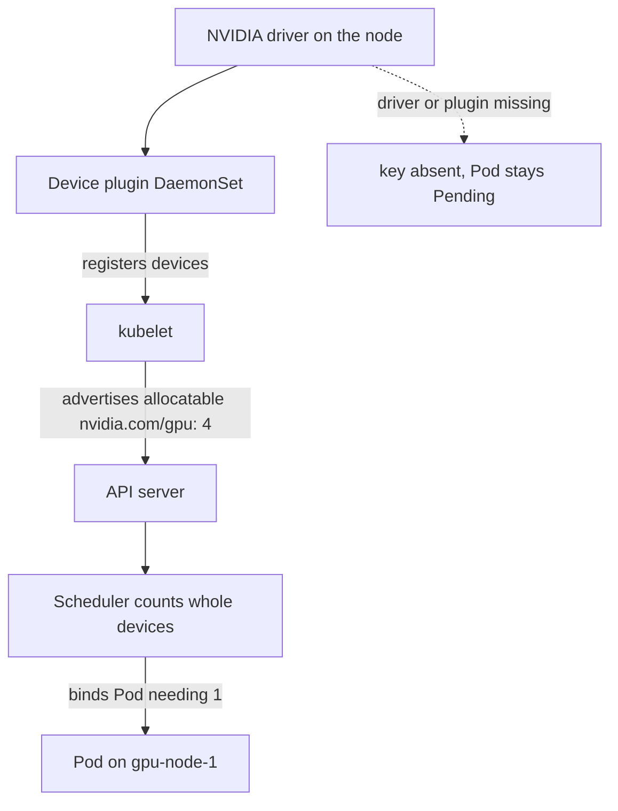

## Before you start

You need [kubernetes-basics](kubernetes-basics) — Pods, Deployments, replicas and `kubectl` are assumed here, not re-explained. Everything below is about one new thing: what changes when the resource your Pod needs is a GPU.

## In one sentence

Scheduling GPUs in Kubernetes means telling the scheduler "this Pod needs a whole graphics card", which works differently from CPU and memory because a GPU is handed out as an **indivisible whole device** to exactly one container.

## Why it matters

A GPU is the most expensive thing in your cluster by a wide margin — often more per hour than the entire CPU node pool. Two failure modes cost real money. A CPU-only workload lands on a GPU node, occupies it, and blocks the job that actually needed the card. Or your inference Pod sits `Pending` for hours with a message that never says "the driver is missing", while an engineer restarts things hoping for a different result.

Both come from the same gap: people apply CPU reflexes to a resource that does not behave like CPU at all.

## The intuition

CPU is **compressible**. Ask for 500 millicores on a busy node and the kernel simply gives you smaller slices of time — you run slower, but you run. That is why Kubernetes lets you set `requests` lower than `limits` and overcommit a node: CPU stretches.

A GPU does not stretch. Think of CPU as water in a shared tank — everyone draws some, nobody is turned away, everyone gets a thinner stream. A GPU is a hotel room key. There is one key. Whoever holds it has the whole room, and the next guest waits at reception until it is handed back. You cannot check into half a room.

That single property explains every rule that follows.

## How it actually works

**Kubernetes does not know what a GPU is.** There is no `nvidia.com/gpu` built into the scheduler. Hardware like this is exposed through the **device plugin** framework: a small DaemonSet runs on each GPU node, discovers the physical cards, and registers them with the kubelet as an **extended resource** — an arbitrary named quantity the scheduler can count. The node then advertises `nvidia.com/gpu: 4` in its allocatable list, and from that moment the scheduler treats GPUs as a countable thing it can place Pods against.



Follow the dotted edge, because it is the one that bites. If the driver or the plugin is not healthy, the node does not advertise `nvidia.com/gpu: 0` — **the key is absent entirely**. The scheduler sees a resource nobody in the cluster offers, and reports `0/12 nodes are available: 12 Insufficient nvidia.com/gpu`. Nothing in that sentence mentions a driver.

**Requests and limits must be equal integers.** Because a device is allocated whole, the Kubernetes docs are strict: specify GPUs in `limits`; if you also set `requests`, the two values must match; and you cannot set `requests` without `limits`. There is no `0.5`, no millicores, and **no overcommit** — the sum of GPU requests on a node can never exceed the devices it has. Where CPU lets you gamble that not everyone peaks at once, GPUs give you no such room.

**GPU nodes are almost always tainted.** A **taint** marks a node as repelling Pods, and a matching **toleration** on a Pod is the permission slip that lets it land there. Without the taint, any ordinary web Pod can be scheduled onto a GPU node — it never requests a GPU, so nothing stops it, and it consumes the CPU and memory that the GPU workload also needs to function. The convention is a taint like `nvidia.com/gpu=present:NoSchedule` plus a `nodeSelector` on a label such as `accelerator=nvidia-l4`, so GPU Pods land on the right *kind* of card and nothing else lands there at all.

**Sharing one card between Pods** is possible, with three mechanisms that differ sharply in how much they protect tenants from each other. **Time-slicing** makes the plugin advertise one physical GPU as several replicas; the CUDA driver context-switches between them. It gives you concurrency and nothing else — the replicas share one pool of VRAM with no isolation, so one Pod loading a large model can push a neighbour into an out-of-memory crash. **MIG** (Multi-Instance GPU) partitions supported data-centre cards into hardware-isolated instances with their own memory and compute paths, advertised as separate resources like `nvidia.com/mig-1g.5gb`. Real isolation, but only fixed profiles and only on certain cards. **MPS** (Multi-Process Service) lets processes submit work concurrently to one context, sharing better than time-slicing without MIG's hardware boundary.

## Worked example

A Deployment requesting one GPU, with the shape that actually schedules:

```yaml
apiVersion: apps/v1
kind: Deployment
metadata:
  name: inference
spec:
  replicas: 2
  selector:
    matchLabels: { app: inference }
  template:
    metadata:
      labels: { app: inference }
    spec:
      nodeSelector:
        accelerator: nvidia-l4          # land only on the right card type
      tolerations:
        - key: "nvidia.com/gpu"          # permission to sit on a tainted GPU node
          operator: "Exists"
          effect: "NoSchedule"
      containers:
        - name: server
          image: my-registry/inference:1.4
          resources:
            requests:
              cpu: "4"
              memory: "16Gi"
              nvidia.com/gpu: 1          # requests and limits MUST match
            limits:
              cpu: "8"                   # CPU may differ — it is compressible
              memory: "16Gi"
              nvidia.com/gpu: 1          # whole device, integer, no overcommit
```

Line by line: `nodeSelector` narrows placement to L4 nodes so a Pod sized for 24 GB of VRAM never lands on a smaller card. The toleration is what makes the GPU node acceptable at all — remove it and the Pod stays `Pending` even with cards free. The `cpu` request and limit differ deliberately, because CPU is compressible. The two `nvidia.com/gpu: 1` entries are identical because they must be; set `requests: 1` and `limits: 2` and the API server rejects the Pod.

With `replicas: 2` you have now claimed two whole devices. On a node with four cards, two remain — and if a third replica appears, it waits for a device to be released, however idle the GPUs look in `nvidia-smi`.

## A second example — when it gets harder

The failure everyone hits is a Pod `Pending` forever. Diagnose it by asking, in order, whether the resource exists, whether the Pod is allowed on the node, and whether something else holds the device. This walks `kubectl get nodes -o json` and does exactly that:

```js
// Parse `kubectl get nodes -o json` and report GPU capacity vs what pods hold.
const nodes = {
  items: [
    { metadata: { name: 'gpu-a-1' },
      status: { allocatable: { cpu: '15', 'nvidia.com/gpu': '4' } },
      spec: { taints: [{ key: 'nvidia.com/gpu', value: 'present', effect: 'NoSchedule' }] } },
    { metadata: { name: 'gpu-a-2' },
      status: { allocatable: { cpu: '15', 'nvidia.com/gpu': '4' } },
      spec: { taints: [{ key: 'nvidia.com/gpu', value: 'present', effect: 'NoSchedule' }] } },
    { metadata: { name: 'cpu-pool-1' },
      status: { allocatable: { cpu: '7' } },          // no GPU key at all
      spec: {} },
  ],
};

// Requests already claimed on each node, from `kubectl get pods -o json`.
const claimed = { 'gpu-a-1': 4, 'gpu-a-2': 3, 'cpu-pool-1': 0 };

for (const node of nodes.items) {
  const name = node.metadata.name;
  const advertised = node.status.allocatable['nvidia.com/gpu'];
  if (advertised === undefined) {
    // The key is ABSENT, not zero — the device plugin never registered here.
    console.log(`${name.padEnd(12)} no "nvidia.com/gpu" advertised (CPU-only or plugin missing)`);
    continue;
  }
  const total = Number(advertised);
  const free = total - (claimed[name] ?? 0);
  const taints = (node.spec.taints ?? []).map((t) => `${t.key}=${t.value}:${t.effect}`);
  console.log(
    `${name.padEnd(12)} gpus ${total}  free ${free}  taints [${taints.join(', ') || 'none'}]`
  );
}
```

Output:

```
gpu-a-1      gpus 4  free 0  taints [nvidia.com/gpu=present:NoSchedule]
gpu-a-2      gpus 4  free 1  taints [nvidia.com/gpu=present:NoSchedule]
cpu-pool-1   no "nvidia.com/gpu" advertised (CPU-only or plugin missing)
```

Read that as a decision tree. If **no node advertises the key**, the problem is the plugin or driver, not the Pod — check the plugin DaemonSet's Pods and logs on that node. If nodes advertise it but `free` is 0 everywhere, you are simply out of devices and no amount of YAML fixes it; something must finish or the cluster must grow. If a node has a free device and your Pod still will not schedule, look at the taint line and confirm your Pod tolerates it — `kubectl describe pod` will say `node(s) had untolerated taint`, which is the clearest of the messages you will get.

One more trap: distinguishing "out of devices" from "device held by a zombie". A crashed process can leave a GPU claimed while the card sits idle, so `nvidia-smi` showing 0% utilisation does not mean the device is schedulable. Kubernetes counts *allocations*, not utilisation. That gap between "looks idle" and "is allocated" is the single most confusing thing about GPU scheduling, and the reason [gpu-autoscaling-and-cold-starts](gpu-autoscaling-and-cold-starts) argues you should never autoscale on GPU utilisation.

## Quick reference

| Sharing mode | Isolation | When to use | Risk |
|---|---|---|---|
| Exclusive (1 Pod = 1 GPU) | Complete | Production inference and training | Idle capacity if the model is small |
| Time-slicing | None — shared VRAM | Dev, notebooks, CI, bursty small jobs | One Pod OOMs another; unpredictable latency |
| MIG | Hardware-partitioned memory and compute | Multi-tenant serving on supported cards | Fixed profiles; only some data-centre GPUs |
| MPS | Shared context, no hard memory limit | Many small concurrent kernels, trusted tenants | A misbehaving process still affects neighbours |

| Symptom | Likely cause | First check |
|---|---|---|
| `Insufficient nvidia.com/gpu`, no node has the key | Driver or device plugin unhealthy | Plugin DaemonSet Pods and logs |
| `node(s) had untolerated taint` | Missing toleration | Pod `tolerations` vs node taints |
| Pending with free GPUs elsewhere | `nodeSelector` too narrow, or CPU/memory won't fit | `kubectl describe pod` events |
| Card idle in `nvidia-smi` but unschedulable | Device allocated to a stuck Pod | `kubectl get pods -o wide` on that node |

## Common mistakes

- Setting `requests` lower than `limits` for `nvidia.com/gpu`, out of CPU habit — the API server rejects it, and there is no overcommit to gain anyway.
- Leaving GPU nodes untainted, so CPU-only Pods colonise the most expensive hardware you own.
- Reading an absent `nvidia.com/gpu` key as zero available, and hunting for a capacity problem when the driver never loaded.
- Reaching for time-slicing in production because it raises the Pod count, then debugging out-of-memory crashes caused by a neighbour.
- Assuming low `nvidia-smi` utilisation means a device is free — Kubernetes schedules on allocation, not utilisation.
- Requesting a GPU without a `nodeSelector` in a mixed fleet, so a large model lands on a small card and fails at load time rather than at schedule time.

## What interviewers ask

- **Why must GPU requests and limits be equal?** — A GPU is allocated as a whole device to one container and cannot be time-shared by the kernel the way CPU is, so there is no meaningful "guaranteed floor below a ceiling" and no overcommit; they are testing whether you understand compressible versus non-compressible resources.
- **Why is my GPU Pod stuck Pending?** — Walk the chain: does any node advertise `nvidia.com/gpu` at all (if not, the driver or device plugin is broken), does the Pod tolerate the GPU node's taint, is every device already allocated, and does the Pod's CPU and memory also fit.
- **Why taint GPU nodes?** — Without a taint any Pod can be scheduled there, so ordinary workloads consume CPU and memory on nodes you are paying a large premium for, and can starve the GPU workload of the host resources it needs.
- **Time-slicing or MIG?** — Time-slicing gives concurrency with no memory isolation, so it belongs in development; MIG partitions the card in hardware with its own memory, so it is the only honest choice for untrusted or production multi-tenancy — at the cost of fixed profiles and limited hardware support.
- **How does Kubernetes know about GPUs at all?** — It does not natively; a vendor device plugin DaemonSet discovers the hardware and registers it with the kubelet as an extended resource, which is why a driver problem surfaces as a scheduling message rather than a hardware error.

## Practice

1. Take a working CPU Deployment and add `nvidia.com/gpu: 1` to `requests` only, with a different value in `limits`. Predict the error before you apply it, then read the actual rejection message.
2. On a cluster with GPU nodes, run `kubectl get nodes -o json | jq '.items[] | {name: .metadata.name, gpu: .status.allocatable["nvidia.com/gpu"], taints: .spec.taints}'` and write down, for each node, how many devices are free and which Pods hold the rest.
3. Design the node pools for a cluster serving three tenants: a latency-sensitive production model, a batch job that can wait, and a team of researchers using notebooks. Decide which pool gets exclusive GPUs, which gets time-slicing or MIG, and what taints and tolerations enforce it — then justify each choice against the isolation column of the table above.

## Where to go next

[gpu-autoscaling-and-cold-starts](gpu-autoscaling-and-cold-starts) is the direct sequel: now that a Pod can claim a device, the question is how the cluster grows and shrinks the pool of devices when traffic moves — and why the answer looks nothing like autoscaling a web service. If you want the hardware layer first, [gpu-fundamentals-for-engineers](gpu-fundamentals-for-engineers) explains what is inside the card you just allocated.
