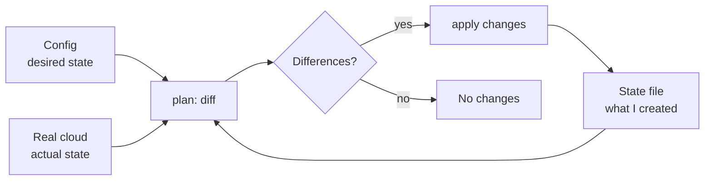

## Before you start

You need a rough idea of servers, networks, and cloud resources. `docker-containerization` and `cicd-pipelines` are natural neighbours — IaC provisions what your pipeline deploys onto.

## In one sentence

**Infrastructure as code** means describing your servers, databases, and networks in text files kept in version control, so that creating an environment is running a command rather than clicking through a console and hoping you remember every step.

## Why it matters

Infrastructure built by hand is infrastructure nobody can rebuild. The person who configured it leaves, the console changes, and six months later production has a firewall rule nobody can explain and everyone's afraid to remove.

Three things break without IaC. **Reproducibility** — staging and production drift apart until "works in staging" stops meaning anything. **Auditability** — no record of who opened that port or why. **Recovery** — when a region fails, rebuilding by hand takes days.

With IaC, infrastructure gets what application code has had for decades: review, history, rollback, and a diff.

## The intuition

The core distinction is **imperative vs declarative**.

An imperative script is a recipe: create the server, install nginx, open port 443. Run it twice and you may get two servers, or an error. It describes *steps*.

A declarative config is a shopping list: "three servers of this size, this firewall rule". You state the **desired end state** and the tool works out what to do — create what's missing, change what's wrong, leave what's already right. Run it ten times and the result is identical.

That property is **idempotence**, and it's why declarative won. You never have to know the current state to run it safely.

To make that work, the tool must know what it created previously. That's the **state file** — a record mapping your config to real resources. It's what lets the tool tell "this doesn't exist yet" from "this exists and needs changing".



## How it actually works

The cycle is **write, plan, apply**.

You write config declaring what should exist. `plan` compares three things — your config, the state file, and the real infrastructure — and prints what it would change, without changing anything. `apply` executes it and updates the state file.

The `plan` step is the entire safety model. It's a preview, and reading it is a genuine skill: `~` means change in place, `+` create, `-` destroy. The line that must always stop you is a `-` you didn't expect, or the tag "must be replaced" — some changes can't be made in place, so the tool destroys and recreates, which on a database means data loss.

**Drift** is when reality stops matching your config, almost always because someone made a manual change in the console during an incident. The config says `t3.small`; production is running `t3.large` because someone resized it at 2am and never went back.

Drift is dangerous precisely because it's silent. Everything works fine until the next unrelated `apply`, which dutifully "corrects" the difference and reverts the emergency fix. Terraform's `plan -refresh-only` shows you drift without acting on it.

The **state file** deserves respect. It contains resource IDs and, importantly, **secrets in plaintext** — database passwords appear in it. So it lives in remote encrypted storage, never in git, with **locking** enabled so two engineers can't apply simultaneously and corrupt it.

## Worked example

The plan/apply/drift cycle, modelled in plain Node:

```js
// What the config file says should exist.
const desired = { name: 'web', instanceType: 't3.small', count: 3, publicIp: false };

// What is ACTUALLY running — someone resized it and exposed it during an incident.
let actual    = { name: 'web', instanceType: 't3.large', count: 3, publicIp: true };

function plan(desired, actual) {
  const changes = [];
  for (const k of new Set([...Object.keys(desired), ...Object.keys(actual)])) {
    if (JSON.stringify(desired[k]) !== JSON.stringify(actual[k]))
      changes.push({ field: k, from: actual[k], to: desired[k] });
  }
  return changes;
}

function render(changes) {
  if (!changes.length) return '  No changes. Infrastructure matches configuration.';
  return changes.map(c => `  ~ ${c.field}: ${JSON.stringify(c.from)} -> ${JSON.stringify(c.to)}`).join('\n');
}

console.log('plan (desired vs real world):');
console.log(render(plan(desired, actual)));
console.log(`\nPlan: 0 to add, ${plan(desired, actual).length} to change, 0 to destroy.\n`);

actual = { ...desired };                      // apply: reality now matches config
console.log('after apply:');
console.log(render(plan(desired, actual)));
```

Output:

```
plan (desired vs real world):
  ~ instanceType: "t3.large" -> "t3.small"
  ~ publicIp: true -> false

Plan: 0 to add, 2 to change, 0 to destroy.

after apply:
  No changes. Infrastructure matches configuration.
```

This is the whole model in twenty lines. Note what the plan actually reveals: the drift is *visible before anything happens*. Someone upsized to `t3.large` for a reason, and applying blindly would downsize production back to `t3.small` — possibly during peak traffic.

The second run printing "No changes" is idempotence. Running `apply` again is safe and does nothing, which is exactly the property a shell script doesn't have.

## A second example — when it gets harder

Reading a plan properly is where experience shows. These two lines look similar and are not remotely equivalent:

```
  ~ aws_instance.web        will be updated in-place
      ~ instance_type = "t3.small" -> "t3.medium"

  -/+ aws_db_instance.main  must be replaced
      ~ engine_version = "14.7" -> "15.2"  # forces replacement
```

The first resizes a server — brief restart, no data lost. The second **destroys and recreates your production database**. The `-/+` and the phrase "forces replacement" are the difference between a routine change and an outage with data loss.

Some attributes can't be changed in place by the cloud provider, so the tool's only option is destroy-then-create. It says so clearly; the failure is human, when someone skims to the summary and types `yes`.

Hence the review discipline mature teams enforce:

| Rule | Reason |
|---|---|
| Never apply without reading the full plan | The summary hides *which* resources are destroyed |
| Post the plan in the pull request | Reviewers see infrastructure changes, not just config diffs |
| Treat any unexpected `-` or `-/+` as a stop | Recreation of stateful resources means data loss |
| Never edit the state file by hand | Corrupting it can orphan real resources |
| Never make manual console changes | Creates drift that a later apply silently reverts |
| Lock the state during apply | Concurrent applies corrupt state |
| Use `prevent_destroy` on databases | A guardrail that survives a tired reviewer |

The deeper lesson: IaC doesn't remove risk, it makes risk **reviewable**. A `plan` is a diff of your production environment — the highest-value review your team does, and the one most often rubber-stamped.

## Quick reference

| Term | Meaning |
|---|---|
| Declarative | You describe the end state; the tool decides the steps |
| Imperative | You describe the steps; running twice may differ |
| Idempotent | Running repeatedly gives the same result |
| Plan | A preview diff of what apply would change |
| State file | The tool's record of what it created; contains secrets |
| Drift | Reality no longer matches config, usually from manual edits |

## Common mistakes

- Committing the state file to git — it holds plaintext secrets and breaks the moment two people apply.
- Applying without reading the plan, then discovering the database was recreated.
- Making a "quick" console change during an incident and never bringing it back into config.
- Editing state by hand to fix an error, orphaning real resources that still cost money.
- Sharing one state file across dev, staging, and production, so a mistake takes out everything.

## What interviewers ask

- **Declarative vs imperative?** — Declarative describes the desired end state and is idempotent; imperative describes steps and may behave differently on a second run. They want to hear idempotence as the reason declarative won.
- **What is the state file and why does it matter?** — The tool's map from config to real resources; it's how it knows what already exists. It contains secrets, so it belongs in encrypted remote storage with locking, never in git.
- **What is drift and how do you handle it?** — Reality diverging from config, usually via manual changes. Detect it with a refresh-only plan, then either update the config to match a legitimate change or re-apply to correct it — but investigate *why* before reverting.
- **What's dangerous in a plan?** — Anything marked "must be replaced" on a stateful resource, because destroy-and-recreate means data loss. Also any unexpected destroy.
- **Why not just use shell scripts?** — They're imperative and not idempotent: running twice can double-create or fail, and they have no concept of current state or a preview diff.

## Practice

1. Extend the plan function to handle resources that don't exist yet (`+ create`) and ones removed from config (`- destroy`), and render the three symbols distinctly.
2. Write the review checklist you'd require before approving a production apply — be specific about what makes you reject it.
3. Describe how you'd handle finding that production runs `t3.large` while config says `t3.small`. Give the questions you'd ask before choosing to update the config or re-apply.

## Where to go next

`cicd-pipelines` — IaC is most valuable when a pipeline runs `plan` on every pull request. [secrets-management](secrets-management) is directly connected, since state files are a classic accidental secret leak.
