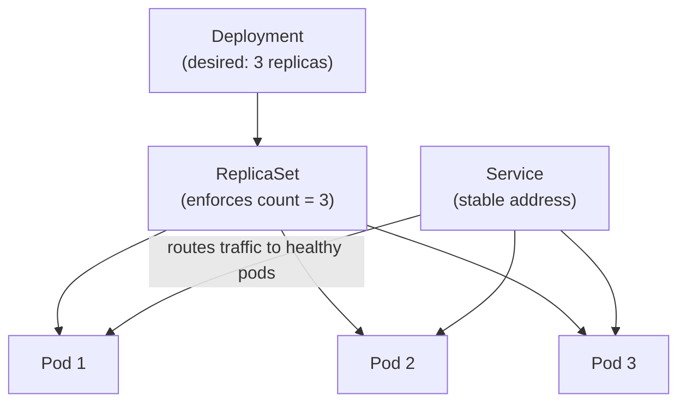

## Before you start

Requires `docker-containerization` — Kubernetes runs containers, so the concepts of an image and a container are assumed here, not re-explained.

## In one sentence

**Kubernetes** (often "K8s") is a system that runs your containers across many machines for you, automatically restarting them when they crash and adding more copies when traffic increases.

## Why it matters

Docker runs one container on one machine. Real applications need many containers running reliably across many machines, surviving hardware failures, and scaling with demand. Doing that by hand — noticing a crashed container and manually restarting it at 3 a.m. — doesn't scale past a handful of servers; Kubernetes automates the whole loop of watching, comparing, and correcting.

## The intuition

Think of Kubernetes as a building manager, not a security guard. A security guard reacts to one incident at a time. A building manager holds a standing instruction — "this floor should always have exactly 3 working elevators" — and continuously checks reality against that instruction, calling a repair crew the moment an elevator breaks, without anyone asking them to. You give Kubernetes a *desired state* ("keep 3 copies of my app running"), and it spends its entire existence closing the gap between that desired state and whatever is actually true right now.

## How it actually works

The smallest unit Kubernetes manages is a **Pod** — one or more containers that always run together on the same machine, sharing the same network address and storage. Most of the time a Pod holds exactly one container; multiple containers in one Pod is for tightly-coupled helpers, like a logging sidecar.

A **Deployment** describes how many copies (**replicas**) of a Pod you want running, and it manages rolling out new versions without downtime: it creates new Pods running the new version and only removes old Pods once the new ones report healthy. Under the hood, a Deployment doesn't manage Pods directly — it manages a **ReplicaSet**, which is the component actually responsible for keeping the replica count correct at any given moment. The Deployment's job is orchestrating *rollouts* between ReplicaSets (old version, new version); the ReplicaSet's job is just "keep exactly N Pods alive right now."

Pods are disposable and get a new IP address every time they restart, so a **Service** gives them a stable address that the rest of your app can rely on, and it load-balances traffic across whichever Pods are currently healthy behind it.



The Deployment states the intent, the ReplicaSet enforces the count, the Pods are the actual running instances, and the Service is the stable front door that never changes even as individual Pods are replaced underneath it.

## Worked example

```yaml
# deployment.yaml (simplified)
apiVersion: apps/v1
kind: Deployment
metadata:
  name: my-app
spec:
  replicas: 3          # Kubernetes keeps exactly 3 Pods running
  template:
    spec:
      containers:
        - name: my-app
          image: my-app:1.0
```

```bash
kubectl apply -f deployment.yaml

kubectl get pods
# NAME                     READY   STATUS    RESTARTS   AGE
# my-app-7d9f8b7c4c-abcde  1/1     Running   0          10s
# my-app-7d9f8b7c4c-fghij  1/1     Running   0          10s
# my-app-7d9f8b7c4c-klmno  1/1     Running   0          10s

kubectl scale deployment my-app --replicas=5   # scale up to 5 copies
kubectl logs my-app-7d9f8b7c4c-abcde            # view logs from one Pod
```

`replicas: 3` is the instruction Kubernetes continuously enforces. If you manually deleted one of those Pods right now, a fourth line would appear in `kubectl get pods` within seconds — Kubernetes noticing the count dropped to 2 and immediately starting a replacement.

## A second example — when it gets harder

The naive model — "Kubernetes keeps my Pods alive, so my app is highly available" — breaks the moment you ask what happens *during* a deploy, not just after a crash. A rolling update has to keep the Service serving traffic the whole time:

```bash
kubectl set image deployment/my-app my-app=my-app:2.0

kubectl rollout status deployment/my-app
# Waiting for deployment "my-app" rollout to finish:
# 1 out of 3 new replicas have been updated...
# 2 out of 3 new replicas have been updated...
# deployment "my-app" successfully rolled out
```

Kubernetes doesn't kill all 3 old Pods and then start 3 new ones — that would mean a window with zero running Pods. Instead the Deployment creates new Pods one at a time, waits for each to pass its health check, then retires one old Pod, repeating until the new ReplicaSet fully replaces the old one. The Service keeps routing traffic throughout, always to whichever Pods (old or new) currently report healthy. This is also why a bad rollout is recoverable: `kubectl rollout undo` tells the Deployment to reverse direction, scaling the old ReplicaSet back up and the new one down, using the exact same mechanism.

## Quick reference

| Concept | Role |
|---|---|
| Pod | Smallest deployable unit; one or more containers running together |
| ReplicaSet | Enforces a fixed number of Pod replicas at any instant |
| Deployment | Manages rollouts between ReplicaSets (old version to new version) |
| Service | Stable network address that load-balances across healthy Pods |
| Node | A physical or virtual machine that runs Pods |
| `kubectl` | The command-line tool used to talk to a Kubernetes cluster |

## Common mistakes

- Thinking a Pod and a container are the same thing — a Pod can hold multiple containers that share a network namespace and storage.
- Talking to Pods directly by IP address instead of through a Service, which breaks the moment a Pod restarts and gets reassigned a new IP.
- Assuming more replicas alone fixes performance problems — if the app has a shared bottleneck (like a single database), adding Pods multiplies load on that bottleneck instead of relieving it.

## What interviewers ask

- **What is a Pod, and why not just run containers directly?** — A Pod is Kubernetes's unit of scheduling; grouping containers that must share networking and storage gives Kubernetes one consistent abstraction to manage scaling, restarts, and rollouts against.
- **What's the difference between a Deployment and a ReplicaSet?** — A ReplicaSet's only job is keeping a fixed Pod count alive right now; a Deployment manages the *transition* between two ReplicaSets during a rollout, which is why you interact with Deployments, not ReplicaSets, directly.
- **Why do you need a Service if you already have Pods?** — Pods are replaced constantly and get new IPs each time, so a Service provides one address that never changes and spreads traffic across whichever Pods are currently alive.

## Practice

1. Apply a Deployment with `replicas: 3`, then manually delete one Pod with `kubectl delete pod <name>` and watch `kubectl get pods` to see it replaced — time how long the replacement takes.
2. Trigger a rolling update (change the image tag) and run `kubectl rollout status` while it happens; explain why the Service never returns errors during the transition.
3. Explain out loud why scaling a Deployment to more replicas won't help if all replicas are waiting on the same overloaded database connection pool.

## Where to go next

Next is `cicd-pipelines` — once you can describe your desired running state declaratively, the natural next step is automating how a new image tag gets there safely.
