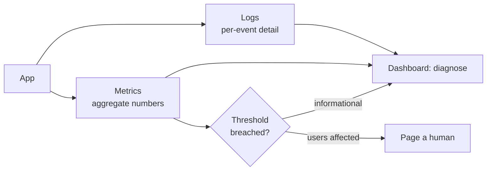

## Before you start

You need to have written a server that handles requests. [performance-profiling](performance-profiling) is a good companion — monitoring tells you *that* something is slow, profiling tells you *why*.

## In one sentence

Logging is recording what your program did so you can reconstruct it later; monitoring is watching those records and metrics continuously so you find out something is wrong before your users tell you.

## Why it matters

Production is the one environment you cannot debug interactively. You can't set a breakpoint on a customer's checkout at 3am. All you'll ever have is what you wrote down at the time.

That makes logging a decision you make *before* the incident. The failure mode is symmetrical and both halves are common: log too little and an outage becomes archaeology; log everything and the one line that mattered is buried under ten million that didn't — and you're paying to store all of it.

## The intuition

Think of a flight recorder versus a cockpit warning light.

**Logs** are the flight recorder: a detailed record of individual events, consulted after something happens. They answer "what happened to *this* request?"

**Metrics** are the warning light: cheap aggregate numbers sampled continuously. They answer "how is the system doing *right now*?" You can't store a log line per request forever, but you can store "requests per second" forever.

**Alerts** are the light that wakes a human. That's the scarce resource. Every alert spends someone's attention, and attention is finite — so the bar for an alert is much higher than the bar for a dashboard.



## How it actually works

**Structured logging** is the foundational habit. Instead of gluing values into a sentence, emit one JSON object per line with named fields. `Order 991 failed for user 42` is readable by a human and useless to a machine. `{"msg":"order failed","orderId":991,"userId":42}` can be searched, filtered, grouped, and counted.

**Levels** must mean something, and the meaning is about *who cares*:

- `error` — something failed that needs a human eventually. If nobody would act, it's not an error.
- `warn` — recovered, but suspicious. A retry that succeeded.
- `info` — significant business events. Request completed, order placed.
- `debug` — details for diagnosis, off in production by default.

The discipline that makes levels worth having: if `error` fires routinely and nobody reacts, it has become noise and the level is a lie.

**Correlation IDs** are what make logs usable in a distributed system. Generate an ID per incoming request, attach it to every log line, and pass it downstream in a header. Now one search reconstructs a request's entire journey across five services.

For metrics, the **four golden signals** from Google's SRE book are the standard starting set: **latency**, **traffic**, **errors**, and **saturation**. If you only instrument four things, instrument those.

**Alerting** has one rule worth more than the rest: **alert on symptoms, not causes.** "Checkout error rate is 8%" is a symptom — users are affected, page someone. "CPU is at 90%" is a cause that may be entirely fine. Paging on causes is the fastest route to **alert fatigue**, the state where responders have learned that alerts are usually nothing and start ignoring them — at which point your alerting system is worse than none, because it provides false assurance.

## Worked example

A structured logger in about fifteen lines — this is genuinely most of what the libraries do:

```js
const LEVELS = { debug: 10, info: 20, warn: 30, error: 40 };
const threshold = LEVELS[process.env.LOG_LEVEL ?? 'info'];

function log(level, msg, fields = {}) {
  if (LEVELS[level] < threshold) return;                 // cheap filter
  process.stdout.write(JSON.stringify({
    ts: new Date().toISOString(), level, msg, ...fields, // one JSON object per line
  }) + '\n');
}

const REDACT = new Set(['password', 'token', 'authorization', 'card']);
function safe(obj) {                                      // never log secrets
  return Object.fromEntries(Object.entries(obj).map(([k, v]) =>
    [k, REDACT.has(k.toLowerCase()) ? '[REDACTED]' : v]));
}

// A child logger binds context once, so every line carries it.
function child(base) {
  return (level, msg, fields = {}) => log(level, msg, { ...base, ...fields });
}

const reqLog = child({ requestId: 'a1b2c3', userId: 42, route: 'POST /orders' });
reqLog('info',  'request received');
reqLog('debug', 'cache miss', { key: 'user:42' });
reqLog('info',  'order created', safe({ orderId: 991, amount: 25.5, password: 'hunter2' }));
reqLog('error', 'payment failed', { err: 'card_declined', durationMs: 812 });
```

Output with the default level:

```
{"ts":"2026-08-28T12:24:02.076Z","level":"info","msg":"request received","requestId":"a1b2c3","userId":42,"route":"POST /orders"}
{"ts":"2026-08-28T12:24:02.076Z","level":"info","msg":"order created","requestId":"a1b2c3","userId":42,"route":"POST /orders","orderId":991,"amount":25.5,"password":"[REDACTED]"}
{"ts":"2026-08-28T12:24:02.076Z","level":"error","msg":"payment failed","requestId":"a1b2c3","userId":42,"route":"POST /orders","err":"card_declined","durationMs":812}
```

Three things are doing real work. The `debug` line is **absent** — filtered by level, so you can raise verbosity via an env var during an incident without redeploying. Every line carries `requestId`, so one query returns the whole request. And the password shows as `[REDACTED]`: logs get shipped to third-party systems and read by many people, so a logged secret is a breach.

Set `LOG_LEVEL=debug` and the cache-miss line appears too — same binary, more detail.

## A second example — when it gets harder

Now the part that separates people who've been on call from people who haven't: **what deserves to wake someone up.**

Consider a service where the database briefly becomes slow. A naive setup fires:

```
ALERT: CPU > 80% on api-3
ALERT: DB connection pool utilisation > 90%
ALERT: p99 latency > 2s
ALERT: memory > 75% on api-3
ALERT: checkout error rate > 5%
```

Five pages, one incident, at 3am. Four are causes and one is the symptom — and the symptom is the only one that tells you users are hurt. Worse, if the pool recovers by itself in ninety seconds, all five were noise, and the responder learns a little more to distrust the pager.

The discipline:

| Signal | Page? | Why |
|---|---|---|
| Checkout error rate > 5% for 5 min | **Yes** | Users are actively failing to buy |
| p99 latency > 2s for 10 min | **Yes** | User-visible, sustained |
| Disk will be full in 4 hours | **Yes** | Imminent and certain |
| CPU at 90% | No | Dashboard. Fine if latency is fine |
| Pool at 90% | No | Dashboard. Symptom will page if it matters |
| One 500 error | No | Log it. Rate matters, not instances |

Two mechanisms make this work. **Duration thresholds** — "for 5 minutes" — stop momentary blips paging anyone. And **symptom-level alerting** means one incident produces roughly one page, with causes on a dashboard for when the responder arrives.

The honest test: *if this fires and I do nothing, will a user be harmed?* If no, it's a dashboard. Applying that to an existing alert set usually deletes half of it — and the rest gets taken seriously again.

## Quick reference

| Signal | Question | Example |
|---|---|---|
| Latency | How slow? | p50/p99 request duration |
| Traffic | How much demand? | requests/sec |
| Errors | How often failing? | 5xx rate as a % |
| Saturation | How full? | queue depth, event loop lag |

## Tools & frameworks

| Tool | What it's for | Reach for it when |
|---|---|---|
| [Pino](https://getpino.io/) | Fast structured JSON logging for Node | Any Node service — structured beats `console.log` immediately |
| [Prometheus](https://prometheus.io/docs/introduction/overview/) | Metrics collection and alert rules | You need numbers over time, not log lines |
| [Grafana](https://grafana.com/docs/grafana/latest/) | Dashboards across metrics, logs and traces | You are correlating a latency spike with a log burst |
| [Grafana Loki](https://grafana.com/docs/loki/latest/) | Label-indexed log aggregation | Log volume makes full-text indexing too expensive |
| [OpenTelemetry JS](https://opentelemetry.io/docs/languages/js/) | Unified logs, metrics and traces | You want one instrumentation layer instead of three agents |

The mistake to name is logging where you should be metering: one log line per request is not a latency histogram.

## Common mistakes

- Logging free-text sentences instead of JSON, making search and aggregation impossible.
- Logging secrets, tokens, passwords, or personal data — logs travel widely and are rarely as protected as your database.
- No correlation ID, so a request across services can't be reassembled.
- `error` used for things nobody acts on, until real errors are invisible.
- Alerting on causes (CPU, memory) instead of symptoms (users failing), producing multiple pages per incident.

## What interviewers ask

- **Why structured logging?** — Named fields make logs searchable, filterable, and countable by machines. They're checking whether you've operated software, not just written it.
- **What are the four golden signals?** — Latency, traffic, errors, saturation. The best starting instrumentation for any user-facing service.
- **What should trigger a page vs a dashboard?** — Page on symptoms affecting users, sustained over a duration. Dashboard everything else. The test is "if I ignore this, is a user harmed?"
- **What is alert fatigue and why is it dangerous?** — Responders desensitised by noisy alerts start ignoring all of them, including real ones — which is worse than no alerting because it creates false confidence.
- **How do you trace a request across microservices?** — A correlation ID generated at the edge, attached to every log line, and propagated in a header to every downstream call.

## Practice

1. Add the `child` logger above to an HTTP server so every request gets a `crypto.randomUUID()` correlation ID, and log start and completion with duration.
2. Take five alerts from any system you know and classify each as symptom or cause. Rewrite the cause-based ones as symptom-based, with duration thresholds.
3. Write a redaction function handling *nested* objects and arrays, and prove `{ user: { password: 'x' } }` is redacted at any depth.

## Where to go next

[secrets-management](secrets-management) — the natural follow-on, since the fastest way to leak a secret is to log it. [message-brokers-in-practice](message-brokers-in-practice) shows why correlation IDs matter even more once work is asynchronous.
