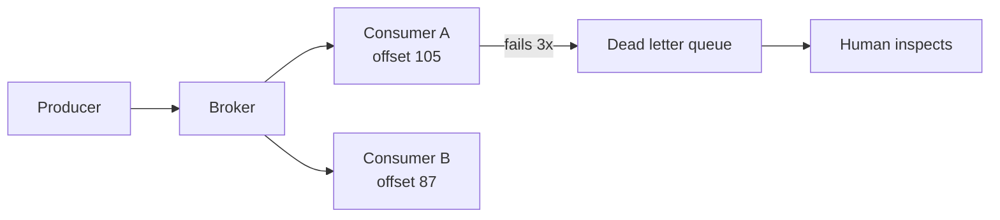

## Before you start

You need HTTP request/response and a sense of why a slow operation blocks a caller. [logging-and-monitoring](logging-and-monitoring) helps, since async systems are much harder to debug without correlation IDs.

## In one sentence

A **message broker** sits between your services and holds work in a queue, so the sender can hand off a task and move on immediately while a separate consumer picks it up and does it — even if that consumer is currently busy, slow, or restarting.

## Why it matters

Consider checkout. Charging the card, sending a receipt, updating inventory, notifying the warehouse, refreshing analytics. Do it all inline and the customer waits for the slowest one — and if the email provider is down, the *purchase* fails over an email.

Publish an `order.placed` message instead and checkout returns in 50ms. The email service consumes when it can. If it's down for ten minutes, messages wait in the queue and get processed on recovery. Nobody loses an order.

That's the trade: **latency and coupling for complexity**. You gain resilience and independent scaling; you take on duplicates, ordering questions, and failures that surface far from their cause.

## The intuition

Two shapes, and picking the wrong one causes most confusion.

A **queue** is a to-do list: each task done once, by one worker. Add workers to go faster, because they split the list. RabbitMQ and SQS are built around this.

A **log** is a diary: messages are appended and *kept*, and many independent consumers each read at their own pace, tracking their own position. Reading removes nothing, so a new consumer can start from the beginning and replay history. That's Kafka.

The distinction that matters: in a queue a consumed message is gone; in a log it stays, so five teams consume `order.placed` independently and a sixth can join next year and catch up.



## How it actually works

**Consumer groups** are how you scale. A topic is split into **partitions**, and each partition is assigned to exactly one consumer in a group — so five consumers across five partitions process in parallel without duplicating work. Add a sixth consumer and it sits idle, because **partition count caps your parallelism**. Lose a consumer and its partitions are reassigned automatically.

**Ordering** is the guarantee people most often assume wrongly. Brokers guarantee order **within a partition**, not across a topic. Messages are routed to partitions by a key, so if you key by `orderId`, everything for one order lands in one partition and stays ordered relative to itself — while different orders process in parallel. Global ordering across a whole topic requires a single partition, which means a single consumer and no parallelism at all.

**Delivery semantics** come in three flavours, and one of them isn't really available:

- **At-most-once**: acknowledge before processing. Fast, loses messages on a crash.
- **At-least-once**: acknowledge after processing. Never loses, but **duplicates** — if the consumer crashes after doing the work and before acknowledging, the message is redelivered.
- **Exactly-once**: what everyone wants. Genuinely hard, requires transactional coordination, and is usually approximated.

Nearly every real system runs **at-least-once plus idempotent consumers**. That's the practical answer to "exactly once": accept that duplicates will happen and make processing the same message twice harmless.

A **dead letter queue** catches messages that keep failing. Configure a maximum receive count — SQS's redrive policy calls it `maxReceiveCount` — and after that many failed attempts the broker moves the message aside instead of retrying it forever. Without one, a single unprocessable "poison" message is retried infinitely, blocking the queue and burning CPU.

## Worked example

A queue with retries, a DLQ, and idempotency — the four behaviours you must understand, in one runnable script:

```js
const queue = [1, 2, 3].map((n) => ({ id: `m${n}`, body: { orderId: n }, receiveCount: 0 }));
queue.push({ id: 'm1', body: { orderId: 1 }, receiveCount: 0 });  // a DUPLICATE of m1
const dlq = [], processed = new Set(), MAX_RECEIVES = 3;

async function handler(msg) {
  if (msg.body.orderId === 2) throw new Error('poison message: bad payload');
  return `charged order ${msg.body.orderId}`;
}

while (queue.length) {
  const msg = queue.shift();
  msg.receiveCount++;
  if (processed.has(msg.id)) {                         // duplicate delivery
    console.log(`${msg.id} already processed - skipping (idempotency)`);
    continue;
  }
  try {
    const out = await handler(msg);
    processed.add(msg.id);                             // record BEFORE acking
    console.log(`${msg.id} OK   -> ${out} (delivery #${msg.receiveCount})`);
  } catch (err) {
    if (msg.receiveCount >= MAX_RECEIVES) {
      dlq.push({ ...msg, lastError: err.message });    // stop retrying forever
      console.log(`${msg.id} FAIL -> moved to DLQ after ${msg.receiveCount} deliveries`);
    } else {
      console.log(`${msg.id} FAIL -> retry (delivery #${msg.receiveCount}): ${err.message}`);
      queue.push(msg);
    }
  }
}
console.log('\nDLQ contents:', dlq.map(m => `${m.id}(${m.lastError})`).join(', ') || 'empty');
```

Output:

```
m1 OK   -> charged order 1 (delivery #1)
m2 FAIL -> retry (delivery #1): poison message: bad payload
m3 OK   -> charged order 3 (delivery #1)
m1 already processed - skipping (idempotency)
m2 FAIL -> retry (delivery #2): poison message: bad payload
m2 FAIL -> moved to DLQ after 3 deliveries

DLQ contents: m2(poison message: bad payload)
```

Four behaviours, all visible. `m1` arrives twice — an at-least-once redelivery — and the second time the idempotency check skips it, so the customer isn't charged twice. `m2` fails repeatedly and lands in the DLQ after three attempts rather than blocking the queue forever. `m3` is unaffected by its neighbour's failure. And the queue drains instead of spinning.

Notice messages complete out of order: `m3` finishes before `m2`. That's normal and correct for a work queue.

## A second example — when it gets harder

The idempotency check above uses a `Set`, which works for one process. In production you have twenty consumers on different machines, and it breaks immediately.

```js
// BROKEN across consumers: the Set is in-memory and per-process.
if (processed.has(msg.id)) return;
processed.add(msg.id);
// Two consumers get the same redelivered message. Neither has it locally. Both charge.

// STILL BROKEN with a shared DB — a gap between reading and writing:
const seen = await db.get(msg.id);
if (seen) return;
await handleAndRecord(msg);     // another consumer slips in during this gap
```

Real idempotency needs **shared, atomic** state — the atomicity matters as much as the sharing.

The robust patterns collapse both steps into one atomic operation. A **unique constraint** on `message_id` lets the database reject the duplicate — attempt the insert, treat a violation as "already handled". A **conditional write** does the same in one round trip. Best of all, make the operation **naturally idempotent**: `SET status = 'paid'` gives the same result applied five times; `balance = balance - 10` does not.

The rule worth remembering: **prefer operations safe to repeat over machinery that prevents repeats.**

Two more traps. A DLQ nobody watches is a silent data-loss bucket — alert on its depth. And **consumer lag** is the health metric here: a queue growing faster than it drains looks fine right up until it doesn't.

## Quick reference

| | Kafka | RabbitMQ | SQS |
|---|---|---|---|
| Model | Distributed log | Queue + exchanges | Managed queue |
| Messages after read | Retained, replayable | Removed on ack | Removed on delete |
| Ordering | Per partition | Per queue | FIFO queues only |
| Routing | Topic + key | Rich (fanout, topic, direct) | Simple |
| Best for | Event streams, replay, analytics | Complex routing, task queues | Simple decoupling on AWS |
| Ops burden | High | Medium | None (managed) |

## Common mistakes

- Assuming global ordering. Order holds within a partition; use a key to group what must stay ordered.
- Building on the belief that a message arrives exactly once. Design for duplicates.
- Doing idempotency with an in-memory `Set`, which fails the moment you run two consumers.
- Check-then-write idempotency, which has a race window; use a unique constraint or conditional write.
- No DLQ, so one poison message is retried forever and blocks the queue.
- A DLQ nobody monitors, quietly accumulating lost customer actions.

## What interviewers ask

- **Kafka vs RabbitMQ vs SQS?** — Kafka is a retained log for event streams and replay; RabbitMQ is a broker with rich routing for task queues; SQS is a managed queue for simple decoupling. They want a use-case answer, not a favourite.
- **What's a consumer group and how does it scale?** — Consumers sharing a subscription, each assigned distinct partitions so work isn't duplicated. Parallelism is capped by partition count.
- **Do brokers guarantee ordering?** — Only within a partition. Global ordering needs one partition, which eliminates parallelism — that's the trade-off they're probing.
- **What does at-least-once mean and what does it force on you?** — No loss but possible duplicates, so consumers must be idempotent. The follow-up is always *how*: unique constraints, conditional writes, or naturally repeatable operations.
- **What is a DLQ and why do you need one?** — Where messages go after N failed attempts, so a poison message stops blocking the queue. It must be monitored, or it becomes silent data loss.

## Practice

1. Replace the in-memory `Set` with a `Map` simulating a database, and add a deliberate `await` between the check and the write. Run two concurrent consumers and demonstrate the double-charge.
2. Add exponential backoff so retries wait 1s, 2s, 4s. Explain why immediate retries make an overloaded downstream service worse.
3. Design the message flow for an order system with payment, email, and inventory consumers. State which need strict ordering, which are naturally idempotent, and where you'd put DLQs.

## Where to go next

`kubernetes-basics` — brokers and consumers are usually deployed as independently scaled workloads. [logging-and-monitoring](logging-and-monitoring) is essential here, since consumer lag and DLQ depth are the metrics that tell you an async system is failing.
