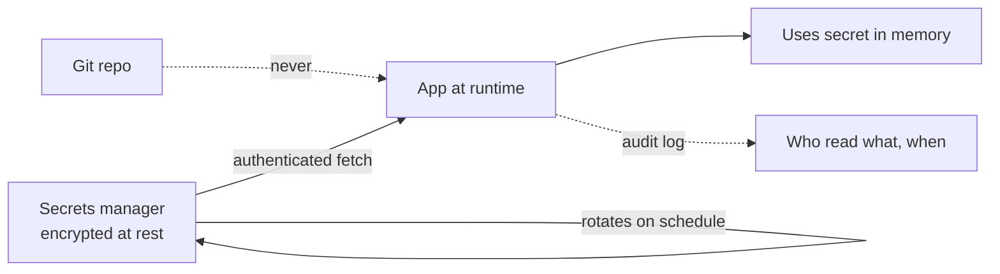

## Before you start

You need `authentication-authorization` and basic Node. [logging-and-monitoring](logging-and-monitoring) is worth reading alongside, because logging is one of the most common ways secrets escape.

## In one sentence

Secrets management is how you get passwords, API keys, and encryption keys to the code that needs them without ever writing them somewhere they can be read by people — or bots — who shouldn't see them.

## Why it matters

A leaked secret is not a bug you fix by deploying a patch. Someone else has your database credentials, and they keep working until you rotate them.

The dominant leak path is embarrassingly simple: **credentials committed to git**. Automated scanners watch public GitHub pushes and exploit exposed AWS keys within minutes. And git makes it permanent — deleting the line in a later commit changes nothing, because the secret is still sitting in history that anyone with the repo can read. Once committed, a secret is compromised, and the only real fix is to rotate it.

## The intuition

Rank storage by how many people can read it and how long it lives.

**Hardcoded in source** is worst: in the repo, in every clone, in history forever. **Environment variables** are a real improvement — config lives outside the code, so one image runs anywhere with different values — but they're visible to the whole process, dumped by crash handlers, and shown by `docker inspect`. **A secrets manager** (Vault, AWS Secrets Manager, Azure Key Vault) is the mature answer: encrypted storage, per-service authenticated access, logged reads, automated rotation.

The pattern to internalise: **secrets flow in at runtime; they never sit in the artefact.** Your image, repo, and build logs should all be safe to hand to a stranger.



## How it actually works

**At rest**, secrets are stored encrypted with a strong authenticated algorithm — OWASP's cheat sheet specifically names AES-256 in GCM mode. "Authenticated" is the key property: GCM produces an **authentication tag** alongside the ciphertext, so decryption *fails loudly* if a single bit was altered. Plain AES-CBC would happily decrypt tampered data into garbage.

Three inputs matter. The **key** (32 bytes for AES-256) is the actual secret. The **IV** (initialisation vector, 12 bytes for GCM) must be unique for every encryption with a given key — reusing an IV in GCM is catastrophic and breaks the whole scheme. It doesn't need to be secret, so store it alongside the ciphertext. And the **auth tag** (16 bytes) is your tamper detection.

**Rotation** replaces a secret on a schedule so a stolen credential has a limited life. The hard part isn't generating a new key — it's keeping data encrypted under the old one readable. The solution is a **key ID stored with each ciphertext**: new data uses the current key, old data decrypts with whichever key its ID names.

**Comparing** secrets needs care too. `===` returns as soon as it finds a differing byte, so response time leaks how much of a guess was correct. `crypto.timingSafeEqual` always takes the same time.

## Worked example

Real AES-256-GCM encryption at rest — this runs as-is:

```js
import { randomBytes, createCipheriv, createDecipheriv } from 'node:crypto';

const key = randomBytes(32);                      // 32 bytes = AES-256

function encrypt(plaintext, key) {
  const iv = randomBytes(12);                     // UNIQUE per encryption, always
  const c = createCipheriv('aes-256-gcm', key, iv);
  const ct = Buffer.concat([c.update(plaintext, 'utf8'), c.final()]);
  return Buffer.concat([iv, c.getAuthTag(), ct]).toString('base64');  // iv|tag|ct
}

function decrypt(blob, key) {
  const b = Buffer.from(blob, 'base64');
  const d = createDecipheriv('aes-256-gcm', key, b.subarray(0, 12));
  d.setAuthTag(b.subarray(12, 28));               // throws below if this fails
  return Buffer.concat([d.update(b.subarray(28)), d.final()]).toString('utf8');
}

const secret = 'postgres://user:s3cr3t@db:5432/app';
const stored = encrypt(secret, key);
console.log('stored   :', stored.slice(0, 48) + '...');
console.log('roundtrip:', decrypt(stored, key));
console.log('same input twice differs:', encrypt(secret, key) !== encrypt(secret, key));

const tampered = Buffer.from(stored, 'base64');
tampered[tampered.length - 1] ^= 0x01;            // flip ONE bit
try { decrypt(tampered.toString('base64'), key); }
catch (e) { console.log('tamper detected:', e.message); }
```

Output:

```
stored   : BzTbNbD1zTVyUPryJNTVl1l9GhOcFuwnZ/6w97t4rKEE9ZB9...
roundtrip: postgres://user:s3cr3t@db:5432/app
same input twice differs: true
tamper detected: Unsupported state or unable to authenticate data
```

Two results matter most. **Encrypting the same string twice produces different output** — because the IV is random each time, so an attacker can't tell that two records hold identical values. And flipping a **single bit** makes decryption throw rather than return corrupted data. That's the authentication in "authenticated encryption", and it's why GCM is specified rather than a bare cipher mode.

## A second example — when it gets harder

The naive model — "one key, encrypt everything" — collapses the first time you rotate. If you swap the key, every existing row becomes permanently unreadable.

The fix is to tag each ciphertext with the ID of the key that produced it:

```js
const keyring = { v1: randomBytes(32), v2: randomBytes(32) };
const ACTIVE = 'v2';                       // new writes use v2; v1 is kept to read old data

function encrypt(pt) {
  const iv = randomBytes(12);
  const c = createCipheriv('aes-256-gcm', keyring[ACTIVE], iv);
  const ct = Buffer.concat([c.update(pt, 'utf8'), c.final()]);
  return `${ACTIVE}:${Buffer.concat([iv, c.getAuthTag(), ct]).toString('base64')}`;
}

function decrypt(blob) {
  const [kid, data] = blob.split(':');      // which key wrote this?
  const key = keyring[kid];
  if (!key) throw new Error(`unknown key id ${kid}`);
  const b = Buffer.from(data, 'base64');
  const d = createDecipheriv('aes-256-gcm', key, b.subarray(0, 12));
  d.setAuthTag(b.subarray(12, 28));
  return Buffer.concat([d.update(b.subarray(28)), d.final()]).toString('utf8');
}
```

Output:

```
new record tagged : v2
read old record   : written under v1
read new record   : written under v2
```

The prefix costs three bytes and turns rotation into routine work: add the new key as active, keep the old one for reads, re-encrypt in the background, retire the old key once nothing references it.

The other half is **rotating credentials you don't store yourself** — a database password, a third-party API key. The trick is supporting **two valid credentials at once**: issue the new one, deploy config referencing it, verify traffic moved, then revoke the old. Without that overlap rotation means downtime, and rotation that causes downtime never happens.

## Quick reference

| Storage | Safe for production? | Notes |
|---|---|---|
| Hardcoded in source | Never | In git history permanently |
| `.env` file committed | Never | Same as hardcoded |
| `.env` file, gitignored | Local dev only | Easy to leak by accident |
| Environment variables | Acceptable | Visible to the process, in `docker inspect` |
| Secrets manager / vault | Best | Encrypted, audited, auto-rotated |

## Common mistakes

- Committing a secret and "fixing" it with a later commit. It's still in history — rotate it.
- Reusing an IV with the same key in GCM, which breaks the algorithm's guarantees entirely.
- Using AES-CBC without a MAC, so tampered ciphertext decrypts to garbage instead of failing.
- Logging secrets, or logging a whole config object that happens to contain them.
- Comparing tokens with `===`, leaking length information through timing.
- Storing the encryption key next to the data it protects — one breach then yields both.

## What interviewers ask

- **Why are env vars better than hardcoding, and why still not ideal?** — They keep secrets out of the repo and let one artefact run anywhere; but they're process-wide, appear in crash dumps and `docker inspect`, and have no rotation or audit trail.
- **What is encryption at rest and which algorithm?** — Data encrypted where it's stored so a stolen disk or dump is useless. AES-256-GCM, because it's authenticated: tampering causes decryption to fail rather than return garbage.
- **Why must the IV be unique?** — Reusing an IV with the same key in GCM lets an attacker recover plaintext relationships and can compromise the authentication key. It needn't be secret — just never repeated.
- **How do you rotate an encryption key without losing data?** — Store a key ID with each ciphertext, encrypt new data with the new key, keep the old key for reads, re-encrypt in the background, then retire it.
- **A secret was committed to git — what now?** — Rotate it immediately. It's compromised; history rewriting doesn't help since clones and forks already exist.

## Practice

1. Extend the keyring example with a `reEncrypt(blob)` that decrypts with whatever key ID it finds and re-encrypts under the active key. Verify a `v1` record becomes `v2`.
2. Write a `.env.example` for an app needing a database URL, an API key, and a JWT secret — with placeholders only — and add the real `.env` to `.gitignore`.
3. Compare a 64-character token with `===` versus `timingSafeEqual` over many iterations and describe what an attacker could infer from the timing difference.

## Where to go next

[web-security-fundamentals](web-security-fundamentals) — secrets are one part of a much larger attack surface. [infrastructure-as-code](infrastructure-as-code) matters too: IaC state files often contain secrets in plaintext.
