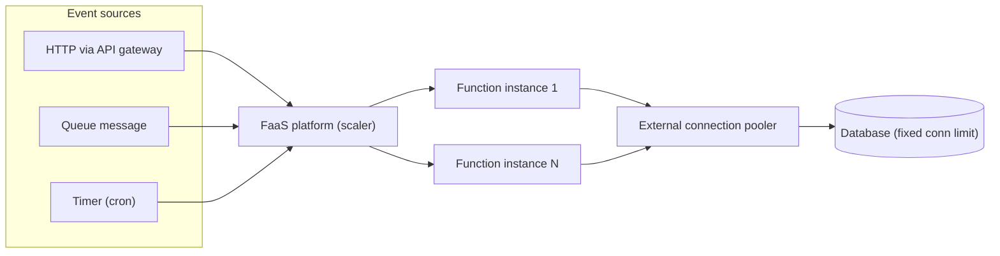
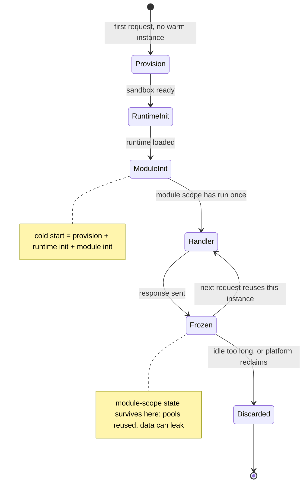

## Before you start

Read [docker-containerization](docker-containerization) — a function runs in a sandbox built from an image-like bundle, and the packaging instincts carry over. [api-gateways-and-proxies](api-gateways-and-proxies) helps, because an HTTP-triggered function almost always sits behind a gateway. Nothing else is required.

## In one sentence

**Serverless** means the platform owns the servers, the scaling and the idle capacity, and you supply only a function plus a trigger — you are billed per invocation rather than per hour a machine is switched on.

## Why it matters

The unlock is genuine. A scheduled job that runs for nine seconds a day used to need a machine that existed for 86,400 seconds a day. An image-resize step that gets 40 requests on Tuesday and 40,000 on Wednesday used to mean provisioning for Wednesday and paying for it all week. Serverless makes both of those cost roughly what the work costs, and scaling out is something you configure rather than build.

What breaks is a set of assumptions you have never had to state. A long-running server lets you keep things in memory, hold a connection open, and take as long as you like. Every one of those is gone, and each removal produces a distinct production failure — leaked data between users, a database that falls over during a traffic spike, a job that dies at the timeout without finishing. Those failures are not bad luck. They are the execution model asserting itself against code written for a server.

Interviewers probe this because "just use Lambda" is the easy answer and the constraints are where the engineering is.

## The intuition

Compare owning a car with a taxi rank.

The car sits on your drive. It is there instantly whenever you want it, you keep your things in the glovebox, and you pay for it whether or not you drive. A long-running server is the car.

At the taxi rank, you say where you are going and a car appears. You pay per trip and nothing while you are not travelling. Two consequences follow immediately. The first trip after a quiet spell takes longer, because a car has to arrive. And you must not leave anything in the taxi, because the next passenger gets that car — and might find your belongings still in it.

That last point is not a stretched metaphor; it is precisely the warm-instance trap below. The taxi does not vanish between trips. It waits nearby with whatever you left inside.

Two words to be careful with. You have not stopped running on servers — you have stopped *managing* them, and someone else is patching an OS on your behalf. And "serverless" now stretches to managed containers that scale to zero and to databases billed per query, which behave differently from a function-as-a-service platform. **FaaS** is the specific case this topic covers: your unit of deployment is a function with a trigger.



Note what the diagram already tells you: instances fan out horizontally with no coordination between them, and the shared database at the bottom does not fan out at all. That mismatch is the source of the classic outage.

## How it actually works

An invocation runs in an **execution environment** — an isolated sandbox holding your code and runtime. Its lifecycle explains every constraint in this topic.



When a request arrives and no environment is available, the platform provisions a sandbox, starts the runtime, and runs your module-level code — everything outside the handler, including every `require` or `import` at the top of the file. Only then does the handler run. That whole prelude is the **cold start**, and you are billed for it.

Once the response is sent, the environment is **frozen** rather than destroyed. The platform keeps it around in case another request arrives, and if one does, that request skips straight to the handler — a **warm start**. Eventually the environment is **discarded**: after idle time, or because the platform recycles environments periodically regardless of traffic.

Two facts follow, and they are the same fact seen from two sides.

**Statelessness is a consequence, not a preference.** Anything you keep in memory may vanish, because the environment can be discarded between any two requests. So a counter, a session, or an in-memory queue is not merely unfashionable here — it is silently lossy, and it will look fine in testing where traffic keeps one instance warm.

**And module-scope state persists between invocations on the same instance.** That is what makes connection reuse work: open a client at module scope and warm invocations reuse it instead of reconnecting. It is also exactly what lets request data leak. Push a user's record into a module-level array and the next invocation on that instance can read it — a different user's request, same object. Both behaviours come from one mechanism, so you cannot have the performance without owning the hazard.

Cold-start duration is dominated by how much work happens before the handler. Importing a whole SDK to use one client, or pulling in a large dependency tree, is paid on every cold start. What genuinely helps: a smaller bundle, importing the specific client rather than the umbrella package, moving rarely-used heavy imports inside the branch that needs them, and **provisioned concurrency** — telling the platform to keep a number of environments initialised in advance, which trades money for predictable latency.

Keep the scale in perspective. A FaaS cold start is typically tens to hundreds of milliseconds, occasionally over a second. [gpu-autoscaling-and-cold-starts](gpu-autoscaling-and-cold-starts) covers the other extreme, where the cold start is loading tens of gigabytes of model weights and takes *minutes*. Same word, different engineering: hundreds of milliseconds you can hide with a warm pool and a retry, minutes you must design the whole autoscaler around.

## Worked example

This simulates the platform's side of the contract: it owns the environment, you supply the module.

```js
function busy(ms) { const end = Date.now() + ms; while (Date.now() < end) {} }

function loadModule() {
  // === MODULE SCOPE: runs once per execution environment, not per request ===
  busy(120);                       // stands in for parsing a big dependency tree
  const pool = { conns: 1, id: Math.random().toString(36).slice(2, 7) };
  let seenUsers = [];              // the accidental leak: outlives the invocation

  return function handler(event) {
    busy(15);                      // the real per-request work
    seenUsers.push(event.user);
    return { pool: pool.id, seenByThisInstance: [...seenUsers] };
  };
}

class Platform {
  constructor() { this.env = null; this.starts = 0; }
  invoke(event) {
    const t0 = Date.now();
    let kind = 'warm';
    if (!this.env) {               // no frozen environment available -> cold start
      kind = 'COLD';
      this.starts++;
      this.env = loadModule();     // init phase: module scope executes here
    }
    const out = this.env(event);
    return { kind, ms: Date.now() - t0, ...out };
  }
  discard() { this.env = null; }   // platform reclaims the environment
}

const p = new Platform();
for (const user of ['alice', 'bob', 'carol']) {
  const r = p.invoke({ user });
  console.log(`${r.kind.padEnd(4)} ${String(r.ms).padStart(3)}ms  pool=${r.pool}  sawUsers=[${r.seenByThisInstance}]`);
}
p.discard();
const r = p.invoke({ user: 'dave' });
console.log(`${r.kind.padEnd(4)} ${String(r.ms).padStart(3)}ms  pool=${r.pool}  sawUsers=[${r.seenByThisInstance}]`);
console.log(`cold starts: ${p.starts} of 4 invocations`);
```

Real output:

```
COLD 135ms  pool=foxta  sawUsers=[alice]
warm  15ms  pool=foxta  sawUsers=[alice,bob]
warm  15ms  pool=foxta  sawUsers=[alice,bob,carol]
COLD 135ms  pool=bkxrg  sawUsers=[dave]
cold starts: 2 of 4 invocations
```

Three things in five lines. The cold invocation costs 135ms against 15ms warm, and all 120ms of the difference is module-scope work you chose to do. The `pool` id is identical across the three warm calls, which is the connection reuse you want. And `sawUsers` grows — by Carol's request the instance holds Alice's and Bob's data too. After the discard, a fresh instance has a new pool and an empty list, which is why this bug is invisible on a single test request.

## A second example — when it gets harder

Now the failure that takes down production. Each concurrent invocation gets its own environment, and if each opens its own database connection, concurrency *is* connection count.

```js
const DB_LIMIT = 100;
function run(concurrency, viaPooler) {
  let open = 0, rejected = 0, served = 0;
  const pooler = { held: 0, max: 20 };     // the pooler's own small real pool
  for (let i = 0; i < concurrency; i++) {
    if (viaPooler) {
      if (pooler.held < pooler.max) pooler.held++;
      open = pooler.held;                  // what the DB actually sees
      served++;
    } else {
      if (open < DB_LIMIT) { open++; served++; } else rejected++;
    }
  }
  return { dbConnections: open, served, rejected };
}
for (const n of [10, 100, 500]) {
  const d = run(n, false), p = run(n, true);   // direct vs via an external pooler
  console.log(
    `concurrency ${String(n).padStart(3)} | direct: db=${String(d.dbConnections).padStart(3)}` +
    ` rejected=${String(d.rejected).padStart(3)} | pooler: db=${String(p.dbConnections).padStart(3)}` +
    ` rejected=${p.rejected}`
  );
}
```

```
concurrency  10 | direct: db= 10 rejected=  0 | pooler: db= 10 rejected=0
concurrency 100 | direct: db=100 rejected=  0 | pooler: db= 20 rejected=0
concurrency 500 | direct: db=100 rejected=400 | pooler: db= 20 rejected=0
```

At 10 and 100 concurrent invocations everything is fine, which is why this passes every test you ran. At 500 the database refuses 400 of them, and the errors are connection errors, not slow queries — so the dashboard blames the database while the cause is the scaling you asked for.

Why does a **connection pool** not save you? On a long-running server a pool is shared: one process, one pool, many requests taking turns, and [connection-pooling](connection-pooling) explains why that is efficient. Here each instance has its own pool, so a pool of 5 across 500 instances is 2,500 connections attempted, not 5. The pool makes it *worse*, because pooling assumes a process that outlives many requests and amortises across them, and the function instance is the wrong granularity for that assumption.

The fix has to live outside the functions: an external pooler or database proxy that many instances share, multiplexing them onto a small number of real connections, or an HTTP data API where the connection concept never reaches you. The shape of the fix — move the shared resource to something that is actually shared — is the transferable lesson.

Other limits shape design the same way. There is a hard **execution timeout**, so long jobs must be split or moved elsewhere. **Payload size** is capped, so large data travels by object store with a reference passed in the event. **Memory and CPU are coupled**, so raising memory buys speed and sometimes lowers total cost by finishing sooner. And you cannot hold a long-lived connection inside the function, so a WebSocket server does not live here — the gateway holds the socket and invokes your function per message, which is why [websockets-vs-polling](websockets-vs-polling) matters before you promise real-time.

Cost has a crossover rather than a verdict. You pay per invocation and per unit of memory-time, so idle costs nothing and a spike costs exactly the spike. A container costs the same whether it serves one request or thousands, so its cost per request falls as traffic rises while a function's stays flat. Somewhere the lines cross. Reason about it by taking your requests per month and average duration, computing memory-time, and comparing against the smallest always-on instance that could carry the peak — then check what your traffic shape does to the answer, because spiky and idle traffic sits far from steady high volume.

## Quick reference

| Consideration | Serverless function | Long-running container |
|---|---|---|
| Billing | Per invocation and memory-time | Per hour of uptime |
| Idle cost | Effectively zero | Full price |
| Scale-out | Platform-managed, near instant | You configure an autoscaler |
| First-request latency | Cold start, tens to hundreds of ms | Warm once deployed |
| In-memory state | Unsafe: instance may vanish or be reused | Safe for process lifetime |
| DB connections | One or more per concurrent instance | One shared pool per process |
| Max duration | Hard platform timeout | Unbounded |
| Long-lived sockets | Not in the function | Native |
| Best at | Spiky, event-driven, cron, fan-out | Steady high throughput, low latency |

## Tools & frameworks

| Tool | What it's for | Reach for it when |
|---|---|---|
| [AWS Lambda](https://docs.aws.amazon.com/lambda/latest/dg/welcome.html) | The reference FaaS platform | Interviews assume Lambda's model: cold starts, concurrency, timeouts |
| [Cloudflare Workers](https://developers.cloudflare.com/workers/runtime-apis/nodejs/) | V8-isolate functions at the edge | Cold starts must be near-zero and you accept a partial Node API |
| [Serverless Framework](https://www.serverless.com/framework/docs) | Deploying functions and their event sources | You want the function and its triggers defined together |
| [AWS SAM](https://docs.aws.amazon.com/serverless-application-model/latest/developerguide/what-is-sam.html) | CloudFormation-native serverless IaC | You are AWS-only and want local invoke plus native CFN |
| [Knative](https://knative.dev/docs/) | Scale-to-zero on your own Kubernetes | You want FaaS economics without leaving your cluster |
| [Hono](https://hono.dev/docs) | One handler for Node, Workers and Lambda | You refuse to be locked to a single runtime's handler signature |

Two problems define this topic: cold starts, and connection exhaustion when a thousand concurrent function instances each open a database connection — which is exactly why a pooler or data proxy shows up in serverless architectures.

## Common mistakes

- Caching per-user data at module scope. It survives the invocation and the next user on that instance can read it.
- Opening a database connection per invocation with no external pooler, then discovering the limit only during a real traffic spike.
- Importing an entire SDK at module scope to use one client, paying for it on every cold start.
- Treating warm instances as guaranteed. Traffic keeps them alive in testing; the platform recycles them regardless.
- Choosing serverless for steady high-volume traffic on cost grounds without checking the crossover, where a container is usually cheaper.
- Trying to run a job longer than the timeout and discovering the limit through truncated work rather than a clean error.

## What interviewers ask

- **What does serverless actually mean?** — You still run on servers; you stop managing them and pay per invocation instead of per hour. They are checking you do not think the servers disappeared.
- **What is a cold start and what makes it worse?** — Provisioning the sandbox, initialising the runtime, and running module-level code before the handler. A large dependency tree makes it much worse because those imports are paid every time.
- **Why must a serverless function be stateless?** — An instance can be discarded between any two requests, so in-memory state is lossy; and it can be reused, so leftover state leaks into another request. Both come from the same freeze-and-reuse model.
- **Your function spikes to 500 concurrent invocations and the database falls over — why?** — Each concurrent instance holds its own connection, so concurrency equals connection count and the database's fixed limit is exhausted. The fix is a shared external pooler, not a bigger in-process pool.
- **When would you not choose serverless?** — Steady high throughput (a container is cheaper), jobs longer than the timeout, latency-critical paths where cold starts are unacceptable, and anything needing heavy local state or long-lived connections.

## Practice

1. Extend the platform simulation to hold a pool of several environments and route each invocation to a free one, creating a new one only when all are busy. Feed it a burst of 50 concurrent invocations and count cold starts.
2. Add an idle timer so an environment is discarded after N milliseconds without an invocation. Drive it with steady traffic and then bursty traffic, and compare the cold-start rate for the same total request count.
3. Take the connection model and add a queue in front of the functions that caps concurrency. Find the concurrency limit that keeps the database under its connection ceiling, and write down what that limit costs you in latency.

## Where to go next

[message-brokers-in-practice](message-brokers-in-practice) — the natural pairing, since queue-triggered functions are where serverless is strongest and where concurrency control lives. Then [logging-and-monitoring](logging-and-monitoring), because you cannot attach a debugger to an instance that no longer exists, so observability is the only way to understand a function in production.
