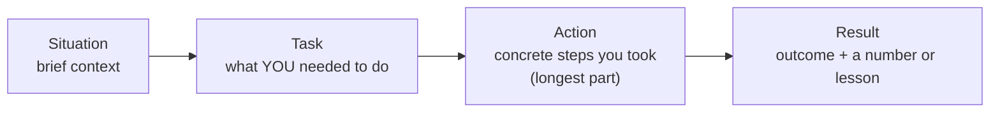

## Before you start

Requires `whiteboarding-practice` in spirit — both rounds reward narrating your real reasoning, but here the subject is your past behavior, not a live design.

## In one sentence

A **behavioral interview** asks you to describe real things you've actually done ("Tell me about a time you disagreed with a teammate") so the interviewer can use your past behavior as evidence to predict how you'll act on their team.

## Why it matters

Technical skill alone doesn't predict whether someone communicates well under pressure, takes ownership of mistakes, or works well with people who disagree with them — behavioral questions are how companies screen for that directly. Answering with vague generalities ("I'm a team player") instead of one specific story is the single biggest reason strong engineers underperform in this round, because a generality gives the interviewer nothing to actually evaluate.

## The intuition

A courtroom doesn't accept "he's generally an honest person" as evidence — it wants one specific, checkable account: what happened, when, who was there, what was said. Behavioral interviews work the same way. "I always try to communicate clearly" is a character reference; "here's the specific time I disagreed with my lead, here's exactly what I said, here's what happened" is testimony. Interviewers can only cross-examine testimony — a character reference has nothing in it to probe.

## How it actually works

The standard structure for an answer is **STAR**: Situation, Task, Action, Result. You briefly set the scene (Situation), say what you specifically needed to do (Task), describe the concrete steps you took (Action — this should be the longest part), and close with what happened (Result), ideally with a number or a genuine lesson learned.



Before the interview, prepare 5–6 stories that each can flex to answer multiple common questions: a conflict with a teammate, a mistake you made, a time you led without formal authority, a tight deadline. One story about a project deadline can answer "tell me about a challenge," "tell me about pressure," and "tell me about prioritization" — you just re-emphasize a different part of the same Action section each time, rather than needing a separate story for each question.

## Worked example

```text
Q: "Tell me about a time you disagreed with a decision at work."

S: Our team was about to ship a feature using a third-party library
   I'd found reliability issues with during testing.
T: I needed to raise the concern without just overruling the team's
   existing plan two days before the deadline.
A: I wrote up the three specific failures I'd reproduced, proposed a
   fallback approach that only added one day, and brought it to our
   lead with data instead of just an opinion.
R: We delayed launch by one day, avoided a production incident the
   library later caused for another team, and I now flag reliability
   concerns earlier in the review cycle instead of at the end.
```

Notice the Action section is the longest and most specific part — that's where interviewers are actually listening. The Situation and Task exist only to make the Action make sense; they should take a fraction of the airtime.

## A second example — when it gets harder

The formula above is straightforward for questions about disagreement or pressure. It gets genuinely uncomfortable with **"tell me about a time you failed"** — where the honest Result is not a triumphant recovery, and the temptation is to pick a fake failure (a humble-brag disguised as a flaw) instead of a real one:

```text
Q: "Tell me about a time you failed."

Weak (fake failure): "I sometimes work too hard and forget to take
breaks." — This isn't a real failure and interviewers recognize the
pattern immediately; it signals you're avoiding the question.

Honest version:

S: I shipped a database migration without a rollback plan because I
   was confident it was low-risk based on testing in staging.
T: The migration needed to run against production data that turned
   out to have edge cases staging didn't have.
A: It partially failed midway through, and I had to write an
   emergency fix script live, under pressure, instead of just
   reverting cleanly. I fixed the data, but it took two extra hours
   and required help from a teammate.
R: The immediate result was a stressful two hours and one apologetic
   message to the team. The lasting result is that I now write a
   rollback plan for every migration regardless of how "safe" I
   believe it is, and I added a staging dataset closer to production
   scale so this specific gap can't repeat.
```

The honest version is harder to say out loud precisely because the Result isn't flattering — but it's exactly what makes it convincing. An interviewer who hears a real mistake followed by a real, specific behavior change learns something a suspiciously mild "failure" never reveals: that you actually update how you work after things go wrong.

## Quick reference

| STAR part | What goes here | Typical length |
|---|---|---|
| Situation | Brief context, just enough to understand the stakes | 1–2 sentences |
| Task | What you specifically needed to achieve | 1 sentence |
| Action | The concrete steps you took, in your own words | 3–5 sentences |
| Result | Outcome, ideally with a number or a genuine lesson | 1–2 sentences |

## Common mistakes

- Answering in generalities ("I usually...") instead of one specific real story — interviewers can only score concrete evidence, not a character reference.
- Picking a fake, humble-brag "failure" ("I work too hard") instead of a real one — this pattern is recognizable and reads as avoidance, not humility.
- Rehearsing a story so rigidly it sounds memorized — know the key beats, not a word-for-word script, so it still sounds like you thinking, not you reciting.

## What interviewers ask

- **"Tell me about a time you failed."** — They're checking for self-awareness and whether you own mistakes instead of blaming others or dodging with a fake, safe answer.
- **"Tell me about a conflict with a coworker."** — They're assessing whether you can disagree professionally and reach resolution, not whether you avoid conflict entirely.
- **"Tell me about a time you had to learn something quickly."** — They're gauging how you approach the unknown, since most real engineering jobs constantly require exactly this.

## Practice

1. Write out 5–6 stories from your own experience in bullet form (not full sentences yet), each covering a different theme: conflict, failure, leading without authority, a tight deadline, learning something fast.
2. Pick your most uncomfortable real failure and write its STAR answer in full, including a Result that is honestly not a triumphant save — then say it out loud and time it; aim for under two minutes.
3. Record yourself answering "tell me about a time you disagreed with someone" without notes, then check whether your Action section is actually the longest part, or whether you spent most of the time on Situation instead.

## Where to go next

This closes Phase 10. Return to `resume-review` to prepare a fresh application, or revisit `mock-interviews-technical` and `whiteboarding-practice` — behavioral prep is usually the last skill sharpened before a real interview loop, not the first.
