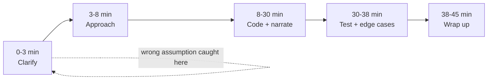

## Before you start

Requires `resume-review` in spirit — you're now past the paper stage and into performing live, under a clock, in front of a stranger.

## In one sentence

A **technical mock interview** is timed practice at solving a coding problem out loud, under the same pressure and format (usually 30–45 minutes, a shared screen, a stranger watching) as the real interview, so the format itself stops being the thing that trips you up.

## Why it matters

Many strong engineers can solve a problem alone, in a quiet room, with unlimited time — and then freeze the first time they're asked to think out loud, on a clock, with someone judging every pause. Interviewers score your communication and approach almost as much as your final answer. Practicing the *format* — not any specific problem — is what turns raw problem-solving ability into an actual passing interview performance.

## The intuition

A real technical interview has a repeating shape, the way a doctor's exam does: symptoms first, then examination, then diagnosis, then treatment plan — never diagnosis before symptoms. Skipping straight to "treatment" (code) before establishing "symptoms" (the actual constraints of the problem) is the single most common way candidates sabotage an otherwise-correct solution. Mock interviews drill the *shape* until following it is automatic, freeing your attention for the actual problem instead of the format.

## How it actually works

The shape is: state the problem, ask clarifying questions, propose an approach, code it while narrating, then test against examples and edge cases. The most common failure is jumping to code before fully understanding the problem — spend the first few minutes restating it in your own words and asking about constraints (input size, negative values, duplicates, sorted or not), because these change which approach is even correct, and asking them signals rigor rather than uncertainty.

Narrate your thinking as you go, even the parts that feel obvious: "I'll use a hash map here so lookups are constant time." Silence makes it impossible for an interviewer to tell whether you're stuck or simply thinking, and most interviewers will nudge you toward the right idea — but only if they know where your head currently is. A wrong idea said out loud is recoverable; a right idea never spoken gives the interviewer nothing to score.



The self-loop on "Clarify" is deliberate: catching a wrong assumption in the first three minutes costs three minutes. Catching the same wrong assumption at minute 30, after you've written the whole solution against it, costs the rest of the interview.

## Worked example

```text
A 45-minute time budget for one coding question:

0:00-0:03  Restate the problem in your own words; ask 2-3 clarifying
           questions (input size, edge cases, expected output format).
0:03-0:08  Propose a brute-force approach out loud, state its
           complexity, then propose a better approach and why it wins.
0:08-0:30  Write the code, narrating each non-trivial line as you type.
0:30-0:38  Trace through 1-2 examples by hand, including an edge case
           (empty input, single element, duplicates).
0:38-0:45  State final time/space complexity; mention one alternative
           approach if asked.
```

Notice the brute-force step isn't wasted time — stating "the naive approach is O(n²) because we check every pair, but I think we can do better with a hash map" does two things at once: it shows the interviewer you can recognize a bad complexity when you see one, and it gives you a fallback to code if the better idea doesn't pan out in time.

## A second example — when it gets harder

The schedule above assumes you find a working approach. The harder, more honest case is a problem you **genuinely cannot fully solve** in the time given — this happens to strong candidates regularly, and how you handle it matters more than whether it happens:

```text
At minute 30, your approach isn't quite working and you're not sure why.

Wrong instinct: go silent, keep tweaking code, hope it resolves itself
before time runs out.

Better script:
"I think there's a bug in how I'm handling the case where the array
has duplicates — let me trace through [3, 1, 3] by hand to find it."
[trace it out loud, find the actual bug]
"OK, I see it — I'm not resetting the pointer here. Let me fix that."

If you truly run out of time with a partial solution:
"I haven't finished handling duplicates, but here's what I have, and
here's specifically what's still broken and why: [explain the gap]."
```

An interviewer who watches you methodically trace an example to find your own bug learns something a perfect silent solution never reveals: that you debug like an engineer, not by guessing. A candidate who narrates a known, specific gap in an unfinished solution almost always scores better than one who goes silent and submits something wrong with no explanation — the narration is evidence of understanding even when the code isn't finished.

## Quick reference

| Phase | What you do | Time (of 45 min) |
|---|---|---|
| Clarify | Restate problem, ask about constraints and edge cases | ~3 min |
| Approach | State brute-force, then propose and justify a better one | ~5 min |
| Code | Write the solution, narrating as you go | ~22 min |
| Test | Trace through examples and edge cases by hand | ~8 min |
| Wrap-up | State complexity, discuss alternatives if asked | ~5 min |

## Common mistakes

- Coding immediately without clarifying constraints, then having to backtrack once an edge case reveals a wrong assumption.
- Going completely silent while thinking, leaving the interviewer no way to help or gauge progress — narrate even half-formed ideas.
- Declaring "done" without testing against at least one edge case (empty input, one element, duplicates) — this is often exactly where real bugs surface.

## What interviewers ask

- **"Can you think of a more efficient approach?"** — They're checking whether you recognize your first solution's complexity and can reason about trade-offs, not expecting you to have known the optimal answer instantly.
- **"What's the time and space complexity of your solution?"** — They're confirming you understand the cost of your own code, which matters to them more than whether it compiles on the first try.
- **"What would you change if the input were much larger?"** — They're testing whether your solution's design, not just its correctness, scales — this often reveals whether you actually understood the trade-offs you made or got lucky.

## Practice

1. Record yourself (phone camera is enough) solving one medium-difficulty problem under a 45-minute timer, narrating out loud the entire time — then watch it back and count how many seconds pass in total silence.
2. Pick a problem you've already solved before and re-solve it, this time deliberately stating a brute-force approach and its complexity out loud before writing any code.
3. Find a problem you cannot solve in 30 minutes, and practice the "stuck" script above: narrate exactly what's broken and why, out loud, instead of going silent.

## Where to go next

Next is `whiteboarding-practice` — the same narrate-while-you-think discipline, applied to system design instead of a single function.
