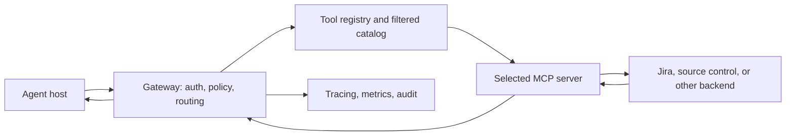

## Before you start

Read [Resume Review](./resume-review.md) first. This topic assumes you already have resume claims about systems, outcomes, or leadership that an interviewer may probe. Keep the actual measurements and your role available; do not rehearse claims you cannot support.

## In one sentence

Resume interview preparation means turning each important resume claim into a short, truthful explanation of the problem, your contribution, the evidence, and what you learned.

## Why it matters

An interviewer often starts with a number or technology from your resume, then asks how you produced it. A confident answer needs more than a polished headline: you should be able to explain the measurement, the trade-offs, your part of the work, and what would happen if conditions changed. If you cannot verify a detail, say what you remember and what you would check instead of inventing precision.

You do not need to prepare every possible follow-up at once. Start with the strongest claims in the first tier of your question bank. Mark each one 🟢 if you can answer now, 🟡 if you need to check details, and 🔴 if you cannot yet explain it. Work one 🔴 at a time, starting with the claims most likely to be challenged.

## The intuition

Treat a resume claim like a small production incident report. The headline is the outcome; the interviewer wants the evidence trail: what the system did before, what you observed, what you changed, how you measured the result, and what limits remain. If one link in that chain is missing, the answer sounds like a number you memorized instead of work you understand.

For team work, add a second trail: what the team delivered and what you personally owned. Use “we” for the team result and “I” for your specific decisions or implementation. That distinction makes your contribution clear without taking credit for other people’s work.

## How to build an answer

Use four parts and keep the opening answer to about one minute. Let the interviewer choose which part to explore next.

1. **Context:** What problem or constraint mattered? Give only enough background to make the work understandable.
2. **Your action:** What did you personally investigate, decide, build, or coordinate? Name the specific contribution.
3. **Evidence:** What changed, how was it measured, and under what test or production conditions? State the metric definition and the comparison window.
4. **Reflection:** What trade-off, limit, or next bottleneck did you discover? Show that you understand the result beyond its headline.

Before rehearsing, fill a private fact sheet. For performance claims, record the baseline and result, workload shape, test duration, concurrency, error rate, and latency percentiles. For architecture claims, record the request path, failure behavior, security boundary, and alternatives. For leadership claims, record the scope you owned, the people or teams involved, and a decision you made. Replace every bracket below with verified facts; remove a claim if you cannot defend it.

## Worked example — a throughput claim

Do not start with “I tuned Redis and MongoDB.” That lists tools before establishing the bottleneck. A better answer gives the measurement and the reasoning in order:

> “The service was handling [baseline] messages per second under [workload]. I first reproduced the traffic with [load-test setup] and compared [throughput, error rate, and p50/p95/p99 latency]. The evidence pointed to [measured bottleneck], rather than [plausible alternative]. I changed [specific Redis or MongoDB behavior] because [reason], then reran the same workload. We reached [verified result] for [duration] with [latency and error-rate result]. The next constraint I would watch is [limit], so I would not assume the same result doubles linearly.”

This is a speaking scaffold, not a claim that any particular test, index, cache policy, or outcome occurred. Only name the tool and change you actually used. Be ready to show why the measurement represents the workload you care about.

## A second example — whiteboarding an MCP router

For a router serving many tools from several MCP servers, explain the request path before listing components. One reasonable design sketch is:

Say what is known and what is a design choice. The host requests a relevant tool catalog; the router filters it by user, task, and permissions so the model sees a manageable set. The selected server can start on demand, receive a validated call, and return a result through the same route. Authentication should use the caller’s delegated or tenant-scoped authority, not a broad shared credential. Add timeouts, bounded retries, health checks, and clear per-server errors so one unavailable backend does not make every tool look broken.

Then quantify the trade-off: the router adds a network hop, policy checks, and possibly server startup time. Measure each separately and explain whether discovery is cached, what invalidates it, and how freshness is balanced against latency. This is a defensible system-design answer; when discussing your own implementation, replace the sketch with the components and decisions you actually shipped.

## Quick reference

| Follow-up | Evidence to prepare | Avoid |
|---|---|---|
| “How did you get that throughput?” | Baseline, workload, bottleneck evidence, exact change, repeat run | Naming a cache or database without explaining the data |
| “Is that p50, p95, or p99?” | Percentile definition, measurement window, error rate | Calling an average “under 100 ms” without context |
| “What happens if a server is down?” | Timeout, retry boundary, fallback, user-visible error | Claiming the whole system is highly available without evidence |
| “How does BYOK work?” | Key hierarchy, KMS boundary, rotation and revocation behavior | Saying “encrypted” without naming who can unwrap the key |
| “What did you personally build?” | Owned component, decision, collaboration, measurable outcome | Taking sole credit for a team result |

## Common mistakes

- **Confusing throughput with latency.** Messages per second describes rate; p50/p95/p99 describe how long individual requests take. State both if both matter.
- **Mixing percentiles.** A p50 under 100 ms does not mean p99 is under 100 ms. Say which percentile was measured and include the tail if you have it.
- **Describing tuning without diagnosis.** Explain what signal revealed the bottleneck and why your change addressed it.
- **Treating envelope encryption as a slogan.** Explain the data-encryption key, the key-encryption key or KMS boundary, and what rotation or revocation means for existing data.
- **Claiming “exactly once” or “zero cross-tenant access” casually.** Describe the mechanisms, failure cases, and evidence that support the guarantee.
- **Overstating ownership.** Separate what the team delivered from what you personally drove, and give credit where it belongs.
- **Guessing a metric under pressure.** If you do not remember the exact value, say so, state the reliable range or source you recall, and offer to verify it.

## What interviewers ask

- **“How did you find the bottleneck, and what does your latency number mean?”** — They are checking that you can distinguish rate from latency and explain the measurement behind the headline.
- **“Design the router. Why use on-demand discovery and lazy startup?”** — They are checking the request path, tool-selection cost, failure isolation, startup trade-offs, and security boundary.
- **“Explain envelope encryption and what happens when a tenant revokes a key.”** — They are checking whether you understand data keys, key-encryption keys, cached access, rotation, revocation, and deletion rather than repeating “BYOK.”
- **“Which parts did you personally build?”** — They are checking ownership and collaboration, not whether you can describe the entire system as your own work.

## Practice

1. Pick one 🔴 claim. Write its baseline, result, measurement source, workload, and your individual contribution. Mark unknown fields explicitly.
2. Record a 60-second answer to the throughput prompt. Listen for unsupported numbers, unclear percentiles, or tools named without a reason.
3. Draw the MCP router request path from memory. Add one unavailable-server case, the authorization check, and the added-hop measurement.
4. Explain tenant key rotation and revocation to a teammate without saying only “the KMS handles it.”

## Where to go next

Use [MCP (Model Context Protocol)](../12-ai-engineering/mcp-and-agent-tool-protocols.md) to review the protocol concepts behind a router answer. For key hierarchy and lifecycle, read NIST’s linked key-management guidance. Then rehearse one red question at a time and update your private fact sheet with only verified details.
