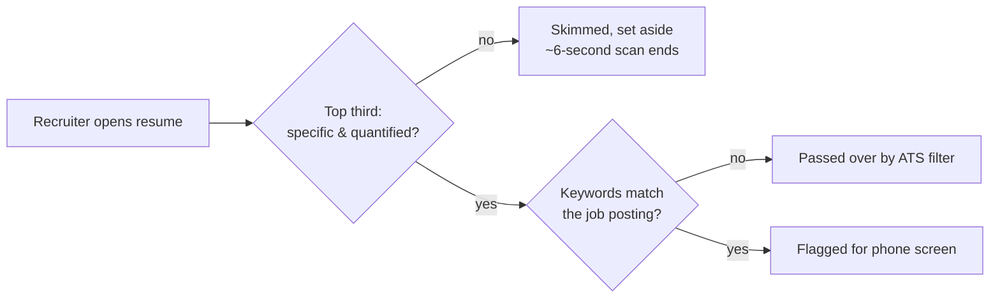

## Before you start

No prior topic in this course is required — this is the first document a company sees, before any technical or behavioral round.

## In one sentence

A good engineering **resume** describes what you actually changed and how much it mattered, in specific measurable terms, instead of listing the tasks you were assigned or the technologies you happened to touch.

## Why it matters

A recruiter typically spends under a minute on a first pass, and an automated tracking system may filter it before a human ever sees it. A vague bullet like "responsible for backend development" gives both of them nothing to grab onto — no number to compare against other candidates, no keyword to match, no story worth a follow-up question. Specific, quantified impact is what gets you from a pile of PDFs to a phone screen.

## The intuition

Imagine two witnesses describing the same car accident. One says "a car was involved and something happened to it." The other says "a blue sedan braked hard, skidded four feet, and stopped inches from the crosswalk." Only the second account gives you anything to evaluate, question, or trust — the first could describe almost anything. Most weak resume bullets are the first witness: technically true, but too vague to be useful evidence of anything. The fix is always the same: replace the vague claim with the specific, checkable detail.

## How it actually works

The core shift is from **duties** to **impact**. A duty describes what you were supposed to do ("worked on the payments team"); impact describes what changed because you did it ("reduced payment failure rate from 4% to 0.8%"). A recruiter can't evaluate a duty — it's the same sentence whether you did excellent work or nothing at all. A number gives them something concrete to ask about in the next round, which is exactly the outcome you want.

A reliable formula for a bullet is **action verb + what you built or fixed + the measurable result**. "Built," "reduced," and "automated" are stronger openers than "responsible for" or "helped with," because they name something you did, not a role you occupied. When you don't have a hard percentage, use a reasonable proxy instead: team size affected, time saved, or scale (requests per second, rows processed). "Automated a report that previously took 3 hours manually every week" is concrete and checkable even without a metric attached to it.

**Keywords** matter for a separate reason: many companies scan resumes with automated tools before a human reads them, matching against the technologies named in the job posting. Mirroring the posting's exact terms (Node.js vs. "Node," Kubernetes vs. "K8s") helps you pass that filter — as long as every keyword you list is one you can actually speak to if asked.



The scan is sequential and unforgiving: a strong bullet buried at the bottom of a role, under three vague ones, may never get read at all. That's why the strongest, most specific achievement in each role belongs first.

## Worked example

```text
Weak:   "Responsible for backend APIs using Node.js"

Strong: "Built a Node.js REST API serving 50K daily requests, cutting
         average response time from 800ms to 150ms by adding caching"
```

The strong version keeps the same underlying fact (you built an API in Node.js) but adds three things the weak version lacks: an action verb ("built" instead of "responsible for"), a scale ("50K daily requests"), and a measurable before/after ("800ms to 150ms"). A hiring manager reading this can ask a real follow-up question — "what did you cache, and how did you decide what was cacheable?" — because there's something concrete to ask about. The weak version invites no follow-up because it makes no specific claim at all.

## A second example — when it gets harder

The formula above assumes you have a number. The harder, more common case is a real contribution with **no metric you ever measured** — most engineers don't instrument every project they touch:

```text
Weak:    "Worked on improving test coverage"

Better:  "Increased test coverage from 40% to 85% across the payments
          module, catching 3 production bugs before release"

If you truly have no number at all, use a scale or frequency proxy
instead of inventing a fake percentage:

Honest:  "Wrote a regression test suite for the checkout flow that
          now runs on every pull request, replacing a manual QA
          pass that previously took a tester half a day per release"
```

The "Honest" version has no percentage anywhere, and that's fine — it still gives a hiring manager something to grab onto (what existed before, what exists now, and the concrete time it replaced) without fabricating precision you don't have. The failure mode here isn't "no number available," it's inventing one you can't defend, because the first question in the interview will be "how did you measure that?" and a made-up number collapses immediately.

## Quick reference

| Weak pattern | Why it fails | Fix |
|---|---|---|
| "Responsible for X" | Describes a duty, not an outcome | "Built/Reduced/Automated X, resulting in Y" |
| No numbers anywhere | Recruiter can't gauge scale or impact | Add a metric, or an honest proxy (time, size, frequency) |
| Generic tech list | Doesn't show what you did with it | Tie each technology to a specific thing you shipped |
| Wall-of-text bullets | Skimmed in seconds, gets skipped | One idea per bullet, ideally one line |
| Every bullet equal weight | Strongest achievement gets buried | Put the strongest, most specific bullet first per role |

## Common mistakes

- Listing responsibilities instead of outcomes — "maintained the API" says nothing an interviewer can follow up on; "fixed a memory leak that was causing weekly restarts" does.
- Adding a number you can't explain if asked — every metric on your resume should be one you personally measured and can defend in detail under a follow-up question.
- Making every bullet the same length and weight, so your strongest, most specific achievement is buried under three generic ones instead of leading.

## What interviewers ask

- **"Walk me through this project on your resume."** — They're checking the bullet wasn't exaggerated and that you can explain the technical decisions behind the number you claimed, not just recite it back.
- **"How did you measure that 80% improvement?"** — They're testing whether the metric is real and whether you understand what was actually measured, not just repeating a number a teammate or manager gave you.
- **"What was your specific role on that team project?"** — They're separating your individual contribution from the team's, since resume bullets often blur "we shipped X" with "I personally did Y."

## Practice

1. Take three bullets from your current resume and rewrite each using the action-verb + what-you-built + measurable-result formula — if you have no number, use an honest time/size/frequency proxy instead of inventing one.
2. Pick your strongest bullet in each role and confirm it's listed first, not buried third or fourth.
3. For every technology keyword on your resume, write one sentence you could say out loud if asked "tell me about a time you used that" — cut any keyword you can't back up this way.

## Where to go next

Next is `mock-interviews-technical` — once the resume earns you a screen, the next skill is performing well in the room, not just on paper.
