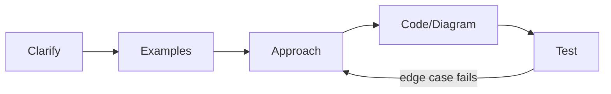

## Before you start

Requires `mock-interviews-technical` — whiteboarding uses the same "narrate while you think" discipline, applied to a bigger, less clearly bounded problem than a single function.

## In one sentence

**Whiteboarding** is solving a problem on a shared surface (a real whiteboard, an online doc, or a virtual canvas) while explaining your thinking out loud, so the interviewer can watch how you reason, not just check your final answer.

## Why it matters

Engineers constantly explain designs and trade-offs to teammates before writing code — whiteboarding is a direct proxy for that everyday skill. A candidate who writes a perfect solution in total silence often scores *worse* than one who talks through a rougher one, because the interviewer has no visibility into silent reasoning and can't tell a lucky guess from real understanding.

## The intuition

The skill being tested isn't drawing ability — it's **structured communication under uncertainty**, the same thing a tour guide does well and a lost driver does badly. A good tour guide narrates the plan before walking ("we'll start at the entrance, then head to the main hall"), points out landmarks along the way, and openly says when they're unsure of a turn instead of silently wandering. A lost driver goes quiet, backtracks without explanation, and leaves everyone in the car guessing whether there's a plan at all. Interviewers are listening for the tour guide, not the lost driver.

## How it actually works

Always restate the problem and ask about constraints before touching the board — it proves you're solving the actual problem asked, not the one you assumed on first hearing it. Once you start, keep the board organized: write the problem statement at the top, keep a running list of constraints to the side, and leave space for examples separate from your solution. A cluttered board makes it hard for the interviewer to follow you, and just as hard for you to check your own work later in the session.

For system-design-style whiteboarding, work top-down: state the high-level components first (client, API, database, cache), then drill into whichever piece the interviewer seems most interested in — that signal tells you where to spend your limited time. For algorithmic whiteboarding, sketch the data structure's state at each step of an example; this catches logic bugs before you've committed to a full solution.

When you get stuck, narrate the stuck-ness itself: "I'm not sure this handles duplicates correctly, let me trace through an example." This keeps the interviewer engaged instead of watching silence, and it often unsticks you, because saying the problem out loud surfaces the gap you couldn't see while thinking it silently.



The loop from "Test" back to "Approach" is normal, not a failure — tracing an example against your design is exactly how you're supposed to catch a gap, and looping back to fix it live is stronger evidence of skill than never testing at all.

## Worked example

```text
Opening lines for a whiteboarding session:

"Let me restate the problem to make sure I have it right: [restate
in your own words]. Before I start, a couple of clarifying questions —
[constraint question 1]? [constraint question 2]?"

"I'll sketch a small example first to make sure I understand the
shape of the input and output, then think about an approach."

[After proposing an approach]
"Before I commit to this, let me trace through the example on the
board to check it actually works, including an edge case like an
empty input."
```

This script catches misunderstandings while they're still cheap to fix — before you've drawn a full architecture or written a full solution around a wrong assumption. It also gives the interviewer an early, low-stakes chance to redirect you if you've misread the question.

## A second example — when it gets harder

The script above handles the *opening*. The harder case is a **gap in your own design that surfaces halfway through** — say, tracing an example reveals your cache never invalidates, and the interviewer is watching you realize it live:

```text
[Mid-session, tracing an example exposes a real gap]

Wrong instinct: erase the board and start over silently, or pretend
the gap isn't there and keep talking past it.

Better script:
"Tracing this example just showed me a problem — if the underlying
data changes, my cache never invalidates, so users would see stale
results. Let me think through options: I could add a short TTL, or
invalidate on write. Given the scale we discussed earlier, a TTL is
simpler and the staleness window is probably acceptable — let's go
with that and I'll note the trade-off."

Then actually update the diagram to reflect the fix, out loud.
```

This is the moment the interview is actually testing: not whether your first draft was flawless, but whether you can find a real gap yourself, reason about options instead of panicking, and revise the design live without losing the thread of the conversation. A design with one visibly-found-and-fixed gap usually reads as *more* competent than a design that happened to have no gaps, because the interviewer never got to see how you handle being wrong.

## Quick reference

| Board habit | Why it helps |
|---|---|
| Problem statement at the top | Keeps you and the interviewer anchored to what's actually being solved |
| Constraints/assumptions listed to the side | Makes your reasoning visible and easy to correct if wrong |
| Example traced step-by-step | Catches logic errors before or after writing the full solution |
| Top-down structure for system design | Shows overall shape before deep-diving one component |
| Narrate when stuck | Keeps interviewer engaged and often reveals the fix |

## Common mistakes

- Diving straight into a diagram before restating the problem or asking about constraints, then having to backtrack once a wrong assumption surfaces.
- Letting the board become cluttered with crossed-out attempts, making it hard for the interviewer — and you — to follow the current state of the solution.
- Going silent while stuck instead of narrating the confusion — saying what's unclear out loud often unblocks you and keeps the interviewer engaged rather than watching you disengage.

## What interviewers ask

- **"Can you walk me through your diagram again?"** — They're checking whether you can explain your own reasoning clearly after the fact, which mirrors explaining a design to teammates later, not just whether the diagram happens to be correct.
- **"What would you change if this component became a bottleneck?"** — They're testing whether you understand the trade-offs in what you drew, not just that you drew something plausible-looking.
- **"Why did you organize the board this way?"** — Rare but real; it checks whether your structure was deliberate or accidental, since organized thinking usually (not always) produces an organized board.

## Practice

1. Set a 45-minute timer and design something concrete (a URL shortener, a rate limiter) on a real or virtual whiteboard, narrating the clarify-examples-approach-diagram-test flow the whole way through.
2. Review a design you already sketched and deliberately find one real gap in it (a single point of failure, a missing invalidation strategy) — then practice the script for surfacing a gap live: name it, reason about options, pick one, and say why.
3. Record yourself walking through your own diagram after finishing it, cold, as if a different interviewer just asked "walk me through this again" — notice where your explanation stalls, since that's usually where the design itself is weakest.

## Where to go next

Next is `mock-interviews-behavioral` — the same "narrate your reasoning, especially when it's not flattering" skill, applied to real stories about your work instead of a live design.
